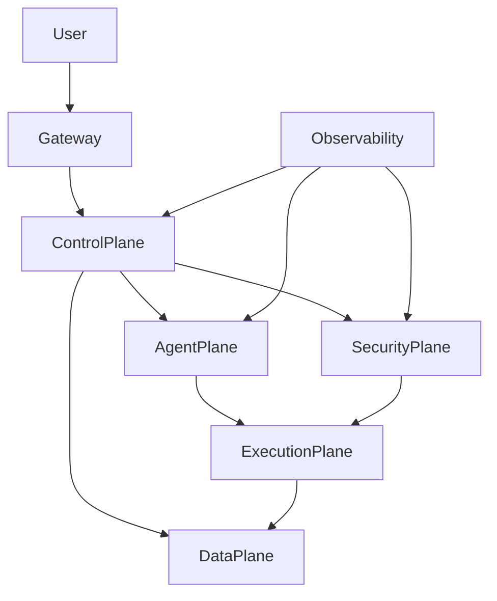

# Enterprise AI Software Factory
## Chapter 1 — Vision, Philosophy & Design Principles

### Purpose
This book defines the architecture for an Enterprise AI Software Factory: an autonomous, secure, multi-agent software engineering operating system.

## Core Design Goals
- Correctness over speed
- Security by default
- Zero Trust networking
- Human governance
- Deterministic workflows
- Continuous learning
- Enterprise observability
- Fault tolerance

## High-Level Logical Architecture

## The System Planes

### Control Plane
Coordinates orchestration, workflow execution, scheduling, model routing,
policy enforcement, approvals and recovery.

### Agent Plane
Contains specialized AI agents such as Planner, Architect, Backend,
Frontend, QA, Security and DevOps.

### Execution Plane
Runs AI-generated code inside disposable sandboxes.

### Data Plane
Stores Git repositories, memory, vector stores, knowledge graphs,
artifacts and logs.

### Security Plane
Provides identity, secrets, policy enforcement, package verification,
supply-chain protection and zero-trust networking.

### Observability Plane
Collects traces, metrics, logs and audit records.

## Zero Trust Philosophy

Every request is:
1. Authenticated
2. Authorized
3. Policy checked
4. Logged
5. Executed in isolation
6. Verified before merge

## Chapter Summary

The Enterprise AI Software Factory is treated as an operating system rather
than an AI chatbot. Every subsystem communicates through controlled,
observable and authenticated interfaces.
