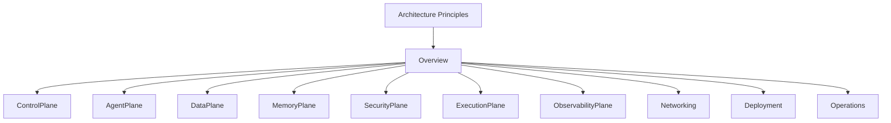

# Enterprise AI Software Factory
# Architecture Design Specification (ADS)

> **Document ID:** ADS-000
>
> **Document Name:** Architecture Principles
>
> **Status:** Accepted
>
> **Version:** 1.0.0
>
> **Last Updated:** 2026
>
> **Owner:** Chief Systems Architect

---

# Purpose

This document defines the architectural principles that govern the entire Enterprise AI Software Factory.

These principles are the highest level of the architecture.

Every subsystem, service, protocol, deployment, workflow, AI agent, security decision, infrastructure component, and future feature must comply with these principles.

If a future design violates any principle defined here, an Architecture Decision Record (ADR) must justify the exception.

This document should rarely change.

Think of it as the constitution of the platform.

---

# Goals

This document exists to ensure that the platform remains

- Secure
- Reliable
- Deterministic
- Observable
- Enterprise Ready
- Vendor Independent
- Modular
- Scalable

without architectural drift.

---

# Principle AP-001
# Correctness Before Speed

## Statement

The platform must always prioritize correctness over execution speed.

## Why

AI systems can generate fast but incorrect outputs.

Enterprise software values reliability more than response time.

Every generated artifact must be verified before acceptance.

## Achieved Through

- Agentic Test Driven Development
- Multi-stage Review
- CI Validation
- Human Approval Gates
- Static Analysis
- Formal Verification

---

# Principle AP-002
# Security by Default

## Statement

Every component is considered untrusted until verified.

## Why

AI generated software may execute privileged operations.

Every request must therefore be authenticated, authorized and validated.

Security is never optional.

---

# Principle AP-003
# Zero Trust

## Statement

No service automatically trusts another service.

Every communication requires

- Authentication
- Authorization
- Encryption
- Policy Validation

## Future Systems

- Identity Plane
- Policy Engine
- Service Mesh
- Security Plane

---

# Principle AP-004
# Human Governance

## Statement

Artificial Intelligence assists engineering.

Artificial Intelligence never owns engineering.

## Human Approval Required

- Production Deployment
- Architecture Changes
- Security Exceptions
- Policy Changes
- Critical Infrastructure

---

# Principle AP-005
# Deterministic Workflows

## Statement

Every workflow must be reproducible.

Running identical workflows with identical inputs should produce equivalent outputs.

## Achieved Through

- Temporal
- LangGraph
- Workflow Checkpoints
- Event History

---

# Principle AP-006
# Bounded Execution

## Statement

Agents must never execute indefinitely.

Every execution has

- Retry Limits
- Time Limits
- Cost Limits
- Human Escalation

Purpose:

Prevent infinite reasoning loops.

---

# Principle AP-007
# Explainability

Every AI decision must answer

- Why?
- Based on what?
- Which documents?
- Which model?
- Which policies?
- Which workflow?

---

# Principle AP-008
# Observability

Every subsystem must expose

- Metrics
- Logs
- Traces
- Events
- Health Checks

No subsystem may become a black box.

---

# Principle AP-009
# Enterprise First

The platform is designed primarily for enterprise environments.

Priorities

1. Reliability

2. Security

3. Governance

4. Auditability

5. Scalability

6. Compliance

7. Cost Control

---

# Principle AP-010
# Vendor Independence

No subsystem should permanently depend on

- One AI Model
- One Cloud
- One Vector Database
- One Message Queue

Every dependency should be replaceable.

---

# Principle AP-011
# Single Responsibility

Every system owns exactly one responsibility.

Examples

Control Plane

Owns

- Workflow
- Scheduling
- Routing

Does NOT own

- Memory
- Security
- Storage

Memory Plane

Owns

- Context
- Knowledge
- Retrieval

Does NOT own

- Scheduling

---

# Principle AP-012
# Event Driven

Communication should be asynchronous whenever possible.

Benefits

- Scalability
- Loose Coupling
- Replay
- Auditing
- Failure Isolation

---

# Principle AP-013
# Memory as Infrastructure

Memory is a core platform capability.

Memory is NOT chat history.

Memory includes

- Working Memory
- Semantic Memory
- Procedural Memory
- Organizational Memory
- Knowledge Graph
- Vector Retrieval

---

# Principle AP-014
# Fail Closed

If the platform cannot determine whether an operation is safe,

the operation is denied.

Safety always overrides convenience.

---

# Principle AP-015
# Continuous Verification

Verification never stops after code generation.

Verification exists during

- Planning
- Coding
- Review
- Testing
- Deployment
- Runtime

---

# Architectural Layers

The Enterprise AI Software Factory is divided into logical layers.

```text
Vision

↓

Architecture Principles

↓

System Overview

↓

Architectural Planes

↓

Subsystems

↓

Services

↓

Protocols

↓

Deployment

↓

Operations
```

Every future document expands one layer.

---

# Principle Dependency Graph



---

# Compliance

Every future document must contain

## Principles Implemented

Example

Control Plane

- ✅ AP-001
- ✅ AP-005
- ✅ AP-008
- ✅ AP-010
- ✅ AP-012

---

# Future Documents

This document intentionally contains no implementation details.

Implementation begins in

- 001-System-Overview.md

The following documents progressively expand the complete architecture.

```
000 Architecture Principles

↓

001 System Overview

↓

002 Control Plane

↓

003 Agent Plane

↓

004 Data Plane

↓

005 Memory Plane

↓

006 Security Plane

↓

007 Execution Plane

↓

008 Observability Plane

↓

009 Networking

↓

010 Deployment

↓

011 Operations

↓

...
```

---

# References

This document is intentionally technology agnostic.

Technology decisions are documented in

- Architecture Decision Records (ADR)

- Individual System Specifications

---

# End of Document
