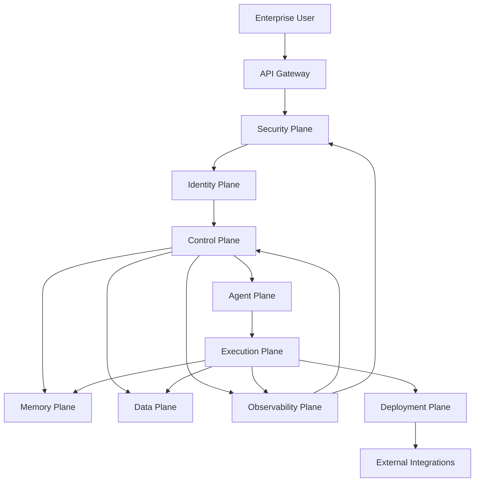
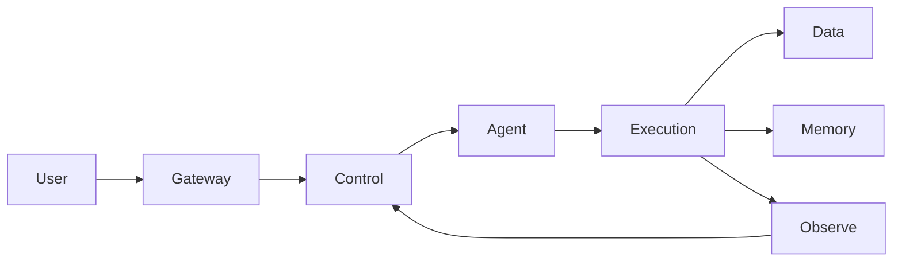

# Enterprise AI Software Factory
# Architecture Design Specification (ADS)

> **Document ID:** ADS-001
>
> **Document Name:** System Overview
>
> **Status:** Draft
>
> **Version:** 1.0.0
>
> **Depends On:** ADS-000 Architecture Principles

---

# Purpose

This document introduces the complete Enterprise AI Software Factory at a high level.

Unlike later documents, this chapter does **not** explain the internal implementation of each subsystem.

Instead, it answers four questions:

- What systems exist?
- Why do they exist?
- How do they communicate?
- What role does each system play?

Every subsequent chapter expands one subsystem introduced here.

---

# Goals

The Enterprise AI Software Factory aims to create a secure, autonomous software engineering platform capable of transforming a product idea into production-ready software through coordinated AI systems while maintaining enterprise-grade reliability, security, governance, and observability.

The architecture is designed around independent systems rather than a monolithic AI agent.

---

# High-Level Architecture



---

# System Lifecycle

```text
User Request

↓

Authentication

↓

Authorization

↓

Workflow Creation

↓

Task Planning

↓

Context Retrieval

↓

Agent Assignment

↓

Sandbox Execution

↓

Testing

↓

Security Validation

↓

Deployment

↓

Monitoring

↓

Learning

↓

Memory Update
```

---

# Architectural Systems

The platform consists of independent systems called **Planes**.

Each Plane owns a single responsibility and communicates with other Planes using well-defined interfaces.

---

# Control Plane

## Purpose

Acts as the central orchestration layer of the platform.

The Control Plane coordinates workflows but never executes engineering tasks directly.

## Responsibilities

- Workflow orchestration
- Task scheduling
- State persistence
- Agent coordination
- Retry management
- Model routing
- Workflow recovery

## Connected Systems

- Agent Plane
- Memory Plane
- Data Plane
- Security Plane
- Observability Plane

Future Document

ADS-002

---

# Agent Plane

## Purpose

Hosts specialized AI agents responsible for engineering work.

Examples include

- Planner
- Architect
- Backend Engineer
- Frontend Engineer
- QA Engineer
- Security Reviewer
- DevOps Engineer

The Agent Plane never executes code directly.

Execution is delegated to the Execution Plane.

Future Document

ADS-003

---

# Data Plane

## Purpose

Stores structured and persistent project data.

Examples

- Git repositories
- Build artifacts
- Documentation
- Project metadata
- Logs
- Test reports

The Data Plane is the persistent storage layer of the platform.

Future Document

ADS-004

---

# Memory Plane

## Purpose

Provides intelligent context retrieval.

Unlike the Data Plane, Memory exists to improve AI reasoning.

Memory Types

- Working Memory
- Semantic Memory
- Procedural Memory
- Organizational Memory
- Knowledge Graph
- Vector Memory

Future Document

ADS-005

---

# Security Plane

## Purpose

Protects every interaction occurring inside the platform.

The Security Plane validates communication before it reaches other systems.

Responsibilities

- Authentication
- Authorization
- Policy Enforcement
- Secrets
- Package Verification
- Zero Trust

Future Document

ADS-006

---

# Execution Plane

## Purpose

Executes AI generated work inside isolated environments.

Examples

- Docker
- MicroVM
- Kubernetes Jobs

No AI model has direct access to the host operating system.

Future Document

ADS-007

---

# Observability Plane

## Purpose

Provides visibility into every workflow executed by the platform.

Responsibilities

- Metrics
- Logs
- Traces
- Audit Events
- Performance Monitoring
- Failure Analysis

Future Document

ADS-008

---

# Deployment Plane

## Purpose

Packages validated software for release.

Responsibilities

- CI/CD
- GitOps
- Release Management
- Rollback
- Staging
- Production Deployment

Future Document

ADS-009

---

# Identity Plane

## Purpose

Provides secure identities to every workload.

Responsibilities

- User Authentication
- Workload Identity
- Service Identity
- Certificate Management
- Token Issuance

Future Document

ADS-010

---

# Communication Model

The Enterprise AI Software Factory uses a layered communication model.



Communication rules

1. Every request passes through the Security Plane.

2. Every workload receives an identity.

3. Every event is logged.

4. Every workflow is observable.

5. Every execution occurs inside an isolated environment.

---

# Trust Boundaries

```text
────────────────────────────────────────────

Internet

↓

Trust Boundary #1

↓

Gateway

↓

Trust Boundary #2

↓

Control Plane

↓

Trust Boundary #3

↓

Execution Plane

↓

Trust Boundary #4

↓

Deployment

────────────────────────────────────────────
```

Every trust boundary introduces additional authentication, authorization and policy enforcement.

---

# High-Level Technology Stack

| Layer | Primary Technologies |
|---------|----------------------|
| Workflow | Temporal, LangGraph |
| Agent Runtime | OpenHands |
| AI Models | Gemini, Claude, Qwen, Local Models |
| Execution | Docker, Kubernetes, MicroVM |
| Memory | Neo4j, Qdrant |
| Storage | PostgreSQL, MinIO |
| Event Bus | Kafka / NATS |
| Security | OPA, Vault, SPIFFE |
| Service Mesh | Istio / Linkerd |
| Observability | OpenTelemetry, Prometheus, Grafana |
| Deployment | ArgoCD, GitHub Actions |

---

# Design Principles Used

This document follows the principles defined in ADS-000.

Implemented Principles

- ✅ AP-001 Correctness Before Speed
- ✅ AP-002 Security by Default
- ✅ AP-003 Zero Trust
- ✅ AP-004 Human Governance
- ✅ AP-005 Deterministic Workflows
- ✅ AP-008 Observability
- ✅ AP-010 Vendor Independence
- ✅ AP-012 Event Driven

---

# Next Documents

The following documents expand each architectural system individually.

```
ADS-002 Control Plane

↓

ADS-003 Agent Plane

↓

ADS-004 Data Plane

↓

ADS-005 Memory Plane

↓

ADS-006 Security Plane

↓

ADS-007 Execution Plane

↓

ADS-008 Observability Plane

↓

ADS-009 Deployment Plane

↓

ADS-010 Identity Plane
```

Each document specifies the internal architecture, connectivity, protocols, failure handling, deployment model, and implementation details of its respective system.

---

# End of Document
