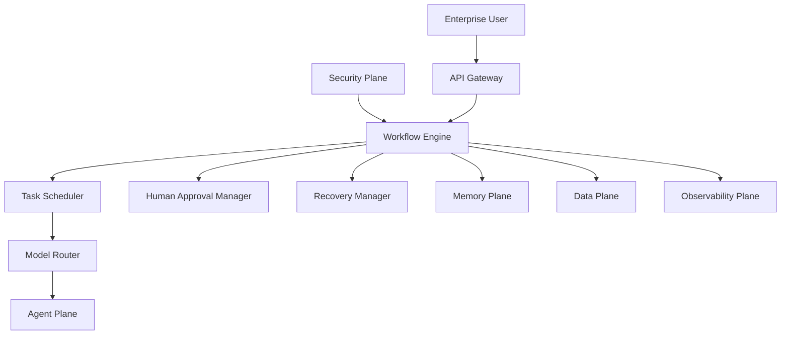
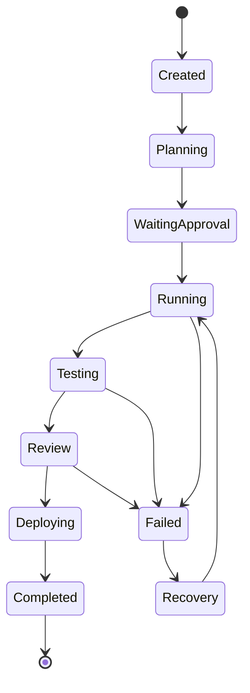
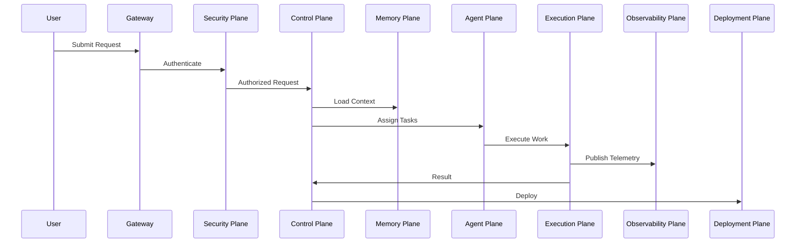

# Enterprise AI Software Factory
# Architecture Design Specification (ADS)

> **Document ID:** ADS-002
>
> **Document Name:** Control Plane
>
> **Status:** Draft
>
> **Version:** 1.0.0
>
> **Depends On:** ADS-000, ADS-001

---

# Purpose

The Control Plane is the central orchestration system of the Enterprise AI Software Factory.

It is responsible for coordinating every workflow across the platform without directly executing engineering tasks.

The Control Plane acts as the brain of the system, making decisions, maintaining workflow state, coordinating AI agents, and ensuring that every subsystem follows the architecture principles defined in ADS-000.

No engineering workflow can begin without passing through the Control Plane.

---

# Responsibilities

The Control Plane owns the following responsibilities.

- Workflow orchestration
- State persistence
- Agent scheduling
- Model routing
- Context loading
- Retry management
- Failure recovery
- Human approval gates
- Cost optimization
- Workflow versioning
- Event publishing

The Control Plane never:

- Executes code
- Stores project files
- Maintains long-term memory
- Performs authentication
- Deploys applications

These responsibilities belong to other systems.

---

# High-Level Architecture



---

# Internal Components

The Control Plane consists of multiple independent services.

| Component | Responsibility |
|-----------|----------------|
| Workflow Engine | Creates and manages engineering workflows |
| State Manager | Persists workflow state and checkpoints |
| Scheduler | Determines execution order |
| Model Router | Selects the most appropriate AI model |
| Retry Manager | Handles transient failures |
| Recovery Manager | Restores failed workflows |
| Approval Manager | Manages Human-in-the-Loop gates |
| Event Publisher | Broadcasts workflow events |
| Cost Controller | Tracks token and infrastructure costs |

---

# Workflow Lifecycle

```text
User Request

↓

Create Workflow

↓

Generate Workflow ID

↓

Load Context

↓

Security Validation

↓

Task Planning

↓

Agent Assignment

↓

Execution

↓

Verification

↓

Deployment

↓

Workflow Complete
```

Every workflow receives a unique Workflow ID used for tracking, logging, auditing, and recovery.

---

# Connected Systems

## API Gateway

Provides authenticated user requests.

---

## Security Plane

Authorizes every workflow before execution.

The Control Plane never bypasses security policies.

---

## Identity Plane

Provides workload identities and service credentials.

---

## Agent Plane

Receives engineering tasks.

Returns execution results.

---

## Memory Plane

Provides contextual knowledge.

Stores workflow summaries after completion.

---

## Data Plane

Stores

- project metadata
- workflow checkpoints
- artifacts
- workflow history

---

## Observability Plane

Receives

- metrics
- traces
- logs
- events

for every workflow transition.

---

## Deployment Plane

Receives validated software after workflow completion.

---

# Workflow States



---

# Communication Flow



---

# Communication Protocols

| Communication | Protocol |
|---------------|----------|
| Gateway → Control | HTTPS |
| Control → Agent | gRPC |
| Control → Memory | gRPC |
| Control → Security | gRPC |
| Control → Data | PostgreSQL Driver |
| Control → Event Bus | Kafka / NATS |
| Control → Observability | OpenTelemetry |

---

# Failure Handling

The Control Plane continuously monitors workflow execution.

Failures are classified into categories.

| Failure | Action |
|----------|--------|
| Model Timeout | Retry |
| Agent Crash | Restart Agent |
| Container Failure | Create New Sandbox |
| Network Failure | Retry with Backoff |
| Context Corruption | Reload Context |
| Policy Failure | Reject Workflow |
| Approval Timeout | Pause Workflow |

---

# Recovery Strategy

Recovery occurs in stages.

```text
Failure

↓

Identify Failure Type

↓

Locate Checkpoint

↓

Restore Workflow State

↓

Restart Failed Component

↓

Continue Execution

↓

Escalate if Retry Limit Exceeded
```

The workflow never restarts from the beginning unless recovery is impossible.

---

# Security Responsibilities

The Control Plane never performs security decisions.

Instead it delegates them.

| Decision | Responsible System |
|-----------|--------------------|
| Authentication | Identity Plane |
| Authorization | Security Plane |
| Secret Management | Security Plane |
| Policy Evaluation | Policy Engine |
| Certificates | Identity Plane |

---

# Scalability

The Control Plane is horizontally scalable.

Multiple workflow coordinators may run simultaneously.

Shared workflow state is maintained using persistent storage.

Leader election ensures only one coordinator owns a workflow at any time.

---

# Recommended Technologies

| Capability | Technology |
|------------|------------|
| Workflow Engine | Temporal |
| Workflow Graph | LangGraph |
| Cache | Redis |
| Database | PostgreSQL |
| Messaging | Kafka / NATS |
| RPC | gRPC |
| Telemetry | OpenTelemetry |

---

# Why These Technologies

| Technology | Reason |
|------------|--------|
| Temporal | Durable workflows and replay |
| LangGraph | Agent workflow orchestration |
| Redis | Fast transient state |
| PostgreSQL | Reliable persistence |
| Kafka | Event streaming |
| gRPC | Efficient service communication |
| OpenTelemetry | Standard observability |

---

# Architecture Decision Records

## ADR-002

### Decision

Use Temporal as the primary workflow engine.

### Alternatives

- Apache Airflow
- Argo Workflows
- Prefect

### Reason

Temporal provides durable execution, automatic retries, checkpointing, replay, and long-running workflow support, making it better suited for AI-driven engineering workflows.

---

# Principles Implemented

- ✅ AP-001 Correctness Before Speed
- ✅ AP-002 Security by Default
- ✅ AP-003 Zero Trust
- ✅ AP-005 Deterministic Workflows
- ✅ AP-006 Bounded Execution
- ✅ AP-008 Observability
- ✅ AP-012 Event Driven
- ✅ AP-014 Fail Closed

---

# Next Document

ADS-003 — Agent Plane

This document explains how specialized AI agents receive work from the Control Plane, collaborate with one another, and interact with the remaining platform systems.

---

# End of Document
