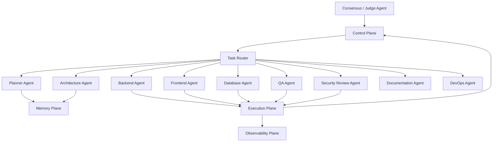
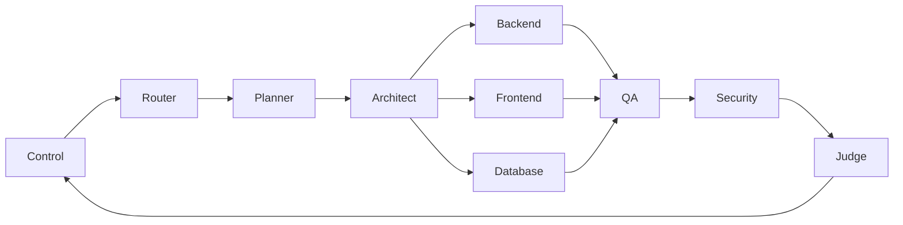
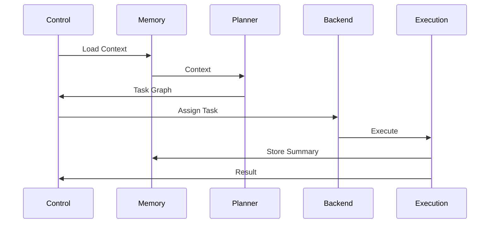

# Enterprise AI Software Factory
# Architecture Design Specification (ADS)

> **Document ID:** ADS-003
>
> **Document Name:** Agent Plane
>
> **Status:** Draft
>
> **Version:** 1.0.0
>
> **Depends On:** ADS-000, ADS-001, ADS-002

---

# Purpose

The Agent Plane contains every AI worker responsible for performing engineering tasks within the Enterprise AI Software Factory.

Unlike traditional AI assistants that rely on a single model performing every task, the Agent Plane distributes work across specialized agents, each responsible for one engineering domain.

The Agent Plane never owns workflows.

The Control Plane owns workflows.

The Agent Plane only executes assigned responsibilities.

---

# Goals

- Specialize AI capabilities
- Improve code quality
- Reduce hallucinations
- Enable parallel execution
- Improve scalability
- Allow independent model selection
- Support future agent additions

---

# High-Level Architecture



---

# Responsibilities

The Agent Plane is responsible for

- Planning software
- Designing architecture
- Writing code
- Creating tests
- Reviewing code
- Reviewing security
- Updating documentation
- Preparing deployments

The Agent Plane never

- Deploys directly
- Stores project data
- Authenticates users
- Manages workflows

---

# Agent Lifecycle

```text
Task Assigned

↓

Agent Selected

↓

Context Loaded

↓

Reasoning

↓

Execution Request

↓

Validation

↓

Result Submitted

↓

Task Complete
```

---

# Agent Categories

## Planner Agent

Purpose

Converts approved specifications into independent engineering tasks.

Responsibilities

- Break requirements into tasks
- Estimate complexity
- Define dependencies
- Assign priorities

Inputs

- Product Specification
- Architecture Specification

Outputs

- Task Graph

---

## Architecture Agent

Purpose

Designs the technical implementation before coding begins.

Responsibilities

- Folder structure
- APIs
- Database schema
- Component relationships
- Service boundaries

Outputs

- Architecture Plan

---

## Backend Agent

Purpose

Implements backend services.

Responsibilities

- APIs
- Business logic
- Authentication
- Integrations

---

## Frontend Agent

Purpose

Builds user interfaces.

Responsibilities

- Components
- Styling
- State Management
- Accessibility

---

## Database Agent

Purpose

Designs and maintains persistence.

Responsibilities

- Schema
- Migrations
- Indexes
- Performance

---

## QA Agent

Purpose

Creates verification before implementation.

Responsibilities

- Unit Tests
- Integration Tests
- End-to-End Tests
- Regression Tests

The QA Agent writes tests before coding begins.

---

## Security Review Agent

Purpose

Evaluates engineering output for security risks.

Checks include

- Vulnerabilities
- Secrets
- Injection
- Dependency Risks
- Authentication
- Authorization

---

## Documentation Agent

Purpose

Maintains project documentation.

Outputs

- README
- API Docs
- Architecture Docs
- Changelogs

---

## DevOps Agent

Purpose

Prepares software for deployment.

Responsibilities

- Docker
- CI
- CD
- Infrastructure
- Deployment Configurations

---

## Consensus / Judge Agent

Purpose

Acts as the final reviewer.

Responsibilities

- Compare outputs
- Detect disagreements
- Request additional review
- Approve completion

This agent never writes code.

---

# Task Routing



---

# Agent Collaboration

Agents never communicate directly.

Every interaction is coordinated through the Control Plane.

Benefits

- Centralized auditing
- Retry management
- Security validation
- Better observability
- Deterministic workflows

---

# Context Flow



---

# Communication

| Source | Destination | Purpose |
|---------|-------------|----------|
| Control Plane | Planner | Task Assignment |
| Planner | Memory Plane | Context Retrieval |
| Backend | Execution Plane | Code Generation |
| QA | Execution Plane | Test Execution |
| Security Agent | Execution Plane | Security Validation |
| Documentation Agent | Data Plane | Documentation Update |
| Judge Agent | Control Plane | Approval |

---

# Model Assignment

Different agents may use different AI models.

| Agent | Preferred Capability |
|--------|----------------------|
| Planner | Long Context Reasoning |
| Architect | Architecture Reasoning |
| Backend | Code Generation |
| Frontend | UI Generation |
| QA | Test Generation |
| Security | Secure Code Review |
| Documentation | Technical Writing |
| Judge | Evaluation |

The architecture intentionally avoids binding any agent to a specific model vendor.

---

# Failure Handling

If an agent fails

```text
Task Failure

↓

Retry

↓

Different Model

↓

Different Agent

↓

Human Review

↓

Workflow Recovery
```

No failed task is silently ignored.

---

# Scalability

Every agent type is independently scalable.

Example

```text
Backend Agents

5 Instances

↓

QA Agents

20 Instances

↓

Planner

2 Instances

↓

Security

3 Instances
```

The platform scales each agent according to workload.

---

# Security

Each agent receives

- Temporary identity
- Temporary credentials
- Scoped permissions
- Time-limited access

Agents never share credentials.

---

# Future Improvements

Future versions may introduce

- Mobile Agent
- AI UX Designer
- Performance Engineer
- Cost Optimization Agent
- Accessibility Agent
- Legal Compliance Agent
- Cloud Architecture Agent

The architecture allows these agents to be added without modifying existing agents.

---

# Architecture Decision Record

## ADR-003

Decision

Use specialized agents instead of one general-purpose coding agent.

Reason

Specialization improves quality, scalability, observability, and independent evolution.

Trade-offs

Higher orchestration complexity.

Benefits

Lower hallucination rate.

Parallel execution.

Independent scaling.

---

# Principles Implemented

- ✅ AP-001 Correctness Before Speed
- ✅ AP-005 Deterministic Workflows
- ✅ AP-006 Bounded Execution
- ✅ AP-008 Observability
- ✅ AP-011 Single Responsibility
- ✅ AP-012 Event Driven

---

# Next Document

ADS-004 — Data Plane

The next document explains how persistent data, artifacts, repositories, databases, and project assets are stored and managed throughout the platform lifecycle.

---

# End of Document
