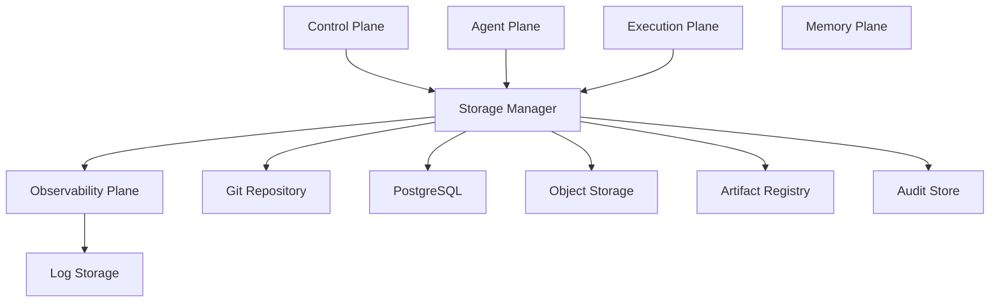
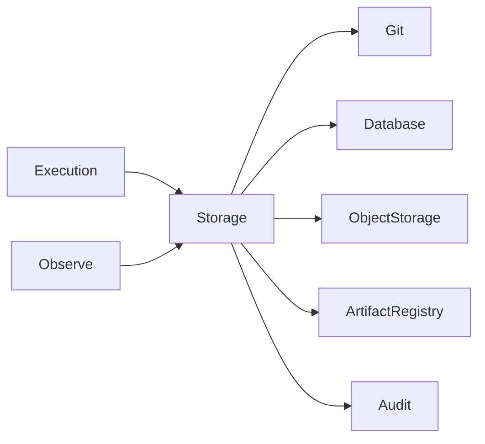

# Enterprise AI Software Factory
# Architecture Design Specification (ADS)

> **Document ID:** ADS-004
>
> **Document Name:** Data Plane
>
> **Status:** Draft
>
> **Version:** 1.0.0
>
> **Depends On:** ADS-000, ADS-001, ADS-002, ADS-003

---

# Purpose

The Data Plane is the persistent storage layer of the Enterprise AI Software Factory.

Unlike the Memory Plane, whose purpose is to improve AI reasoning, the Data Plane is responsible for storing durable project assets and maintaining the single source of truth for engineering artifacts.

Every file, repository, build artifact, deployment package, audit record, and workflow checkpoint ultimately resides inside the Data Plane.

---

# Responsibilities

The Data Plane owns

- Git repositories
- Project metadata
- Build artifacts
- Test reports
- Generated documentation
- Workflow checkpoints
- Deployment manifests
- Logs
- Audit history
- Object storage
- Relational data

The Data Plane does NOT own

- Context Retrieval
- AI Memory
- Workflow Scheduling
- Authentication
- Authorization

---

# High-Level Architecture



---

# Internal Components

| Component | Responsibility |
|------------|----------------|
| Storage Manager | Entry point for all storage requests |
| Git Repository | Source code version control |
| PostgreSQL | Structured application data |
| Object Storage | Binary assets and generated files |
| Artifact Registry | Build packages and container images |
| Audit Store | Immutable audit history |
| Log Storage | Persistent platform logs |

---

# Data Categories

## Source Code

Stores

- Backend
- Frontend
- Infrastructure
- Documentation
- Configuration

Primary Storage

Git Repository

---

## Structured Metadata

Stores

- Workflow IDs
- User Projects
- Agent Assignments
- Build Status
- Deployment History

Primary Storage

PostgreSQL

---

## Binary Objects

Stores

- Images
- PDFs
- ZIP files
- Releases
- Screenshots
- UI Snapshots

Primary Storage

Object Storage

---

## Build Artifacts

Stores

- Docker Images
- Packages
- Executables
- Releases

Primary Storage

Artifact Registry

---

## Audit Records

Stores

- Workflow Events
- Security Decisions
- Policy Results
- Human Approvals
- Deployment History

Audit records are immutable.

---

# Data Flow



---

# Storage Lifecycle

```text
Project Created

↓

Repository Initialized

↓

Workflow Executed

↓

Files Generated

↓

Artifacts Stored

↓

Deployment Created

↓

Audit Recorded

↓

Project Archived
```

---

# Connected Systems

## Control Plane

Reads

- Workflow State

Writes

- Metadata
- Checkpoints

---

## Agent Plane

Reads

- Repository
- Documentation
- Configurations

Writes

- Generated Code
- Documentation
- Tests

---

## Execution Plane

Reads

- Source Code

Writes

- Build Outputs
- Test Reports

---

## Memory Plane

Reads

- Documentation
- Codebase
- APIs

Never modifies persistent project data.

---

## Observability Plane

Writes

- Logs
- Metrics
- Traces

---

# Repository Structure

Every project follows a standardized layout.

```text
project/

├── backend/

├── frontend/

├── infrastructure/

├── docs/

├── tests/

├── deployments/

├── artifacts/

└── metadata/
```

---

# Data Ownership

| Data | Owner |
|--------|--------|
| Source Code | Git Repository |
| Metadata | PostgreSQL |
| Binary Assets | Object Storage |
| Releases | Artifact Registry |
| Logs | Log Storage |
| Audits | Audit Store |

No duplicate ownership exists.

---

# Communication

| Source | Destination | Purpose |
|----------|------------|----------|
| Control Plane | PostgreSQL | Workflow Metadata |
| Agent Plane | Git | Read/Write Code |
| Execution Plane | Artifact Registry | Store Builds |
| Observability Plane | Log Storage | Persist Logs |
| Memory Plane | Git | Read Context |

---

# Backup Strategy

Every persistent store follows

```text
Live Storage

↓

Incremental Backup

↓

Daily Snapshot

↓

Encrypted Archive

↓

Offsite Storage
```

Backups are versioned and verified.

---

# Recovery Strategy

```text
Failure

↓

Detect Failure

↓

Locate Snapshot

↓

Restore Storage

↓

Verify Integrity

↓

Resume Workflows
```

The Data Plane restores data before workflow execution resumes.

---

# Security

Every storage request requires

- Authentication
- Authorization
- Encryption
- Audit Logging

Data Encryption

- At Rest
- In Transit

Access

Least Privilege

No anonymous access.

---

# Scalability

The Data Plane scales independently.

Git repositories

Horizontal

Object Storage

Elastic

PostgreSQL

Read Replicas

Artifact Registry

Distributed

Logs

Partitioned

---

# Recommended Technologies

| Capability | Technology |
|------------|------------|
| Relational Storage | PostgreSQL |
| Object Storage | MinIO |
| Version Control | Git |
| Artifact Registry | Harbor |
| Cache | Redis |
| Search | OpenSearch |

---

# Why These Technologies

| Technology | Reason |
|------------|--------|
| PostgreSQL | ACID compliance |
| Git | Industry standard versioning |
| MinIO | S3-compatible object storage |
| Harbor | Secure container registry |
| Redis | High-speed cache |
| OpenSearch | Log indexing and search |

---

# Architecture Decision Record

## ADR-004

Decision

Separate persistent storage from AI memory.

Reason

Persistent storage guarantees data integrity.

AI Memory optimizes reasoning.

Mixing both responsibilities increases complexity and creates inconsistent data ownership.

---

# Principles Implemented

- ✅ AP-001 Correctness Before Speed
- ✅ AP-002 Security by Default
- ✅ AP-003 Zero Trust
- ✅ AP-008 Observability
- ✅ AP-011 Single Responsibility
- ✅ AP-014 Fail Closed

---

# Next Document

ADS-005 — Memory Plane

The Memory Plane introduces semantic memory, procedural memory, organizational memory, vector retrieval, and the Knowledge Graph used by AI agents for reasoning.

---

# End of Document
