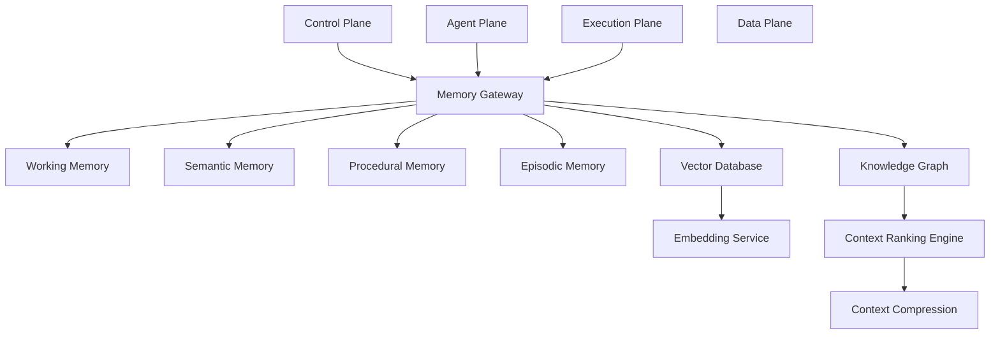
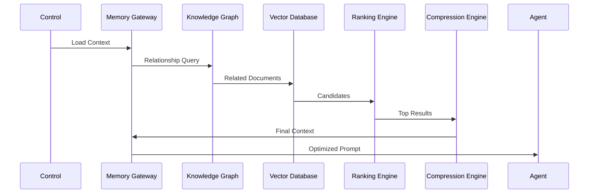

# Enterprise AI Software Factory
# Architecture Design Specification (ADS)

> **Document ID:** ADS-005
>
> **Document Name:** Memory Plane
>
> **Status:** Draft
>
> **Version:** 1.0.0
>
> **Depends On:** ADS-000, ADS-001, ADS-002, ADS-003, ADS-004

---

# Purpose

The Memory Plane provides intelligent context to every AI agent operating inside the Enterprise AI Software Factory.

Unlike the Data Plane, which permanently stores project artifacts, the Memory Plane exists solely to improve reasoning, planning, and decision making.

Its purpose is to ensure that AI agents always receive the minimum required context with maximum relevance, reducing hallucinations while minimizing token usage.

The Memory Plane is one of the most critical systems within the platform because every engineering task depends on contextual understanding.

---

# Responsibilities

The Memory Plane owns

- Context Retrieval
- Context Ranking
- Context Compression
- Semantic Search
- Knowledge Graph
- Vector Search
- Working Memory
- Organizational Memory
- Procedural Memory
- Episodic Memory
- Context Summarization

The Memory Plane never owns

- Project Files
- Git Repositories
- Workflow Scheduling
- User Authentication
- Code Execution

---

# High-Level Architecture



---

# Why a Separate Memory Plane?

Traditional AI systems place every document into a vector database.

This approach causes

- Context pollution
- Irrelevant retrieval
- High token usage
- Poor reasoning
- Hallucinations

The Enterprise AI Software Factory separates

Persistent Data

↓

Memory

↓

Reasoning

into independent systems.

This separation dramatically improves context quality.

---

# Memory Types

## Working Memory

Purpose

Stores temporary information required only during the active workflow.

Examples

- Current task
- Active branch
- Current file
- Temporary summaries
- Execution status

Lifetime

Workflow Duration

---

## Semantic Memory

Purpose

Stores long-term project knowledge.

Examples

- APIs
- Business Rules
- Coding Standards
- Architecture
- Naming Conventions

Lifetime

Permanent

---

## Procedural Memory

Purpose

Stores engineering workflows.

Examples

- Build Process
- Deployment Process
- Testing Strategy
- Code Review Standards

Lifetime

Permanent

---

## Episodic Memory

Purpose

Stores historical engineering events.

Examples

- Previous Bugs
- Previous Fixes
- Human Feedback
- Failed Deployments
- Production Incidents

Lifetime

Permanent

---

## Organizational Memory

Purpose

Stores organization-wide knowledge.

Examples

- Company Standards
- Internal Frameworks
- Security Policies
- Engineering Guidelines
- Coding Style

---

# Knowledge Graph

The Knowledge Graph represents relationships instead of documents.

Examples

```text
UserService

↓

depends_on

↓

AuthenticationService

↓

uses

↓

JWT

↓

validated_by

↓

Security Policy
```

Unlike Vector Search,

the Knowledge Graph understands

relationships.

---

# Vector Database

The Vector Database stores embeddings.

Purpose

Fast semantic similarity search.

Examples

- Documentation
- Code
- Architecture
- Specifications

The Vector Database never replaces the Knowledge Graph.

Both systems complement each other.

---

# Context Retrieval Pipeline

```mermaid
flowchart LR

Task

↓

Gateway

↓

KnowledgeGraph

↓

VectorSearch

↓

Ranking

↓

Compression

↓

FinalContext

↓

AI Agent
```

Every AI prompt receives only the Final Context.

---

# Context Ranking

Retrieved information is scored.

Ranking considers

- Semantic Similarity
- File Importance
- Recent Usage
- Architectural Dependency
- Workflow Context
- User Intent

Only high-ranking context proceeds.

---

# Context Compression

Large repositories exceed model limits.

The Compression Engine

- Removes duplicates
- Summarizes documentation
- Removes unrelated files
- Compresses logs
- Prioritizes dependencies

Goal

Maximum information

Minimum tokens

---

# Memory Gateway

Every request enters through the Memory Gateway.

Responsibilities

- Authentication
- Context Retrieval
- Context Assembly
- Context Filtering
- Cache Lookup
- Query Routing

No AI agent directly accesses storage.

---

# Connected Systems

## Control Plane

Requests workflow context.

Receives summarized context.

---

## Agent Plane

Requests task-specific knowledge.

Receives optimized prompts.

---

## Data Plane

Provides

- Documents
- Code
- Metadata
- APIs

The Data Plane never performs retrieval.

---

## Observability Plane

Collects

- Retrieval Latency
- Cache Hits
- Ranking Scores
- Token Usage

---

# Retrieval Flow



---

# Caching Strategy

Frequently accessed context is cached.

Cache Levels

L1

Workflow Cache

L2

Project Cache

L3

Organization Cache

Benefits

- Lower latency
- Reduced embedding cost
- Faster reasoning

---

# Memory Lifecycle

```text
Project Created

↓

Knowledge Indexed

↓

Embeddings Generated

↓

Knowledge Graph Updated

↓

Queries Executed

↓

Context Retrieved

↓

Workflow Complete

↓

Memory Updated
```

---

# Scalability

Every memory subsystem scales independently.

Knowledge Graph

Horizontal

Vector Database

Horizontal

Embedding Service

Distributed Workers

Ranking Engine

Stateless

Compression Engine

Stateless

---

# Recommended Technologies

| Capability | Technology |
|------------|------------|
| Knowledge Graph | Neo4j |
| Vector Database | Qdrant |
| Embedding Models | BGE / Jina Embeddings |
| Cache | Redis |
| Search | Hybrid Retrieval |
| Context Compression | LLM-based Summarization |

---

# Why These Technologies

| Technology | Reason |
|------------|--------|
| Neo4j | Native graph traversal |
| Qdrant | Fast vector retrieval |
| Redis | High-speed caching |
| Hybrid Search | Better retrieval accuracy |
| BGE Embeddings | Strong open-source embedding performance |

---

# Failure Handling

If retrieval fails

```text
Retrieve Context

↓

Retry

↓

Fallback Cache

↓

Fallback Summary

↓

Human Escalation
```

The platform never proceeds with empty context unless explicitly approved.

---

# Architecture Decision Record

## ADR-005

Decision

Separate Memory Plane from Data Plane.

Reason

Persistent storage and reasoning are fundamentally different responsibilities.

Separating them improves retrieval quality, scalability, and maintainability while significantly reducing hallucinations.

---

# Principles Implemented

- ✅ AP-001 Correctness Before Speed
- ✅ AP-005 Deterministic Workflows
- ✅ AP-008 Observability
- ✅ AP-011 Single Responsibility
- ✅ AP-013 Memory as Infrastructure

---

# Next Document

ADS-006 — Security Plane

The Security Plane introduces Zero Trust Architecture, authentication, authorization, policy enforcement, secrets management, workload identity, and enterprise security controls.

---

# End of Document
