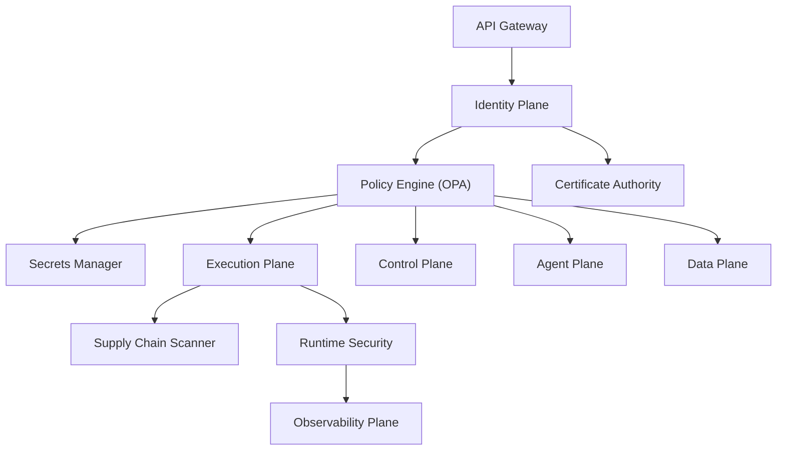

# Enterprise AI Software Factory
# Architecture Design Specification (ADS)

> **Document ID:** ADS-006
>
> **Document Name:** Security Plane
>
> **Status:** Draft
>
> **Version:** 1.0.0
>
> **Depends On:** ADS-000, ADS-001, ADS-002, ADS-003, ADS-004, ADS-005

---

# Purpose

The Security Plane is the centralized trust and enforcement layer of the Enterprise AI Software Factory.

Every request entering or leaving any subsystem passes through the Security Plane before execution.

Unlike traditional applications where security is distributed across services, the Enterprise AI Software Factory centralizes all security decisions into a dedicated system responsible for authentication, authorization, policy enforcement, workload identity, secret management, software supply-chain validation, and runtime protection.

No subsystem is allowed to bypass the Security Plane.

---

# Responsibilities

The Security Plane owns

- Authentication
- Authorization
- Policy Enforcement
- Workload Identity
- Secret Management
- Certificate Management
- Package Verification
- Supply Chain Security
- Runtime Security
- Zero Trust Networking
- Compliance Auditing
- Threat Detection
- Security Logging

The Security Plane never owns

- Workflow Scheduling
- Context Retrieval
- Code Generation
- Project Storage

---

# High-Level Architecture



---

# Security Principles

Every interaction inside the platform follows these principles.

- Verify Explicitly
- Least Privilege
- Zero Trust
- Short-Lived Credentials
- Fail Closed
- Continuous Verification
- Defense in Depth

---

# Security Workflow

```text
Incoming Request

↓

Authentication

↓

Identity Verification

↓

Authorization

↓

Policy Evaluation

↓

Secret Injection

↓

Certificate Validation

↓

Execution

↓

Runtime Monitoring

↓

Audit Logging
```

No request reaches the Control Plane without completing every security stage.

---

# Internal Components

| Component | Responsibility |
|------------|----------------|
| Identity Verifier | Validates identities |
| Policy Engine | Evaluates permissions |
| Secrets Manager | Stores credentials |
| Certificate Authority | Issues certificates |
| Runtime Security | Monitors containers |
| Package Scanner | Verifies dependencies |
| Compliance Engine | Validates regulations |
| Audit Logger | Records every security event |

---

# Authentication

Authentication verifies the identity of every entity.

Supported identities include

- Human Users
- AI Agents
- Internal Services
- Kubernetes Workloads
- CI/CD Pipelines

Recommended Standards

- OpenID Connect (OIDC)
- OAuth2
- SPIFFE
- SPIRE

---

# Authorization

After authentication, authorization determines what actions are permitted.

Authorization considers

- User Role
- Agent Type
- Workflow State
- Resource Ownership
- Organization Policy

Recommended Model

RBAC + ABAC

---

# Policy Engine

Every privileged action is evaluated by the Policy Engine.

Examples

- Create Repository
- Delete Branch
- Deploy Production
- Execute Container
- Install Package
- Read Secret
- Access Database

Recommended Technology

Open Policy Agent (OPA)

---

# Workload Identity

Every service receives its own cryptographic identity.

No shared credentials exist.

Example

```text
Planner Agent

↓

SPIFFE Identity

↓

mTLS Certificate

↓

Authorized Service
```

Benefits

- Strong authentication
- Automatic certificate rotation
- Service-to-service trust

---

# Secret Management

Secrets are never embedded inside prompts or source code.

Examples

- API Keys
- Database Passwords
- Tokens
- Certificates

Recommended Technology

HashiCorp Vault

Future cloud implementations may support

- AWS Secrets Manager
- Azure Key Vault
- Google Secret Manager

---

# Certificate Management

Every service communicates using mTLS.

Certificates are

- Automatically issued
- Automatically rotated
- Short lived

Recommended Technologies

SPIRE

cert-manager

---

# Zero Trust Networking

```mermaid
flowchart LR

User

↓

Gateway

↓

Identity

↓

Policy

↓

Service Mesh

↓

Control Plane

↓

Execution Plane
```

Every connection requires

- Authentication
- Authorization
- Encryption

No internal service is automatically trusted.

---

# Supply Chain Security

Every dependency is verified before installation.

Validation includes

- License Check
- Signature Verification
- CVE Scan
- Provenance Check
- Hash Validation

Recommended Standards

- Sigstore
- SLSA
- in-toto
- SBOM

---

# Runtime Security

The Runtime Security subsystem continuously monitors

- Container Escapes
- Privilege Escalation
- Unexpected Network Calls
- Shell Execution
- File System Changes
- Suspicious Processes

Recommended Technologies

- Falco
- Cilium Tetragon

---

# Security Logging

Every security decision produces an immutable audit record.

Examples

- Authentication
- Authorization
- Policy Decision
- Secret Access
- Deployment Approval
- Package Installation

Audit records cannot be modified.

---

# Connected Systems

## API Gateway

Provides authenticated requests.

---

## Identity Plane

Issues identities.

---

## Control Plane

Requests authorization.

---

## Agent Plane

Requests temporary permissions.

---

## Execution Plane

Receives runtime security policies.

---

## Data Plane

Encrypts stored information.

---

## Observability Plane

Receives

- Security Metrics
- Alerts
- Logs
- Threat Events

---

# Security Communication

| Source | Destination | Purpose |
|----------|------------|----------|
| Gateway | Identity | User Authentication |
| Identity | Policy Engine | Identity Validation |
| Policy Engine | Control Plane | Authorization |
| Policy Engine | Vault | Secret Access |
| Execution | Runtime Security | Runtime Monitoring |
| Runtime Security | Observability | Alerts |

---

# Threat Model

| Threat | Mitigation |
|---------|------------|
| Credential Theft | Vault + Short-Lived Tokens |
| Prompt Injection | Context Validation |
| Container Escape | Runtime Monitoring |
| Malicious Package | Supply Chain Verification |
| Lateral Movement | Zero Trust Networking |
| Unauthorized Deployment | Human Approval Gate |
| Secret Leakage | Secret Injection Only |

---

# Failure Strategy

```text
Security Failure

↓

Deny Request

↓

Generate Alert

↓

Record Audit

↓

Notify Observability

↓

Human Escalation
```

The Security Plane always fails closed.

---

# Scalability

Every security subsystem scales independently.

Policy Engine

Stateless

Vault

Highly Available Cluster

Runtime Security

Per Node

Certificate Authority

Distributed

Audit Logging

Horizontal

---

# Recommended Technologies

| Capability | Technology |
|------------|------------|
| Authentication | Keycloak |
| Authorization | Open Policy Agent |
| Secrets | HashiCorp Vault |
| Identity | SPIFFE / SPIRE |
| Runtime Security | Falco |
| Service Mesh | Istio |
| Certificate Management | cert-manager |
| Compliance | OpenSCAP |

---

# Why These Technologies

| Technology | Reason |
|------------|--------|
| OPA | Policy as Code |
| Vault | Enterprise Secret Management |
| SPIFFE | Standardized Workload Identity |
| Falco | Runtime Threat Detection |
| Istio | Zero Trust Networking |
| Keycloak | Enterprise Identity Provider |

---

# Architecture Decision Record

## ADR-006

Decision

Implement a dedicated Security Plane instead of embedding security into each subsystem.

Reason

Centralized security improves consistency, governance, observability, and compliance while reducing duplicated security logic across the platform.

---

# Principles Implemented

- ✅ AP-002 Security by Default
- ✅ AP-003 Zero Trust
- ✅ AP-004 Human Governance
- ✅ AP-008 Observability
- ✅ AP-014 Fail Closed
- ✅ AP-015 Continuous Verification

---

# Next Document

ADS-007 — Execution Plane

The Execution Plane explains how AI-generated work is executed safely inside isolated sandboxes using zero-trust execution environments while remaining fully observable and recoverable.

---

# End of Document
