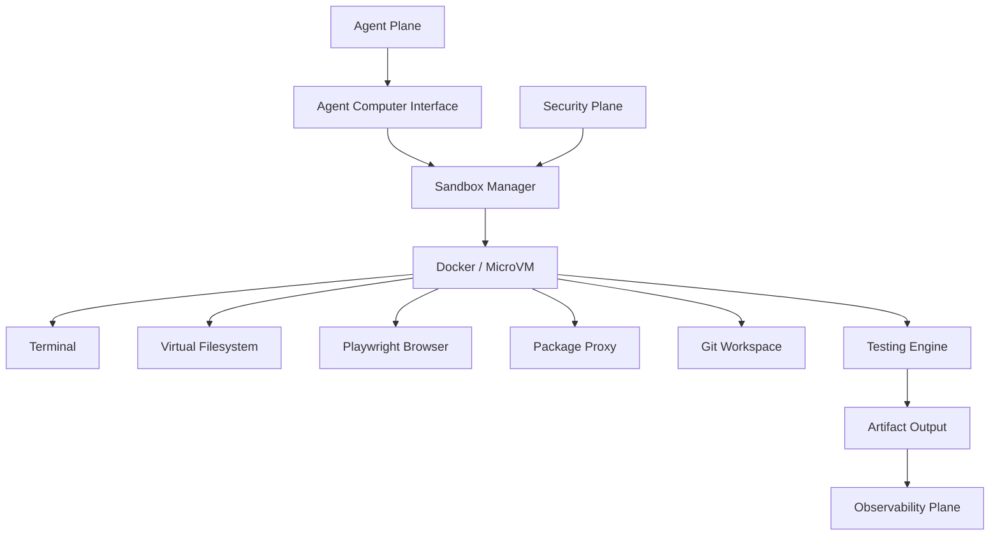
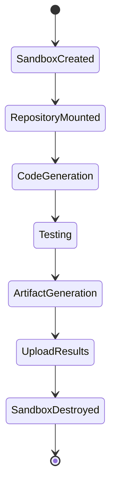
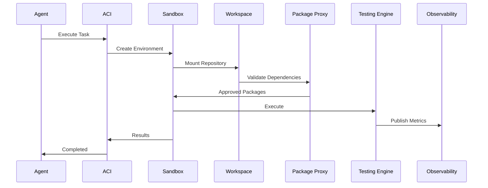

# Enterprise AI Software Factory
# Architecture Design Specification (ADS)

> **Document ID:** ADS-007
>
> **Document Name:** Execution Plane
>
> **Status:** Draft
>
> **Version:** 1.0.0
>
> **Depends On:** ADS-000 → ADS-006

---

# Purpose

The Execution Plane is responsible for safely executing every engineering task generated by the AI agents.

Unlike the Agent Plane, which performs reasoning, the Execution Plane performs actions.

Every code modification, terminal command, browser interaction, test execution, package installation, deployment simulation, and file modification occurs inside this plane.

No AI model is ever allowed to directly access the host operating system.

Everything happens inside isolated execution environments.

---

# Responsibilities

The Execution Plane owns

- Code Execution
- File Editing
- Terminal Execution
- Browser Automation
- Testing
- Build Generation
- Package Installation
- Sandbox Lifecycle
- Runtime Isolation
- Execution Telemetry
- Rollback
- Workspace Management

The Execution Plane never owns

- Workflow Scheduling
- Context Retrieval
- Authentication
- Authorization
- Project Storage
- Model Selection

---

# High-Level Architecture



---

# Why a Separate Execution Plane?

Traditional AI coding assistants often execute commands directly on the developer's machine.

This introduces serious risks

- File corruption
- Secret leakage
- Malicious commands
- Dependency attacks
- Operating system compromise

The Enterprise AI Software Factory completely separates reasoning from execution.

AI thinks in the Agent Plane.

AI acts in the Execution Plane.

---

# Execution Pipeline

```text
Task Assigned

↓

Context Loaded

↓

Sandbox Created

↓

Workspace Mounted

↓

Dependencies Verified

↓

Code Generated

↓

Tests Executed

↓

Artifacts Produced

↓

Sandbox Destroyed
```

Every task receives a fresh execution environment.

---

# Internal Components

| Component | Responsibility |
|------------|----------------|
| Agent Computer Interface | Standardized tool interface |
| Sandbox Manager | Creates isolated environments |
| Workspace Manager | Mounts repositories |
| Terminal Engine | Executes shell commands |
| Browser Engine | Browser automation |
| Package Proxy | Validates dependencies |
| Testing Engine | Executes automated tests |
| Artifact Manager | Stores generated outputs |

---

# Agent Computer Interface (ACI)

The Agent Computer Interface is the only interface AI agents may use.

Agents never execute

```bash
rm -rf /
```

Instead they request structured actions.

Example

```text
read_file()

edit_file()

create_file()

delete_file()

run_tests()

build_project()

take_screenshot()

run_browser()

install_package()
```

The ACI validates every request before execution.

---

# Sandbox Manager

Every engineering task receives an isolated workspace.

Example

```text
Task

↓

Create Sandbox

↓

Mount Repository

↓

Inject Temporary Credentials

↓

Execute Task

↓

Collect Artifacts

↓

Destroy Sandbox
```

No sandbox survives after completion.

---

# Workspace Manager

Each sandbox contains

```text
Workspace

├── backend/

├── frontend/

├── docs/

├── tests/

├── temp/

└── logs/
```

Repositories are mounted as disposable copies.

The original repository is never modified directly.

---

# Package Proxy

Every dependency request is intercepted.

Example

```text
npm install express

↓

Package Proxy

↓

License Validation

↓

Signature Validation

↓

CVE Scan

↓

Approval

↓

Installation
```

Blocked packages are rejected before reaching the sandbox.

---

# Browser Engine

The Browser Engine provides isolated browser automation.

Supported tasks

- UI Testing
- Screenshot Generation
- Accessibility Checks
- Responsive Layout Testing
- End-to-End Testing

Recommended Technology

Playwright

---

# Testing Engine

Every generated feature passes through automated testing.

Supported tests

- Unit Tests
- Integration Tests
- End-to-End Tests
- Accessibility Tests
- Visual Regression Tests

Only successful executions continue.

---

# Connected Systems

## Agent Plane

Submits engineering tasks.

Receives execution results.

---

## Security Plane

Provides

- Sandbox Policies
- Runtime Rules
- Temporary Credentials

---

## Data Plane

Provides

- Repository
- Configuration
- Build Assets

Receives

- Generated Files
- Reports
- Build Outputs

---

## Memory Plane

Receives

- Execution Summaries
- File Changes
- Generated Documentation

---

## Observability Plane

Receives

- Execution Metrics
- Logs
- Traces
- Screenshots
- Resource Usage

---

# Execution Lifecycle



---

# Execution Communication



---

# Runtime Isolation

Every sandbox receives

- Temporary Filesystem
- Temporary Credentials
- Temporary Network Rules
- Temporary Storage
- Temporary Identity

Everything is destroyed after execution.

No state persists.

---

# Resource Limits

Every sandbox enforces

- CPU Limits
- Memory Limits
- Disk Limits
- Network Limits
- Execution Time Limits

This prevents resource abuse.

---

# Failure Handling

```text
Execution Failure

↓

Capture Logs

↓

Store Snapshot

↓

Destroy Sandbox

↓

Create Fresh Sandbox

↓

Replay Workflow

↓

Escalate if Retry Limit Exceeded
```

Execution environments are never reused after failure.

---

# Scalability

The Execution Plane scales horizontally.

Example

```text
Incoming Tasks

↓

Execution Queue

↓

Worker Pool

↓

Sandbox Cluster

↓

Artifact Store
```

Worker nodes are stateless and may be added or removed dynamically.

---

# Security

Execution follows Zero Trust principles.

Every sandbox

- Uses temporary credentials
- Has no host access
- Has restricted networking
- Is monitored continuously
- Is destroyed after execution

Host operating systems are never exposed.

---

# Recommended Technologies

| Capability | Technology |
|------------|------------|
| Sandbox | Docker |
| MicroVM | Firecracker |
| Orchestration | Kubernetes Jobs |
| Browser | Playwright |
| Build | BuildKit |
| Runtime Security | Falco |
| Filesystem | OverlayFS |
| Queue | Kafka / NATS |

---

# Why These Technologies

| Technology | Reason |
|------------|--------|
| Firecracker | Lightweight isolation |
| Docker | Portable execution |
| Playwright | Browser automation |
| Kubernetes Jobs | Elastic execution |
| BuildKit | Efficient builds |
| Falco | Runtime threat detection |

---

# Architecture Decision Record

## ADR-007

Decision

Separate reasoning from execution using isolated sandboxes.

Reason

Large language models should never execute commands directly on production hosts.

Separating reasoning from execution significantly improves security, auditability, and recovery.

---

# Principles Implemented

- ✅ AP-001 Correctness Before Speed
- ✅ AP-002 Security by Default
- ✅ AP-003 Zero Trust
- ✅ AP-006 Bounded Execution
- ✅ AP-008 Observability
- ✅ AP-014 Fail Closed
- ✅ AP-015 Continuous Verification

---

# Next Document

ADS-008 — Observability Plane

The Observability Plane explains how every workflow, agent, sandbox, policy decision, and deployment is monitored through logs, metrics, traces, dashboards, alerts, and distributed telemetry.

---

# End of Document
