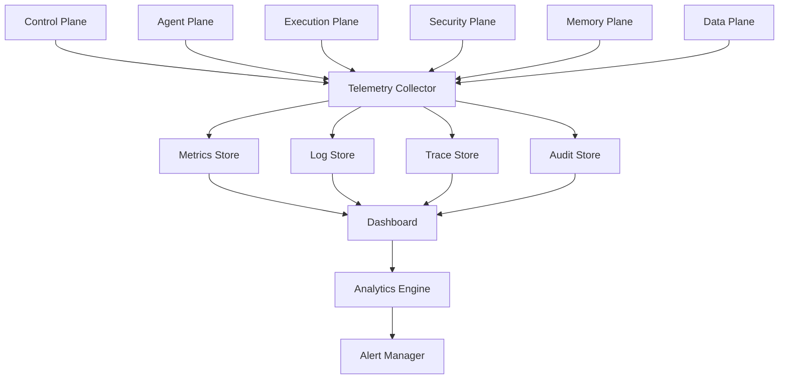
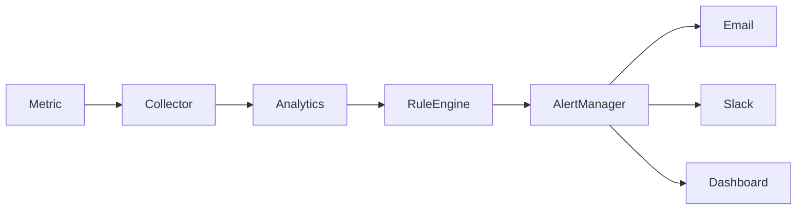

# Enterprise AI Software Factory
# Architecture Design Specification (ADS)

> **Document ID:** ADS-008
>
> **Document Name:** Observability Plane
>
> **Status:** Draft
>
> **Version:** 1.0.0
>
> **Depends On:** ADS-000 → ADS-007

---

# Purpose

The Observability Plane provides complete visibility into every action performed within the Enterprise AI Software Factory.

Its purpose is not simply to collect logs.

It provides engineers, operators, and administrators with the ability to understand:

- What happened
- Why it happened
- When it happened
- Who performed it
- Which AI model performed it
- Which workflow triggered it
- Which systems were affected

The Observability Plane transforms every subsystem from a black box into a fully traceable and measurable system.

---

# Responsibilities

The Observability Plane owns

- Metrics Collection
- Distributed Tracing
- Centralized Logging
- Workflow Monitoring
- Agent Monitoring
- Model Monitoring
- Cost Monitoring
- Alerting
- Audit Event Collection
- Dashboarding
- Health Monitoring
- Performance Analytics

The Observability Plane never owns

- Workflow Execution
- Security Decisions
- Data Storage
- AI Reasoning

---

# High-Level Architecture



---

# Why an Observability Plane?

Without observability, the platform cannot answer questions such as:

- Why did an AI agent fail?
- Which model generated incorrect code?
- Why was a deployment rejected?
- Which workflow consumed the most tokens?
- Why did latency increase?

The Observability Plane provides the answers.

---

# Core Components

| Component | Responsibility |
|------------|----------------|
| Telemetry Collector | Receives telemetry from every system |
| Metrics Store | Stores time-series metrics |
| Log Store | Stores structured logs |
| Trace Store | Stores distributed traces |
| Audit Store | Stores immutable audit records |
| Dashboard | Visualizes system health |
| Alert Manager | Generates alerts |
| Analytics Engine | Performs long-term analysis |

---

# Observability Pipeline

```text
System Event

↓

Telemetry Generated

↓

Telemetry Collector

↓

Metrics

Logs

Traces

Audit

↓

Dashboards

↓

Alerts

↓

Operators
```

---

# Metrics

Every subsystem publishes metrics.

Examples

- Workflow Duration
- Task Queue Length
- Agent Utilization
- Model Latency
- Token Usage
- CPU Usage
- Memory Usage
- Test Success Rate
- Deployment Success Rate

---

# Structured Logging

Logs are emitted in structured JSON format.

Every log contains

- Timestamp
- Workflow ID
- Request ID
- Agent ID
- User ID
- Service Name
- Severity
- Message

Logs never contain

- Secrets
- Tokens
- Passwords
- API Keys

---

# Distributed Tracing

Every request receives a Trace ID.

Example

```text
User Request

↓

Gateway

↓

Control Plane

↓

Agent Plane

↓

Execution Plane

↓

Deployment

↓

Response
```

Every service appends information to the same trace.

This enables end-to-end debugging.

---

# Audit Events

Audit logs are immutable.

Examples

- Login
- Approval
- Deployment
- Secret Access
- Policy Decision
- Workflow Creation
- Model Selection
- Prompt Execution

Audit events are never deleted.

---

# Dashboards

The platform provides dashboards for

## System Health

- Running Workflows
- Failed Workflows
- Queue Length

---

## Agent Health

- Active Agents
- Failed Agents
- Agent Latency

---

## Model Performance

- Cost
- Token Usage
- Latency
- Accuracy
- Failure Rate

---

## Infrastructure

- CPU
- RAM
- Storage
- Network
- GPU

---

## Security

- Authentication Failures
- Policy Violations
- Secret Access
- Runtime Alerts

---

# Connected Systems

## Control Plane

Publishes

- Workflow Events
- Scheduling Events

---

## Agent Plane

Publishes

- Agent Status
- Model Usage
- Task Completion

---

## Execution Plane

Publishes

- Build Logs
- Test Results
- Runtime Metrics

---

## Security Plane

Publishes

- Authentication Events
- Authorization Events
- Threat Alerts

---

## Memory Plane

Publishes

- Retrieval Time
- Cache Hit Rate
- Ranking Metrics

---

## Deployment Plane

Publishes

- Deployment Status
- Rollbacks
- Releases

---

# Alert Pipeline



Alerts are generated only after rule evaluation.

---

# Health Monitoring

Every subsystem exposes

- Liveness
- Readiness
- Startup
- Dependency Health

Health checks determine whether the subsystem should continue receiving traffic.

---

# Communication

| Source | Destination | Purpose |
|----------|------------|----------|
| Every Plane | Telemetry Collector | Metrics |
| Every Plane | Log Store | Structured Logs |
| Every Plane | Trace Store | Distributed Traces |
| Analytics Engine | Alert Manager | Alerts |
| Dashboard | Operators | Visualization |

---

# Scalability

The Observability Plane scales independently.

Telemetry Collectors

Horizontal

Metrics

Distributed

Logs

Partitioned

Traces

Distributed

Dashboards

Stateless

---

# Security

Observability data is protected by

- Role-Based Access Control
- Encryption at Rest
- Encryption in Transit
- Immutable Audit Logs
- Least Privilege Access

Sensitive information is automatically redacted before storage.

---

# Recommended Technologies

| Capability | Technology |
|------------|------------|
| Telemetry | OpenTelemetry |
| Metrics | Prometheus |
| Dashboards | Grafana |
| Logs | Loki |
| Traces | Jaeger |
| Alerts | Alertmanager |

---

# Why These Technologies

| Technology | Reason |
|------------|--------|
| OpenTelemetry | Industry telemetry standard |
| Prometheus | Reliable metrics collection |
| Grafana | Unified visualization |
| Loki | Efficient structured logging |
| Jaeger | Distributed tracing |
| Alertmanager | Flexible alert routing |

---

# Architecture Decision Record

## ADR-008

Decision

Adopt a centralized observability platform rather than isolated logging per subsystem.

Reason

Centralized observability enables correlation across workflows, agents, infrastructure, and deployments while simplifying debugging and operational monitoring.

---

# Principles Implemented

- ✅ AP-001 Correctness Before Speed
- ✅ AP-008 Observability
- ✅ AP-009 Enterprise First
- ✅ AP-012 Event Driven

---

# Next Document

ADS-009 — Identity Plane

This document defines how users, services, AI agents, workflows, and execution environments receive identities, authenticate, authorize, and securely communicate throughout the Enterprise AI Software Factory.

---

# End of Document
