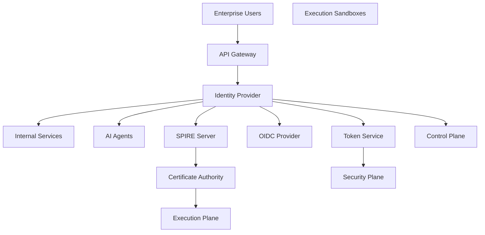

# Enterprise AI Software Factory
# Architecture Design Specification (ADS)

> **Document ID:** ADS-009
>
> **Document Name:** Identity Plane
>
> **Status:** Draft
>
> **Version:** 1.0.0
>
> **Depends On:** ADS-000 → ADS-008

---

# Purpose

The Identity Plane provides a unique and verifiable identity for every entity interacting with the Enterprise AI Software Factory.

Identity is the foundation of Zero Trust Architecture.

Without a trusted identity, no request may enter the platform.

Every user, AI agent, workflow, service, container, sandbox, API, and deployment receives an identity before interacting with another subsystem.

The Identity Plane answers one question:

> **Who is making this request?**

---

# Responsibilities

The Identity Plane owns

- User Authentication
- Service Authentication
- Workload Identity
- AI Agent Identity
- Token Issuance
- Certificate Issuance
- Session Management
- Identity Federation
- Single Sign-On
- Identity Lifecycle

The Identity Plane never owns

- Authorization
- Policy Decisions
- Secret Management
- Workflow Scheduling
- Code Execution

Authorization belongs to the Security Plane.

---

# High-Level Architecture



---

# Why an Identity Plane?

Enterprise systems cannot trust requests based on network location.

Identity must be cryptographically verified.

Every interaction begins with identity.

Examples

- User Login
- AI Agent Registration
- Sandbox Creation
- Service Startup
- Deployment Request
- Workflow Creation

Without identity, the request is rejected.

---

# Identity Types

## Human Identity

Examples

- Developer
- Administrator
- Project Manager
- Security Engineer

Authentication Methods

- SSO
- OAuth2
- OIDC
- MFA

---

## Service Identity

Every internal service receives a unique identity.

Examples

- Control Plane
- Memory Plane
- Security Plane
- Observability Plane

Purpose

Secure service-to-service communication.

---

## Agent Identity

Every AI agent receives its own identity.

Examples

- Planner Agent
- Backend Agent
- QA Agent

Benefits

- Independent auditing
- Fine-grained permissions
- Complete traceability

---

## Workload Identity

Every execution environment receives a temporary identity.

Examples

- Docker Container
- Kubernetes Pod
- Firecracker VM

Identity expires immediately after execution.

---

# Authentication Flow

```text
Request

↓

Identity Provider

↓

Credential Validation

↓

Identity Created

↓

Access Token Issued

↓

Security Plane

↓

Authorized Request
```

---

# Token Lifecycle

```text
Login

↓

Access Token

↓

Refresh Token

↓

Expiration

↓

Renewal

↓

Revocation
```

Tokens are always short-lived.

---

# Service Identity

Every service communicates using mTLS.

Example

```text
Control Plane

↓

SPIFFE Identity

↓

mTLS

↓

Memory Plane
```

Benefits

- Mutual Authentication
- Certificate Rotation
- Strong Encryption

---

# Workload Identity

When a sandbox starts

```text
Create Sandbox

↓

Request Identity

↓

Issue Certificate

↓

Execute Task

↓

Destroy Sandbox

↓

Revoke Identity
```

No sandbox shares identities.

---

# Connected Systems

## API Gateway

Receives authenticated users.

---

## Security Plane

Consumes identity information.

Performs authorization.

---

## Control Plane

Authenticates workflows.

---

## Agent Plane

Receives temporary identities.

---

## Execution Plane

Receives workload identities.

---

## Observability Plane

Receives identity metadata for tracing.

---

# Communication

| Source | Destination | Purpose |
|----------|------------|----------|
| Gateway | Identity Provider | User Authentication |
| Identity | Security Plane | Identity Validation |
| Identity | Control Plane | Workflow Identity |
| Identity | Agent Plane | Agent Identity |
| Identity | Execution Plane | Workload Identity |
| Identity | Observability | Identity Metadata |

---

# Identity Federation

Enterprise customers may integrate existing identity providers.

Supported Standards

- OpenID Connect
- OAuth2
- SAML 2.0
- LDAP
- Active Directory

The platform does not require a proprietary identity provider.

---

# Certificate Management

Certificates are automatically

- Issued
- Rotated
- Revoked

Manual certificate management is not required.

Recommended Technologies

- SPIFFE
- SPIRE
- cert-manager

---

# Session Management

Sessions are

- Encrypted
- Short-Lived
- Revocable
- Auditable

Idle sessions automatically expire.

---

# Failure Handling

```text
Authentication Failure

↓

Reject Request

↓

Audit Event

↓

Alert Security Plane

↓

Notify Observability
```

Authentication failures never reach application logic.

---

# Scalability

Identity services are horizontally scalable.

Authentication

Stateless

Certificate Issuance

Distributed

Session Storage

Replicated

Token Service

Stateless

---

# Security

Identity follows

- Zero Trust
- Mutual TLS
- Least Privilege
- Short-Lived Credentials
- Certificate Rotation

No shared identities exist.

---

# Recommended Technologies

| Capability | Technology |
|------------|------------|
| Identity Provider | Keycloak |
| Workload Identity | SPIFFE |
| Identity Runtime | SPIRE |
| Certificate Management | cert-manager |
| Authentication | OAuth2 / OIDC |
| Federation | SAML |

---

# Why These Technologies

| Technology | Reason |
|------------|--------|
| Keycloak | Enterprise identity management |
| SPIFFE | Standard workload identity |
| SPIRE | Automated identity issuance |
| cert-manager | Certificate automation |
| OAuth2/OIDC | Industry authentication standard |

---

# Architecture Decision Record

## ADR-009

Decision

Separate authentication from authorization.

Reason

Authentication verifies identity.

Authorization determines permissions.

Separating responsibilities improves scalability, security, and maintainability.

---

# Principles Implemented

- ✅ AP-002 Security by Default
- ✅ AP-003 Zero Trust
- ✅ AP-009 Enterprise First
- ✅ AP-014 Fail Closed

---

# Next Document

ADS-010 — Deployment Plane

This document explains how validated software is packaged, promoted through environments, deployed using GitOps principles, monitored after release, and automatically rolled back when required.

---

# End of Document
