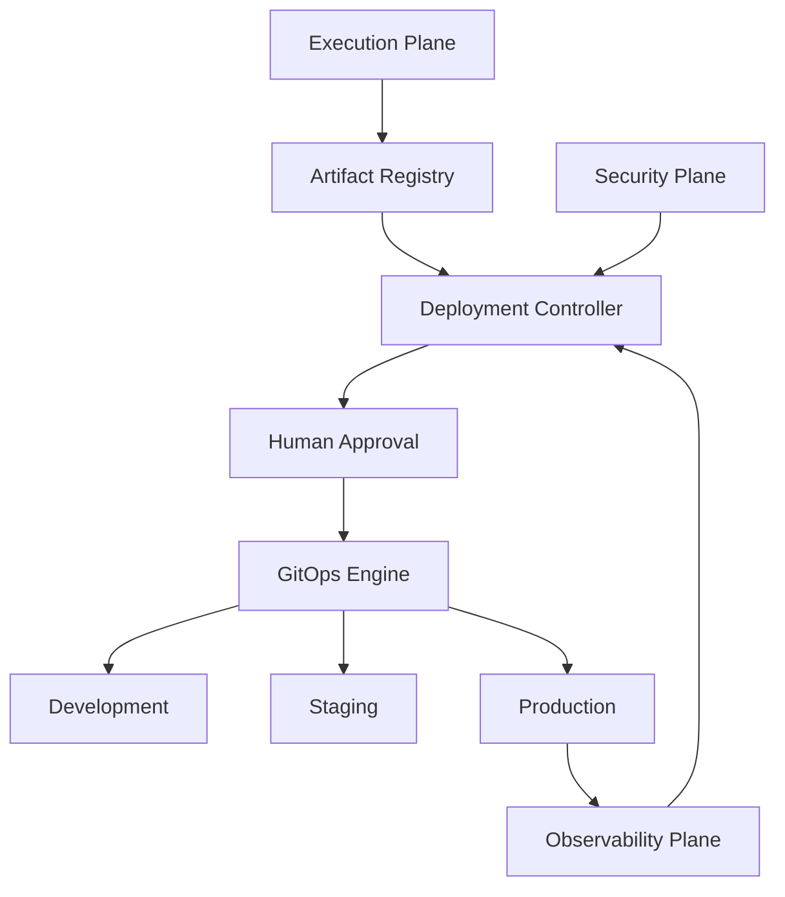
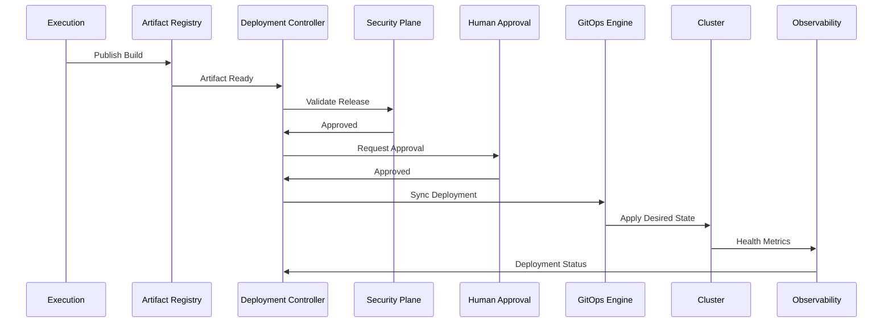

# Enterprise AI Software Factory
# Architecture Design Specification (ADS)

> **Document ID:** ADS-010
>
> **Document Name:** Deployment Plane
>
> **Status:** Draft
>
> **Version:** 1.0.0
>
> **Depends On:** ADS-000 → ADS-009

---

# Purpose

The Deployment Plane is responsible for safely promoting validated software from development into production environments.

Unlike the Execution Plane, which builds and tests software, the Deployment Plane manages software releases, deployment strategies, rollback procedures, environment promotion, and production health verification.

No deployment is executed without passing all required validation stages.

---

# Responsibilities

The Deployment Plane owns

- Continuous Delivery
- Release Management
- Environment Promotion
- GitOps
- Deployment Validation
- Canary Releases
- Blue-Green Deployments
- Rollback
- Post Deployment Verification
- Release Metadata
- Deployment History

The Deployment Plane never owns

- Workflow Scheduling
- AI Reasoning
- Authentication
- Context Retrieval
- Code Generation

---

# High-Level Architecture



---

# Deployment Lifecycle

```text
Build Complete

↓

Artifact Published

↓

Security Verification

↓

Human Approval

↓

Development Deployment

↓

Integration Validation

↓

Staging Deployment

↓

Production Deployment

↓

Health Verification

↓

Deployment Complete
```

---

# Internal Components

| Component | Responsibility |
|-----------|----------------|
| Deployment Controller | Coordinates deployments |
| GitOps Engine | Synchronizes desired state |
| Environment Manager | Manages deployment targets |
| Rollback Manager | Restores previous releases |
| Health Validator | Validates application health |
| Release Manager | Tracks versions and releases |

---

# Environment Promotion

Software progresses through environments in a fixed order.

```text
Development

↓

Testing

↓

Staging

↓

Production
```

Skipping environments is not allowed unless explicitly approved.

---

# GitOps

Git becomes the source of truth.

Deployment changes occur by updating repository state.

The deployment platform reconciles infrastructure to match Git.

Benefits

- Reproducibility
- Auditability
- Rollback
- Version Control

---

# Deployment Strategies

Supported strategies

## Rolling Update

Gradually replaces running instances.

---

## Blue-Green

Maintains two production environments.

Traffic switches only after validation.

---

## Canary

Releases to a small percentage of users.

Health metrics determine promotion.

---

## Shadow Deployment

Receives production traffic without affecting users.

Used for AI validation and regression testing.

---

# Human Approval

Production deployments require approval.

Approval may include

- Engineering Lead
- Security Team
- Product Owner

Critical releases always require human authorization.

---

# Connected Systems

## Execution Plane

Publishes

- Build Artifacts
- Test Results

---

## Security Plane

Validates

- Deployment Policies
- Image Signatures
- Compliance

---

## Observability Plane

Monitors

- Health
- Errors
- Latency
- Resource Usage

---

## Control Plane

Tracks deployment progress.

Updates workflow state.

---

## Data Plane

Stores

- Release Metadata
- Deployment History
- Environment Configurations

---

# Deployment Flow



---

# Rollback Strategy

```text
Deployment Failure

↓

Health Check Failure

↓

Stop Rollout

↓

Restore Previous Version

↓

Verify Health

↓

Notify Control Plane
```

Rollback is automatic unless manual intervention is required.

---

# Health Validation

Deployment success is determined by

- Pod Health
- HTTP Status
- Error Rate
- Latency
- Resource Usage
- Business Metrics

Deployment completes only after all checks succeed.

---

# Scalability

The Deployment Plane supports

- Multi-cluster deployments
- Multi-region deployments
- Multi-cloud deployments
- On-premise deployments
- Hybrid deployments

---

# Security

Deployments require

- Signed Artifacts
- Policy Validation
- Approval Gates
- Immutable Images
- Audit Logging

Unsigned artifacts are rejected.

---

# Recommended Technologies

| Capability | Technology |
|------------|------------|
| GitOps | Argo CD |
| CI | GitHub Actions |
| Container Registry | Harbor |
| Orchestration | Kubernetes |
| Package Manager | Helm |
| Progressive Delivery | Argo Rollouts |

---

# Why These Technologies

| Technology | Reason |
|------------|--------|
| Argo CD | Declarative GitOps deployment |
| Argo Rollouts | Canary and Blue-Green support |
| Kubernetes | Enterprise orchestration |
| Helm | Package management |
| Harbor | Secure artifact registry |

---

# Architecture Decision Record

## ADR-010

Decision

Adopt GitOps as the deployment model.

Reason

Git becomes the single source of truth, enabling reproducible deployments, simplified rollbacks, and complete deployment auditing.

---

# Principles Implemented

- ✅ AP-001 Correctness Before Speed
- ✅ AP-002 Security by Default
- ✅ AP-004 Human Governance
- ✅ AP-008 Observability
- ✅ AP-009 Enterprise First
- ✅ AP-014 Fail Closed

---

# Next Document

ADS-011 — Network Topology

This document defines how every Plane communicates across the platform, including API Gateway, Service Mesh, Event Bus, trust boundaries, network segmentation, encryption, ingress, egress, and enterprise connectivity.

---

# End of Document
