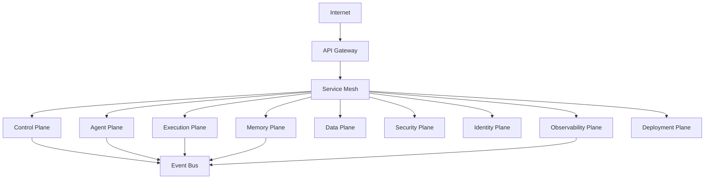

# Enterprise AI Software Factory
# Architecture Design Specification (ADS)

> **Document ID:** ADS-011
>
> **Document Name:** Network Topology
>
> **Status:** Draft
>
> **Version:** 1.0.0
>
> **Depends On:** ADS-000 → ADS-010

---

# Purpose

The Network Topology defines how every Plane communicates within the Enterprise AI Software Factory.

Unlike previous documents that describe logical responsibilities, this document focuses on network communication, trust boundaries, service-to-service connectivity, ingress, egress, encryption, and communication protocols.

This document serves as the networking blueprint for the platform.

---

# Goals

The network architecture is designed to provide

- Zero Trust Networking
- Secure Service Communication
- High Availability
- Horizontal Scalability
- Failure Isolation
- Minimal Latency
- Complete Observability

---

# Enterprise Network



---

# Network Zones

The platform is divided into independent trust zones.

```text
Internet

↓

DMZ

↓

Application Zone

↓

Internal Services

↓

Execution Cluster

↓

Storage Cluster

↓

Monitoring Cluster
```

Each zone enforces independent security policies.

---

# Trust Boundaries

```text
Boundary 1

Internet

↓

API Gateway

----------------------------

Boundary 2

Gateway

↓

Internal Platform

----------------------------

Boundary 3

Internal Platform

↓

Execution Sandboxes

----------------------------

Boundary 4

Execution

↓

Persistent Storage

----------------------------

Boundary 5

Platform

↓

Deployment Targets
```

Every trust boundary requires

- Authentication
- Authorization
- Encryption
- Audit Logging

---

# Communication Model

Communication follows three patterns.

## Synchronous

Used for

- API Calls
- Context Retrieval
- Authentication

Protocol

gRPC

HTTPS

---

## Asynchronous

Used for

- Events
- Notifications
- Workflow Updates

Protocol

Kafka

NATS

---

## Streaming

Used for

- Logs
- Metrics
- Traces

Protocol

OpenTelemetry

---

# Service Mesh

Every internal service communicates through the Service Mesh.

Responsibilities

- mTLS
- Traffic Routing
- Retries
- Circuit Breaking
- Load Balancing
- Telemetry
- Service Discovery

Recommended

Istio

Alternative

Linkerd

---

# Event Bus

The Event Bus removes direct coupling between systems.

Example

```text
Execution Finished

↓

Publish Event

↓

Kafka

↓

Control Plane

↓

Observability

↓

Memory Update

↓

Deployment
```

Benefits

- Replay
- Horizontal Scaling
- Loose Coupling
- Reliability

---

# API Gateway

The API Gateway is the only public entry point.

Responsibilities

- Authentication
- Rate Limiting
- Request Validation
- API Routing
- TLS Termination

No Plane is publicly accessible.

---

# Network Policies

Every Plane has explicit ingress and egress rules.

Example

Control Plane

Ingress

- API Gateway
- Security Plane

Egress

- Agent Plane
- Memory Plane
- Event Bus

Direct communication outside approved routes is denied.

---

# Ingress

External traffic enters through

```text
Internet

↓

Load Balancer

↓

API Gateway

↓

Service Mesh

↓

Platform
```

No direct internet access exists beyond the Gateway.

---

# Egress

Outgoing traffic is restricted.

Allowed destinations

- Approved AI Providers
- Package Registries
- Git Providers
- Enterprise APIs

Every outbound request passes through an Egress Proxy.

---

# Service Discovery

Services never use static IP addresses.

Discovery occurs through

- Kubernetes DNS
- Service Mesh
- SPIFFE Identity

---

# Network Encryption

Every communication is encrypted.

External

TLS 1.3

Internal

mTLS

Storage

AES-256

Secrets

Envelope Encryption

---

# Connected Systems

| Source | Destination | Method |
|----------|------------|---------|
| User | API Gateway | HTTPS |
| Gateway | Service Mesh | mTLS |
| Control Plane | Agent Plane | gRPC |
| Agent Plane | Execution Plane | gRPC |
| Execution Plane | Event Bus | Kafka |
| Memory Plane | Data Plane | gRPC |
| Deployment Plane | Kubernetes | Kubernetes API |
| Every Plane | Observability | OpenTelemetry |

---

# Failure Handling

```text
Network Failure

↓

Retry

↓

Circuit Breaker

↓

Alternate Instance

↓

Health Verification

↓

Continue Workflow
```

---

# High Availability

Every critical service runs multiple replicas.

Example

```text
Control Plane

3 Pods

Memory Plane

5 Pods

Execution Plane

20 Workers

Kafka

3 Brokers

PostgreSQL

Primary + Replicas
```

---

# Scalability

Horizontal scaling occurs independently.

Gateway

Auto Scales

Control Plane

Auto Scales

Execution

Worker Pool

Memory

Independent Cluster

Observability

Independent Cluster

---

# Recommended Technologies

| Capability | Technology |
|------------|------------|
| API Gateway | Envoy / Kong |
| Service Mesh | Istio |
| Event Bus | Kafka |
| DNS | CoreDNS |
| Load Balancer | NGINX / HAProxy |
| Ingress | Kubernetes Ingress |
| Egress | Egress Gateway |

---

# Why These Technologies

| Technology | Reason |
|------------|--------|
| Istio | Enterprise service mesh |
| Kafka | Reliable event streaming |
| Envoy | High-performance proxy |
| CoreDNS | Kubernetes-native discovery |
| Kong | API management |

---

# Architecture Decision Record

## ADR-011

Decision

All internal communication must pass through a Service Mesh.

Reason

The Service Mesh centralizes encryption, retries, traffic policies, observability, and service discovery without requiring every subsystem to implement these features individually.

---

# Principles Implemented

- ✅ AP-002 Security by Default
- ✅ AP-003 Zero Trust
- ✅ AP-008 Observability
- ✅ AP-009 Enterprise First
- ✅ AP-012 Event Driven
- ✅ AP-014 Fail Closed

---

# Next Document

ADS-012 — Event-Driven Architecture

This document defines the event model used throughout the platform, including event schemas, publishers, subscribers, workflow events, replay mechanisms, dead-letter queues, and reliable asynchronous communication.

---

# End of Document
