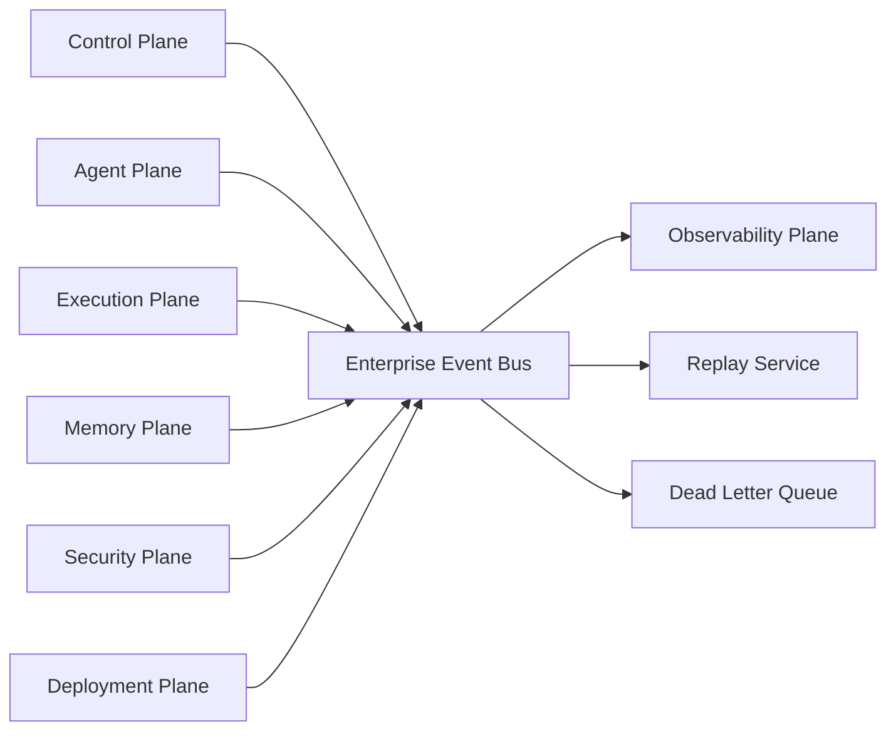
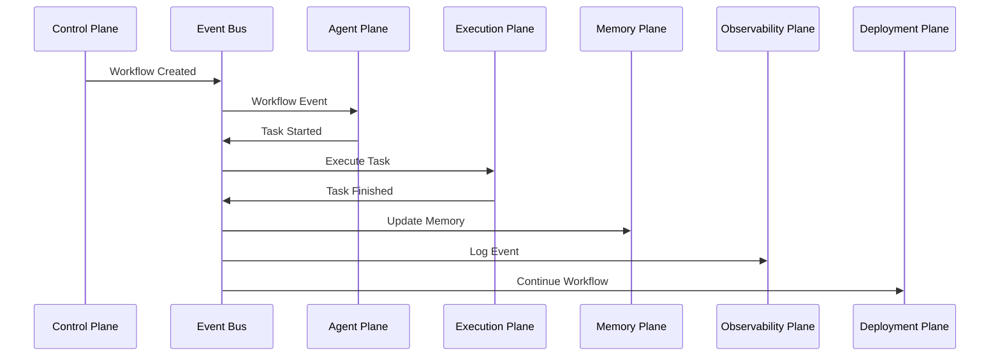

# Enterprise AI Software Factory
# Architecture Design Specification (ADS)

> **Document ID:** ADS-012
>
> **Document Name:** Event-Driven Architecture
>
> **Status:** Draft
>
> **Version:** 1.0.0
>
> **Depends On:** ADS-000 → ADS-011

---

# Purpose

The Event-Driven Architecture enables asynchronous communication between every subsystem inside the Enterprise AI Software Factory.

Instead of tightly coupling systems through direct synchronous communication, events are published onto a centralized Event Bus where interested systems subscribe and react independently.

This architecture improves scalability, fault tolerance, observability, replay capability, and extensibility.

---

# Goals

The Event Bus exists to

- Decouple services
- Improve scalability
- Enable event replay
- Increase fault tolerance
- Support long-running workflows
- Simplify integrations
- Improve observability

---

# High-Level Architecture



---

# Why Event-Driven?

Without an event-driven architecture,

every system depends directly on every other system.

Example

```text
Control Plane

↓

Execution Plane

↓

Memory Plane

↓

Observability Plane

↓

Deployment Plane
```

If one service becomes unavailable,

multiple workflows fail.

Instead

```text
Execution Finished

↓

Publish Event

↓

Kafka

↓

Subscribers React
```

Every subscriber works independently.

---

# Event Lifecycle

```text
Event Created

↓

Validated

↓

Published

↓

Stored

↓

Consumed

↓

Acknowledged

↓

Archived
```

Every event receives

- Event ID
- Timestamp
- Workflow ID
- Correlation ID
- Event Version

---

# Internal Components

| Component | Responsibility |
|------------|----------------|
| Event Producer | Publishes events |
| Event Broker | Routes events |
| Event Consumer | Processes events |
| Replay Service | Replays historical events |
| Dead Letter Queue | Stores failed events |
| Event Registry | Stores event schemas |

---

# Event Categories

## Workflow Events

Examples

- Workflow Created
- Workflow Started
- Workflow Completed
- Workflow Failed

---

## Agent Events

Examples

- Task Assigned
- Task Started
- Task Finished
- Task Failed

---

## Execution Events

Examples

- Sandbox Created
- Build Started
- Tests Passed
- Artifact Generated

---

## Security Events

Examples

- Authentication Success
- Authentication Failure
- Policy Denied
- Secret Access

---

## Deployment Events

Examples

- Deployment Started
- Rollback Triggered
- Release Published

---

## Memory Events

Examples

- Context Updated
- Embeddings Generated
- Knowledge Graph Updated

---

# Event Flow



---

# Event Schema

Every event follows a standard structure.

```json
{
  "eventId": "uuid",
  "eventType": "WorkflowCompleted",
  "workflowId": "workflow-001",
  "timestamp": "...",
  "source": "Execution Plane",
  "version": "1.0",
  "payload": {}
}
```

---

# Event Registry

Every event type is registered before use.

The registry stores

- Event Name
- Version
- Payload Schema
- Publisher
- Consumers

No undocumented events are allowed.

---

# Dead Letter Queue

Events that cannot be processed are redirected.

```text
Publish Event

↓

Processing Failure

↓

Retry

↓

Retry Limit Reached

↓

Dead Letter Queue

↓

Manual Investigation
```

No events are silently discarded.

---

# Replay Service

Historical events may be replayed.

Use Cases

- Disaster Recovery
- Workflow Recovery
- Debugging
- Audit
- Testing

Replay never modifies historical events.

---

# Connected Systems

## Control Plane

Publishes

- Workflow Events

Consumes

- Workflow Results

---

## Agent Plane

Publishes

- Task Events

Consumes

- Assignment Events

---

## Execution Plane

Publishes

- Execution Events

Consumes

- Task Events

---

## Memory Plane

Consumes

- Execution Events

Publishes

- Memory Updated

---

## Security Plane

Publishes

- Security Events

Consumes

- Authentication Requests

---

## Observability Plane

Consumes

All Events

---

## Deployment Plane

Consumes

Deployment Events

---

# Delivery Guarantees

Supported delivery models

- At Least Once
- Exactly Once (where supported)
- Ordered Delivery (within partitions)

---

# Failure Handling

```text
Event Publish Failure

↓

Retry

↓

Alternate Broker

↓

Dead Letter Queue

↓

Alert

↓

Replay
```

---

# Event Versioning

Events are immutable.

Changes require

- New Schema Version
- Backward Compatibility
- Registry Update

Older consumers continue operating.

---

# Scalability

The Event Bus scales horizontally.

Topics

Partitioned

Consumers

Consumer Groups

Brokers

Distributed

Replay

Independent Service

---

# Security

Every published event is

- Authenticated
- Authorized
- Encrypted
- Audited

Unauthorized publishers are rejected.

---

# Recommended Technologies

| Capability | Technology |
|------------|------------|
| Event Broker | Apache Kafka |
| Lightweight Broker | NATS |
| Schema Registry | Confluent Schema Registry |
| Serialization | Protobuf / Avro |
| Dead Letter Queue | Kafka DLQ |
| Replay | Kafka Consumer Groups |

---

# Why These Technologies

| Technology | Reason |
|------------|--------|
| Kafka | Durable event streaming |
| NATS | Lightweight messaging |
| Protobuf | Efficient serialization |
| Schema Registry | Strong schema governance |

---

# Architecture Decision Record

## ADR-012

Decision

Adopt an event-driven architecture for all asynchronous communication.

Reason

Events reduce coupling, improve scalability, simplify recovery, and provide complete replayability across workflows.

---

# Principles Implemented

- ✅ AP-005 Deterministic Workflows
- ✅ AP-008 Observability
- ✅ AP-009 Enterprise First
- ✅ AP-012 Event Driven
- ✅ AP-014 Fail Closed

---

# Next Document

ADS-013 — Model Routing & AI Execution Layer

This document defines how the platform selects AI models, routes requests, balances cost vs. quality, performs fallback, enables multi-model consensus, and prevents vendor lock-in.

---

# End of Document
