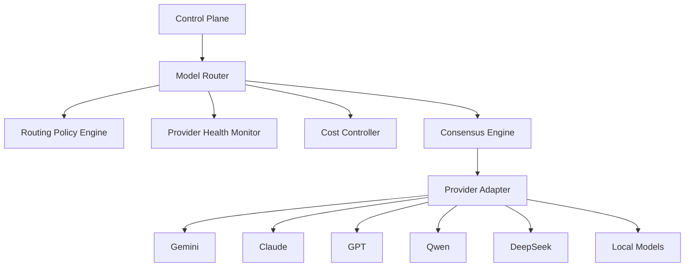

# Enterprise AI Software Factory
# Architecture Design Specification (ADS)

> **Document ID:** ADS-013
>
> **Document Name:** Model Routing & AI Execution Layer
>
> **Status:** Draft
>
> **Version:** 1.0.0
>
> **Depends On:** ADS-000 → ADS-012

---

# Purpose

The Model Routing & AI Execution Layer is responsible for selecting the most appropriate AI model for every engineering task.

Instead of relying on a single LLM, the platform dynamically selects models based on capability, latency, confidence, security policy, cost, context size, and workload.

The goal is to maximize software quality while minimizing operational cost and maintaining vendor independence.

---

# Responsibilities

The Model Routing Layer owns

- Model Selection
- Request Routing
- Provider Management
- Cost Optimization
- Fallback Routing
- Confidence Evaluation
- Multi-Agent Consensus
- Load Distribution
- Context Window Management
- Rate Limit Handling
- Provider Health Monitoring

The Model Router never owns

- Workflow Scheduling
- Memory Retrieval
- Authentication
- Deployment
- Data Storage

---

# High-Level Architecture



---

# Why Model Routing?

Different models have different strengths.

Examples

| Task | Preferred Capability |
|--------|----------------------|
| Long Context Analysis | Large Context Models |
| Backend Development | Coding Models |
| UI Generation | Multimodal Models |
| Security Review | Reasoning Models |
| Documentation | Fast Language Models |
| Image Understanding | Vision Models |

A single model cannot optimize every workload.

---

# Routing Pipeline

```text
Incoming Task

↓

Task Classification

↓

Capability Analysis

↓

Policy Validation

↓

Budget Check

↓

Health Check

↓

Model Selection

↓

Execution

↓

Confidence Evaluation

↓

Result Returned
```

---

# Routing Factors

The router evaluates

- Context Size
- Task Type
- Required Capability
- Estimated Cost
- Current Load
- Provider Availability
- Latency
- Historical Accuracy
- Security Policy
- User Preferences

No routing decision is random.

---

# Internal Components

| Component | Responsibility |
|------------|----------------|
| Task Classifier | Determines task category |
| Routing Engine | Chooses model |
| Cost Controller | Tracks AI spending |
| Provider Manager | Connects to providers |
| Health Monitor | Tracks provider availability |
| Consensus Engine | Resolves disagreements |
| Confidence Engine | Scores responses |
| Fallback Manager | Handles provider failures |

---

# Model Categories

## Frontier Models

Examples

- GPT
- Claude
- Gemini

Purpose

Complex reasoning.

---

## Coding Models

Examples

- Qwen Coder
- DeepSeek Coder

Purpose

Code generation.

---

## Vision Models

Examples

- Gemini Vision
- GPT Vision

Purpose

UI review.

---

## Local Models

Purpose

Private execution.

Used for

- Air-gapped deployments
- Sensitive code
- Cost optimization

---

# Routing Decision

```mermaid
flowchart LR

Task

↓

Classifier

↓

Policy Engine

↓

Capability Match

↓

Health Check

↓

Budget Check

↓

Selected Model
```

---

# Multi-Model Consensus

Critical engineering tasks may require multiple models.

Example

```text
Architecture Task

↓

Claude

↓

GPT

↓

Gemini

↓

Consensus Engine

↓

Final Decision
```

Consensus is used only when confidence thresholds require additional validation.

---

# Confidence Scoring

Every response receives a confidence score.

Factors

- Internal Consistency
- Test Coverage
- Historical Performance
- Security Review
- Consensus Agreement

Example

| Score | Action |
|--------|--------|
| 95-100 | Accept |
| 80-94 | Review |
| Below 80 | Retry or Escalate |

---

# Fallback Strategy

```text
Primary Model

↓

Unavailable

↓

Secondary Model

↓

Unavailable

↓

Local Model

↓

Human Escalation
```

Workflows continue whenever possible.

---

# Provider Abstraction

The platform never communicates directly with AI providers.

Every provider implements the same interface.

Benefits

- Vendor Independence
- Easier Migration
- Centralized Monitoring
- Unified Logging

---

# Connected Systems

## Control Plane

Requests model execution.

---

## Agent Plane

Submits engineering tasks.

---

## Memory Plane

Provides optimized context.

---

## Security Plane

Validates provider permissions.

---

## Observability Plane

Collects

- Latency
- Cost
- Success Rate
- Failure Rate

---

# Communication

| Source | Destination | Purpose |
|----------|------------|----------|
| Control Plane | Model Router | Task Request |
| Model Router | Policy Engine | Routing Decision |
| Model Router | Provider Adapter | Execute Request |
| Provider Adapter | AI Provider | Inference |
| Provider Adapter | Observability | Metrics |

---

# Failure Handling

```text
Provider Failure

↓

Retry

↓

Alternate Provider

↓

Local Model

↓

Human Review
```

---

# Scalability

The routing layer scales independently.

Routing

Stateless

Provider Adapters

Horizontal

Consensus Engine

Distributed

Health Monitoring

Distributed

---

# Security

Every provider request

- Uses encrypted transport
- Redacts secrets
- Applies prompt sanitization
- Logs audit metadata
- Enforces policy checks

Sensitive enterprise data may be restricted to approved providers or local models.

---

# Recommended Technologies

| Capability | Technology |
|------------|------------|
| Orchestration | LangGraph |
| Routing | Custom Router |
| Local Runtime | Ollama |
| Gateway | LiteLLM |
| Policy | Open Policy Agent |
| Monitoring | OpenTelemetry |

---

# Why These Technologies

| Technology | Reason |
|------------|--------|
| LiteLLM | Unified provider abstraction |
| Ollama | Local model execution |
| LangGraph | Agent orchestration |
| OPA | Policy enforcement |
| OpenTelemetry | Provider telemetry |

---

# Architecture Decision Record

## ADR-013

Decision

Introduce a centralized Model Routing Layer rather than allowing each agent to choose its own model.

Reason

A centralized router enables consistent policy enforcement, cost optimization, vendor independence, intelligent fallback, and organization-wide routing strategies.

---

# Principles Implemented

- ✅ AP-001 Correctness Before Speed
- ✅ AP-005 Deterministic Workflows
- ✅ AP-009 Enterprise First
- ✅ AP-010 Vendor Independence
- ✅ AP-012 Event Driven

---

# Next Document

ADS-014 — Multi-Agent Collaboration & Consensus Engine

This document defines how AI agents communicate, negotiate, validate each other's outputs, resolve disagreements, and collaboratively produce engineering decisions without entering infinite reasoning loops.

---

# End of Document
