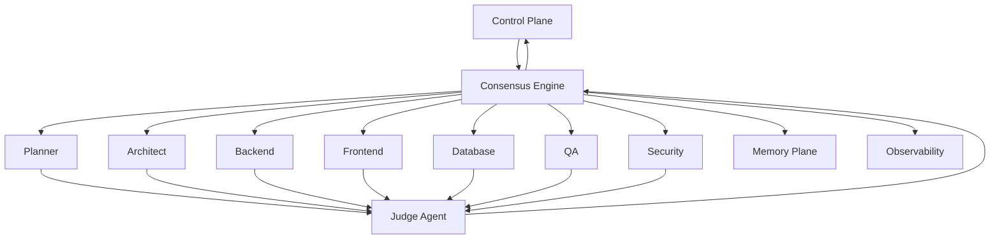
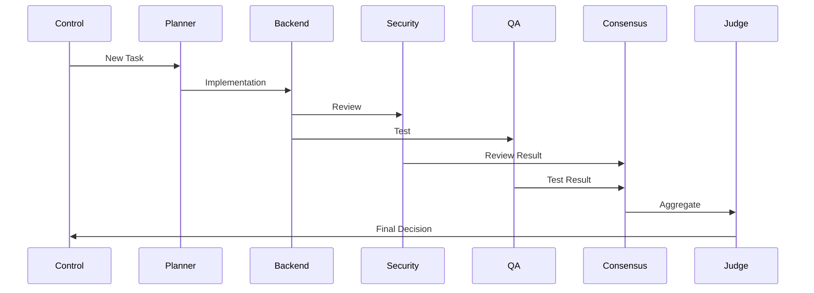

# Enterprise AI Software Factory
# Architecture Design Specification (ADS)

> **Document ID:** ADS-014
>
> **Document Name:** Multi-Agent Collaboration & Consensus Engine
>
> **Status:** Draft
>
> **Version:** 1.0.0
>
> **Depends On:** ADS-000 → ADS-013

---

# Purpose

The Multi-Agent Collaboration & Consensus Engine enables specialized AI agents to collaborate on complex engineering tasks while maintaining consistency, preventing infinite reasoning loops, and ensuring high-confidence outputs.

Instead of allowing agents to communicate freely, every interaction follows structured collaboration workflows coordinated by the Control Plane.

This architecture prevents hallucination cascades, circular reasoning, duplicated work, and conflicting implementations.

---

# Responsibilities

The Consensus Engine owns

- Agent Collaboration
- Task Coordination
- Conflict Resolution
- Consensus Building
- Confidence Evaluation
- Decision Recording
- Evidence Aggregation
- Escalation Management
- Majority Voting
- Review Requests

The Consensus Engine never owns

- Workflow Scheduling
- Code Execution
- Authentication
- Memory Storage
- Deployment

---

# Why a Consensus Engine?

Without structured collaboration

- Agents overwrite each other
- Different models produce conflicting implementations
- Infinite debate occurs
- Low-confidence solutions reach production
- Decisions become impossible to audit

The Consensus Engine transforms multiple AI models into a coordinated engineering organization.

---

# High-Level Architecture



---

# Collaboration Principles

Every collaboration follows these rules.

- One task has one owner.
- Every decision requires evidence.
- Collaboration is bounded.
- Consensus is measurable.
- Human escalation is always available.
- Discussions are recorded.
- Decisions are reproducible.

---

# Collaboration Lifecycle

```text
Task Assigned

↓

Primary Agent Selected

↓

Supporting Agents Assigned

↓

Independent Analysis

↓

Evidence Collection

↓

Consensus Evaluation

↓

Confidence Score

↓

Accepted

OR

Escalation
```

---

# Collaboration Roles

## Primary Agent

Owns implementation.

Responsible for final delivery.

Example

Backend Agent

---

## Supporting Agents

Provide reviews.

Examples

Security

QA

Architecture

Performance

Documentation

---

## Judge Agent

Never writes code.

Responsibilities

- Compare outputs
- Detect conflicts
- Aggregate evidence
- Calculate confidence
- Request retries
- Escalate to humans

---

# Consensus Models

## Single Agent

One agent completes the task.

Used for

Low-risk documentation.

---

## Dual Review

One implementation.

One reviewer.

Used for

Routine coding.

---

## Multi-Agent Review

Multiple specialists review.

Used for

Critical infrastructure.

---

## Majority Voting

Three or more implementations.

Most supported solution wins.

---

## Human Arbitration

Final escalation path.

Used for

High-risk architecture.

---

# Consensus Flow



---

# Confidence Engine

Every engineering decision receives a confidence score.

Factors include

- Test Success
- Security Review
- Consensus Agreement
- Historical Reliability
- Static Analysis
- Policy Compliance
- Architecture Validation

Example

| Confidence | Action |
|------------|--------|
| 95–100 | Accept |
| 85–94 | Auto Review |
| 70–84 | Additional Consensus |
| Below 70 | Human Escalation |

---

# Conflict Resolution

Possible conflicts

- Architecture disagreements
- API inconsistencies
- Naming conflicts
- Security findings
- Failed tests

Resolution process

```text
Conflict

↓

Evidence Collection

↓

Consensus Vote

↓

Judge Decision

↓

Retry

↓

Human Escalation
```

---

# Communication Rules

Agents never communicate directly.

All communication passes through the Consensus Engine.

Benefits

- Full audit trail
- Better observability
- Policy enforcement
- Deterministic execution
- Loop prevention

---

# Decision Records

Every decision stores

- Decision ID
- Workflow ID
- Participating Agents
- Supporting Evidence
- Confidence Score
- Timestamp
- Final Outcome

Decisions are immutable.

---

# Infinite Loop Prevention

Every collaboration enforces

- Maximum Review Count
- Maximum Retry Count
- Maximum Discussion Depth
- Maximum Token Budget
- Maximum Execution Time

If limits are exceeded

↓

Human Review

---

# Connected Systems

## Control Plane

Creates collaboration sessions.

---

## Agent Plane

Executes engineering work.

---

## Memory Plane

Provides historical engineering context.

---

## Observability Plane

Tracks collaboration metrics.

---

## Security Plane

Validates permissions.

---

# Collaboration Metrics

Collected metrics include

- Consensus Duration
- Average Confidence
- Retry Count
- Human Escalations
- Agreement Rate
- Review Time
- Conflict Frequency

---

# Failure Handling

```text
Consensus Failure

↓

Retry

↓

Additional Reviewer

↓

Alternative Model

↓

Human Review

↓

Workflow Resume
```

---

# Scalability

Consensus services are stateless.

Multiple consensus sessions may execute simultaneously.

Judge Agents may scale independently.

---

# Security

Every collaboration

- Is authenticated
- Is encrypted
- Is logged
- Is auditable

No agent may impersonate another.

---

# Recommended Technologies

| Capability | Technology |
|------------|------------|
| Workflow Coordination | LangGraph |
| Durable Sessions | Temporal |
| Event Streaming | Kafka |
| Policy Validation | Open Policy Agent |
| Structured Messaging | MCP |
| Agent Communication | A2A Protocol |

---

# Why These Technologies

| Technology | Reason |
|------------|--------|
| LangGraph | Structured multi-agent graphs |
| Temporal | Durable collaboration workflows |
| Kafka | Reliable event coordination |
| MCP | Standardized tool interaction |
| A2A | Standardized agent communication |

---

# Architecture Decision Record

## ADR-014

Decision

All inter-agent communication must pass through the Consensus Engine.

Reason

Centralizing collaboration improves auditability, prevents uncontrolled agent conversations, enables confidence scoring, and simplifies workflow recovery.

---

# Principles Implemented

- ✅ AP-001 Correctness Before Speed
- ✅ AP-005 Deterministic Workflows
- ✅ AP-006 Bounded Execution
- ✅ AP-008 Observability
- ✅ AP-011 Single Responsibility
- ✅ AP-012 Event Driven
- ✅ AP-015 Continuous Verification

---

# Next Document

ADS-015 — Agent Computer Interface (ACI)

This document defines the secure execution interface that allows AI agents to interact with files, terminals, browsers, APIs, and development environments without direct access to the host operating system.

---

# End of Document
