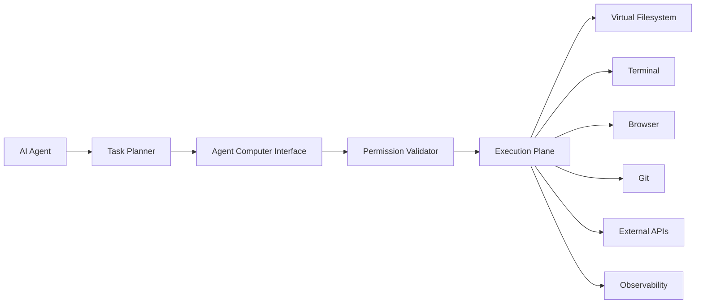
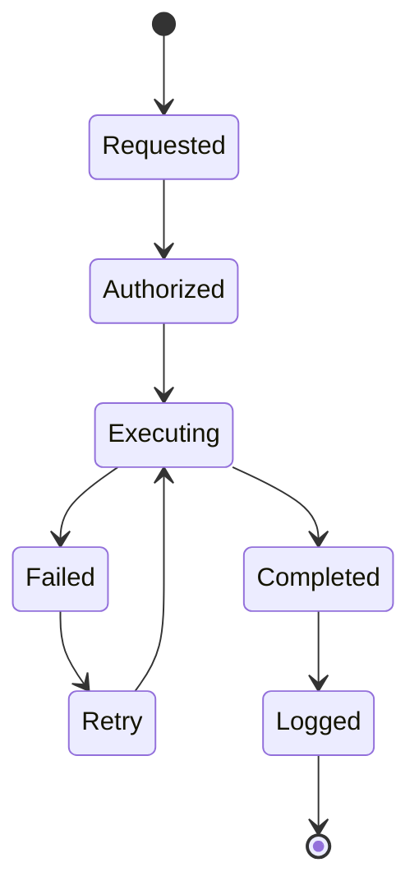

# Enterprise AI Software Factory
# Architecture Design Specification (ADS)

> **Document ID:** ADS-015
>
> **Document Name:** Agent Computer Interface (ACI)
>
> **Status:** Draft
>
> **Version:** 1.0.0
>
> **Depends On:** ADS-000 → ADS-014

---

# Purpose

The Agent Computer Interface (ACI) is the standardized execution interface between AI agents and the execution environment.

Instead of allowing AI models to directly interact with operating systems, shells, files, browsers, or APIs, every action must pass through the ACI.

The ACI converts high-level reasoning into secure, deterministic, and auditable actions.

It acts as the "Operating System API" for every AI agent inside the Enterprise AI Software Factory.

---

# Responsibilities

The Agent Computer Interface owns

- Tool Invocation
- File Operations
- Terminal Operations
- Browser Automation
- IDE Interaction
- Git Operations
- API Execution
- Permission Validation
- Action Auditing
- Execution Serialization

The ACI never owns

- AI Reasoning
- Workflow Scheduling
- Authentication
- Long-Term Storage
- Deployment

---

# Why an Agent Computer Interface?

Large Language Models should never execute arbitrary commands.

Without an ACI

- AI generates unsafe shell commands.
- Commands are difficult to audit.
- Recovery becomes impossible.
- Security policies are bypassed.
- Tool interfaces become inconsistent.

The ACI solves these problems by exposing a fixed set of approved capabilities.

---

# High-Level Architecture



---

# Execution Flow

```text
Task

↓

AI Agent

↓

ACI

↓

Permission Validation

↓

Tool Selection

↓

Execution

↓

Result Collection

↓

Return Result

↓

Audit Log
```

Every execution follows the same lifecycle.

---

# Core Components

| Component | Responsibility |
|------------|----------------|
| Tool Registry | Available tools |
| Permission Validator | Checks permissions |
| Command Translator | Converts structured actions |
| Execution Dispatcher | Routes tool calls |
| Result Collector | Collects outputs |
| Audit Logger | Records execution history |

---

# Supported Tool Categories

## File Tools

Capabilities

- Read File
- Create File
- Edit File
- Delete File
- Move File
- Search File

Example

```text
read_file()

edit_file()

create_directory()

rename_file()
```

---

## Terminal Tools

Capabilities

- Execute Commands
- Build Projects
- Run Tests
- Install Packages

Example

```text
run_command()

build_project()

run_tests()

execute_script()
```

---

## Browser Tools

Capabilities

- Open URL
- Click
- Fill Forms
- Capture Screenshot
- Accessibility Audit

Recommended Engine

Playwright

---

## Git Tools

Capabilities

- Clone Repository
- Commit
- Branch
- Merge
- Diff
- Pull Request

No direct Git operations occur outside the ACI.

---

## API Tools

Capabilities

- REST
- GraphQL
- Webhooks
- MCP Servers

Every request is authenticated.

---

# Tool Registry

The Tool Registry defines every action an agent may perform.

Example

| Tool | Description |
|--------|-------------|
| read_file | Reads file contents |
| edit_file | Modifies file |
| run_tests | Executes test suite |
| browser_open | Opens browser |
| git_diff | Generates repository diff |

Agents cannot invoke tools that are not registered.

---

# Permission Validation

Before every execution

```text
Tool Request

↓

Permission Check

↓

Policy Validation

↓

Security Validation

↓

Execution
```

Unauthorized actions are rejected.

---

# Command Translation

Agents never generate raw shell commands.

Instead

```text
edit_file()

↓

ACI

↓

Safe File Operation

↓

Execution
```

The ACI generates the platform-specific implementation.

---

# Connected Systems

## Agent Plane

Requests tool execution.

---

## Execution Plane

Performs the requested action.

---

## Security Plane

Validates permissions.

---

## Identity Plane

Provides temporary identities.

---

## Observability Plane

Collects

- Tool Usage
- Latency
- Errors
- Resource Usage

---

## Memory Plane

Provides contextual information for tool execution.

---

# Communication

| Source | Destination | Purpose |
|----------|------------|----------|
| Agent | ACI | Tool Request |
| ACI | Security Plane | Permission Validation |
| ACI | Execution Plane | Execute Tool |
| Execution Plane | Observability | Metrics |
| Execution Plane | Agent | Results |

---

# Tool Lifecycle



---

# Failure Handling

```text
Tool Failure

↓

Capture Logs

↓

Retry

↓

Alternative Tool

↓

Human Review
```

Every failure is logged.

---

# Security

Every tool execution

- Uses temporary credentials
- Is policy validated
- Is audited
- Runs inside isolated environments
- Cannot bypass the Security Plane

No direct OS access exists.

---

# Scalability

The ACI is stateless.

Multiple ACI instances may execute simultaneously.

Tool execution is distributed across the Execution Plane.

---

# Recommended Technologies

| Capability | Technology |
|------------|------------|
| Tool Protocol | MCP |
| Agent Communication | A2A |
| Browser Automation | Playwright |
| File Operations | Native ACI API |
| RPC | gRPC |
| Serialization | Protocol Buffers |

---

# Why These Technologies

| Technology | Reason |
|------------|--------|
| MCP | Standard tool interface |
| A2A | Standard agent communication |
| Playwright | Browser automation |
| gRPC | Fast service communication |
| Protocol Buffers | Efficient structured messages |

---

# Architecture Decision Record

## ADR-015

Decision

Every AI interaction with the external environment must occur exclusively through the Agent Computer Interface.

Reason

The ACI provides a secure abstraction layer between AI reasoning and system execution, ensuring consistency, auditability, recoverability, and policy enforcement.

---

# Principles Implemented

- ✅ AP-001 Correctness Before Speed
- ✅ AP-002 Security by Default
- ✅ AP-003 Zero Trust
- ✅ AP-006 Bounded Execution
- ✅ AP-008 Observability
- ✅ AP-011 Single Responsibility
- ✅ AP-014 Fail Closed

---

# Next Document

ADS-016 — Enterprise Memory Architecture

This document expands the Memory Plane into its internal subsystems, including semantic memory, episodic memory, procedural memory, organizational memory, GraphRAG, vector retrieval, embedding pipelines, indexing, memory aging, and knowledge evolution.

---

# End of Document
