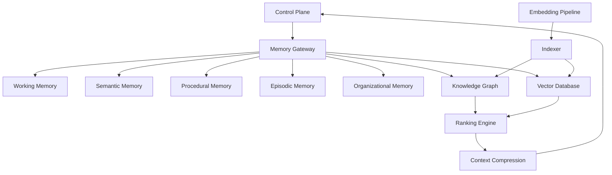

# Enterprise AI Software Factory
# Architecture Design Specification (ADS)

> **Document ID:** ADS-016
>
> **Document Name:** Enterprise Memory Architecture
>
> **Status:** Draft
>
> **Version:** 1.0.0
>
> **Depends On:** ADS-000 → ADS-015

---

# Purpose

The Enterprise Memory Architecture expands the Memory Plane into multiple specialized memory systems.

Instead of treating memory as a single vector database, the platform separates memory based on its purpose, lifecycle, ownership, and retrieval strategy.

Each memory subsystem exists to solve a specific reasoning problem while minimizing hallucinations and unnecessary token usage.

---

# Objectives

The Memory Architecture aims to

- Improve reasoning quality
- Reduce hallucinations
- Minimize prompt size
- Preserve engineering knowledge
- Learn from completed workflows
- Share knowledge between agents
- Support long-running projects

---

# High-Level Architecture



---

# Memory Hierarchy

```text
Organization

↓

Projects

↓

Repositories

↓

Workflows

↓

Tasks

↓

Context

↓

Prompt
```

Each level progressively reduces information until only the minimum required context reaches an AI model.

---

# Memory Types

## Working Memory

Purpose

Stores temporary workflow state.

Examples

- Current Task
- Active File
- Open Pull Request
- Current Branch
- Agent State

Persistence

Temporary

Deleted after workflow completion.

---

## Semantic Memory

Purpose

Stores factual project knowledge.

Examples

- APIs
- Services
- Architecture
- Components
- Naming Conventions

Persistence

Permanent

---

## Procedural Memory

Purpose

Stores engineering processes.

Examples

- Build Pipeline
- Release Process
- Deployment Workflow
- Testing Standards
- Security Checklist

Persistence

Permanent

---

## Episodic Memory

Purpose

Stores historical engineering experiences.

Examples

- Production Incidents
- Previous Bugs
- Human Reviews
- Failed Deployments
- Previous Solutions

Persistence

Permanent

---

## Organizational Memory

Purpose

Stores company-wide engineering knowledge.

Examples

- Coding Standards
- Internal Libraries
- Design Systems
- Compliance Rules
- Engineering Playbooks

Persistence

Permanent

---

# Knowledge Graph

The Knowledge Graph stores relationships rather than documents.

Example

```text
API

↓

implemented_by

↓

Backend Service

↓

deployed_to

↓

Production

↓

monitored_by

↓

Observability
```

This enables relationship-aware reasoning instead of keyword matching.

---

# Vector Database

Purpose

Semantic similarity search.

Stores

- Documentation
- Code
- ADRs
- Specifications
- Design Documents

The Vector Database complements the Knowledge Graph.

It never replaces it.

---

# Embedding Pipeline

Every indexed artifact follows the same process.

```text
New Document

↓

Parser

↓

Chunking

↓

Embedding Model

↓

Metadata Extraction

↓

Vector Database

↓

Knowledge Graph
```

---

# Context Retrieval

```mermaid
flowchart LR

Task

↓

Memory Gateway

↓

Knowledge Graph

↓

Vector Search

↓

Ranking

↓

Compression

↓

Prompt Assembly

↓

Agent
```

Only ranked and compressed context reaches AI agents.

---

# Ranking Engine

The Ranking Engine evaluates

- Semantic Similarity
- Dependency Distance
- Workflow Relevance
- Recency
- User Intent
- Architecture Importance

Low-value context is discarded.

---

# Context Compression

Purpose

Reduce token usage.

Strategies

- Summarization
- Duplicate Removal
- Dependency Pruning
- Log Compression
- Documentation Reduction

Compression occurs after retrieval.

---

# Memory Updates

Memory evolves continuously.

```text
Workflow Complete

↓

Execution Summary

↓

Knowledge Extraction

↓

Embedding

↓

Knowledge Graph Update

↓

Memory Available
```

Knowledge improves over time without modifying original project artifacts.

---

# Memory Aging

Not all knowledge remains equally valuable.

Memory receives freshness scores.

Examples

| Age | Priority |
|------|----------|
| Active Sprint | Highest |
| Current Release | High |
| Previous Release | Medium |
| Archived Projects | Low |

Older knowledge remains searchable but receives lower ranking.

---

# Connected Systems

## Control Plane

Requests workflow context.

Publishes workflow summaries.

---

## Agent Plane

Consumes optimized prompts.

Publishes engineering knowledge.

---

## Execution Plane

Publishes execution summaries.

Publishes generated artifacts.

---

## Data Plane

Supplies source documents.

Never performs retrieval.

---

## Observability Plane

Publishes

- Retrieval Metrics
- Cache Hit Rate
- Query Latency

---

# Caching Strategy

Three cache layers are maintained.

```text
L1

Workflow Cache

↓

L2

Project Cache

↓

L3

Organization Cache
```

This minimizes retrieval latency and embedding cost.

---

# Failure Handling

```text
Memory Request

↓

Vector Failure

↓

Knowledge Graph

↓

Cache

↓

Summary

↓

Human Escalation
```

Memory retrieval always attempts fallback before failure.

---

# Scalability

Every subsystem scales independently.

Knowledge Graph

Horizontal

Vector Database

Horizontal

Embedding Workers

Distributed

Ranking Engine

Stateless

Compression Engine

Stateless

---

# Security

Memory follows Zero Trust principles.

Every request

- Authenticated
- Authorized
- Encrypted
- Logged

Sensitive knowledge may be isolated by organization, project, or tenant.

---

# Recommended Technologies

| Capability | Technology |
|------------|------------|
| Knowledge Graph | Neo4j |
| Vector Database | Qdrant |
| Embedding Models | BGE-M3 / Jina Embeddings v4 |
| Context Ranking | Custom Ranking Engine |
| Cache | Redis |
| Parser | Tree-sitter + Unstructured.io |

---

# Why These Technologies

| Technology | Reason |
|------------|--------|
| Neo4j | Native graph traversal |
| Qdrant | High-performance vector search |
| BGE-M3 | Strong multilingual retrieval |
| Redis | Fast context caching |
| Tree-sitter | Accurate source-code parsing |

---

# Architecture Decision Record

## ADR-016

Decision

Implement multiple specialized memory systems instead of a single vector database.

Reason

Different reasoning tasks require different retrieval strategies.

Separating memory improves relevance, reduces hallucinations, and keeps prompts efficient.

---

# Principles Implemented

- ✅ AP-001 Correctness Before Speed
- ✅ AP-005 Deterministic Workflows
- ✅ AP-008 Observability
- ✅ AP-011 Single Responsibility
- ✅ AP-013 Memory as Infrastructure

---

# Next Document

ADS-017 — Knowledge Graph & GraphRAG Architecture

This document defines the internal design of the Knowledge Graph, GraphRAG pipeline, entity relationships, dependency graphs, AST integration, retrieval strategy, and reasoning workflow.

---

# End of Document
