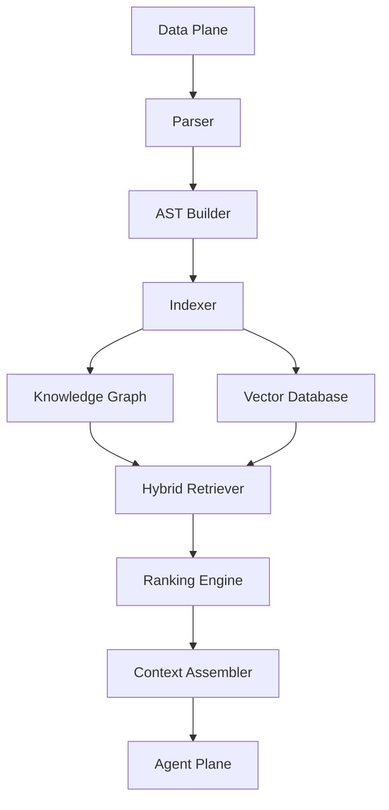
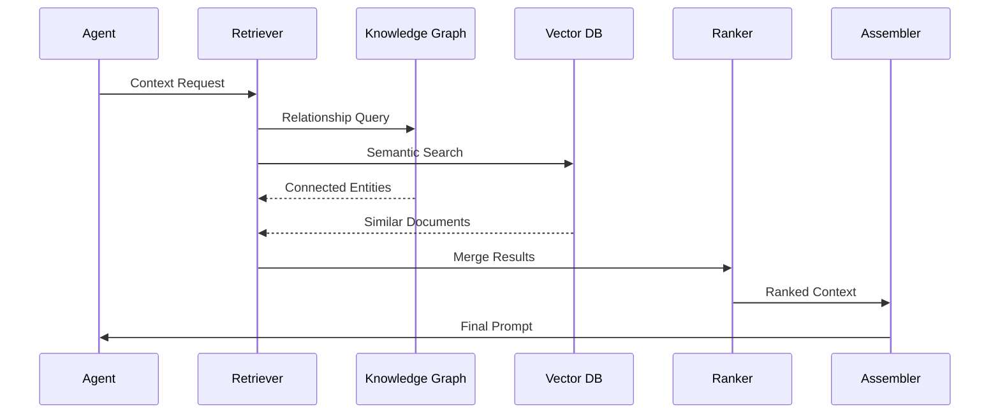

# Enterprise AI Software Factory
# Architecture Design Specification (ADS)

> **Document ID:** ADS-017
>
> **Document Name:** Knowledge Graph & GraphRAG Architecture
>
> **Status:** Draft
>
> **Version:** 1.0.0
>
> **Depends On:** ADS-000 → ADS-016

---

# Purpose

The Knowledge Graph & GraphRAG Architecture provides relationship-aware reasoning for the Enterprise AI Software Factory.

Unlike traditional Retrieval-Augmented Generation (RAG), which retrieves documents based on semantic similarity alone, GraphRAG understands the structural relationships between software components.

The objective is to retrieve **relevant context**, not simply **similar text**.

---

# Goals

The Knowledge Graph exists to

- Understand software relationships
- Reduce hallucinations
- Improve architectural reasoning
- Improve code navigation
- Enable dependency-aware retrieval
- Reduce unnecessary prompt size
- Improve long-term project understanding

---

# Why GraphRAG?

Traditional RAG retrieves documents.

GraphRAG retrieves relationships.

Example

Traditional RAG

```text
Search

↓

Returns

AuthService.md

UserService.md

Login.ts
```

GraphRAG

```text
User Login

↓

Authentication Service

↓

JWT Provider

↓

Session Manager

↓

Database

↓

Frontend Login Screen

↓

API Gateway

↓

Deployment

```

The model understands how everything is connected.

---

# High-Level Architecture



---

# Graph Components

The Knowledge Graph stores

- Projects
- Services
- APIs
- Functions
- Classes
- Files
- Modules
- Databases
- Workflows
- Infrastructure
- Agents

Every node is connected through explicit relationships.

---

# Relationship Types

Examples

```text
Service

↓

calls

↓

API

↓

uses

↓

Database

↓

deployed_to

↓

Cluster

↓

monitored_by

↓

Observability
```

Additional relationships

- imports
- extends
- owns
- depends_on
- communicates_with
- publishes
- subscribes_to
- secured_by
- executed_by
- reviewed_by

---

# Graph Construction Pipeline

```text
Repository

↓

Parser

↓

AST Extraction

↓

Entity Detection

↓

Relationship Discovery

↓

Graph Builder

↓

Knowledge Graph
```

The graph is continuously updated as the project evolves.

---

# AST Integration

Source code is parsed into Abstract Syntax Trees.

Extracted information includes

- Classes
- Methods
- Interfaces
- Imports
- Dependencies
- Annotations
- Types
- Modules

AST data becomes graph relationships.

---

# Hybrid Retrieval

Retrieval combines multiple systems.

```text
Task

↓

Knowledge Graph

+

Vector Search

+

Metadata Search

↓

Ranking

↓

Prompt
```

No retrieval strategy is used independently.

---

# Graph Query Flow



---

# Entity Types

| Entity | Description |
|----------|------------|
| Project | Root project |
| Repository | Git repository |
| Module | Logical package |
| File | Source file |
| Class | Code class |
| Function | Executable method |
| API | Public endpoint |
| Database | Persistent storage |
| Service | Runtime component |
| Workflow | Business workflow |
| Agent | AI engineering agent |

---

# Graph Updates

Every engineering workflow updates the graph.

```text
Code Changed

↓

AST Generated

↓

Relationships Updated

↓

Embeddings Generated

↓

Knowledge Graph Updated

↓

Search Available
```

Graph updates occur asynchronously.

---

# Connected Systems

## Data Plane

Provides

- Source Code
- Documentation
- ADRs

---

## Memory Plane

Uses GraphRAG during retrieval.

---

## Agent Plane

Consumes relationship-aware context.

---

## Control Plane

Triggers indexing workflows.

---

## Observability Plane

Collects

- Query Latency
- Retrieval Quality
- Graph Size
- Index Health

---

# Failure Handling

```text
Graph Query Failure

↓

Vector Search

↓

Cached Context

↓

Summary

↓

Human Escalation
```

Retrieval never depends on a single subsystem.

---

# Scalability

Graph services scale independently.

Graph Database

Horizontal

Index Workers

Distributed

Embedding Workers

Distributed

Retriever

Stateless

---

# Security

Graph access follows

- Zero Trust
- RBAC
- Project Isolation
- Tenant Isolation
- Audit Logging

Cross-project queries are denied unless explicitly authorized.

---

# Recommended Technologies

| Capability | Technology |
|------------|------------|
| Graph Database | Neo4j |
| Vector Database | Qdrant |
| Code Parser | Tree-sitter |
| Search | Hybrid Search |
| Embeddings | BGE-M3 |
| Retrieval | GraphRAG |

---

# Why These Technologies

| Technology | Reason |
|------------|--------|
| Neo4j | Native graph traversal |
| Tree-sitter | Accurate language parsing |
| Qdrant | Fast vector retrieval |
| GraphRAG | Relationship-aware retrieval |
| BGE-M3 | High-quality multilingual embeddings |

---

# Architecture Decision Record

## ADR-017

Decision

Adopt GraphRAG as the primary retrieval strategy instead of vector search alone.

Reason

Software systems are highly relational.

Understanding dependencies, ownership, communication paths, and architecture produces significantly better AI reasoning than document similarity alone.

---

# Principles Implemented

- ✅ AP-001 Correctness Before Speed
- ✅ AP-005 Deterministic Workflows
- ✅ AP-011 Single Responsibility
- ✅ AP-013 Memory as Infrastructure

---

# Next Document

ADS-018 — Enterprise Context Engine

This document defines how retrieved knowledge is ranked, compressed, assembled into prompts, versioned, cached, and delivered to AI models while respecting context windows, token budgets, and workflow requirements.

---

# End of Document
