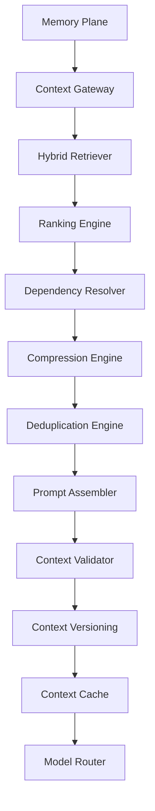

# Enterprise AI Software Factory
# Architecture Design Specification (ADS)

> **Document ID:** ADS-018
>
> **Document Name:** Enterprise Context Engine
>
> **Status:** Draft
>
> **Version:** 1.0.0
>
> **Depends On:** ADS-000 → ADS-017

---

# Purpose

The Enterprise Context Engine is responsible for transforming raw organizational knowledge into optimized AI prompts.

It acts as the bridge between the Memory Plane and AI Models.

Instead of sending every retrieved document directly to an LLM, the Context Engine intelligently filters, ranks, compresses, assembles, validates and versions the information before it reaches an AI model.

The objective is to maximize reasoning quality while minimizing hallucinations, latency and token consumption.

---

# Goals

The Context Engine exists to

- Deliver only relevant context
- Reduce hallucinations
- Respect model context limits
- Optimize token usage
- Preserve architectural consistency
- Improve prompt quality
- Maintain deterministic context generation

---

# High-Level Architecture



---

# Why a Context Engine?

Without a Context Engine

```text
Memory

↓

100 Files

↓

AI Model
```

Problems

- Context overflow
- Duplicate information
- Conflicting knowledge
- High latency
- Increased cost
- Hallucinations

Instead

```text
Memory

↓

Retriever

↓

Ranking

↓

Compression

↓

Assembly

↓

Validation

↓

Prompt
```

The AI receives only what it needs.

---

# Context Generation Pipeline

```text
Task

↓

Retrieve Knowledge

↓

Rank Context

↓

Resolve Dependencies

↓

Remove Duplicates

↓

Compress

↓

Assemble Prompt

↓

Validate

↓

Version

↓

Cache

↓

Model
```

---

# Internal Components

| Component | Responsibility |
|------------|----------------|
| Context Gateway | Entry point for context requests |
| Hybrid Retriever | Retrieves graph and vector knowledge |
| Ranking Engine | Scores retrieved information |
| Dependency Resolver | Finds required supporting context |
| Compression Engine | Reduces prompt size |
| Deduplication Engine | Removes duplicate content |
| Prompt Assembler | Builds final prompt |
| Context Validator | Detects inconsistencies |
| Version Manager | Tracks prompt versions |
| Context Cache | Stores frequently used prompts |

---

# Context Ranking

Every retrieved object receives a score.

Ranking considers

- Semantic Similarity
- Dependency Distance
- Project Relevance
- Workflow State
- Architecture Importance
- User Intent
- Recent Activity

Only the highest-ranked context proceeds.

---

# Dependency Resolution

Software components rarely exist independently.

Example

```text
Authentication API

↓

JWT Service

↓

Database

↓

User Model

↓

Configuration

↓

Environment Variables
```

The Dependency Resolver automatically includes related components.

---

# Context Compression

Compression reduces prompt size without losing critical information.

Methods

- Hierarchical Summarization
- AST Compression
- Duplicate Removal
- Documentation Summaries
- Log Summaries
- Dependency Pruning

Compression occurs only after ranking.

---

# Prompt Assembly

The Prompt Assembler builds prompts in a fixed structure.

```text
System Instructions

↓

Project Rules

↓

Architecture Context

↓

Relevant Code

↓

Task Context

↓

User Request

↓

Expected Output
```

Every prompt follows the same template.

---

# Context Validation

Before delivery, the Context Validator checks

- Missing Dependencies
- Conflicting Information
- Invalid References
- Duplicate Files
- Version Mismatch
- Policy Violations

Invalid prompts are rejected.

---

# Context Versioning

Every generated prompt receives

- Context ID
- Version Number
- Workflow ID
- Timestamp
- Retrieval Metadata

This enables replay and debugging.

---

# Context Caching

Three cache levels are supported.

```text
L1

Workflow Cache

↓

L2

Project Cache

↓

L3

Organization Cache
```

Benefits

- Lower latency
- Reduced retrieval cost
- Faster prompt generation

---

# Connected Systems

## Memory Plane

Provides

- Graph Data
- Vector Data
- Organizational Knowledge

---

## Model Router

Consumes optimized prompts.

---

## Control Plane

Initiates context generation.

---

## Observability Plane

Collects

- Prompt Size
- Generation Time
- Cache Hit Rate
- Compression Ratio

---

# Communication

| Source | Destination | Purpose |
|----------|------------|----------|
| Control Plane | Context Gateway | Context Request |
| Context Gateway | Memory Plane | Knowledge Retrieval |
| Ranking Engine | Compression Engine | Ranked Context |
| Prompt Assembler | Validator | Prompt Validation |
| Context Cache | Model Router | Final Prompt |

---

# Failure Handling

```text
Context Request

↓

Retrieval Failure

↓

Cache

↓

Compressed Summary

↓

Human Escalation
```

Every failure path attempts a fallback before interruption.

---

# Scalability

The Context Engine is horizontally scalable.

Retriever

Stateless

Ranking

Distributed

Compression

Distributed

Validation

Stateless

Caching

Distributed

---

# Security

Every generated prompt

- Removes secrets
- Applies policy filtering
- Redacts sensitive data
- Enforces tenant isolation
- Logs prompt metadata

Raw prompts are never exposed to unauthorized users.

---

# Recommended Technologies

| Capability | Technology |
|------------|------------|
| Prompt Assembly | DSPy |
| Context Compression | LLMLingua-2 |
| Caching | Redis |
| Parsing | Tree-sitter |
| Retrieval | GraphRAG |
| Embeddings | BGE-M3 |

---

# Why These Technologies

| Technology | Reason |
|------------|--------|
| DSPy | Structured prompt pipelines |
| LLMLingua-2 | Advanced prompt compression |
| Redis | High-speed caching |
| Tree-sitter | Accurate code parsing |
| GraphRAG | Relationship-aware retrieval |

---

# Architecture Decision Record

## ADR-018

Decision

Separate Context Engineering from Memory Retrieval.

Reason

Memory retrieves information.

Context Engineering transforms that information into optimal AI inputs.

Separating these concerns improves maintainability, prompt quality, and future extensibility.

---

# Principles Implemented

- ✅ AP-001 Correctness Before Speed
- ✅ AP-005 Deterministic Workflows
- ✅ AP-008 Observability
- ✅ AP-011 Single Responsibility
- ✅ AP-013 Memory as Infrastructure

---

# Next Document

ADS-019 — Autonomous Planning & Task Decomposition Engine

This document defines how product requirements are transformed into deterministic task graphs, dependency DAGs, execution plans, milestones, and parallel engineering workflows.

---

# End of Document
