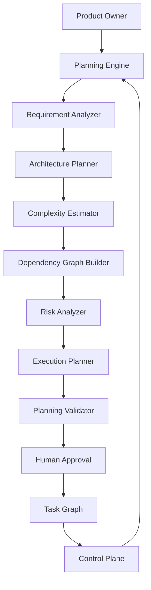

# Enterprise AI Software Factory
# Architecture Design Specification (ADS)

> **Document ID:** ADS-019
>
> **Document Name:** Autonomous Planning Engine
>
> **Status:** Draft
>
> **Version:** 2.0.0
>
> **Depends On:** ADS-000 → ADS-018

---

# Executive Summary

The Autonomous Planning Engine is the intelligence layer responsible for converting human requirements into deterministic engineering workflows.

Rather than allowing AI models to immediately begin coding, the Planning Engine performs structured reasoning before any implementation begins. It analyzes business requirements, identifies engineering objectives, decomposes work into atomic tasks, estimates complexity, identifies dependencies, predicts execution cost, and generates an optimized execution graph for the entire software factory.

The Planning Engine is therefore the **brain** of the Enterprise AI Software Factory.

Every engineering workflow begins here.

---

# Purpose

Transform human intent into an executable engineering plan.

The Planning Engine guarantees that implementation follows architecture rather than improvisation.

No coding agent may execute until an approved execution plan has been generated.

---

# Goals

The Planning Engine exists to achieve the following objectives.

• Remove ambiguity from requirements

• Produce deterministic execution plans

• Maximize safe parallel execution

• Reduce hallucinations

• Prevent conflicting implementations

• Improve execution predictability

• Reduce engineering cost

• Increase workflow observability

• Enable replayable engineering workflows

---

# Design Principles

The Planning Engine follows several architectural principles.

• Planning before execution

• Single source of architectural truth

• Dependency-aware execution

• Bounded planning loops

• Human approval before implementation

• Replayable planning sessions

• Complete auditability

---

# Functional Responsibilities

The Planning Engine is responsible for

- Requirement Analysis
- Requirement Normalization
- Feature Extraction
- Task Decomposition
- Dependency Analysis
- Complexity Estimation
- Resource Estimation
- Parallelization Planning
- Risk Analysis
- Milestone Generation
- Execution Graph Construction
- Planning Validation

The Planning Engine never

- Writes production code
- Executes workflows
- Deploys applications
- Modifies repositories

---

# High-Level Architecture



---

# Planning Workflow

```mermaid
flowchart LR

Requirement

-->

Requirement Analysis

-->

Architecture Planning

-->

Task Extraction

-->

Dependency Mapping

-->

Complexity Analysis

-->

Execution Graph

-->

Validation

-->

Human Approval

-->

Execution
```

---

# Internal Components

## Requirement Analyzer

Purpose

Convert natural language into structured engineering requirements.

Outputs

- Functional Requirements
- Non Functional Requirements
- Constraints
- Risks
- Unknowns

---

## Architecture Planner

Purpose

Generate the initial software architecture.

Produces

- Services
- APIs
- Databases
- Modules
- Folder Structure

---

## Complexity Estimator

Purpose

Estimate engineering effort.

Metrics

- Story Points
- Estimated Hours
- Model Cost
- Token Usage
- Execution Time

---

## Dependency Graph Builder

Purpose

Identify relationships between tasks.

Example

```text
Authentication

↓

Database

↓

JWT

↓

Frontend

↓

Integration Tests
```

Dependencies are stored as a Directed Acyclic Graph (DAG).

---

## Risk Analyzer

Every task receives a risk score.

Factors

- Security Impact
- Architectural Importance
- Deployment Impact
- User Impact
- Data Sensitivity
- Infrastructure Changes

---

## Execution Planner

Converts the dependency graph into an optimized execution schedule.

Objectives

- Maximize parallelism
- Reduce idle agents
- Minimize critical path duration

---

# Planning Algorithm

```text
Receive Requirement

↓

Extract Features

↓

Generate Architecture

↓

Identify Components

↓

Create Tasks

↓

Build DAG

↓

Estimate Complexity

↓

Calculate Critical Path

↓

Optimize Parallel Execution

↓

Validate Plan

↓

Human Approval
```

---

# Task Decomposition Strategy

Tasks must satisfy the following rules.

✔ Independent

✔ Testable

✔ Reviewable

✔ Reversible

✔ Observable

Tasks should never exceed one logical engineering objective.

Examples

Good

```
Implement JWT Authentication
```

Bad

```
Build entire backend
```

---

# Planning Outputs

The Planning Engine produces

- Execution Graph
- Task DAG
- Milestones
- Sprint Plan
- Risk Report
- Architecture Summary
- Resource Plan
- Cost Estimate

These outputs become immutable inputs for downstream systems.

---

# Failure Modes

Possible failures include

- Ambiguous requirements
- Circular dependencies
- Missing architecture
- Conflicting constraints
- Excessive complexity

Recovery

```text
Failure

↓

Planning Retry

↓

Alternative Planner

↓

Consensus

↓

Human Review
```

---

# Security Considerations

Planning never receives

- Production secrets
- Credentials
- Runtime tokens

Planning operates exclusively on project metadata and requirements.

Every planning session is logged and versioned.

---

# Scalability

Planning services are stateless.

Multiple planning workflows may execute simultaneously.

Execution graphs are persisted independently of planner instances.

---

# Recommended Technologies

| Capability | Technology |
|------------|------------|
| Workflow | Temporal |
| Graph Engine | LangGraph |
| Graph Storage | Neo4j |
| Queue | Kafka |
| Planning Models | GPT / Claude / Gemini |
| Validation | DSPy |

---

# Architecture Decision Record

## ADR-019

Decision

Introduce a dedicated Planning Engine before every engineering workflow.

Reason

Separating planning from implementation dramatically improves consistency, reduces hallucinations, enables deterministic execution, and simplifies workflow replay.

---

# Related Documents

ADS-002 — Control Plane

ADS-003 — Agent Plane

ADS-012 — Event-Driven Architecture

ADS-014 — Consensus Engine

ADS-018 — Enterprise Context Engine

---

# Next Document

ADS-020 — Agentic TDD Engine

The next document defines how every implementation task is transformed into a Test-Driven Development workflow where tests are generated before code, ensuring deterministic verification and minimizing AI hallucinations.

---

# End of Document
