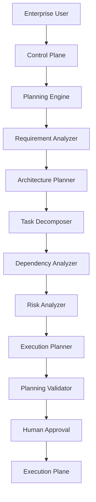
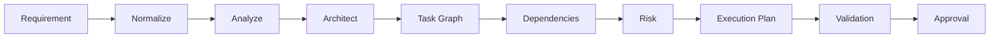

# Enterprise AI Software Factory
# Architecture Design Specification (ADS)

> **Document ID:** ADS-019-v1
>
> **Document Name:** Autonomous Planning Engine — Architecture
>
> **Version:** 2.0.0
>
> **Status:** Draft
>
> **Classification:** Internal Architecture Specification
>
> **Depends On:** ADS-000 → ADS-018
>
> **Next:** ADS-019-v2 — Algorithms & Decision Models

---

# Executive Summary

The Autonomous Planning Engine is the first intelligent subsystem responsible for transforming human intent into deterministic engineering workflows.

Unlike traditional AI coding assistants that immediately begin generating code, the Enterprise AI Software Factory separates **thinking** from **implementation**.

Before any engineering work begins, the Planning Engine performs architectural reasoning, requirement analysis, dependency discovery, execution planning, and risk assessment.

The output of the Planning Engine is **not code**.

The output is an executable engineering blueprint that downstream systems can safely implement.

This architectural separation is one of the core principles of the Enterprise AI Software Factory and is the primary reason why the platform can scale to large software systems while remaining deterministic, auditable and resilient.

---

# Purpose

The Planning Engine converts business intent into engineering intent.

Its purpose is to eliminate ambiguity before implementation begins.

Rather than allowing AI models to "figure things out while coding", every engineering decision is planned before execution.

This significantly reduces hallucinations, architectural drift, duplicated work and conflicting implementations.

---

# Scope

The Planning Engine is responsible for everything that happens **before** implementation.

Its scope includes

- Understanding requirements
- Understanding constraints
- Discovering missing information
- Building software architecture
- Decomposing work
- Identifying dependencies
- Estimating complexity
- Scheduling execution
- Producing engineering artifacts

The Planning Engine intentionally does **not**

- Generate production code
- Execute terminal commands
- Modify repositories
- Deploy software
- Run tests

---

# Why This System Exists

Traditional AI coding systems typically follow this workflow.

```text
Prompt

↓

LLM

↓

Code
```

While simple, this approach introduces several problems.

- No architectural planning
- High hallucination rates
- Poor scalability
- Conflicting implementations
- Lack of dependency awareness
- No deterministic execution
- Difficult recovery
- Difficult auditing

The Enterprise AI Software Factory replaces this with

```text
Requirement

↓

Planning

↓

Architecture

↓

Task Graph

↓

Execution

↓

Verification

↓

Deployment
```

The Planning Engine exists to guarantee that implementation always follows architecture rather than improvisation.

---

# Design Goals

The Planning Engine has eight primary goals.

## Goal 1

Transform ambiguous requirements into deterministic engineering specifications.

---

## Goal 2

Produce software architectures before implementation begins.

---

## Goal 3

Generate execution graphs rather than sequential task lists.

---

## Goal 4

Maximize parallel engineering work.

---

## Goal 5

Reduce implementation risk through dependency analysis.

---

## Goal 6

Produce engineering artifacts that can be audited and replayed.

---

## Goal 7

Support Human-In-The-Loop governance before implementation.

---

## Goal 8

Provide deterministic planning regardless of which AI model performs the reasoning.

---

# High-Level Architecture



---

# Internal Systems

The Planning Engine consists of several independent systems.

| System | Purpose |
|---------|----------|
| Requirement Analyzer | Understands business intent |
| Architecture Planner | Creates technical architecture |
| Task Decomposer | Generates engineering tasks |
| Dependency Analyzer | Builds execution dependencies |
| Risk Analyzer | Calculates implementation risk |
| Scheduler | Optimizes execution order |
| Validator | Verifies planning correctness |
| Approval Manager | Waits for human approval |

Each subsystem owns exactly one responsibility.

---

# Workflow

The Planning Engine follows a deterministic workflow.



Every planning workflow follows this exact sequence.

No stages may be skipped.

---

# Inputs

The Planning Engine accepts

- Business Requirements
- Existing Codebase
- Project Context
- Organizational Standards
- Architecture Constraints
- User Preferences
- Compliance Rules
- Budget Constraints

---

# Outputs

The Planning Engine produces

- Master Specification
- Architecture Blueprint
- Task Graph
- Dependency Graph
- Milestone Plan
- Risk Report
- Complexity Report
- Cost Estimate
- Engineering Roadmap
- Execution DAG

These outputs become immutable references for downstream systems.

---

# Connected Systems

## Control Plane

Creates planning workflows.

Receives execution plans.

---

## Memory Plane

Provides historical project knowledge.

---

## Knowledge Graph

Provides dependency information.

---

## Context Engine

Produces optimized planning context.

---

## Consensus Engine

Validates planning decisions.

---

## Human Approval Framework

Approves or rejects planning results.

---

# Engineering Principles

The Planning Engine follows these principles.

- Planning before coding
- Deterministic execution
- Single source of truth
- Architecture before implementation
- Human governance
- Replayable workflows
- Observable decisions
- Recoverable planning

---

# Architecture Decisions

## ADR-019-01

### Decision

Separate planning from implementation.

### Status

Accepted

### Alternatives

Single-agent coding.

### Reason

Planning improves software quality, reduces hallucinations and enables deterministic workflows.

---

## ADR-019-02

### Decision

Generate execution graphs instead of linear task lists.

### Status

Accepted

### Reason

Execution graphs enable parallel engineering and better scheduling.

---

## Related Documents

ADS-002 — Control Plane

ADS-003 — Agent Plane

ADS-014 — Consensus Engine

ADS-016 — Enterprise Memory

ADS-018 — Enterprise Context Engine

---

# Version History

| Version | Description |
|----------|-------------|
| v1 | Architectural overview |
| v2 | Algorithms & Mathematical Models |
| v3 | APIs, Events & Contracts |
| v4 | Runtime Implementation |
| v5 | Complete Engineering Walkthrough |

---

# Next Document

**ADS-019-v2 — Algorithms & Decision Models**

The next document defines every algorithm used by the Planning Engine, including task decomposition, dependency graph generation, critical path analysis, complexity estimation, planning confidence scoring, execution scheduling, and mathematical decision models.

---

# End of Document
