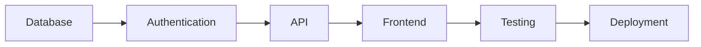
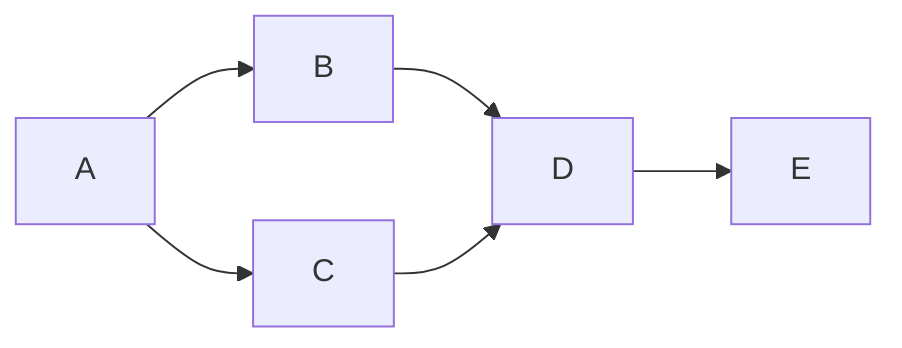

# Enterprise AI Software Factory
# Architecture Design Specification (ADS)

> **Document ID:** ADS-019-v2
>
> **Document Name:** Autonomous Planning Engine — Algorithms & Decision Models
>
> **Version:** 2.0.0
>
> **Status:** Draft
>
> **Classification:** Internal Engineering Specification
>
> **Depends On:** ADS-019-v1
>
> **Next:** ADS-019-v3 — APIs, Events & Contracts

---

# Executive Summary

ADS-019-v1 explained **what** the Planning Engine is.

This document explains **how it thinks**.

The Planning Engine is composed of multiple deterministic algorithms that convert an unstructured product requirement into an executable engineering graph.

Every planning decision must be reproducible.

Random planning is prohibited.

---

# Planning Pipeline

```mermaid
flowchart LR

A[Requirement]

-->

B[Normalize]

-->

C[Requirement Classification]

-->

D[Architecture Generation]

-->

E[Task Decomposition]

-->

F[Dependency DAG]

-->

G[Complexity Analysis]

-->

H[Risk Analysis]

-->

I[Parallel Scheduler]

-->

J[Execution Graph]

-->

K[Validation]
```



Every planning request executes this exact pipeline.

---

# Algorithm Overview

| Algorithm | Purpose |
|------------|----------|
| ALG-001 | Requirement Normalization |
| ALG-002 | Requirement Classification |
| ALG-003 | Architecture Generation |
| ALG-004 | Task Decomposition |
| ALG-005 | Dependency Graph Construction |
| ALG-006 | Complexity Scoring |
| ALG-007 | Risk Analysis |
| ALG-008 | Parallel Scheduling |
| ALG-009 | Critical Path Detection |
| ALG-010 | Planning Confidence |

---

# ALG-001 Requirement Normalization

## Objective

Convert ambiguous human language into structured engineering requirements.

Input

```text
Create a SaaS platform for AI coding.
```

Output

```yaml
Product:
    SaaS

Capabilities:
    Authentication
    Billing
    Multi Agent

Constraints:
    Enterprise
    Secure
    Multi Tenant

Priority:
    High
```

Normalization removes

- duplicate statements
- conflicting wording
- informal language
- missing assumptions

---

# ALG-002 Requirement Classification

Requirements are classified into categories.

```mermaid
flowchart TB

Requirement

-->

Functional

Requirement

-->

Non Functional

Requirement

-->

Business

Requirement

-->

Compliance

Requirement

-->

Infrastructure
```

Each requirement receives a category.

This determines which engineering agents will later receive work.

---

# ALG-003 Architecture Generation

Architecture generation identifies

- services
- APIs
- databases
- queues
- caches
- external systems

Example

```text
Authentication

↓

User Service

↓

JWT

↓

Gateway

↓

Database
```

The architecture planner never creates implementation details.

Only logical architecture.

---

# ALG-004 Task Decomposition

Planning converts architecture into atomic engineering tasks.

Bad

```text
Build backend.
```

Good

```text
Create User Model

↓

Create Login API

↓

Create JWT Service

↓

Create Session Store

↓

Write Unit Tests
```

Every task must satisfy

✔ Independent

✔ Reviewable

✔ Testable

✔ Observable

✔ Reversible

---

# Decomposition Rules

Every task should

- modify one subsystem

- own one responsibility

- produce one measurable output

Maximum estimated implementation time

```
8 engineering hours
```

Large tasks are recursively decomposed.

---

# ALG-005 Dependency Graph

Dependencies are stored as a DAG.



Circular dependencies are rejected.

---

# DAG Validation Rules

A valid graph must

✔ contain no cycles

✔ have one root

✔ contain no orphan tasks

✔ contain deterministic execution order

---

# ALG-006 Complexity Score

Every task receives a normalized complexity score.

Formula

```text
Complexity

=

(Code Size × 0.30)

+

(Dependency Weight × 0.20)

+

(Security Impact × 0.20)

+

(Testing Complexity × 0.15)

+

(Architectural Impact × 0.15)
```

Final score

```
0 → 100
```

Example

| Score | Category |
|---------|-----------|
| 0–20 | Very Small |
| 21–40 | Small |
| 41–60 | Medium |
| 61–80 | Large |
| 81–100 | Critical |

---

# ALG-007 Risk Score

Every task receives a risk value.

Formula

```text
Risk

=

Business Impact

×

Security Impact

×

Failure Probability

──────────────

Implementation Confidence
```

High-risk tasks require

- Security Review

- Human Approval

- Consensus Review

---

# ALG-008 Parallel Scheduling

Independent tasks are grouped.

Example

```text
Authentication

Database

UI

↓

Parallel

↓

Integration
```

Planner attempts to maximize

```
Agent Utilization
```

while minimizing

```
Critical Path Length
```

---

# ALG-009 Critical Path Detection

The planner computes the minimum completion time.



Critical Path

```
A

↓

B

↓

D

↓

E
```

The scheduler prioritizes this path.

---

# ALG-010 Planning Confidence

Every plan receives a confidence score.

Formula

```text
Confidence

=

Architecture Completeness × 0.25

+

Requirement Clarity × 0.20

+

Dependency Accuracy × 0.20

+

Historical Success × 0.20

+

Consensus Agreement × 0.15
```

Output

```
0

↓

100
```

Example

| Confidence | Action |
|-------------|---------|
| 95+ | Execute |
| 85–94 | Review |
| 70–84 | Consensus |
| Below 70 | Human Escalation |

---

# Planner Decision Tree

```mermaid
flowchart TD

Requirement

-->

Clear?

No

-->

Clarification

Yes

-->

Architecture

-->

Risk

-->

High?

Yes

-->

Human Approval

No

-->

Execution Graph
```

---

# Time Complexity

| Algorithm | Complexity |
|------------|------------|
| Requirement Parsing | O(n) |
| Task Generation | O(n) |
| DAG Construction | O(V + E) |
| Critical Path | O(V + E) |
| Scheduling | O(n log n) |

---

# Failure Recovery

```text
Planning Failure

↓

Checkpoint Restore

↓

Alternative Planner

↓

Consensus

↓

Human Review

↓

Resume
```

Planning never restarts from the beginning unless recovery fails.

---

# Metrics

Prometheus metrics

```
planning_duration_seconds

planner_success_total

planner_failure_total

average_task_complexity

average_confidence

planning_retry_total

critical_path_duration

parallelization_ratio

planning_cost

planning_tokens
```

---

# Architecture Decision Record

## ADR-019-03

Decision

Represent execution using DAGs instead of linear task lists.

Reason

DAGs allow deterministic scheduling, dependency validation, parallel execution and replay.

---

## ADR-019-04

Decision

Use mathematical scoring models rather than subjective planner reasoning.

Reason

Numeric models improve reproducibility and observability.

---

# Related Documents

ADS-019-v1

ADS-019-v3

ADS-022

ADS-026

---

# Next Document

ADS-019-v3

**APIs, Events & Contracts**

This document specifies REST APIs, gRPC interfaces, internal planner events, protobuf contracts, state machines and communication protocols used by the Planning Engine.

---

# End of Document
