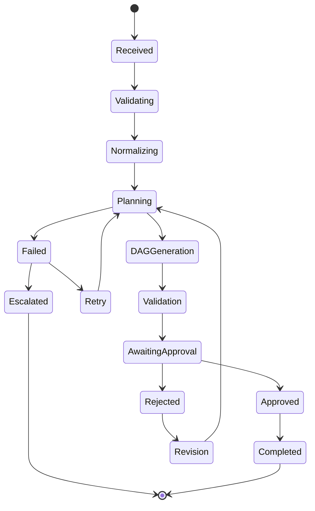
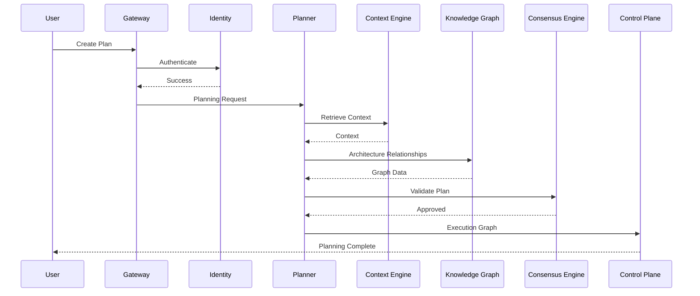

# Enterprise AI Software Factory
# Architecture Design Specification (ADS)

> **Document ID:** ADS-019-v3
>
> **Document Name:** Autonomous Planning Engine — APIs, Events & Contracts
>
> **Version:** 2.0.0
>
> **Status:** Draft
>
> **Classification:** Internal Engineering Specification
>
> **Depends On:** ADS-019-v1
>
> **Depends On:** ADS-019-v2
>
> **Next:** ADS-019-v4 — Runtime & Implementation Blueprint

---

# Executive Summary

Architecture describes *what* exists.

Algorithms describe *how* it works.

This document defines **how every subsystem communicates with the Planning Engine.**

Every interaction with the Planning Engine must occur through well-defined APIs, strongly typed schemas, immutable event contracts and deterministic communication protocols.

The Planning Engine is not allowed to expose internal implementation details.

Every subsystem communicates exclusively through stable interfaces.

This allows the engine to evolve internally without breaking downstream systems.

---

# Communication Philosophy

The Planning Engine follows four communication principles.

## Principle 1

Internal implementation must remain hidden.

Only public APIs are visible.

---

## Principle 2

Every message must be strongly typed.

No raw JSON blobs are exchanged between systems.

---

## Principle 3

Every request must be replayable.

Every request therefore receives

- Request ID
- Workflow ID
- Correlation ID
- Planning Version
- Timestamp

---

## Principle 4

Every interaction is observable.

Every API call

- produces metrics
- emits events
- creates traces
- creates audit logs

---

# Public Interfaces

The Planning Engine exposes four interfaces.

| Interface | Purpose |
|------------|----------|
| REST API | External platform requests |
| gRPC API | Internal service communication |
| Event Bus | Asynchronous notifications |
| MCP Interface | Agent Tool Invocation |

---

# Overall Communication Flow

```mermaid
flowchart LR

Gateway

-->

REST API

-->

Planning Engine

-->

gRPC

-->

Planner Services

-->

Kafka

-->

Subscribers

Planner Services

-->

Observability

Planner Services

-->

Audit Logs
```

---

# REST API

The REST interface is designed for

- Product Managers
- Web Dashboard
- CLI
- Enterprise Integrations

---

## API-001

### Create Planning Session

```http
POST /planner/v1/plans
```

Purpose

Create a new planning workflow.

---

Request

```json
{
    "projectId":"proj-001",
    "requirement":"Build an enterprise AI software factory.",
    "constraints":[
        "Multi Tenant",
        "Zero Trust",
        "Enterprise"
    ]
}
```

---

Response

```json
{
    "planId":"plan-884",
    "status":"Planning",
    "workflowId":"wf-001"
}
```

---

Possible Responses

| Code | Meaning |
|--------|----------|
|200|Planning Started|
|400|Invalid Requirement|
|401|Unauthorized|
|429|Rate Limited|
|500|Planner Failure|

---

## API-002

### Retrieve Plan

```http
GET /planner/v1/plans/{planId}
```

Returns

- Current Status
- Completion %
- Risk
- Confidence
- Estimated Cost

---

## API-003

### Cancel Planning

```http
DELETE /planner/v1/plans/{planId}
```

Immediately terminates

- planners
- queues
- scheduled tasks

Creates

```
PlanningCancelled
```

event.

---

## API-004

### Approve Plan

```http
POST /planner/v1/plans/{planId}/approve
```

Purpose

Human approval.

Approval moves the workflow to the Execution Plane.

---

# Internal gRPC APIs

REST is never used for internal communication.

All internal services use gRPC.

---

## PlannerService

```protobuf
service PlannerService{

rpc CreatePlan(PlanningRequest)

returns(PlanningResponse);

rpc ValidatePlan(ValidationRequest)

returns(ValidationResponse);

rpc CancelPlan(CancelRequest)

returns(CancelResponse);

}
```

---

# Request Schema

```protobuf
message PlanningRequest{

string workflow_id=1;

string project_id=2;

string requirement=3;

repeated string constraints=4;

}
```

---

# Response Schema

```protobuf
message PlanningResponse{

string plan_id=1;

string status=2;

double confidence=3;

double estimated_cost=4;

}
```

---

# MCP Interface

The Planning Engine exposes planning tools through MCP.

Available tools

```text
create_plan

validate_plan

estimate_complexity

calculate_risk

build_dag

generate_architecture
```

Every MCP tool is versioned.

---

# Event Communication

The Planning Engine publishes immutable events.

Subscribers never poll APIs.

They subscribe to events.

---

# Event Flow

```mermaid
sequenceDiagram

Planner

->>Kafka

PlanningStarted

Kafka

->>Observability

Kafka

->>Control Plane

Kafka

->>Dashboard

Planner

->>Kafka

PlanningCompleted

Planner

->>Kafka

PlanningFailed
```

---

# EVT-001

PlanningStarted

Payload

```json
{
"workflowId":"",
"planId":"",
"timestamp":""
}
```

Published when planning begins.

---

# EVT-002

PlanningCompleted

Contains

- confidence

- complexity

- milestones

- DAG reference

---

# EVT-003

PlanningFailed

Contains

- error

- retry count

- planner id

- failure category

---

# EVT-004

PlanningApproved

Published after Human Approval.

Triggers

Execution Plane.

---

# EVT-005

PlanningRejected

Triggers

Planner rollback.

Human feedback.

Planning revision.

---

# Message Ordering

Events follow strict ordering.

```
Started

↓

Architecture

↓

TaskGraph

↓

Validated

↓

Approved

↓

Execution
```

No subscriber may process events out of order.

---

# Event Versioning

Every event contains

```yaml
eventVersion

producerVersion

schemaVersion

plannerVersion
```

Breaking changes always require a new version.---

# Contract Validation

Every request entering the Planning Engine must pass contract validation before reaching any internal subsystem.

Validation occurs in four stages.

```text
Receive Request

↓

Schema Validation

↓

Policy Validation

↓

Business Validation

↓

Planning Engine
```

Requests failing validation are rejected immediately.

---

## Validation Rules

Every incoming request must satisfy

| Rule | Description |
|-------|-------------|
| Required Fields | All mandatory fields must exist |
| Schema Version | Supported schema version |
| Project Exists | Valid project reference |
| Authentication | Valid identity token |
| Authorization | Caller has planning permissions |
| Constraints | Valid planning constraints |
| Payload Size | Below configured limits |

No planning begins until validation succeeds.

---

# Idempotency

Planning requests are idempotent.

Every request must contain

```
Idempotency-Key
```

Example

```http
POST /planner/v1/plans

Idempotency-Key:
3c62d7f8-f33a-4c56-b83d-fec81274cb11
```

If the same request is submitted twice

↓

The original workflow is returned.

No duplicate planning sessions are created.

---

# Authentication

Every request must contain

- OAuth2 Access Token
- OIDC Identity
- Tenant Identifier
- User Identifier

Example

```http
Authorization:

Bearer eyJhbGci...
```

Authentication is delegated to the Identity Plane.

The Planning Engine never validates credentials directly.

---

# Authorization

Authorization follows Role-Based Access Control.

Supported roles

- Viewer
- Developer
- Planner
- Project Owner
- Organization Administrator
- Platform Administrator

Example

```text
Developer

↓

Can Create Plan

↓

Cannot Approve Plan
```

Approval requires elevated permissions.

---

# Multi-Tenant Isolation

Every planning session belongs to exactly one tenant.

```text
Tenant

↓

Organization

↓

Project

↓

Repository

↓

Planning Session
```

Cross-tenant access is forbidden.

Planning metadata is logically isolated.

---

# Rate Limiting

The API Gateway enforces rate limits before requests reach the Planning Engine.

Example policy

| Endpoint | Limit |
|-----------|------:|
| Create Plan | 20 requests/minute |
| Get Plan | 300 requests/minute |
| Cancel Plan | 30 requests/minute |
| Approve Plan | 50 requests/minute |

Rate limits are configurable.

---

# Planner State Machine

Every planning workflow follows a deterministic lifecycle.



No state transitions may bypass validation.

---

# Planner Sequence Diagram



---

# Retry Policy

Failures are categorized before retrying.

| Failure | Retry |
|----------|------:|
| Network Timeout | Yes |
| Model Timeout | Yes |
| Temporary Provider Failure | Yes |
| Invalid Requirement | No |
| Authentication Failure | No |
| Authorization Failure | No |
| Corrupted Request | No |

Retries use exponential backoff.

```
1 s

↓

2 s

↓

4 s

↓

8 s

↓

Escalation
```

---

# Circuit Breakers

Repeated failures automatically isolate unhealthy planner components.

```text
Failure

↓

Retry

↓

Threshold Reached

↓

Circuit Open

↓

Traffic Redirected

↓

Recovery Check

↓

Circuit Closed
```

This prevents cascading failures.

---

# Error Contracts

Every error follows the same schema.

```json
{
    "errorCode":"PLN-0042",
    "message":"Dependency graph contains a cycle.",
    "severity":"High",
    "retryable":false,
    "workflowId":"wf-123",
    "timestamp":"..."
}
```

Errors are immutable.

---

# API Versioning

The Planning API follows semantic versioning.

Example

```
v1

↓

v1.1

↓

v1.2

↓

v2
```

Breaking changes always require a new major version.

Older API versions remain supported during migration windows.

---

# Observability

Every request generates

- Metrics
- Traces
- Structured Logs
- Audit Records

No planner execution is anonymous.

---

# Prometheus Metrics

```text
planner_requests_total

planner_success_total

planner_failure_total

planner_active_sessions

planner_queue_length

planner_confidence_average

planner_cost_total

planner_retry_total

planner_timeout_total

planner_duration_seconds
```

Metrics are exposed through the Observability Plane.

---

# OpenTelemetry Traces

Each planning session creates a distributed trace.

```text
Trace

↓

Planning

↓

Architecture

↓

Task Graph

↓

Risk Analysis

↓

Validation

↓

Approval
```

This enables complete workflow replay.

---

# Audit Records

Every planning action records

- Workflow ID
- Planner Version
- User ID
- Tenant ID
- Timestamp
- Input Hash
- Output Hash
- Confidence Score
- Risk Score

Audit records are immutable.

---

# Security Considerations

The Planning Engine never

- Stores secrets
- Executes shell commands
- Modifies repositories
- Accesses production infrastructure

Sensitive data is redacted before entering the planning pipeline.

All communication is encrypted using TLS and authenticated through the Identity Plane.

---

# Architecture Decision Records

## ADR-019-05

### Decision

Expose both REST and gRPC interfaces.

### Status

Accepted

### Reason

REST simplifies external integrations.

gRPC provides low-latency, strongly typed communication between internal services.

---

## ADR-019-06

### Decision

Adopt an event-driven communication model.

### Status

Accepted

### Reason

Events reduce service coupling, improve scalability, simplify replay, and support long-running workflows.

---

## ADR-019-07

### Decision

Treat planning sessions as immutable workflow records.

### Status

Accepted

### Reason

Immutable records improve auditing, debugging, reproducibility, and compliance.

---

# Future Evolution

Future versions of the Planning Engine may introduce

- Adaptive planning using historical execution data
- Reinforcement learning for scheduling optimization
- Multi-planner consensus
- Cost-aware execution planning
- Automatic architecture optimization
- Predictive delivery estimation
- Dynamic workload balancing

These enhancements must preserve deterministic execution.

---

# Related Documents

ADS-002 — Control Plane

ADS-012 — Event-Driven Architecture

ADS-013 — Model Routing & AI Execution Layer

ADS-014 — Multi-Agent Collaboration & Consensus

ADS-018 — Enterprise Context Engine

ADS-019-v1 — Architecture

ADS-019-v2 — Algorithms & Decision Models

ADS-019-v4 — Runtime & Implementation Blueprint

---

# End of Document
