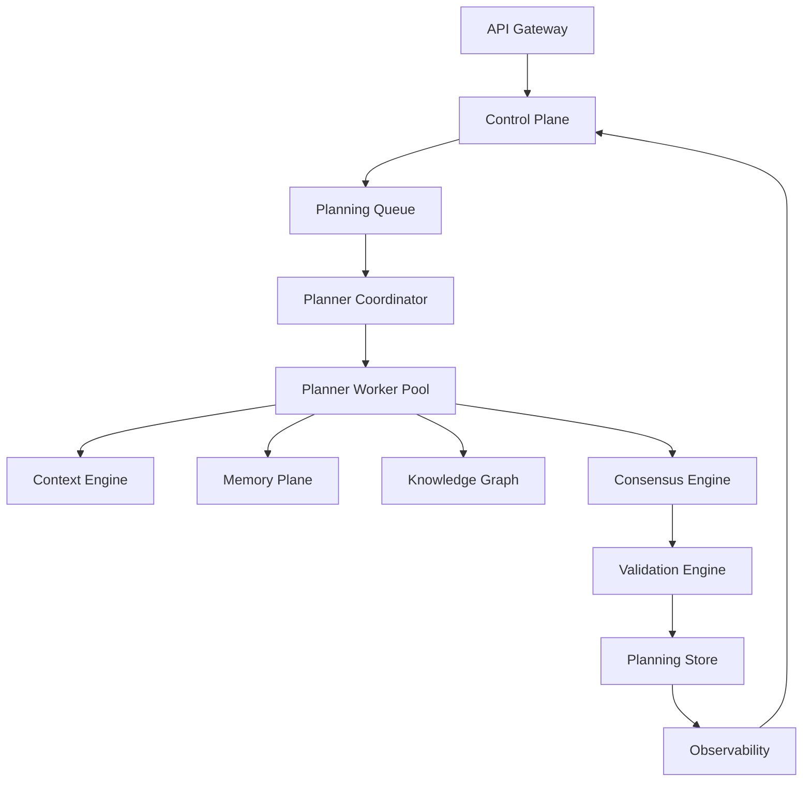
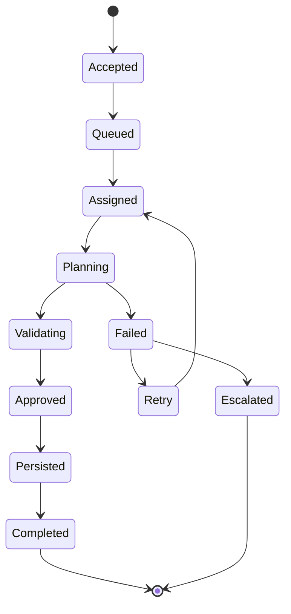
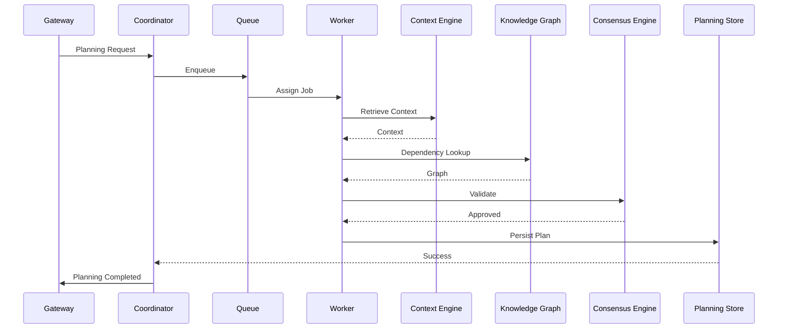
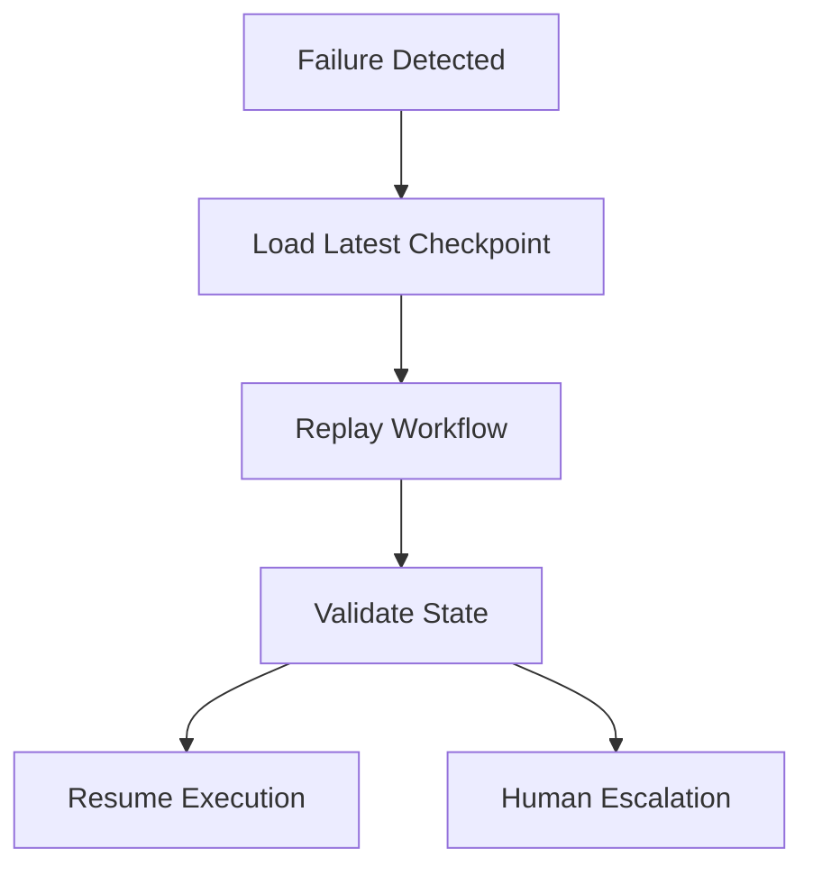
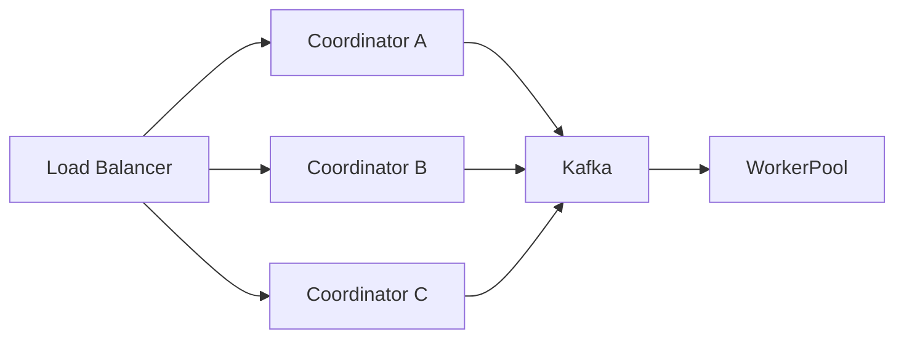

# Enterprise AI Software Factory
# Architecture Design Specification (ADS)

> **Document ID:** ADS-019-v4
>
> **Document Name:** Autonomous Planning Engine — Runtime & Implementation Blueprint
>
> **Version:** 2.0.0
>
> **Status:** Draft
>
> **Classification:** Internal Engineering Specification
>
> **Depends On:** ADS-019-v1
>
> **Depends On:** ADS-019-v2
>
> **Depends On:** ADS-019-v3
>
> **Next:** ADS-019-v5 — End-to-End Engineering Walkthrough

---

# Executive Summary

This document defines the runtime behavior of the Autonomous Planning Engine.

Previous documents described architecture, algorithms and communication contracts.

This document explains how the system actually executes inside production.

It defines

- runtime services
- deployment topology
- worker pools
- queue systems
- caches
- orchestration
- checkpoints
- execution lifecycle
- runtime communication

The objective is to allow another engineering team to build the runtime without requiring knowledge of the planner's internal reasoning.

---

# Runtime Philosophy

The Planning Engine follows several runtime principles.

- Stateless orchestration
- Stateful workflows
- Immutable planning artifacts
- Event-driven execution
- Horizontal scalability
- Checkpoint-based recovery
- Deterministic execution
- Fail-fast validation

---

# Runtime Overview



Every planning request follows this execution topology.

---

# Runtime Components

The runtime consists of nine core services.

| Component | Responsibility |
|------------|----------------|
| Planner Coordinator | Controls workflow execution |
| Queue Manager | Schedules planning requests |
| Worker Pool | Executes planning tasks |
| Context Engine | Retrieves planning context |
| Dependency Service | Builds execution DAGs |
| Consensus Engine | Validates planning output |
| Validation Engine | Performs structural validation |
| Planning Store | Persists execution state |
| Observability | Captures runtime telemetry |

Each component is independently deployable.

---

# Runtime Lifecycle



The runtime never skips lifecycle stages.

---

# Planning Coordinator

The Planner Coordinator acts as the runtime scheduler.

Responsibilities

- receive workflow requests
- allocate workers
- monitor execution
- recover failures
- emit workflow events
- manage checkpoints

The coordinator never performs planning itself.

---

# Worker Pool

Planning work executes inside isolated workers.

Each worker

- loads workflow context
- executes planner algorithms
- persists checkpoints
- emits telemetry

Workers remain stateless.

State is stored externally.

---

# Worker Architecture

```mermaid
flowchart LR

Coordinator

-->

Worker

Worker

-->

Planner Runtime

Planner Runtime

-->

Context Engine

Planner Runtime

-->

Knowledge Graph

Planner Runtime

-->

Dependency Builder

Planner Runtime

-->

Risk Analyzer

Planner Runtime

-->

Checkpoint Store
```

Workers may terminate at any point.

No execution state is stored locally.

---

# Queue Architecture

Planning requests enter a distributed queue.

```text
API

↓

Planning Queue

↓

Coordinator

↓

Worker

↓

Planning Result
```

Queue guarantees

- FIFO ordering per workflow
- priority scheduling
- retry visibility
- dead-letter routing

---

# Queue Priorities

Planning jobs receive priority levels.

| Priority | Example |
|------------|----------|
| Critical | Production Incident |
| High | Enterprise Project |
| Medium | Feature Development |
| Low | Experimental Planning |

Higher priorities always preempt lower priorities.

---

# Checkpoint Architecture

Every major planning stage creates a checkpoint.

```text
Requirement Parsed

↓

Checkpoint

↓

Architecture Complete

↓

Checkpoint

↓

Task Graph Built

↓

Checkpoint

↓

Validation Complete

↓

Checkpoint
```

Recovery always resumes from the latest checkpoint.

---

# Checkpoint Metadata

Each checkpoint stores

- Workflow ID
- Planner Version
- DAG Version
- Timestamp
- Completed Stage
- Context Hash
- Confidence Score

Checkpoints are immutable.

---

# Runtime Storage

Planning artifacts are persisted separately.

```text
Workflow Store

↓

Execution Graph

↓

Task DAG

↓

Complexity Report

↓

Risk Report

↓

Planning Metadata
```

No runtime data is stored inside workers.

---

# Deployment Topology

```mermaid
flowchart TB

Internet

↓

API Gateway

↓

Planner Cluster

↓

Planner Workers

↓

Memory Cluster

↓

Knowledge Graph

↓

Planning Database

↓

Object Storage

↓

Observability Stack
```

Each layer may scale independently.

---

# Kubernetes Layout

```text
Namespace

planning-system

Pods

planner-coordinator

planner-workers

planner-validator

planner-api

planner-cache

planner-events

Stateful Services

PostgreSQL

Redis

Kafka

Neo4j
```

Each service runs independently.

---

# Runtime Communication

The runtime uses different communication protocols.

| Communication | Protocol |
|---------------|-----------|
| External APIs | HTTPS |
| Internal Services | gRPC |
| Events | Kafka |
| Agent Tools | MCP |
| Telemetry | OpenTelemetry |

Communication protocols are selected based on latency and reliability requirements.

---

# Cache Strategy

The Planning Engine maintains multiple cache levels.

```text
L1

Workflow Cache

↓

L2

Project Cache

↓

L3

Organization Cache
```

The objective is to reduce

- repeated retrieval
- graph queries
- embedding generation
- planning latency

---

# Runtime Sequence



---

# Resource Allocation

Workers are dynamically allocated.

Allocation considers

- queue depth
- workflow complexity
- available CPU
- available memory
- planner priority
- tenant quotas

Workers are never statically assigned.

---

# Runtime Principles

The runtime guarantees

- deterministic execution
- horizontal scalability
- stateless workers
- externalized state
- immutable artifacts
- replayable workflows
- checkpoint recovery

These guarantees form the operational foundation of the Planning Engine.

---

# Failure Recovery Architecture

The Planning Engine is designed to survive failures without restarting entire workflows.

Recovery is based on immutable checkpoints and deterministic replay.



Recovery objectives

- Minimize lost work
- Prevent duplicate execution
- Preserve workflow history
- Maintain deterministic state

---

# Retry Strategy

Every runtime component implements bounded retries.

| Failure Category | Max Retries | Strategy |
|-----------------|------------:|----------|
| Network Timeout | 5 | Exponential Backoff |
| Context Retrieval Failure | 3 | Retry Different Replica |
| Knowledge Graph Timeout | 3 | Alternate Replica |
| AI Provider Timeout | 2 | Alternate Model |
| Planner Crash | 2 | Restart Worker |
| Validation Failure | 0 | Reject Workflow |
| Human Rejection | Unlimited | Manual Revision |

Retry timing

```text
1 sec

↓

2 sec

↓

4 sec

↓

8 sec

↓

16 sec

↓

Escalate
```

Retries never continue indefinitely.

---

# High Availability

The Planning Engine remains operational despite infrastructure failures.



Availability is achieved through

- Multiple Coordinators
- Distributed Workers
- Replicated Queues
- Replicated Databases
- Stateless Services

---

# Horizontal Scaling

Scaling decisions are automatic.

Metrics used

- Queue Length
- Average Planning Time
- CPU Utilization
- Memory Usage
- Active Workers
- Waiting Workflows

Scaling flow

```text
Queue Increases

↓

Autoscaler

↓

Create Workers

↓

Register Workers

↓

Consume Queue

↓

Scale Down
```

Workers are disposable.

---

# Resource Scheduler

The Resource Scheduler assigns workflows to workers.

Scheduling considers

- Available CPU
- Available Memory
- Planner Priority
- Estimated Complexity
- Historical Performance
- Tenant Limits
- Geographic Location

Goals

- Balanced utilization
- Low latency
- High throughput

---

# Worker Health Monitoring

Each worker continuously reports

- Heartbeat
- CPU
- Memory
- Queue Status
- Active Workflow
- Version
- Health Score

Example

```text
Worker

↓

Heartbeat

↓

Coordinator

↓

Health Database

↓

Dashboard
```

Missing heartbeats automatically trigger replacement workers.

---

# Runtime Configuration

Configuration is externalized.

Example

```yaml
planner:

  maxWorkers: 250

  maxRetries: 3

  checkpointInterval: every-stage

  maxPlanningTime: 15m

  enableConsensus: true

  confidenceThreshold: 92

  cacheEnabled: true
```

Configuration changes never require code changes.

---

# Runtime Security

The runtime follows Zero Trust principles.

Every service

- Authenticates
- Authorizes
- Encrypts Traffic
- Validates Policies
- Records Audit Logs

No service trusts another service implicitly.

---

# Runtime Isolation

Every worker executes inside an isolated runtime.

Possible runtimes

- Kubernetes Pod
- Firecracker VM
- Docker Container

Workers never share

- Memory
- Filesystems
- Environment Variables

Isolation prevents cross-workflow contamination.

---

# Secrets Management

Secrets are never stored inside

- Planner Workers
- Containers
- Configuration Files

Secrets are retrieved on demand.

```text
Worker

↓

Identity

↓

Secret Manager

↓

Temporary Credential

↓

Execution
```

Secrets automatically expire.

---

# Performance Optimization

Several optimizations reduce planning latency.

Techniques

- Context Caching
- Graph Query Caching
- Incremental Planning
- Lazy Dependency Loading
- Parallel Retrieval
- Batch Validation
- Shared Embeddings

Optimization must never change planning results.

---

# Observability

Every runtime action produces telemetry.

Collected data

- Logs
- Metrics
- Traces
- Audit Records
- Runtime Events

Nothing executes invisibly.

---

# Runtime Metrics

Important metrics include

```text
planner_queue_depth

planner_active_workers

planner_completed_total

planner_failed_total

planner_checkpoint_count

planner_recovery_total

planner_replay_total

planner_cpu_usage

planner_memory_usage

planner_parallel_efficiency

planner_average_latency
```

---

# Distributed Tracing

Each workflow receives one Trace ID.

```text
Gateway

↓

Planner

↓

Context

↓

Knowledge Graph

↓

Consensus

↓

Validation

↓

Storage
```

Every span is recorded.

---

# Logging Strategy

Logs follow structured JSON.

Example

```json
{
  "traceId":"abc-123",
  "workflowId":"wf-220",
  "plannerVersion":"2.0",
  "stage":"DependencyAnalysis",
  "durationMs":184,
  "status":"Success"
}
```

Logs are immutable.

---

# Disaster Recovery

Planner state survives infrastructure failures.

Recovery strategy

```text
Database Failure

↓

Replica Promotion

↓

Reconnect Workers

↓

Replay Queue

↓

Resume Planning
```

Recovery Point Objective (RPO)

Near-zero data loss.

Recovery Time Objective (RTO)

Less than five minutes.

---

# Runtime Deployment

Recommended deployment

```text
Kubernetes Cluster

↓

Planner Namespace

↓

Coordinator Deployment

↓

Worker Deployment

↓

Redis

↓

Kafka

↓

PostgreSQL

↓

Neo4j

↓

OpenTelemetry

↓

Prometheus

↓

Grafana
```

---

# Technology Stack

| Layer | Technology |
|---------|------------|
| Runtime | Kubernetes |
| Workflow Engine | Temporal |
| Queue | Kafka |
| Cache | Redis |
| Database | PostgreSQL |
| Graph | Neo4j |
| Observability | OpenTelemetry |
| Metrics | Prometheus |
| Dashboards | Grafana |
| Secrets | HashiCorp Vault |
| Service Mesh | Istio |

---

# Runtime ADRs

## ADR-019-08

### Decision

Workers remain stateless.

### Status

Accepted

### Reason

Stateless workers simplify autoscaling, failover, and recovery.

---

## ADR-019-09

### Decision

Persist checkpoints after every major planning stage.

### Status

Accepted

### Reason

Checkpointing minimizes work loss and enables deterministic replay.

---

## ADR-019-10

### Decision

Externalize runtime configuration.

### Status

Accepted

### Reason

Operational changes should not require recompilation or redeployment.

---

# Runtime Checklist

The Planning Engine runtime MUST

- Execute deterministically
- Persist checkpoints
- Emit telemetry
- Support replay
- Support horizontal scaling
- Reject invalid workflows
- Recover from failures
- Preserve immutable artifacts

The Planning Engine runtime MUST NOT

- Store secrets locally
- Execute unverified workflows
- Modify planning history
- Skip validation stages
- Bypass Human Approval

---

# Related Documents

ADS-002 — Control Plane

ADS-011 — Network Topology

ADS-012 — Event-Driven Architecture

ADS-015 — Agent Computer Interface

ADS-019-v1 — Architecture

ADS-019-v2 — Algorithms

ADS-019-v3 — APIs & Contracts

ADS-019-v5 — End-to-End Engineering Walkthrough

---

# End of Document
