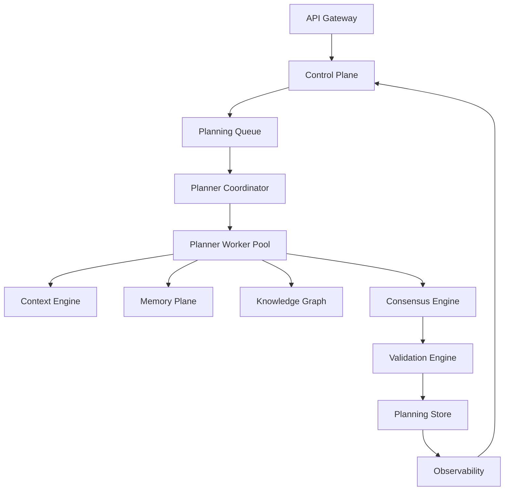
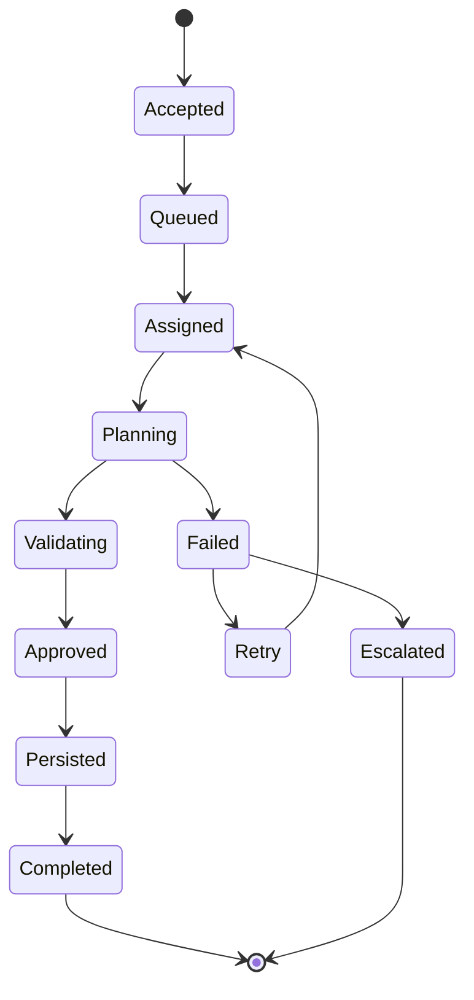
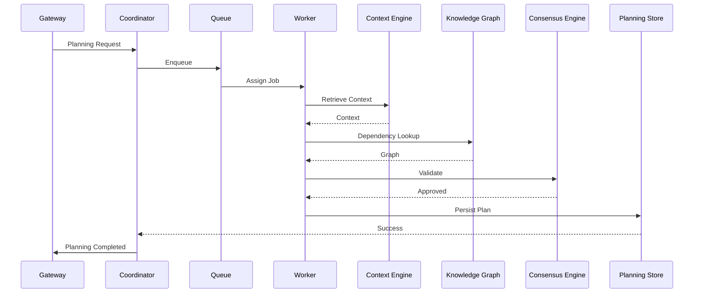

# Enterprise AI Software Factory
# Architecture Design Specification (ADS)

> **Document ID:** ADS-019-v4
>
> **Document Name:** Autonomous Planning Engine — Runtime & Implementation Blueprint
>
> **Version:** 2.0.0
>
> **Status:** Draft
>
> **Classification:** Internal Engineering Specification
>
> **Depends On:** ADS-019-v1
>
> **Depends On:** ADS-019-v2
>
> **Depends On:** ADS-019-v3
>
> **Next:** ADS-019-v5 — End-to-End Engineering Walkthrough

---

# Executive Summary

This document defines the runtime behavior of the Autonomous Planning Engine.

Previous documents described architecture, algorithms and communication contracts.

This document explains how the system actually executes inside production.

It defines

- runtime services
- deployment topology
- worker pools
- queue systems
- caches
- orchestration
- checkpoints
- execution lifecycle
- runtime communication

The objective is to allow another engineering team to build the runtime without requiring knowledge of the planner's internal reasoning.

---

# Runtime Philosophy

The Planning Engine follows several runtime principles.

- Stateless orchestration
- Stateful workflows
- Immutable planning artifacts
- Event-driven execution
- Horizontal scalability
- Checkpoint-based recovery
- Deterministic execution
- Fail-fast validation

---

# Runtime Overview



Every planning request follows this execution topology.

---

# Runtime Components

The runtime consists of nine core services.

| Component | Responsibility |
|------------|----------------|
| Planner Coordinator | Controls workflow execution |
| Queue Manager | Schedules planning requests |
| Worker Pool | Executes planning tasks |
| Context Engine | Retrieves planning context |
| Dependency Service | Builds execution DAGs |
| Consensus Engine | Validates planning output |
| Validation Engine | Performs structural validation |
| Planning Store | Persists execution state |
| Observability | Captures runtime telemetry |

Each component is independently deployable.

---

# Runtime Lifecycle



The runtime never skips lifecycle stages.

---

# Planning Coordinator

The Planner Coordinator acts as the runtime scheduler.

Responsibilities

- receive workflow requests
- allocate workers
- monitor execution
- recover failures
- emit workflow events
- manage checkpoints

The coordinator never performs planning itself.

---

# Worker Pool

Planning work executes inside isolated workers.

Each worker

- loads workflow context
- executes planner algorithms
- persists checkpoints
- emits telemetry

Workers remain stateless.

State is stored externally.

---

# Worker Architecture

```mermaid
flowchart LR

Coordinator

-->

Worker

Worker

-->

Planner Runtime

Planner Runtime

-->

Context Engine

Planner Runtime

-->

Knowledge Graph

Planner Runtime

-->

Dependency Builder

Planner Runtime

-->

Risk Analyzer

Planner Runtime

-->

Checkpoint Store
```

Workers may terminate at any point.

No execution state is stored locally.

---

# Queue Architecture

Planning requests enter a distributed queue.

```text
API

↓

Planning Queue

↓

Coordinator

↓

Worker

↓

Planning Result
```

Queue guarantees

- FIFO ordering per workflow
- priority scheduling
- retry visibility
- dead-letter routing

---

# Queue Priorities

Planning jobs receive priority levels.

| Priority | Example |
|------------|----------|
| Critical | Production Incident |
| High | Enterprise Project |
| Medium | Feature Development |
| Low | Experimental Planning |

Higher priorities always preempt lower priorities.

---

# Checkpoint Architecture

Every major planning stage creates a checkpoint.

```text
Requirement Parsed

↓

Checkpoint

↓

Architecture Complete

↓

Checkpoint

↓

Task Graph Built

↓

Checkpoint

↓

Validation Complete

↓

Checkpoint
```

Recovery always resumes from the latest checkpoint.

---

# Checkpoint Metadata

Each checkpoint stores

- Workflow ID
- Planner Version
- DAG Version
- Timestamp
- Completed Stage
- Context Hash
- Confidence Score

Checkpoints are immutable.

---

# Runtime Storage

Planning artifacts are persisted separately.

```text
Workflow Store

↓

Execution Graph

↓

Task DAG

↓

Complexity Report

↓

Risk Report

↓

Planning Metadata
```

No runtime data is stored inside workers.

---

# Deployment Topology

```mermaid
flowchart TB

Internet

↓

API Gateway

↓

Planner Cluster

↓

Planner Workers

↓

Memory Cluster

↓

Knowledge Graph

↓

Planning Database

↓

Object Storage

↓

Observability Stack
```

Each layer may scale independently.

---

# Kubernetes Layout

```text
Namespace

planning-system

Pods

planner-coordinator

planner-workers

planner-validator

planner-api

planner-cache

planner-events

Stateful Services

PostgreSQL

Redis

Kafka

Neo4j
```

Each service runs independently.

---

# Runtime Communication

The runtime uses different communication protocols.

| Communication | Protocol |
|---------------|-----------|
| External APIs | HTTPS |
| Internal Services | gRPC |
| Events | Kafka |
| Agent Tools | MCP |
| Telemetry | OpenTelemetry |

Communication protocols are selected based on latency and reliability requirements.

---

# Cache Strategy

The Planning Engine maintains multiple cache levels.

```text
L1

Workflow Cache

↓

L2

Project Cache

↓

L3

Organization Cache
```

The objective is to reduce

- repeated retrieval
- graph queries
- embedding generation
- planning latency

---

# Runtime Sequence



---

# Resource Allocation

Workers are dynamically allocated.

Allocation considers

- queue depth
- workflow complexity
- available CPU
- available memory
- planner priority
- tenant quotas

Workers are never statically assigned.

---

# Runtime Principles

The runtime guarantees

- deterministic execution
- horizontal scalability
- stateless workers
- externalized state
- immutable artifacts
- replayable workflows
- checkpoint recovery

These guarantees form the operational foundation of the Planning Engine.

---

# End of Part 1
