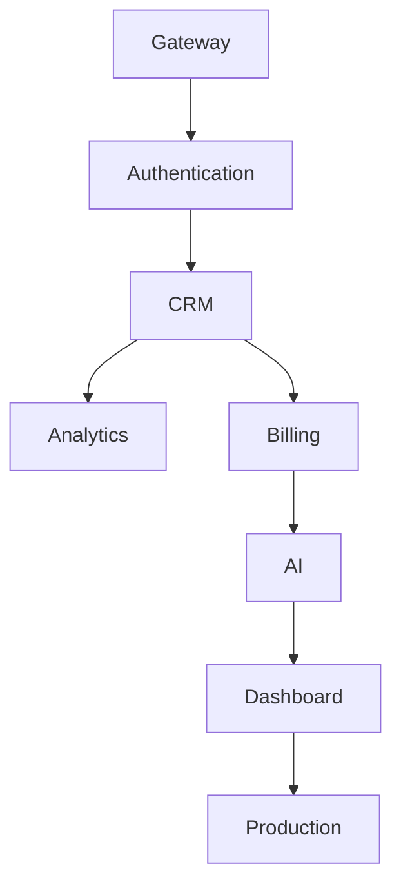
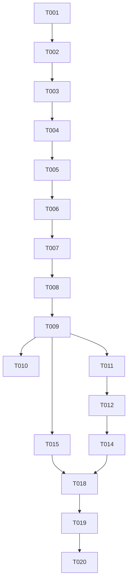

# Enterprise AI Software Factory
# Architecture Design Specification (ADS)

> **Document ID:** ADS-019-v5
>
> **Document Name:** Autonomous Planning Engine — End-to-End Engineering Walkthrough
>
> **Version:** 2.0.0
>
> **Classification:** Reference Implementation
>
> **Depends On:** ADS-019-v1
>
> **Depends On:** ADS-019-v2
>
> **Depends On:** ADS-019-v3
>
> **Depends On:** ADS-019-v4

---

# Executive Summary

This document demonstrates how the Autonomous Planning Engine behaves during a real engineering project.

Unlike previous ADS documents, this chapter does not introduce new architecture.

Instead, it follows one project from the initial requirement through every planning stage until the final execution graph is produced.

The objective is to provide engineers with a concrete reference implementation of the planning process.

---

# Scenario

A Product Manager submits the following request.

> Build an Enterprise AI CRM platform supporting authentication, role-based access control, multi-tenancy, subscriptions, analytics dashboards, REST APIs, audit logging and AI-assisted customer management.

The Planning Engine receives this requirement.

Workflow ID

```
WF-2026-001
```

Planning Session

```
PLAN-001
```

---

# Stage 1 — Requirement Intake

The API Gateway receives

```json
{
  "project":"Enterprise CRM",
  "priority":"High",
  "tenant":"Acme Corporation",
  "requirement":"Build an Enterprise AI CRM..."
}
```

The request is authenticated.

Identity verified.

Authorization verified.

Planning workflow created.

---

# Stage 2 — Requirement Normalization

The Requirement Analyzer extracts structured intent.

Business Goals

- Enterprise CRM
- SaaS
- AI Features
- Secure Platform

Functional Requirements

- Authentication
- Organizations
- Customers
- Dashboard
- Billing
- Analytics
- AI Assistant
- REST APIs

Non Functional Requirements

- Multi Tenant
- Zero Trust
- High Availability
- Horizontal Scaling

Constraints

- Kubernetes
- PostgreSQL
- Enterprise Security
- Audit Logging

---

# Stage 3 — Missing Information

The planner checks for ambiguity.

Questions generated

```text
Which billing provider?

Maximum expected users?

Cloud provider?

Compliance requirements?

Preferred authentication provider?

Single region or multi-region?
```

Planner confidence

```
84%
```

Human clarification requested.

After clarification

Planner confidence

```
97%
```

Planning continues.

---

# Stage 4 — Initial Architecture

The Architecture Planner proposes

```text
Gateway

↓

Authentication Service

↓

CRM Service

↓

AI Service

↓

Analytics

↓

Billing

↓

Notification Service

↓

Audit Service

↓

Database Cluster
```

Architecture Version

```
ARCH-001
```

---

# Stage 5 — Service Discovery

Detected services

| Service | Responsibility |
|----------|---------------|
| Auth | Authentication |
| CRM | Customer Data |
| AI | AI Assistant |
| Billing | Subscriptions |
| Dashboard | Frontend |
| Notification | Email |
| Analytics | Metrics |
| Audit | Compliance |

Planner discovers

```
8 Services
```

---

# Stage 6 — Repository Layout

The planner recommends

```text
apps/

services/

packages/

infrastructure/

docs/

.github/

scripts/

tests/
```

Monorepo selected.

Reason

Shared packages.

Unified CI.

Simpler dependency management.

---

# Stage 7 — Technology Selection

The planner evaluates multiple stacks.

Backend

- FastAPI
- NestJS
- Spring Boot

Frontend

- Next.js

Database

- PostgreSQL

Cache

- Redis

Queue

- Kafka

Vector Store

- Qdrant

Graph

- Neo4j

Container

- Docker

Orchestration

- Kubernetes

Workflow Engine

- Temporal

Reasoning

Each technology satisfies enterprise scalability and operational requirements.

---

# Stage 8 — Engineering Milestones

The planner generates milestones.

Milestone 1

Platform Foundation

Milestone 2

Authentication

Milestone 3

CRM Core

Milestone 4

Billing

Milestone 5

AI Assistant

Milestone 6

Analytics

Milestone 7

Production Hardening

Estimated project duration

```
14 Weeks
```

---

# Stage 9 — Complexity Analysis

Initial estimation

| Module | Complexity |
|----------|-----------|
| Authentication | 58 |
| CRM | 74 |
| AI Assistant | 92 |
| Billing | 61 |
| Dashboard | 48 |
| Analytics | 67 |

Highest complexity

```
AI Assistant
```

Requires

- Consensus Review
- Human Approval
- Security Review

---

# Stage 10 — Risk Analysis

High Risk Components

- AI Service
- Billing
- Authentication

Medium Risk

- Dashboard
- CRM

Low Risk

- Notifications

Overall Project Risk

```
Medium-High
```

---

# Stage 11 — Dependency Graph



Critical Path detected.

Optimization begins.

---

# Stage 12 — Task Decomposition

After the architecture is approved, the Planning Engine decomposes the project into atomic engineering tasks.

## Task Breakdown

| Task ID | Task | Owner |
|----------|------|-------|
| T-001 | Initialize Monorepo | Platform |
| T-002 | Configure CI Pipeline | DevOps |
| T-003 | Configure Kubernetes | Infrastructure |
| T-004 | Authentication Service | Backend |
| T-005 | User Database Schema | Database |
| T-006 | JWT Service | Backend |
| T-007 | RBAC Engine | Backend |
| T-008 | Tenant Isolation | Backend |
| T-009 | Customer CRUD APIs | Backend |
| T-010 | Dashboard UI | Frontend |
| T-011 | Billing Service | Backend |
| T-012 | Subscription APIs | Backend |
| T-013 | Kafka Event Bus | Infrastructure |
| T-014 | AI Assistant APIs | AI |
| T-015 | Analytics Engine | Backend |
| T-016 | Audit Logging | Security |
| T-017 | Notification Service | Backend |
| T-018 | Monitoring Stack | DevOps |
| T-019 | Security Validation | Security |
| T-020 | Production Deployment | DevOps |

The Planning Engine continues decomposition until every task satisfies

- Independent
- Testable
- Observable
- Reversible
- Single Responsibility

No task exceeds the maximum complexity threshold.

---

# Stage 13 — Dependency Resolution

The planner constructs a Directed Acyclic Graph (DAG).



The graph is validated to ensure

- No circular dependencies
- No orphan nodes
- Single root node
- Reachability of every task

---

# Stage 14 — Parallel Execution Groups

Independent tasks are grouped for concurrent execution.

```text
Wave 1

T001
T002
T003

↓

Wave 2

T004
T005

↓

Wave 3

T006
T007
T008

↓

Wave 4

T009
T011
T015
T017

↓

Wave 5

T010
T012
T014

↓

Wave 6

T018
T019

↓

Wave 7

T020
```

Estimated parallelization efficiency

```
81%
```

---

# Stage 15 — Planner Confidence

The Planning Engine evaluates overall planning quality.

| Factor | Score |
|----------|------:|
| Requirement Clarity | 98 |
| Architecture Completeness | 96 |
| Dependency Accuracy | 95 |
| Historical Similarity | 93 |
| Consensus Agreement | 99 |

Final calculation

```text
Confidence

=

98 × 0.20

+

96 × 0.25

+

95 × 0.20

+

93 × 0.15

+

99 × 0.20

=

96.3
```

Final Planner Confidence

```
96.3%
```

Workflow status

```
Approved
```

---

# Stage 16 — Cost Estimation

The planner estimates engineering effort.

| Category | Estimate |
|----------|---------:|
| Tasks | 20 |
| AI Planning Time | 6 min |
| Engineering Duration | 14 Weeks |
| AI Tokens | 2.4M |
| Estimated Reviews | 56 |
| Consensus Sessions | 11 |

Resource allocation

- Backend Agents: 4
- Frontend Agents: 2
- QA Agents: 2
- Security Agents: 1
- DevOps Agents: 2

---

# Stage 17 — Consensus Review

The completed plan is submitted for multi-agent validation.

```text
Planner

↓

Architect Review

↓

Security Review

↓

QA Review

↓

Performance Review

↓

Consensus Engine

↓

Final Decision
```

Review summary

| Reviewer | Result |
|-----------|--------|
| Architect | Approved |
| Security | Approved |
| QA | Approved |
| Performance | Approved |

Consensus Score

```
100%
```

---

# Stage 18 — Human Approval

The Product Owner reviews

- Architecture
- Timeline
- Risk Report
- Budget Estimate
- Milestones
- Execution Graph

Decision

```
Approved
```

Workflow advances to the Execution Plane.

---

# Stage 19 — Execution Package

The Planning Engine produces an immutable planning artifact.

```yaml
Workflow:
    WF-2026-001

Architecture:
    ARCH-001

TaskGraph:
    DAG-001

PlannerConfidence:
    96.3

Risk:
    Medium

Milestones:
    7

EstimatedDuration:
    14 Weeks

ExecutionGroups:
    7

Consensus:
    Approved

HumanApproval:
    Approved
```

This package becomes the only source of truth for implementation.

---

# Stage 20 — Handoff

The Planning Engine publishes

```
PlanningCompleted
```

The Control Plane receives

- Execution Graph
- Task Graph
- Planning Metadata
- Risk Report
- Complexity Report
- Milestone Plan

The Execution Plane begins implementation.

The Planning Engine has completed its responsibilities.

---

# Lessons Learned

This walkthrough demonstrates several core principles.

- Planning always precedes implementation.
- Architecture is established before code generation.
- Tasks are atomic and deterministic.
- Dependencies are explicitly modeled.
- Confidence is measurable.
- Human governance is preserved.
- Planning artifacts are immutable.
- Execution follows a validated graph rather than free-form reasoning.

---

# Reference Artifacts Produced

| Artifact | Identifier |
|-----------|------------|
| Architecture | ARCH-001 |
| Planning Session | PLAN-001 |
| Workflow | WF-2026-001 |
| Task Graph | DAG-001 |
| Milestone Plan | MP-001 |
| Risk Report | RR-001 |
| Complexity Report | CR-001 |
| Execution Package | EP-001 |

These identifiers are referenced throughout downstream systems.

---

# Architecture Decision Record

## ADR-019-11

### Decision

Every planning workflow MUST produce a complete execution package before implementation begins.

### Status

Accepted

### Reason

A complete execution package provides deterministic execution, enables auditing, supports workflow replay, and prevents implementation drift.

---

# Conclusion

The Autonomous Planning Engine converts business requirements into a deterministic engineering blueprint.

Its output is not software.

Its output is the engineering knowledge required to build software correctly.

Every downstream subsystem—including task execution, testing, code review, deployment, and monitoring—depends on the planning artifacts produced here.

The Planning Engine therefore serves as the operational brain of the Enterprise AI Software Factory.

---

# End of Document
