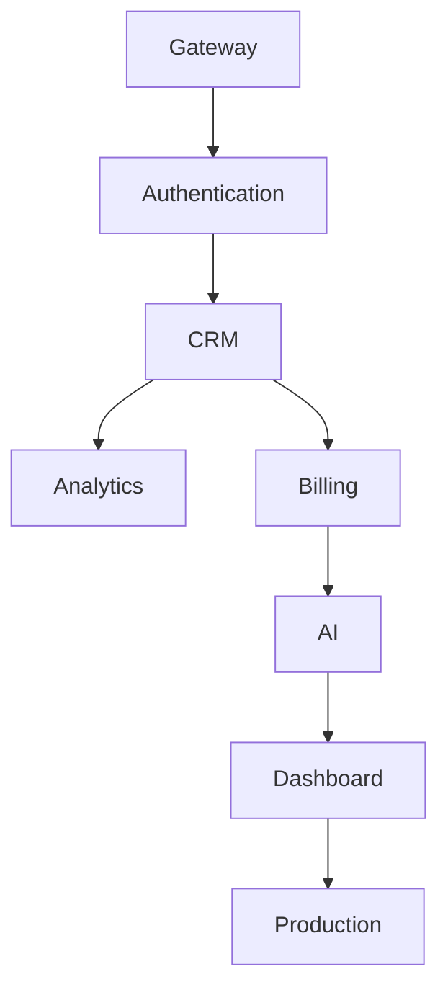

# Enterprise AI Software Factory
# Architecture Design Specification (ADS)

> **Document ID:** ADS-019-v5
>
> **Document Name:** Autonomous Planning Engine — End-to-End Engineering Walkthrough
>
> **Version:** 2.0.0
>
> **Classification:** Reference Implementation
>
> **Depends On:** ADS-019-v1
>
> **Depends On:** ADS-019-v2
>
> **Depends On:** ADS-019-v3
>
> **Depends On:** ADS-019-v4

---

# Executive Summary

This document demonstrates how the Autonomous Planning Engine behaves during a real engineering project.

Unlike previous ADS documents, this chapter does not introduce new architecture.

Instead, it follows one project from the initial requirement through every planning stage until the final execution graph is produced.

The objective is to provide engineers with a concrete reference implementation of the planning process.

---

# Scenario

A Product Manager submits the following request.

> Build an Enterprise AI CRM platform supporting authentication, role-based access control, multi-tenancy, subscriptions, analytics dashboards, REST APIs, audit logging and AI-assisted customer management.

The Planning Engine receives this requirement.

Workflow ID

```
WF-2026-001
```

Planning Session

```
PLAN-001
```

---

# Stage 1 — Requirement Intake

The API Gateway receives

```json
{
  "project":"Enterprise CRM",
  "priority":"High",
  "tenant":"Acme Corporation",
  "requirement":"Build an Enterprise AI CRM..."
}
```

The request is authenticated.

Identity verified.

Authorization verified.

Planning workflow created.

---

# Stage 2 — Requirement Normalization

The Requirement Analyzer extracts structured intent.

Business Goals

- Enterprise CRM
- SaaS
- AI Features
- Secure Platform

Functional Requirements

- Authentication
- Organizations
- Customers
- Dashboard
- Billing
- Analytics
- AI Assistant
- REST APIs

Non Functional Requirements

- Multi Tenant
- Zero Trust
- High Availability
- Horizontal Scaling

Constraints

- Kubernetes
- PostgreSQL
- Enterprise Security
- Audit Logging

---

# Stage 3 — Missing Information

The planner checks for ambiguity.

Questions generated

```text
Which billing provider?

Maximum expected users?

Cloud provider?

Compliance requirements?

Preferred authentication provider?

Single region or multi-region?
```

Planner confidence

```
84%
```

Human clarification requested.

After clarification

Planner confidence

```
97%
```

Planning continues.

---

# Stage 4 — Initial Architecture

The Architecture Planner proposes

```text
Gateway

↓

Authentication Service

↓

CRM Service

↓

AI Service

↓

Analytics

↓

Billing

↓

Notification Service

↓

Audit Service

↓

Database Cluster
```

Architecture Version

```
ARCH-001
```

---

# Stage 5 — Service Discovery

Detected services

| Service | Responsibility |
|----------|---------------|
| Auth | Authentication |
| CRM | Customer Data |
| AI | AI Assistant |
| Billing | Subscriptions |
| Dashboard | Frontend |
| Notification | Email |
| Analytics | Metrics |
| Audit | Compliance |

Planner discovers

```
8 Services
```

---

# Stage 6 — Repository Layout

The planner recommends

```text
apps/

services/

packages/

infrastructure/

docs/

.github/

scripts/

tests/
```

Monorepo selected.

Reason

Shared packages.

Unified CI.

Simpler dependency management.

---

# Stage 7 — Technology Selection

The planner evaluates multiple stacks.

Backend

- FastAPI
- NestJS
- Spring Boot

Frontend

- Next.js

Database

- PostgreSQL

Cache

- Redis

Queue

- Kafka

Vector Store

- Qdrant

Graph

- Neo4j

Container

- Docker

Orchestration

- Kubernetes

Workflow Engine

- Temporal

Reasoning

Each technology satisfies enterprise scalability and operational requirements.

---

# Stage 8 — Engineering Milestones

The planner generates milestones.

Milestone 1

Platform Foundation

Milestone 2

Authentication

Milestone 3

CRM Core

Milestone 4

Billing

Milestone 5

AI Assistant

Milestone 6

Analytics

Milestone 7

Production Hardening

Estimated project duration

```
14 Weeks
```

---

# Stage 9 — Complexity Analysis

Initial estimation

| Module | Complexity |
|----------|-----------|
| Authentication | 58 |
| CRM | 74 |
| AI Assistant | 92 |
| Billing | 61 |
| Dashboard | 48 |
| Analytics | 67 |

Highest complexity

```
AI Assistant
```

Requires

- Consensus Review
- Human Approval
- Security Review

---

# Stage 10 — Risk Analysis

High Risk Components

- AI Service
- Billing
- Authentication

Medium Risk

- Dashboard
- CRM

Low Risk

- Notifications

Overall Project Risk

```
Medium-High
```

---

# Stage 11 — Dependency Graph



Critical Path detected.

Optimization begins.

---

# End of Part 1
