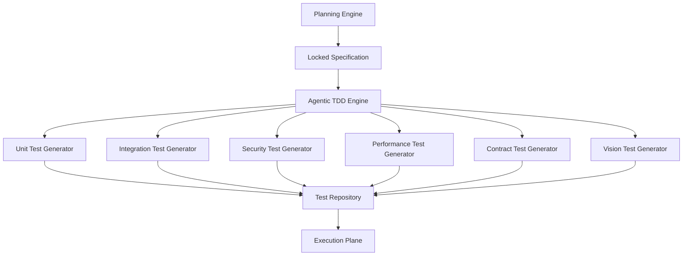

# Enterprise AI Software Factory
# Architecture Design Specification (ADS)

> **Document ID:** ADS-020-v1
>
> **Document Name:** Agentic Test Driven Development Engine — Architecture
>
> **Version:** 2.0.0
>
> **Status:** Draft
>
> **Classification:** Internal Engineering Specification
>
> **Depends On:** ADS-019-v1 → ADS-019-v5
>
> **Next:** ADS-020-v2 — Test Generation Algorithms

---

# Executive Summary

Traditional software development relies on developers writing tests after implementation or, in many cases, not writing tests at all.

Modern AI coding assistants often generate implementation first and then produce tests capable of validating their own output. This creates a dangerous feedback loop where incorrect code can still satisfy incorrect tests.

The Enterprise AI Software Factory reverses this process.

Before a single line of production code is written, the platform generates an executable specification in the form of unit tests, integration tests, contract tests, security tests, and user acceptance tests.

Implementation agents are never allowed to define correctness.

Correctness is defined independently by the Agentic TDD Engine.

---

# Purpose

The Agentic TDD Engine establishes correctness before implementation.

It guarantees that every implementation agent receives a predefined behavioral contract.

Instead of asking

> "Can the AI write code?"

the system asks

> "Can the AI satisfy an independently verified specification?"

---

# Why This System Exists

Most AI coding systems operate like this

```text
Requirement

↓

Code

↓

Tests

↓

Done
```

Problems

- AI writes its own tests.
- Hallucinated APIs remain undetected.
- Edge cases are ignored.
- Security testing is inconsistent.
- Regression testing is unreliable.

The Enterprise AI Software Factory instead follows

```text
Requirement

↓

Planning

↓

Test Generation

↓

Specification Locked

↓

Implementation

↓

Verification
```

---

# Design Goals

The Agentic TDD Engine exists to

- Define correctness before implementation.
- Prevent AI-generated self-validation.
- Improve software reliability.
- Increase regression coverage.
- Reduce hallucinations.
- Enable deterministic engineering.
- Improve review quality.
- Produce measurable software quality metrics.

---

# Responsibilities

The Agentic TDD Engine owns

- Unit Test Generation
- Integration Test Generation
- API Contract Tests
- Security Tests
- Performance Tests
- UI Acceptance Tests
- Regression Test Suites
- Mock Generation
- Test Data Generation
- Coverage Analysis

The Agentic TDD Engine never owns

- Production code
- Deployment
- Runtime monitoring
- Human approval

---

# High-Level Architecture



---

# Core Principle

The implementation agent MUST NEVER define software correctness.

Only the Agentic TDD Engine may define

- expected behavior
- success criteria
- failure conditions
- acceptance rules

This separation prevents implementation bias.

---

# Test Categories

The engine generates several independent test suites.

| Category | Purpose |
|-----------|---------|
| Unit | Individual logic validation |
| Integration | Cross-service verification |
| API Contract | Public interface validation |
| Database | Persistence correctness |
| Security | Vulnerability detection |
| Performance | Latency and throughput |
| End-to-End | User workflow validation |
| Vision | UI comparison |
| Regression | Prevent future breakage |

Each category is maintained independently.

---

# Engineering Workflow

```mermaid
flowchart LR

Planning

-->

Specification

-->

Test Generation

-->

Specification Lock

-->

Implementation

-->

Execution

-->

Verification

-->

Merge
```

No implementation begins until the Specification Lock is complete.

---

# Specification Lock

The generated tests become immutable.

Implementation agents cannot modify

- expected outputs
- assertions
- security requirements
- acceptance criteria

Only a Human Approval workflow may unlock the specification.

---

# Connected Systems

## Planning Engine

Provides architecture and execution plans.

---

## Execution Plane

Runs generated tests.

---

## Security Plane

Adds mandatory security validation.

---

## Vision QA

Validates UI behavior.

---

## Merge Engine

Blocks merge until all tests succeed.

---

# Engineering Principles

The Agentic TDD Engine follows

- Tests before code
- Independent validation
- Immutable specifications
- Multi-layer verification
- Deterministic execution
- Human governance
- Observable quality

---

# Architecture Decision Records

## ADR-020-01

### Decision

Generate tests before implementation.

### Status

Accepted

### Reason

Separating verification from implementation significantly reduces AI hallucinations and self-validation bias.

---

## ADR-020-02

### Decision

Treat generated tests as immutable artifacts.

### Status

Accepted

### Reason

Immutable specifications ensure implementation agents cannot redefine correctness after work begins.

---

# Version Roadmap

| Version | Scope |
|----------|-------|
| v1 | Architecture |
| v2 | Test Generation Algorithms |
| v3 | APIs, Events & Contracts |
| v4 | Runtime & Execution Pipeline |
| v5 | Complete Engineering Walkthrough |

---

# Related Documents

ADS-019-v1

ADS-019-v5

ADS-015

ADS-014

ADS-031

ADS-035

---

# Next Document

**ADS-020-v2 — Test Generation Algorithms**

The next document specifies how the platform generates deterministic test suites, measures coverage, derives edge cases, constructs mocks, estimates confidence, and mathematically evaluates software correctness before implementation begins.

---

# End of Document
