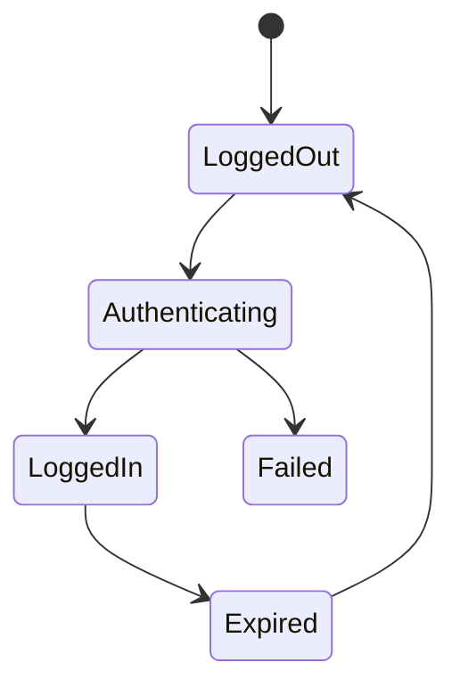

# Enterprise AI Software Factory
# Architecture Design Specification (ADS)

> **Document ID:** ADS-020-v2
>
> **Document Name:** Agentic Test Driven Development Engine — Algorithms & Test Generation
>
> **Version:** 2.0.0
>
> **Status:** Draft
>
> **Classification:** Internal Engineering Specification
>
> **Depends On:** ADS-020-v1
>
> **Next:** ADS-020-v3 — APIs, Events & Contracts

---

# Executive Summary

The Agentic TDD Engine does not generate tests randomly.

Every generated test originates from the approved engineering specification produced by the Planning Engine.

The objective is to mathematically maximize confidence that implementation satisfies the original business requirements.

The generated test suite becomes the executable definition of software correctness.

---

# Test Generation Pipeline

```mermaid
flowchart LR

Requirement

-->

Planning Engine

-->

Locked Specification

-->

Feature Extraction

-->

Behavior Analysis

-->

Edge Case Discovery

-->

Test Generation

-->

Coverage Validation

-->

Specification Lock
```

Every generated test is traceable back to a business requirement.

---

# Test Generation Workflow

The Agentic TDD Engine executes ten deterministic algorithms.

| Algorithm | Purpose |
|------------|----------|
| ALG-020-001 | Requirement Mapping |
| ALG-020-002 | Feature Extraction |
| ALG-020-003 | Behavior Modeling |
| ALG-020-004 | Edge Case Discovery |
| ALG-020-005 | Test Case Generation |
| ALG-020-006 | Mock Generation |
| ALG-020-007 | Coverage Analysis |
| ALG-020-008 | Mutation Analysis |
| ALG-020-009 | Confidence Scoring |
| ALG-020-010 | Specification Lock |

---

# ALG-020-001

## Requirement Mapping

Every requirement receives a unique identifier.

Example

```text
REQ-001

User Login

REQ-002

Password Reset

REQ-003

Tenant Isolation
```

Every generated test references at least one requirement.

No orphan tests are allowed.

---

# ALG-020-002

## Feature Extraction

Business requirements become software behaviors.

Example

```
User Login
```

↓

Planner

↓

```
Authenticate Credentials

Issue JWT

Store Session

Write Audit Log
```

Each behavior becomes independently testable.

---

# ALG-020-003

## Behavior Modeling

Each feature is represented as a finite state machine.

Example



Tests are generated from valid and invalid transitions.

---

# ALG-020-004

## Edge Case Discovery

The planner automatically discovers

- Empty Input
- Null Values
- Invalid Types
- Maximum Length
- Unicode
- Concurrency
- Race Conditions
- Expired Tokens
- Duplicate Requests

Edge cases become mandatory tests.

---

# ALG-020-005

## Test Generation

Generated categories

```text
Unit Tests

↓

Integration Tests

↓

Contract Tests

↓

Security Tests

↓

Performance Tests

↓

UI Tests

↓

Regression Tests
```

Every category receives independent ownership.

---

# Example

Requirement

```
Login
```

Generated

```text
15 Unit Tests

8 Integration Tests

5 Security Tests

3 Contract Tests

2 Performance Tests
```

---

# ALG-020-006

## Mock Generation

Dependencies are isolated.

Generated mocks include

- Database
- Redis
- Kafka
- SMTP
- Payment Gateway
- External APIs

Mocks are deterministic.

---

# ALG-020-007

## Coverage Analysis

Coverage is evaluated across multiple dimensions.

| Dimension | Target |
|-----------|--------:|
| Statement | 95% |
| Branch | 90% |
| Path | 85% |
| Mutation | 80% |
| Requirement | 100% |

Coverage below thresholds blocks implementation.

---

# Coverage Formula

```text
Coverage

=

Satisfied Requirements

───────────────

Total Requirements

×100
```

Example

```
98%

Coverage
```

---

# ALG-020-008

## Mutation Analysis

Artificial defects are introduced.

Example

```text
==

↓

!=
```

Tests should fail.

If tests continue passing

↓

Test quality decreases.

Mutation Score

```
87%
```

---

# ALG-020-009

## Test Confidence

Every suite receives a confidence value.

Formula

```text
Confidence

=

Coverage × 0.30

+

Mutation × 0.25

+

Edge Cases × 0.20

+

Historical Accuracy × 0.15

+

Specification Match × 0.10
```

Result

```
94.7%
```

---

# ALG-020-010

## Specification Lock

After validation

The test suite becomes immutable.

Implementation agents

MUST NOT

- delete assertions

- weaken tests

- remove edge cases

- modify contracts

Only Human Approval may unlock the specification.

---

# Test Dependency Graph

```mermaid
graph TD

Requirement

-->

Behavior

-->

Unit Tests

-->

Integration Tests

-->

Regression

-->

Implementation
```

---

# Test Prioritization

Priority calculation

```text
Priority

=

Business Impact

×

Failure Risk

───────────────

Implementation Cost
```

Higher scores execute first.

---

# Failure Recovery

```text
Generation Failure

↓

Checkpoint

↓

Retry

↓

Alternative Generator

↓

Consensus Review

↓

Human Review
```

---

# Metrics

```
tests_generated_total

coverage_percentage

mutation_score

specification_lock_total

test_generation_time

average_edge_cases

failed_generation_total

confidence_score
```

---

# Architecture Decision Records

## ADR-020-03

Decision

Generate edge cases automatically.

Reason

Human developers consistently overlook unusual inputs.

---

## ADR-020-04

Decision

Use mutation analysis before implementation.

Reason

Mutation analysis measures test quality rather than code quality.

---

# Related Documents

ADS-019-v2

ADS-020-v1

ADS-020-v3

ADS-034

---

# Next Document

ADS-020-v3

**APIs, Events & Contracts**

Defines REST APIs, gRPC interfaces, event contracts, schema definitions and communication protocols for the Agentic TDD Engine.

---

# End of Document
