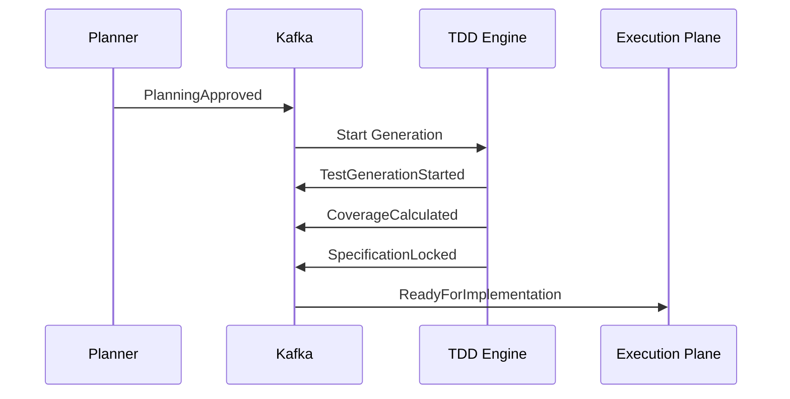
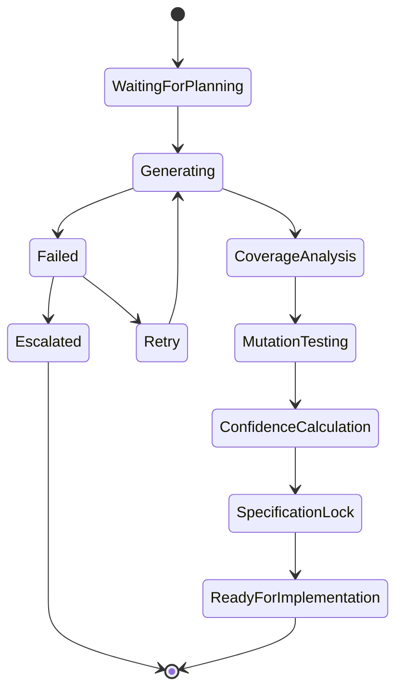
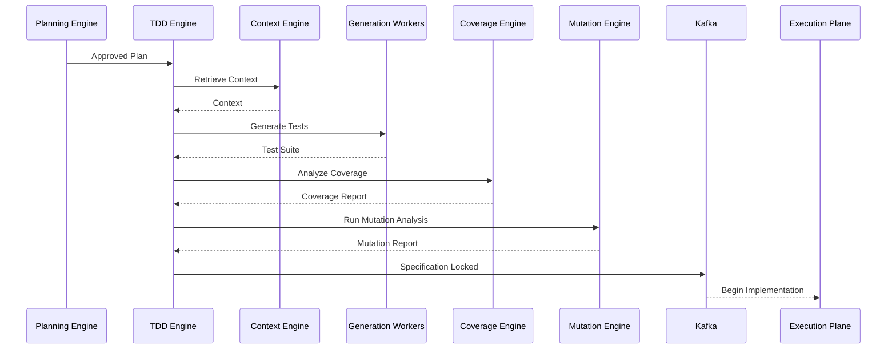

# Enterprise AI Software Factory
# Architecture Design Specification (ADS)

> **Document ID:** ADS-020-v3
>
> **Document Name:** Agentic Test Driven Development Engine — APIs, Events & Contracts
>
> **Version:** 2.0.0
>
> **Status:** Draft
>
> **Classification:** Internal Engineering Specification
>
> **Depends On:** ADS-020-v1
>
> **Depends On:** ADS-020-v2
>
> **Next:** ADS-020-v4 — Runtime & Execution Pipeline

---

# Executive Summary

The Agentic TDD Engine communicates with the rest of the Enterprise AI Software Factory through strongly typed APIs, immutable event contracts, and versioned schemas.

This document defines every supported communication interface.

Implementation details remain hidden behind stable contracts.

---

# Communication Principles

Every interface MUST satisfy the following rules.

- Strongly typed
- Versioned
- Backward compatible
- Observable
- Authenticated
- Authorized
- Replayable
- Auditable

No subsystem may bypass these contracts.

---

# Communication Architecture

```mermaid
flowchart LR

Planner

-->

TDD API

-->

TDD Engine

-->

Test Workers

-->

Repository

Repository

-->

Kafka

Kafka

-->

Execution Plane

Kafka

-->

Observability

Execution Plane

-->

Merge Engine
```

---

# Public REST API

The REST interface is intended for

- Dashboard
- CLI
- Enterprise API
- Integrations

---

## API-020-001

### Create Test Suite

```http
POST /tdd/v1/test-suites
```

Purpose

Generate a complete test suite from an approved planning specification.

---

Request

```json
{
  "workflowId":"WF-2026-001",
  "planId":"PLAN-001",
  "architectureId":"ARCH-001"
}
```

---

Response

```json
{
  "suiteId":"TS-001",
  "status":"Generating",
  "estimatedDuration":"2m"
}
```

---

Possible Responses

| Code | Meaning |
|------:|---------|
|200|Generation Started|
|400|Invalid Planning Artifact|
|401|Unauthorized|
|409|Specification Not Locked|
|429|Rate Limited|
|500|Generation Failed|

---

## API-020-002

### Get Test Suite

```http
GET /tdd/v1/test-suites/{suiteId}
```

Returns

- Status
- Coverage
- Confidence
- Progress
- Generated Categories

---

## API-020-003

### Lock Specification

```http
POST /tdd/v1/test-suites/{suiteId}/lock
```

Locks

- Assertions
- Acceptance Criteria
- Contracts
- Expected Outputs

After locking, implementation may begin.

---

## API-020-004

### Unlock Specification

Only Human Approval may invoke this endpoint.

```http
POST /tdd/v1/test-suites/{suiteId}/unlock
```

Every unlock creates an immutable audit record.

---

# Internal gRPC Service

Internal communication uses gRPC.

```protobuf
service TestGenerationService {

rpc GenerateTests(TestRequest)

returns(TestResponse);

rpc ValidateCoverage(CoverageRequest)

returns(CoverageResponse);

rpc LockSpecification(LockRequest)

returns(LockResponse);

}
```

---

# Request Schema

```protobuf
message TestRequest{

string workflow_id=1;

string project_id=2;

string architecture_id=3;

bool generate_security_tests=4;

bool generate_ui_tests=5;

}
```

---

# Response Schema

```protobuf
message TestResponse{

string suite_id=1;

double confidence=2;

double coverage=3;

string status=4;

}
```

---

# MCP Tool Contracts

The Agentic TDD Engine exposes tools through MCP.

Supported tools

```text
generate_unit_tests

generate_integration_tests

generate_security_tests

generate_contract_tests

generate_ui_tests

calculate_coverage

lock_specification

unlock_specification
```

Every tool invocation is versioned and audited.

---

# Event Model

The TDD Engine never relies on polling.

Every significant action emits an immutable event.

---

# Event Flow



---

# EVT-020-001

TestGenerationStarted

Payload

```json
{
  "workflowId":"",
  "suiteId":"",
  "timestamp":""
}
```

---

# EVT-020-002

CoverageCalculated

Contains

- Statement Coverage
- Branch Coverage
- Mutation Score
- Requirement Coverage

---

# EVT-020-003

SpecificationLocked

Triggers

Implementation authorization.

---

# EVT-020-004

SpecificationUnlocked

Requires

Human Approval.

Automatically notifies

- Planning Engine
- Execution Plane
- Audit System

---

# Event Ordering

Events MUST follow

```
Generation Started

↓

Coverage Complete

↓

Confidence Calculated

↓

Specification Locked

↓

Implementation Begins
```

Out-of-order processing is rejected.

---

# Event Versioning

Every event contains

```yaml
eventVersion

schemaVersion

engineVersion

workflowVersion
```

Breaking changes require a new major schema version.

---

# Contract Validation

Every request entering the Agentic TDD Engine MUST be validated before processing begins.

Validation is performed in four sequential stages.

```text
Receive Request

↓

Schema Validation

↓

Identity Validation

↓

Policy Validation

↓

Business Validation

↓

Execution
```

If validation fails at any stage, processing terminates immediately.

---

# Validation Rules

Every request MUST satisfy the following requirements.

| Rule | Description |
|------|-------------|
| Schema Version | Supported API version |
| Authentication | Valid identity token |
| Authorization | Required permissions |
| Workflow Exists | Valid Planning Session |
| Planning Approved | Planning completed successfully |
| Specification Status | Unlocked for generation |
| Payload Size | Within configured limits |

Invalid requests never enter the generation pipeline.

---

# Authentication

Authentication is delegated to the Enterprise Identity Plane.

Supported methods

- OAuth2
- OpenID Connect (OIDC)
- Mutual TLS (mTLS)
- Enterprise SSO
- Service Accounts

Every request carries

```http
Authorization:
Bearer <Access Token>
```

The TDD Engine never validates credentials itself.

---

# Authorization

Role-Based Access Control (RBAC) is enforced.

| Role | Permission |
|------|------------|
| Viewer | Read Test Suites |
| Developer | Generate Tests |
| QA Engineer | Approve Coverage |
| Security Engineer | Generate Security Tests |
| Project Owner | Lock Specification |
| Organization Admin | Unlock Specification |
| Platform Admin | Full Access |

Unlocking specifications always requires elevated permissions.

---

# Multi-Tenant Isolation

Every generated test suite belongs to a single tenant.

```text
Tenant

↓

Organization

↓

Project

↓

Repository

↓

Planning Session

↓

Test Suite
```

Cross-tenant access is prohibited.

---

# Idempotency

Test generation is idempotent.

Every request MUST include

```
Idempotency-Key
```

Example

```http
POST /tdd/v1/test-suites

Idempotency-Key:
4b781df2-7a89-4e12-98d2-8e47b3fdac65
```

Duplicate requests return the existing Test Suite instead of generating a new one.

---

# Rate Limiting

Rate limiting is enforced by the API Gateway.

| Endpoint | Limit |
|-----------|-------:|
| Generate Tests | 10 requests/min |
| Get Test Suite | 300 requests/min |
| Lock Specification | 50 requests/min |
| Unlock Specification | 20 requests/min |

Limits are configurable.

---

# TDD Engine State Machine



The engine never skips intermediate validation stages.

---

# Runtime Sequence



---

# Retry Policy

Failures are categorized before retries occur.

| Failure | Retry |
|----------|------:|
| AI Model Timeout | Yes |
| Context Retrieval Failure | Yes |
| Temporary Queue Failure | Yes |
| Invalid Planning Artifact | No |
| Authentication Failure | No |
| Authorization Failure | No |
| Specification Conflict | No |

Retry schedule

```text
1 s

↓

2 s

↓

4 s

↓

8 s

↓

Escalation
```

Retries are bounded.

---

# Circuit Breakers

Repeated failures isolate unhealthy components.

```text
Failure

↓

Retry

↓

Threshold Reached

↓

Circuit Open

↓

Traffic Redirected

↓

Recovery Probe

↓

Circuit Closed
```

This prevents cascading failures.

---

# Error Contract

Every error follows a standard structure.

```json
{
  "errorCode":"TDD-0041",
  "message":"Requirement coverage below threshold.",
  "severity":"High",
  "retryable":false,
  "workflowId":"WF-2026-001",
  "timestamp":"..."
}
```

Error responses are immutable.

---

# API Versioning

The TDD Engine follows semantic versioning.

```text
v1

↓

v1.1

↓

v1.2

↓

v2
```

Breaking changes require a new major version.

---

# OpenTelemetry Contracts

Each workflow generates a distributed trace.

```text
Planning

↓

Test Generation

↓

Coverage

↓

Mutation

↓

Confidence

↓

Specification Lock

↓

Execution
```

Each stage becomes an independent span.

---

# Prometheus Metrics

The engine exports

```text
tdd_generation_total

tdd_generation_success_total

tdd_generation_failure_total

tdd_active_workers

tdd_average_generation_time

tdd_average_coverage

tdd_mutation_score

tdd_confidence_average

tdd_specification_lock_total

tdd_retry_total
```

These metrics feed the Enterprise Observability Plane.

---

# Structured Logging

Every operation emits structured logs.

Example

```json
{
  "traceId":"trace-001",
  "workflowId":"WF-2026-001",
  "suiteId":"TS-001",
  "stage":"MutationTesting",
  "durationMs":231,
  "status":"Success"
}
```

Logs are immutable and retained according to organizational policy.

---

# Audit Records

Every test generation workflow records

- Workflow ID
- Test Suite ID
- Planner Version
- TDD Engine Version
- User ID
- Tenant ID
- Coverage Score
- Mutation Score
- Confidence Score
- Timestamp

Audit records support replay and compliance.

---

# Security Considerations

The TDD Engine

MUST

- Verify planning approval
- Enforce specification locking
- Redact secrets from generated tests
- Validate all external inputs
- Record audit trails

The TDD Engine MUST NOT

- Modify planning artifacts
- Execute production deployments
- Access production secrets
- Weaken locked specifications

---

# Architecture Decision Records

## ADR-020-05

### Decision

All generated specifications become immutable after locking.

### Status

Accepted

### Reason

Immutable specifications prevent implementation agents from changing the definition of correctness.

---

## ADR-020-06

### Decision

Coverage and mutation analysis are mandatory before implementation.

### Status

Accepted

### Reason

Passing unit tests alone is insufficient to establish software quality.

---

## ADR-020-07

### Decision

Use event-driven communication instead of synchronous orchestration.

### Status

Accepted

### Reason

Event-driven systems provide better scalability, resilience, replayability, and observability.

---

# Related Documents

ADS-019-v5 — Autonomous Planning Engine Walkthrough

ADS-020-v1 — Architecture

ADS-020-v2 — Algorithms & Test Generation

ADS-020-v4 — Runtime & Execution Pipeline

ADS-031 — AST Merge Engine

ADS-035 — Vision QA Engine

---

# End of Document
