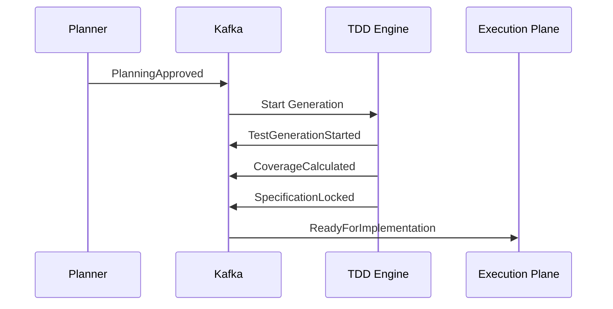

# Enterprise AI Software Factory
# Architecture Design Specification (ADS)

> **Document ID:** ADS-020-v3
>
> **Document Name:** Agentic Test Driven Development Engine — APIs, Events & Contracts
>
> **Version:** 2.0.0
>
> **Status:** Draft
>
> **Classification:** Internal Engineering Specification
>
> **Depends On:** ADS-020-v1
>
> **Depends On:** ADS-020-v2
>
> **Next:** ADS-020-v4 — Runtime & Execution Pipeline

---

# Executive Summary

The Agentic TDD Engine communicates with the rest of the Enterprise AI Software Factory through strongly typed APIs, immutable event contracts, and versioned schemas.

This document defines every supported communication interface.

Implementation details remain hidden behind stable contracts.

---

# Communication Principles

Every interface MUST satisfy the following rules.

- Strongly typed
- Versioned
- Backward compatible
- Observable
- Authenticated
- Authorized
- Replayable
- Auditable

No subsystem may bypass these contracts.

---

# Communication Architecture

```mermaid
flowchart LR

Planner

-->

TDD API

-->

TDD Engine

-->

Test Workers

-->

Repository

Repository

-->

Kafka

Kafka

-->

Execution Plane

Kafka

-->

Observability

Execution Plane

-->

Merge Engine
```

---

# Public REST API

The REST interface is intended for

- Dashboard
- CLI
- Enterprise API
- Integrations

---

## API-020-001

### Create Test Suite

```http
POST /tdd/v1/test-suites
```

Purpose

Generate a complete test suite from an approved planning specification.

---

Request

```json
{
  "workflowId":"WF-2026-001",
  "planId":"PLAN-001",
  "architectureId":"ARCH-001"
}
```

---

Response

```json
{
  "suiteId":"TS-001",
  "status":"Generating",
  "estimatedDuration":"2m"
}
```

---

Possible Responses

| Code | Meaning |
|------:|---------|
|200|Generation Started|
|400|Invalid Planning Artifact|
|401|Unauthorized|
|409|Specification Not Locked|
|429|Rate Limited|
|500|Generation Failed|

---

## API-020-002

### Get Test Suite

```http
GET /tdd/v1/test-suites/{suiteId}
```

Returns

- Status
- Coverage
- Confidence
- Progress
- Generated Categories

---

## API-020-003

### Lock Specification

```http
POST /tdd/v1/test-suites/{suiteId}/lock
```

Locks

- Assertions
- Acceptance Criteria
- Contracts
- Expected Outputs

After locking, implementation may begin.

---

## API-020-004

### Unlock Specification

Only Human Approval may invoke this endpoint.

```http
POST /tdd/v1/test-suites/{suiteId}/unlock
```

Every unlock creates an immutable audit record.

---

# Internal gRPC Service

Internal communication uses gRPC.

```protobuf
service TestGenerationService {

rpc GenerateTests(TestRequest)

returns(TestResponse);

rpc ValidateCoverage(CoverageRequest)

returns(CoverageResponse);

rpc LockSpecification(LockRequest)

returns(LockResponse);

}
```

---

# Request Schema

```protobuf
message TestRequest{

string workflow_id=1;

string project_id=2;

string architecture_id=3;

bool generate_security_tests=4;

bool generate_ui_tests=5;

}
```

---

# Response Schema

```protobuf
message TestResponse{

string suite_id=1;

double confidence=2;

double coverage=3;

string status=4;

}
```

---

# MCP Tool Contracts

The Agentic TDD Engine exposes tools through MCP.

Supported tools

```text
generate_unit_tests

generate_integration_tests

generate_security_tests

generate_contract_tests

generate_ui_tests

calculate_coverage

lock_specification

unlock_specification
```

Every tool invocation is versioned and audited.

---

# Event Model

The TDD Engine never relies on polling.

Every significant action emits an immutable event.

---

# Event Flow



---

# EVT-020-001

TestGenerationStarted

Payload

```json
{
  "workflowId":"",
  "suiteId":"",
  "timestamp":""
}
```

---

# EVT-020-002

CoverageCalculated

Contains

- Statement Coverage
- Branch Coverage
- Mutation Score
- Requirement Coverage

---

# EVT-020-003

SpecificationLocked

Triggers

Implementation authorization.

---

# EVT-020-004

SpecificationUnlocked

Requires

Human Approval.

Automatically notifies

- Planning Engine
- Execution Plane
- Audit System

---

# Event Ordering

Events MUST follow

```
Generation Started

↓

Coverage Complete

↓

Confidence Calculated

↓

Specification Locked

↓

Implementation Begins
```

Out-of-order processing is rejected.

---

# Event Versioning

Every event contains

```yaml
eventVersion

schemaVersion

engineVersion

workflowVersion
```

Breaking changes require a new major schema version.

---

# End of Part 1
