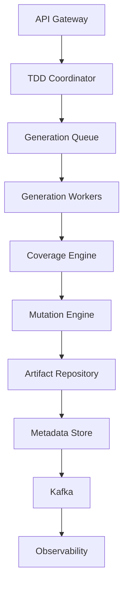
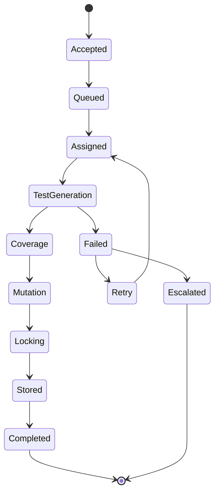
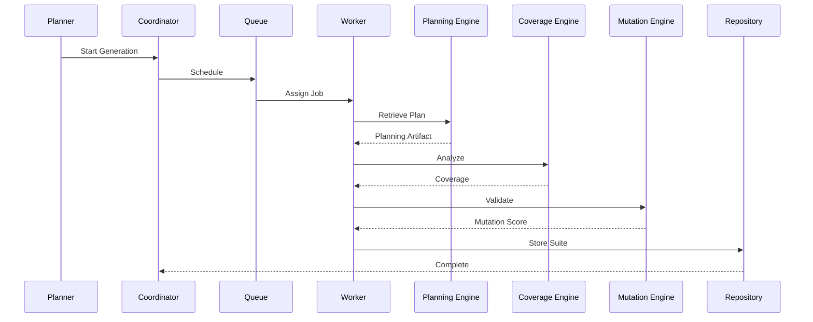
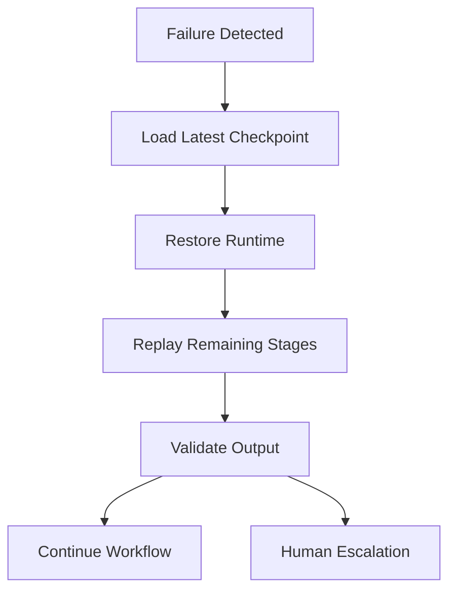
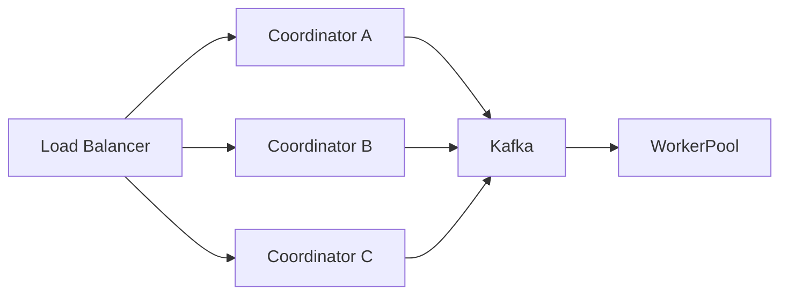

# Enterprise AI Software Factory
# Architecture Design Specification (ADS)

> **Document ID:** ADS-020-v4
>
> **Document Name:** Agentic Test Driven Development Engine — Runtime & Execution Pipeline
>
> **Version:** 2.0.0
>
> **Status:** Draft
>
> **Classification:** Internal Engineering Specification
>
> **Depends On:** ADS-020-v1
>
> **Depends On:** ADS-020-v2
>
> **Depends On:** ADS-020-v3
>
> **Next:** ADS-020-v5 — End-to-End Engineering Walkthrough

---

# Executive Summary

This document defines the production runtime of the Agentic Test Driven Development Engine.

While previous specifications describe architecture, algorithms and communication contracts, this specification focuses on execution.

It defines

- runtime services
- execution workers
- orchestration
- checkpointing
- queue management
- scaling
- caching
- persistence
- runtime lifecycle

The runtime guarantees deterministic and reproducible test generation.

---

# Runtime Philosophy

The runtime follows six principles.

- Stateless workers
- Immutable test artifacts
- Distributed execution
- Checkpoint-based recovery
- Horizontal scalability
- Event-driven orchestration

---

# Runtime Topology



Every execution follows this topology.

---

# Runtime Components

| Component | Responsibility |
|------------|----------------|
| TDD Coordinator | Workflow orchestration |
| Generation Queue | Scheduling |
| Test Workers | Generate tests |
| Coverage Engine | Coverage analysis |
| Mutation Engine | Mutation testing |
| Artifact Repository | Store generated suites |
| Metadata Store | Workflow persistence |
| Observability | Runtime telemetry |

Every component is independently deployable.

---

# Runtime Lifecycle



---

# Coordinator

The coordinator manages workflow execution.

Responsibilities

- assign workers
- monitor progress
- recover failures
- emit events
- manage checkpoints

The coordinator never generates tests.

---

# Generation Workers

Workers execute deterministic test generation.

Each worker

- loads planning artifacts
- generates assigned tests
- validates syntax
- persists checkpoints
- emits telemetry

Workers are stateless.

---

# Worker Topology

```mermaid
flowchart LR

Coordinator

-->

Worker

Worker

-->

Context Engine

Worker

-->

Planning Artifacts

Worker

-->

Coverage Engine

Worker

-->

Checkpoint Store

Worker

-->

Telemetry
```

---

# Queue System

Generation requests enter a distributed queue.

```text
Planner

↓

Generation Queue

↓

Coordinator

↓

Worker Pool

↓

Generated Tests
```

Queue guarantees

- ordering
- retries
- dead-letter handling
- visibility timeout

---

# Queue Priorities

| Priority | Example |
|-----------|----------|
| Critical | Security Patch |
| High | Enterprise Release |
| Medium | Sprint Feature |
| Low | Experimental Branch |

Higher priorities receive worker allocation first.

---

# Checkpoint System

Each major stage creates a checkpoint.

```text
Specification Loaded

↓

Checkpoint

↓

Unit Tests Generated

↓

Checkpoint

↓

Coverage Calculated

↓

Checkpoint

↓

Mutation Complete

↓

Checkpoint

↓

Specification Locked
```

Recovery resumes from the latest successful checkpoint.

---

# Checkpoint Metadata

Each checkpoint stores

- Workflow ID
- Test Suite ID
- Current Stage
- Coverage
- Mutation Score
- Confidence
- Timestamp

Checkpoints are immutable.

---

# Runtime Storage

Artifacts are stored independently.

```text
Planning Artifact

↓

Generated Tests

↓

Coverage Report

↓

Mutation Report

↓

Specification Lock

↓

Audit Metadata
```

Workers never own persistent state.

---

# Cache Strategy

Three cache layers are maintained.

```text
L1

Worker Cache

↓

L2

Project Cache

↓

L3

Organization Cache
```

Cached items

- planning artifacts
- schemas
- mocks
- generated fixtures

---

# Runtime Sequence



---

# Resource Allocation

Workers are allocated using

- queue depth
- estimated complexity
- CPU
- memory
- tenant quota
- workflow priority

Worker allocation is dynamic.

---

# Runtime Principles

The runtime guarantees

- deterministic execution
- stateless workers
- immutable outputs
- replayable workflows
- horizontal scalability
- observable execution

---

# Failure Recovery

The Agentic TDD Engine is designed to recover from failures without regenerating the entire test suite.

Every recovery operation begins from the most recent successful checkpoint.



Recovery objectives

- Preserve completed work
- Eliminate duplicate execution
- Resume deterministically
- Minimize generation time

---

# Retry Strategy

Retries are categorized by failure type.

| Failure | Retry | Strategy |
|----------|------:|----------|
| AI Timeout | 3 | Exponential Backoff |
| Context Failure | 3 | Alternate Replica |
| Queue Timeout | 5 | Retry Queue |
| Coverage Failure | 2 | Retry Worker |
| Mutation Failure | 2 | Retry Worker |
| Invalid Planning Artifact | 0 | Reject Workflow |
| Specification Conflict | 0 | Human Review |

Retry schedule

```text
1 Second

↓

2 Seconds

↓

4 Seconds

↓

8 Seconds

↓

16 Seconds

↓

Escalation
```

Retries are bounded.

---

# Worker Health Monitoring

Every worker continuously reports runtime health.

Collected information

- CPU Usage
- Memory Usage
- Queue Position
- Current Workflow
- Worker Version
- Runtime Status
- Heartbeat Timestamp

Heartbeat Flow

```text
Worker

↓

Heartbeat

↓

Coordinator

↓

Health Store

↓

Dashboard
```

Missing heartbeats automatically trigger worker replacement.

---

# Horizontal Scaling

Worker pools scale automatically.

Scaling inputs

- Queue Length
- Average Generation Time
- Active Workflows
- CPU Utilization
- Memory Pressure
- Tenant Demand

Scaling workflow

```text
Queue Growth

↓

Autoscaler

↓

Provision Workers

↓

Register Workers

↓

Process Queue

↓

Scale Down
```

Workers remain disposable.

---

# High Availability

No runtime component is deployed as a single instance.



Failure of any single coordinator does not interrupt active workflows.

---

# Runtime Isolation

Each generation worker executes in an isolated environment.

Supported isolation technologies

- Kubernetes Pods
- Docker Containers
- Firecracker MicroVMs

Isolation guarantees

- Independent filesystem
- Independent process space
- Independent memory
- Independent runtime configuration

No worker shares execution state.

---

# Secrets Management

Secrets are never embedded inside

- Worker Containers
- Images
- Configuration Files
- Generated Tests

Workers retrieve temporary credentials only when required.

```text
Worker

↓

Identity Plane

↓

Secrets Manager

↓

Temporary Token

↓

Execution

↓

Token Expired
```

---

# Runtime Configuration

Configuration remains external.

Example

```yaml
tdd:

  maxWorkers: 300

  queueDepth: 1000

  maxRetries: 3

  coverageThreshold: 95

  mutationThreshold: 80

  confidenceThreshold: 90

  cacheEnabled: true

  enableVisionTests: true
```

Configuration changes do not require recompilation.

---

# Performance Optimizations

The runtime minimizes latency using

- Context Caching
- Shared Fixtures
- Incremental Test Generation
- Parallel Coverage Analysis
- Parallel Mutation Analysis
- Lazy Artifact Loading
- Distributed Worker Scheduling

Performance optimizations MUST NOT modify generated test behavior.

---

# Runtime Observability

Every workflow emits

- Metrics
- Traces
- Structured Logs
- Audit Events
- Runtime Events

Nothing executes without telemetry.

---

# Prometheus Metrics

```text
tdd_queue_depth

tdd_active_workers

tdd_generation_duration_seconds

tdd_generation_success_total

tdd_generation_failure_total

tdd_checkpoint_total

tdd_recovery_total

tdd_parallel_efficiency

tdd_cache_hit_ratio

tdd_average_latency
```

---

# OpenTelemetry Traces

Each workflow creates a distributed trace.

```text
Planner

↓

TDD Coordinator

↓

Generation Worker

↓

Coverage Engine

↓

Mutation Engine

↓

Repository

↓

Execution Plane
```

Every major stage becomes an independent span.

---

# Structured Logging

Example

```json
{
  "traceId":"trace-302",
  "workflowId":"WF-2026-001",
  "suiteId":"TS-001",
  "worker":"worker-17",
  "stage":"CoverageAnalysis",
  "durationMs":148,
  "status":"Success"
}
```

Logs are immutable.

---

# Disaster Recovery

Runtime state survives infrastructure failures.

Recovery process

```text
Infrastructure Failure

↓

Database Replica Promotion

↓

Reconnect Coordinators

↓

Recover Queue

↓

Restore Checkpoints

↓

Resume Workflows
```

Recovery objectives

Recovery Point Objective (RPO)

Near-zero data loss

Recovery Time Objective (RTO)

Less than five minutes

---

# Production Deployment

Recommended deployment

```text
Kubernetes Cluster

↓

TDD Namespace

↓

Coordinator Deployment

↓

Worker Deployment

↓

Kafka

↓

Redis

↓

PostgreSQL

↓

Artifact Storage

↓

Prometheus

↓

Grafana

↓

OpenTelemetry
```

---

# Recommended Technology Stack

| Layer | Technology |
|--------|------------|
| Runtime | Kubernetes |
| Workflow Engine | Temporal |
| Queue | Kafka |
| Cache | Redis |
| Metadata | PostgreSQL |
| Artifact Storage | MinIO |
| Metrics | Prometheus |
| Dashboards | Grafana |
| Tracing | OpenTelemetry |
| Secrets | HashiCorp Vault |
| Service Mesh | Istio |

---

# Runtime Checklist

The runtime MUST

- Execute deterministically
- Persist checkpoints
- Emit telemetry
- Recover from failures
- Scale horizontally
- Enforce specification locking
- Preserve immutable artifacts

The runtime MUST NOT

- Store secrets locally
- Skip validation stages
- Modify locked specifications
- Lose workflow state
- Execute outside isolated environments

---

# Architecture Decision Records

## ADR-020-08

### Decision

All generation workers remain stateless.

### Status

Accepted

### Reason

Stateless workers simplify autoscaling, recovery, and infrastructure replacement.

---

## ADR-020-09

### Decision

Persist checkpoints after every major generation stage.

### Status

Accepted

### Reason

Checkpointing minimizes work loss and supports deterministic replay.

---

## ADR-020-10

### Decision

Deploy the runtime as independently scalable services.

### Status

Accepted

### Reason

Independent scaling improves resource utilization and fault isolation.

---

# Related Documents

ADS-019-v5 — Planning Walkthrough

ADS-020-v1 — Architecture

ADS-020-v2 — Algorithms

ADS-020-v3 — APIs & Contracts

ADS-020-v5 — End-to-End Engineering Walkthrough

ADS-031 — AST Merge Engine

ADS-035 — Vision QA Engine

---

# End of Document
