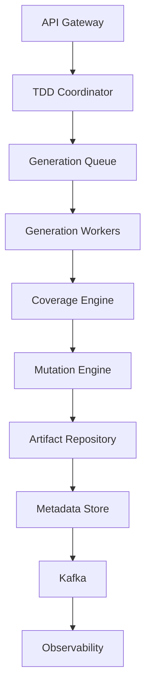
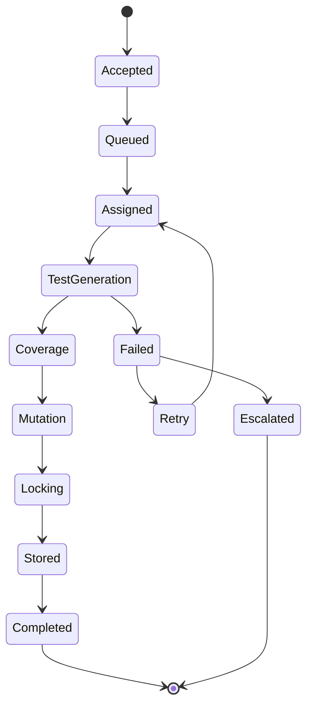
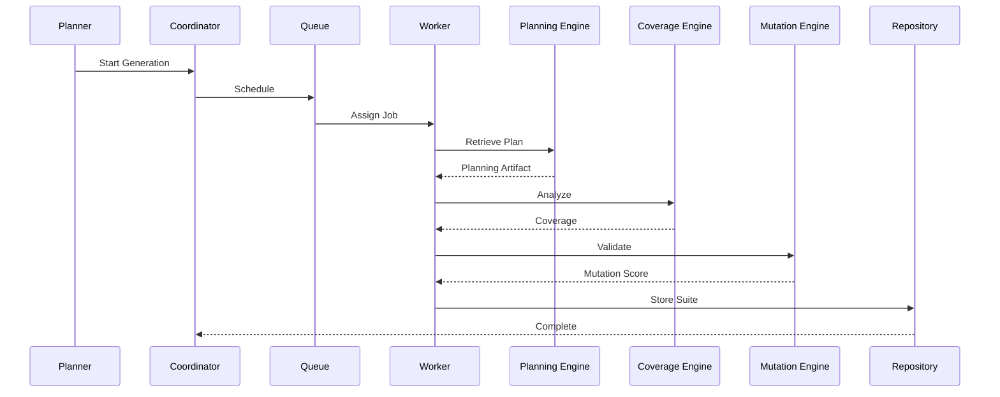

# Enterprise AI Software Factory
# Architecture Design Specification (ADS)

> **Document ID:** ADS-020-v4
>
> **Document Name:** Agentic Test Driven Development Engine — Runtime & Execution Pipeline
>
> **Version:** 2.0.0
>
> **Status:** Draft
>
> **Classification:** Internal Engineering Specification
>
> **Depends On:** ADS-020-v1
>
> **Depends On:** ADS-020-v2
>
> **Depends On:** ADS-020-v3
>
> **Next:** ADS-020-v5 — End-to-End Engineering Walkthrough

---

# Executive Summary

This document defines the production runtime of the Agentic Test Driven Development Engine.

While previous specifications describe architecture, algorithms and communication contracts, this specification focuses on execution.

It defines

- runtime services
- execution workers
- orchestration
- checkpointing
- queue management
- scaling
- caching
- persistence
- runtime lifecycle

The runtime guarantees deterministic and reproducible test generation.

---

# Runtime Philosophy

The runtime follows six principles.

- Stateless workers
- Immutable test artifacts
- Distributed execution
- Checkpoint-based recovery
- Horizontal scalability
- Event-driven orchestration

---

# Runtime Topology



Every execution follows this topology.

---

# Runtime Components

| Component | Responsibility |
|------------|----------------|
| TDD Coordinator | Workflow orchestration |
| Generation Queue | Scheduling |
| Test Workers | Generate tests |
| Coverage Engine | Coverage analysis |
| Mutation Engine | Mutation testing |
| Artifact Repository | Store generated suites |
| Metadata Store | Workflow persistence |
| Observability | Runtime telemetry |

Every component is independently deployable.

---

# Runtime Lifecycle



---

# Coordinator

The coordinator manages workflow execution.

Responsibilities

- assign workers
- monitor progress
- recover failures
- emit events
- manage checkpoints

The coordinator never generates tests.

---

# Generation Workers

Workers execute deterministic test generation.

Each worker

- loads planning artifacts
- generates assigned tests
- validates syntax
- persists checkpoints
- emits telemetry

Workers are stateless.

---

# Worker Topology

```mermaid
flowchart LR

Coordinator

-->

Worker

Worker

-->

Context Engine

Worker

-->

Planning Artifacts

Worker

-->

Coverage Engine

Worker

-->

Checkpoint Store

Worker

-->

Telemetry
```

---

# Queue System

Generation requests enter a distributed queue.

```text
Planner

↓

Generation Queue

↓

Coordinator

↓

Worker Pool

↓

Generated Tests
```

Queue guarantees

- ordering
- retries
- dead-letter handling
- visibility timeout

---

# Queue Priorities

| Priority | Example |
|-----------|----------|
| Critical | Security Patch |
| High | Enterprise Release |
| Medium | Sprint Feature |
| Low | Experimental Branch |

Higher priorities receive worker allocation first.

---

# Checkpoint System

Each major stage creates a checkpoint.

```text
Specification Loaded

↓

Checkpoint

↓

Unit Tests Generated

↓

Checkpoint

↓

Coverage Calculated

↓

Checkpoint

↓

Mutation Complete

↓

Checkpoint

↓

Specification Locked
```

Recovery resumes from the latest successful checkpoint.

---

# Checkpoint Metadata

Each checkpoint stores

- Workflow ID
- Test Suite ID
- Current Stage
- Coverage
- Mutation Score
- Confidence
- Timestamp

Checkpoints are immutable.

---

# Runtime Storage

Artifacts are stored independently.

```text
Planning Artifact

↓

Generated Tests

↓

Coverage Report

↓

Mutation Report

↓

Specification Lock

↓

Audit Metadata
```

Workers never own persistent state.

---

# Cache Strategy

Three cache layers are maintained.

```text
L1

Worker Cache

↓

L2

Project Cache

↓

L3

Organization Cache
```

Cached items

- planning artifacts
- schemas
- mocks
- generated fixtures

---

# Runtime Sequence



---

# Resource Allocation

Workers are allocated using

- queue depth
- estimated complexity
- CPU
- memory
- tenant quota
- workflow priority

Worker allocation is dynamic.

---

# Runtime Principles

The runtime guarantees

- deterministic execution
- stateless workers
- immutable outputs
- replayable workflows
- horizontal scalability
- observable execution

---

# End of Part 1
