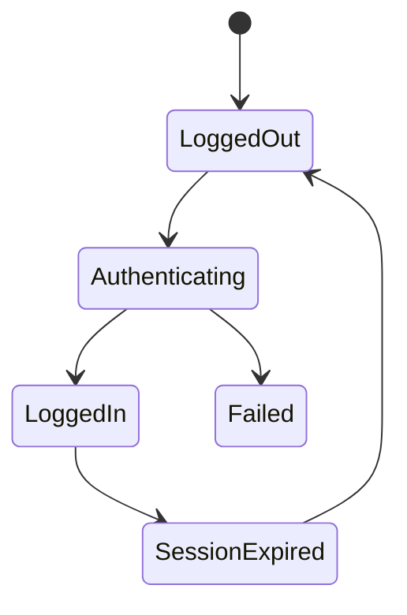

# Enterprise AI Software Factory
# Architecture Design Specification (ADS)

> **Document ID:** ADS-020-v5
>
> **Document Name:** Agentic Test Driven Development Engine — End-to-End Engineering Walkthrough
>
> **Version:** 2.0.0
>
> **Classification:** Reference Implementation
>
> **Depends On:** ADS-020-v1
>
> **Depends On:** ADS-020-v2
>
> **Depends On:** ADS-020-v3
>
> **Depends On:** ADS-020-v4

---

# Executive Summary

This document demonstrates how the Agentic Test Driven Development Engine transforms an approved planning package into an immutable executable software specification.

Unlike previous documents that describe architecture and runtime behavior, this chapter follows a real workflow through every stage of deterministic test generation.

By the end of this walkthrough the Execution Plane possesses a complete specification describing how software must behave before any implementation agent is permitted to write code.

---

# Scenario

The Planning Engine has completed planning.

Planning Package

```
PLAN-001
```

Workflow

```
WF-2026-001
```

Architecture

```
ARCH-001
```

Project

```
Enterprise AI CRM Platform
```

The Planning Engine publishes

```
PlanningCompleted
```

The Control Plane routes the planning artifact to the Agentic TDD Engine.

---

# Stage 1 — Planning Artifact Validation

The TDD Coordinator validates

- Workflow Integrity
- Architecture Version
- Planning Signature
- Requirement Traceability
- Human Approval
- Planning Confidence

Validation Result

```
PASSED
```

Planning Confidence

```
96.3%
```

Generation begins.

---

# Stage 2 — Requirement Extraction

Business requirements

```
Authentication

RBAC

Billing

CRM

Analytics

Notifications

Audit

AI Assistant
```

Functional requirements

```
27
```

Non-functional requirements

```
19
```

Compliance requirements

```
8
```

Total Requirements

```
54
```

Every requirement receives an immutable Requirement ID.

---

# Stage 3 — Behavioral Modeling

Each requirement is converted into software behavior.

Example

```
REQ-014

↓

User Login

↓

Validate Credentials

↓

Generate JWT

↓

Store Session

↓

Audit Login

↓

Return Token
```

Behavior models become the foundation of test generation.

---

# Stage 4 — State Machine Generation

Authentication produces



Every transition becomes one or more test cases.

---

# Stage 5 — Test Categories

The planner determines required suites.

```
Unit Tests

Integration Tests

Contract Tests

Database Tests

Security Tests

Performance Tests

Load Tests

Vision Tests

Regression Tests

Acceptance Tests
```

Each suite receives an independent generation workflow.

---

# Stage 6 — Parallel Generation

```mermaid
flowchart TB

Planning Artifact

-->

Unit Workers

Planning Artifact

-->

Integration Workers

Planning Artifact

-->

Contract Workers

Planning Artifact

-->

Security Workers

Planning Artifact

-->

Vision Workers

Planning Artifact

-->

Performance Workers
```

Worker Pool

```
18 Workers
```

Generation occurs simultaneously.

---

# Stage 7 — Unit Test Generation

Authentication module

Generated

```
42 Unit Tests
```

Coverage

```
97%
```

Edge Cases

```
16
```

Mock Objects

```
8
```

Generation completed.

---

# Stage 8 — Integration Tests

Generated

```
26 Tests
```

Validated

```
Authentication

↓

Database

↓

Redis

↓

Audit

↓

Notifications
```

Cross-service interactions verified.

---

# Stage 9 — Contract Tests

REST APIs

```
18
```

GraphQL APIs

```
2
```

Webhooks

```
5
```

Every endpoint receives

- Request validation
- Response validation
- Error validation
- Schema validation

---

# Stage 10 — Security Tests

Generated

```
31 Tests
```

Includes

- SQL Injection
- XSS
- CSRF
- Authentication
- Authorization
- JWT Validation
- Tenant Isolation
- Secret Leakage

Security Coverage

```
100%
```

---

# Stage 11 — Performance Tests

Generated

```
12
```

Scenarios

- Login
- Search
- Dashboard
- Billing
- AI Chat

Latency Targets

```
<250ms

API Average
```

---

# Stage 12 — Vision Tests

Generated

```
24
```

Playwright captures

↓

Gemini Vision validates

↓

Expected UI compared

↓

Pixel Difference Report

↓

Accessibility Validation

Vision specification complete.

---

# End of Part 1
