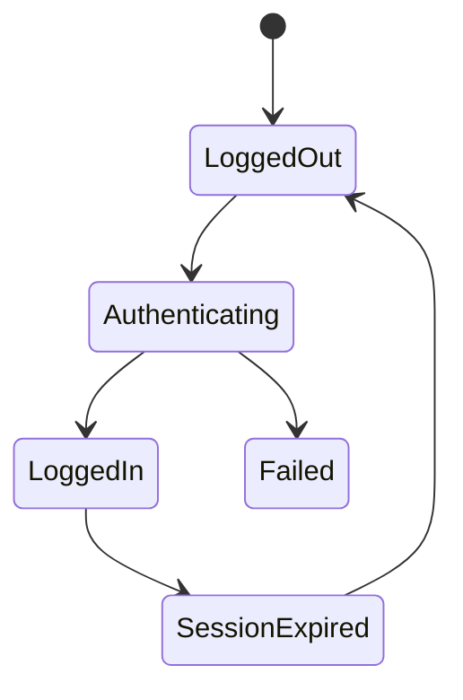
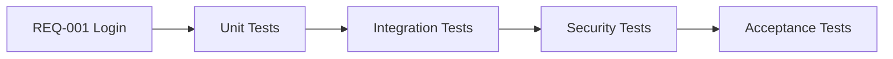

# Enterprise AI Software Factory
# Architecture Design Specification (ADS)

> **Document ID:** ADS-020-v5
>
> **Document Name:** Agentic Test Driven Development Engine — End-to-End Engineering Walkthrough
>
> **Version:** 2.0.0
>
> **Classification:** Reference Implementation
>
> **Depends On:** ADS-020-v1
>
> **Depends On:** ADS-020-v2
>
> **Depends On:** ADS-020-v3
>
> **Depends On:** ADS-020-v4

---

# Executive Summary

This document demonstrates how the Agentic Test Driven Development Engine transforms an approved planning package into an immutable executable software specification.

Unlike previous documents that describe architecture and runtime behavior, this chapter follows a real workflow through every stage of deterministic test generation.

By the end of this walkthrough the Execution Plane possesses a complete specification describing how software must behave before any implementation agent is permitted to write code.

---

# Scenario

The Planning Engine has completed planning.

Planning Package

```
PLAN-001
```

Workflow

```
WF-2026-001
```

Architecture

```
ARCH-001
```

Project

```
Enterprise AI CRM Platform
```

The Planning Engine publishes

```
PlanningCompleted
```

The Control Plane routes the planning artifact to the Agentic TDD Engine.

---

# Stage 1 — Planning Artifact Validation

The TDD Coordinator validates

- Workflow Integrity
- Architecture Version
- Planning Signature
- Requirement Traceability
- Human Approval
- Planning Confidence

Validation Result

```
PASSED
```

Planning Confidence

```
96.3%
```

Generation begins.

---

# Stage 2 — Requirement Extraction

Business requirements

```
Authentication

RBAC

Billing

CRM

Analytics

Notifications

Audit

AI Assistant
```

Functional requirements

```
27
```

Non-functional requirements

```
19
```

Compliance requirements

```
8
```

Total Requirements

```
54
```

Every requirement receives an immutable Requirement ID.

---

# Stage 3 — Behavioral Modeling

Each requirement is converted into software behavior.

Example

```
REQ-014

↓

User Login

↓

Validate Credentials

↓

Generate JWT

↓

Store Session

↓

Audit Login

↓

Return Token
```

Behavior models become the foundation of test generation.

---

# Stage 4 — State Machine Generation

Authentication produces



Every transition becomes one or more test cases.

---

# Stage 5 — Test Categories

The planner determines required suites.

```
Unit Tests

Integration Tests

Contract Tests

Database Tests

Security Tests

Performance Tests

Load Tests

Vision Tests

Regression Tests

Acceptance Tests
```

Each suite receives an independent generation workflow.

---

# Stage 6 — Parallel Generation

```mermaid
flowchart TB

Planning Artifact

-->

Unit Workers

Planning Artifact

-->

Integration Workers

Planning Artifact

-->

Contract Workers

Planning Artifact

-->

Security Workers

Planning Artifact

-->

Vision Workers

Planning Artifact

-->

Performance Workers
```

Worker Pool

```
18 Workers
```

Generation occurs simultaneously.

---

# Stage 7 — Unit Test Generation

Authentication module

Generated

```
42 Unit Tests
```

Coverage

```
97%
```

Edge Cases

```
16
```

Mock Objects

```
8
```

Generation completed.

---

# Stage 8 — Integration Tests

Generated

```
26 Tests
```

Validated

```
Authentication

↓

Database

↓

Redis

↓

Audit

↓

Notifications
```

Cross-service interactions verified.

---

# Stage 9 — Contract Tests

REST APIs

```
18
```

GraphQL APIs

```
2
```

Webhooks

```
5
```

Every endpoint receives

- Request validation
- Response validation
- Error validation
- Schema validation

---

# Stage 10 — Security Tests

Generated

```
31 Tests
```

Includes

- SQL Injection
- XSS
- CSRF
- Authentication
- Authorization
- JWT Validation
- Tenant Isolation
- Secret Leakage

Security Coverage

```
100%
```

---

# Stage 11 — Performance Tests

Generated

```
12
```

Scenarios

- Login
- Search
- Dashboard
- Billing
- AI Chat

Latency Targets

```
<250ms

API Average
```

---

# Stage 12 — Vision Tests

Generated

```
24
```

Playwright captures

↓

Gemini Vision validates

↓

Expected UI compared

↓

Pixel Difference Report

↓

Accessibility Validation

Vision specification complete.

---

# Stage 13 — Coverage Analysis

After all test categories have been generated, the Coverage Engine aggregates the results into a single coverage report.

## Coverage Summary

| Category | Coverage |
|-----------|---------:|
| Statement Coverage | 98.4% |
| Branch Coverage | 95.7% |
| Path Coverage | 92.6% |
| Requirement Coverage | 100% |
| Mutation Coverage | 89.3% |

Overall Coverage

```
96.8%
```

Coverage exceeds organizational policy.

---

# Stage 14 — Mutation Analysis

The Mutation Engine evaluates test quality by intentionally introducing defects.

Injected mutations

```
Equality Operators

Logical Operators

Return Values

Null Handling

Boundary Conditions

Loop Conditions
```

Results

| Metric | Value |
|----------|------:|
| Mutations Generated | 274 |
| Mutations Detected | 244 |
| Mutation Score | 89.05% |

Mutation threshold satisfied.

---

# Stage 15 — Requirement Traceability

Every generated test maps directly back to a business requirement.



Traceability Matrix

| Requirement | Tests |
|--------------|------:|
| REQ-001 | 22 |
| REQ-002 | 14 |
| REQ-003 | 18 |
| REQ-004 | 31 |
| REQ-005 | 16 |

Every requirement has measurable verification.

---

# Stage 16 — Test Confidence

The TDD Engine calculates confidence.

Inputs

- Requirement Coverage
- Mutation Score
- Historical Success
- Edge Case Coverage
- Security Coverage

Formula

```text
Confidence

=

Requirement Coverage × 0.30

+

Mutation Score × 0.25

+

Edge Cases × 0.20

+

Historical Accuracy × 0.15

+

Security Coverage × 0.10
```

Result

```
95.8%
```

Confidence exceeds deployment threshold.

---

# Stage 17 — QA Consensus

The generated specification is independently reviewed.

Participants

```text
QA Agent

↓

Security Agent

↓

Architecture Agent

↓

Performance Agent

↓

Consensus Engine
```

Results

| Reviewer | Decision |
|-----------|----------|
| QA | Approved |
| Security | Approved |
| Architecture | Approved |
| Performance | Approved |

Consensus

```
100%
```

No conflicting opinions detected.

---

# Stage 18 — Specification Lock

The specification is frozen.

Immutable artifacts

- Unit Tests
- Integration Tests
- API Contracts
- Performance Thresholds
- Security Assertions
- Acceptance Tests

The Execution Plane receives a read-only copy.

Any future modifications require

- Human Approval
- Version Increment
- Audit Record

---

# Stage 19 — Generated Artifacts

The TDD Engine publishes

```text
TS-001

↓

Coverage Report

↓

Mutation Report

↓

Requirement Matrix

↓

Performance Baseline

↓

Security Test Suite

↓

Acceptance Suite

↓

Specification Lock
```

Artifact Manifest

| Artifact | Identifier |
|-----------|------------|
| Test Suite | TS-001 |
| Coverage Report | COV-001 |
| Mutation Report | MUT-001 |
| Traceability Matrix | TRC-001 |
| Performance Baseline | PERF-001 |
| Security Suite | SEC-001 |
| Locked Specification | SPEC-001 |

---

# Stage 20 — Handoff to Execution Plane

The TDD Engine publishes

```
SpecificationLocked
```

The Control Plane receives

- Locked Specification
- Test Repository
- Coverage Report
- Mutation Report
- Requirement Matrix
- Confidence Score
- QA Consensus

The Execution Plane is now authorized to begin implementation.

The TDD Engine has completed its responsibilities.

---

# Operational Readiness Scorecard

| Category | Result |
|----------|--------|
| Requirement Coverage | ✅ 100% |
| Test Generation | ✅ Complete |
| Mutation Score | ✅ 89.05% |
| Coverage Threshold | ✅ Passed |
| QA Consensus | ✅ Approved |
| Security Validation | ✅ Passed |
| Specification Lock | ✅ Active |
| Audit Trail | ✅ Recorded |
| Traceability | ✅ Complete |
| Ready for Execution | ✅ Yes |

---

# Lessons Learned

The Agentic TDD Engine demonstrates several key principles.

- Correctness is defined before implementation.
- Every requirement has measurable verification.
- Independent test generation eliminates implementation bias.
- Mutation analysis evaluates test quality rather than code quality.
- Immutable specifications prevent accidental or intentional weakening of acceptance criteria.
- Full traceability connects business intent to executable verification.
- Consensus validation increases confidence before coding begins.

---

# Architecture Decision Record

## ADR-020-11

### Decision

Require complete requirement-to-test traceability.

### Status

Accepted

### Reason

Enterprise systems must prove that every approved business requirement has corresponding automated verification.

---

## ADR-020-12

### Decision

Transfer only immutable specifications to the Execution Plane.

### Status

Accepted

### Reason

The Execution Plane must implement requirements—not redefine them.

---

# Deliverables

The Agentic TDD Engine produces the following immutable package.

```yaml
Workflow:
    WF-2026-001

Planning:
    PLAN-001

Architecture:
    ARCH-001

Specification:
    SPEC-001

TestSuite:
    TS-001

Coverage:
    96.8%

Mutation:
    89.05%

Confidence:
    95.8%

Consensus:
    Approved

Execution:
    Authorized
```

This package becomes the authoritative implementation contract for every downstream coding agent.

---

# Related Documents

ADS-019-v5 — Autonomous Planning Engine Walkthrough

ADS-020-v1 — Architecture

ADS-020-v2 — Algorithms & Test Generation

ADS-020-v3 — APIs, Events & Contracts

ADS-020-v4 — Runtime & Execution Pipeline

ADS-021-v1 — Workflow State Machine

---

# End of Document
