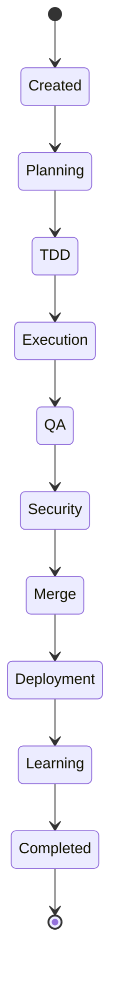

# Enterprise AI Software Factory
# Architecture Design Specification (ADS)

> **Document ID:** ADS-021-v1
>
> **Document Name:** Workflow State Machine — Architecture
>
> **Version:** 2.0.0
>
> **Status:** Draft
>
> **Classification:** Core Runtime Specification
>
> **Importance:** CRITICAL
>
> **Depends On:** ADS-000 → ADS-020
>
> **Next:** ADS-021-v2 — State Transition Algorithms

---

# Executive Summary

The Workflow State Machine (WSM) is the central orchestration kernel of the Enterprise AI Software Factory.

Every engineering workflow—regardless of project size or complexity—passes through the Workflow State Machine.

Rather than allowing independent AI systems to communicate arbitrarily, the Workflow State Machine establishes deterministic execution states, transition rules, recovery mechanisms, and lifecycle governance.

The Workflow State Machine is the authoritative source of execution truth.

No subsystem may execute outside of it.

---

# Purpose

Coordinate every subsystem of the Enterprise AI Software Factory through deterministic workflow execution.

The Workflow State Machine guarantees

- predictable execution
- replayable workflows
- recoverable failures
- observable state transitions
- enterprise governance

---

# Why This System Exists

Traditional AI agents operate independently.

```text
Prompt

↓

Agent

↓

Another Agent

↓

Another Agent
```

Nobody knows

- current progress
- failure location
- execution ownership
- rollback point

The Enterprise AI Software Factory instead executes

```text
Workflow

↓

State Machine

↓

Controlled Transition

↓

Next State
```

Everything becomes observable.

---

# Core Philosophy

The Workflow State Machine owns

Execution.

Nothing else.

Planning owns

Planning.

TDD owns

Testing.

Execution owns

Coding.

Deployment owns

Deployment.

The Workflow State Machine only decides

"When may the next system execute?"

---

# Architectural Position

```mermaid
flowchart TB

User

↓

Planning

↓

TDD

↓

Workflow State Machine

↓

Execution

↓

QA

↓

Security

↓

Merge

↓

Deployment

↓

Learning
```

Every subsystem communicates through the Workflow State Machine.

No subsystem directly invokes another subsystem.

---

# Responsibilities

The Workflow State Machine

MUST

- Track workflow lifecycle
- Validate state transitions
- Schedule subsystem execution
- Handle failures
- Trigger retries
- Create checkpoints
- Emit workflow events
- Maintain execution history

The Workflow State Machine

MUST NOT

- Write code
- Generate tests
- Perform planning
- Deploy applications

---

# High-Level Architecture

```mermaid
flowchart TB

Gateway

-->

Workflow Manager

Workflow Manager

-->

State Registry

Workflow Manager

-->

Scheduler

Workflow Manager

-->

Transition Validator

Workflow Manager

-->

Checkpoint Manager

Workflow Manager

-->

Recovery Manager

Workflow Manager

-->

Event Bus

Workflow Manager

-->

Audit Store
```

---

# Internal Systems

| System | Responsibility |
|---------|----------------|
| Workflow Manager | Controls execution |
| State Registry | Stores workflow state |
| Scheduler | Determines next subsystem |
| Transition Validator | Validates state changes |
| Checkpoint Manager | Creates recovery points |
| Recovery Manager | Handles failures |
| Event Publisher | Emits workflow events |
| Audit Store | Stores workflow history |

---

# Workflow Lifecycle



Every workflow follows this lifecycle.

No states may be skipped.

---

# Workflow Context

Every workflow contains

Workflow ID

Tenant

Project

Planning Version

Specification Version

Current State

Previous State

Current Owner

Checkpoint

Priority

Risk

Confidence

Created Timestamp

Updated Timestamp

---

# Connected Systems

## Planning Engine

Produces execution plans.

---

## Agentic TDD Engine

Produces immutable specifications.

---

## Execution Plane

Produces software artifacts.

---

## QA Engine

Validates implementation.

---

## Security Plane

Performs security verification.

---

## Merge Engine

Creates production candidate.

---

## Deployment Engine

Deploys verified software.

---

## Learning Engine

Captures organizational knowledge.

---

# Engineering Principles

The Workflow State Machine follows

- Deterministic transitions
- Immutable state history
- Single workflow owner
- Event-driven execution
- Complete observability
- Automatic recovery
- Human governance

---

# Architecture Decision Records

## ADR-021-01

Decision

Every subsystem executes only through the Workflow State Machine.

Status

Accepted

Reason

Central orchestration simplifies auditing, replay, scaling and recovery.

---

## ADR-021-02

Decision

Represent workflow execution as explicit states.

Status

Accepted

Reason

Explicit states eliminate ambiguity during long-running engineering workflows.

---

# Operational Readiness Scorecard

| Capability | Target |
|------------|---------|
| Deterministic Execution | Required |
| Replay Support | Required |
| Workflow Recovery | Required |
| Checkpointing | Required |
| Horizontal Scaling | Required |
| Multi-Tenant Support | Required |
| Auditability | Required |
| Event-Driven Execution | Required |

---

# Version Roadmap

| Version | Description |
|----------|-------------|
| v1 | Architecture |
| v2 | State Transition Algorithms |
| v3 | APIs, Events & Contracts |
| v4 | Runtime & Orchestration |
| v5 | End-to-End Workflow Simulation |

---

# Related Documents

ADS-019-v5

ADS-020-v5

ADS-022

ADS-029

ADS-031

ADS-043

---

# Next Document

ADS-021-v2

**Workflow State Transition Algorithms**

This document specifies the mathematical models, transition validation algorithms, workflow scheduling logic, retry strategies, checkpoint algorithms, rollback mechanisms, concurrency handling, timeout policies, and execution optimization techniques that govern workflow progression.

---

# End of Document
