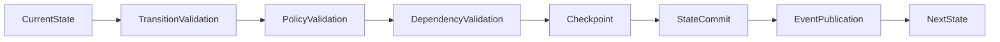
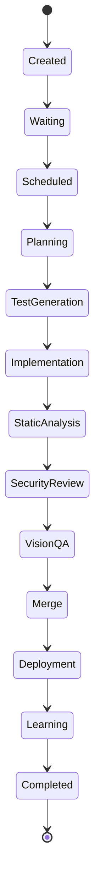
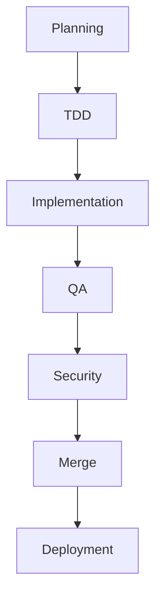
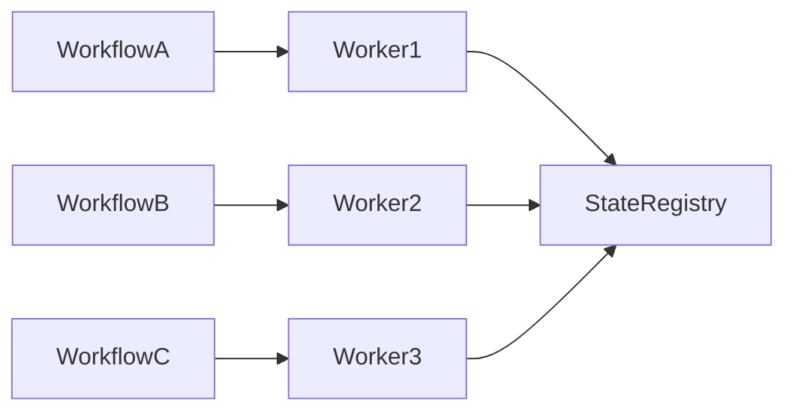

# Enterprise AI Software Factory
# Architecture Design Specification (ADS)

> **Document ID:** ADS-021-v2
>
> **Document Name:** Workflow State Machine — State Transition Algorithms
>
> **Version:** 2.0.0
>
> **Status:** Draft
>
> **Classification:** Internal Engineering Specification
>
> **Importance:** CRITICAL
>
> **Depends On:** ADS-021-v1
>
> **Next:** ADS-021-v3 — APIs, Events & Contracts

---

# Executive Summary

This document specifies the deterministic algorithms governing workflow execution inside the Enterprise AI Software Factory.

The Workflow State Machine is not simply a list of workflow states.

It is a distributed execution engine responsible for ensuring that every engineering workflow progresses safely, deterministically and recoverably.

Every transition must be mathematically valid.

---

# Design Philosophy

The Workflow State Machine follows five core principles.

- Every workflow has exactly one active state.
- Every transition is deterministic.
- Every state is replayable.
- Every transition is validated.
- Every transition is observable.

---

# State Transition Pipeline



A transition is committed only if every stage succeeds.

---

# State Categories

Workflow states belong to four categories.

| Category | Purpose |
|-----------|----------|
| Control | Workflow lifecycle |
| Execution | Engineering activities |
| Recovery | Retry and rollback |
| Terminal | Completed or cancelled |

---

# Control States

```
Created

Waiting

Queued

Scheduled

Running

Paused

Blocked
```

---

# Execution States

```
Planning

TestGeneration

Implementation

StaticAnalysis

SecurityReview

VisionQA

Merge

Deployment

Learning
```

---

# Recovery States

```
Retry

Rollback

Escalation

ManualReview
```

---

# Terminal States

```
Completed

Cancelled

Expired

Failed
```

---

# Workflow Transition Graph



---

# ALG-021-001

## State Validation

Before every transition

The engine validates

- Current State
- Requested State
- Workflow Version
- Policy Rules
- Dependency Graph
- Timeout Rules

Only valid transitions proceed.

---

# Transition Matrix

| Current | Allowed Next |
|----------|--------------|
| Created | Waiting |
| Waiting | Scheduled |
| Scheduled | Planning |
| Planning | TestGeneration |
| TestGeneration | Implementation |
| Implementation | StaticAnalysis |
| StaticAnalysis | SecurityReview |
| SecurityReview | VisionQA |
| VisionQA | Merge |
| Merge | Deployment |
| Deployment | Learning |
| Learning | Completed |

Transitions outside this table are rejected.

---

# ALG-021-002

## Dependency Validation

Each state declares prerequisites.

Example

```
Implementation

Requires

Planning Complete

TDD Locked

Human Approval
```

If any prerequisite fails

↓

Transition denied.

---

# Dependency Graph



The graph is acyclic.

---

# ALG-021-003

## Checkpoint Algorithm

A checkpoint is created

- before transition
- after transition

Checkpoint

contains

- Workflow State
- Context Version
- Active Tasks
- Pending Tasks
- Owner
- Timestamp

Recovery always resumes from checkpoints.

---

# ALG-021-004

## Timeout Detection

Every workflow state has

Maximum Execution Time.

Example

| State | Timeout |
|--------|---------|
| Planning | 15 min |
| Test Generation | 20 min |
| Implementation | 2 hrs |
| Security Review | 30 min |
| Deployment | 15 min |

Timeouts automatically trigger recovery.

---

# ALG-021-005

## Retry Algorithm

Retries are classified.

```
Transient

↓

Retry

Permanent

↓

Escalate

Policy

↓

Reject

Security

↓

Human Review
```

Retries are bounded.

No infinite loops exist.

---

# Retry Schedule

```
Attempt 1

↓

1 sec

↓

Attempt 2

↓

2 sec

↓

Attempt 3

↓

4 sec

↓

Attempt 4

↓

8 sec

↓

Escalation
```

---

# State Invariants

Every workflow MUST satisfy

- One active state
- One owner
- Immutable history
- Valid checkpoint
- Unique workflow identifier
- Observable execution

Violation of any invariant immediately pauses the workflow.

---

# ALG-021-006

## Rollback Algorithm

Not every failure requires restarting the workflow.

The Workflow State Machine supports deterministic rollback to the nearest valid checkpoint.

Rollback Strategy

```text
Failure

↓

Locate Latest Checkpoint

↓

Restore Context

↓

Restore Workflow State

↓

Restore Active Tasks

↓

Resume Execution
```

Rollback is only permitted if

- checkpoint integrity is verified
- workflow history is complete
- execution artifacts remain immutable

Otherwise

↓

Human Escalation.

---

# Rollback Rules

Rollback MUST NOT

- modify immutable artifacts
- rewrite workflow history
- skip completed validation stages

Rollback MAY

- restore execution context
- restore scheduling state
- restore retry counters
- restore workflow ownership

---

# ALG-021-007

## Workflow Scheduling

The Scheduler determines which subsystem executes next.

Scheduling inputs

- Workflow Priority
- Current State
- Dependency Status
- Resource Availability
- Estimated Runtime
- Tenant Quotas
- Organizational Policies

Scheduling outputs

- Assigned Worker
- Scheduled Time
- Target Queue
- Expected Completion

---

# Scheduling Strategy

```text
Workflow Ready

↓

Dependency Check

↓

Priority Queue

↓

Worker Assignment

↓

Execution

↓

Completion
```

Scheduling never bypasses dependency validation.

---

# Scheduling Priorities

| Priority | Description |
|-----------|-------------|
| P0 | Critical Production Incident |
| P1 | Production Release |
| P2 | Enterprise Feature |
| P3 | Sprint Development |
| P4 | Experimental Workflow |

Higher priorities may preempt waiting lower-priority workflows but never interrupt an active critical section.

---

# ALG-021-008

## Concurrency Control

Multiple workflows may execute simultaneously.

Each workflow owns

- independent context
- independent state
- independent checkpoints
- independent event streams

No shared mutable workflow state exists.

---

# Concurrency Model



Concurrency is coordinated by the Workflow Manager.

---

# Deadlock Prevention

The Workflow State Machine prevents deadlocks through

- Dependency Ordering
- Resource Timeouts
- Lease Expiration
- Circular Dependency Detection

Example

```text
Workflow A

↓

Waiting

↓

Timeout

↓

Lease Released

↓

Workflow B Continues
```

Deadlocks are treated as critical runtime events.

---

# ALG-021-009

## Workflow Leasing

Workers never own workflows permanently.

A workflow lease contains

- Worker ID
- Lease Start
- Lease Expiration
- Renewal Counter
- Heartbeat Timestamp

If the lease expires

↓

Workflow ownership returns to the Scheduler.

---

# Lease Lifecycle

```text
Assign Workflow

↓

Acquire Lease

↓

Heartbeat

↓

Renew Lease

↓

Complete

↓

Release Lease
```

Lost workers automatically lose workflow ownership.

---

# ALG-021-010

## Workflow Completion

Completion requires every mandatory subsystem to report success.

Required stages

- Planning
- TDD
- Implementation
- QA
- Security
- Merge
- Deployment
- Learning

Completion Criteria

```text
Every Required State

↓

Validated

↓

Artifacts Persisted

↓

Audit Recorded

↓

Workflow Closed
```

---

# State Consistency Rules

A workflow is considered valid only if

✔ Current State exists

✔ Previous State exists

✔ Transition history is complete

✔ Active owner exists

✔ Checkpoint exists

✔ Audit trail exists

Failure of any rule pauses execution.

---

# Time Complexity

| Operation | Complexity |
|------------|------------|
| State Validation | O(1) |
| Transition Lookup | O(1) |
| DAG Dependency Check | O(V + E) |
| Scheduler Selection | O(log n) |
| Checkpoint Lookup | O(log n) |
| Rollback | O(k) |

Where

- **V** = workflow states
- **E** = dependency edges
- **k** = number of checkpoints restored

---

# Runtime Metrics

```text
workflow_active_total

workflow_completed_total

workflow_failed_total

workflow_retry_total

workflow_checkpoint_total

workflow_rollbacks_total

workflow_transition_duration_seconds

workflow_queue_depth

workflow_scheduler_latency

workflow_deadlock_detected_total
```

---

# Workflow Events

The Workflow State Machine publishes

```text
WorkflowCreated

WorkflowScheduled

WorkflowStarted

WorkflowPaused

WorkflowResumed

WorkflowCheckpointCreated

WorkflowRetry

WorkflowRollback

WorkflowCompleted

WorkflowCancelled

WorkflowFailed

WorkflowEscalated
```

Every event is immutable.

---

# Architecture Decision Records

## ADR-021-03

### Decision

Represent every workflow as a deterministic finite state machine.

### Status

Accepted

### Reason

Finite State Machines provide predictable execution, simplify debugging, and support replayable workflows.

---

## ADR-021-04

### Decision

Assign temporary workflow leases instead of permanent ownership.

### Status

Accepted

### Reason

Leases prevent orphaned workflows and enable automatic recovery when workers fail.

---

## ADR-021-05

### Decision

Require checkpoint creation before and after major transitions.

### Status

Accepted

### Reason

Dual checkpoints minimize recovery time and preserve deterministic execution.

---

# Operational Readiness Scorecard

| Capability | Status |
|------------|--------|
| Deterministic Scheduling | ✅ Required |
| Concurrency Control | ✅ Required |
| Rollback Support | ✅ Required |
| Deadlock Prevention | ✅ Required |
| Checkpoint Recovery | ✅ Required |
| Multi-Tenant Safe | ✅ Required |
| Replay Support | ✅ Required |
| Full Audit Trail | ✅ Required |

---

# Related Documents

ADS-019-v5 — Autonomous Planning Walkthrough

ADS-020-v5 — Agentic TDD Walkthrough

ADS-021-v1 — Workflow State Machine Architecture

ADS-021-v3 — APIs, Events & Contracts

ADS-029 — Sandbox Architecture

ADS-039 — Failure Recovery System

---

# End of Document
