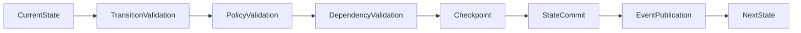
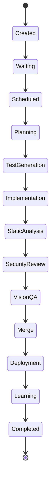
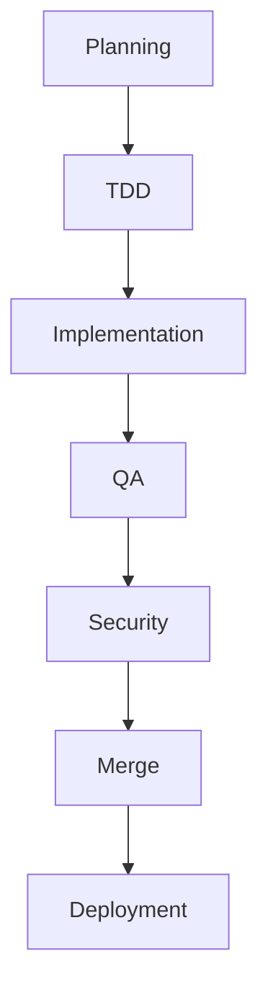

# Enterprise AI Software Factory
# Architecture Design Specification (ADS)

> **Document ID:** ADS-021-v2
>
> **Document Name:** Workflow State Machine — State Transition Algorithms
>
> **Version:** 2.0.0
>
> **Status:** Draft
>
> **Classification:** Internal Engineering Specification
>
> **Importance:** CRITICAL
>
> **Depends On:** ADS-021-v1
>
> **Next:** ADS-021-v3 — APIs, Events & Contracts

---

# Executive Summary

This document specifies the deterministic algorithms governing workflow execution inside the Enterprise AI Software Factory.

The Workflow State Machine is not simply a list of workflow states.

It is a distributed execution engine responsible for ensuring that every engineering workflow progresses safely, deterministically and recoverably.

Every transition must be mathematically valid.

---

# Design Philosophy

The Workflow State Machine follows five core principles.

- Every workflow has exactly one active state.
- Every transition is deterministic.
- Every state is replayable.
- Every transition is validated.
- Every transition is observable.

---

# State Transition Pipeline



A transition is committed only if every stage succeeds.

---

# State Categories

Workflow states belong to four categories.

| Category | Purpose |
|-----------|----------|
| Control | Workflow lifecycle |
| Execution | Engineering activities |
| Recovery | Retry and rollback |
| Terminal | Completed or cancelled |

---

# Control States

```
Created

Waiting

Queued

Scheduled

Running

Paused

Blocked
```

---

# Execution States

```
Planning

TestGeneration

Implementation

StaticAnalysis

SecurityReview

VisionQA

Merge

Deployment

Learning
```

---

# Recovery States

```
Retry

Rollback

Escalation

ManualReview
```

---

# Terminal States

```
Completed

Cancelled

Expired

Failed
```

---

# Workflow Transition Graph



---

# ALG-021-001

## State Validation

Before every transition

The engine validates

- Current State
- Requested State
- Workflow Version
- Policy Rules
- Dependency Graph
- Timeout Rules

Only valid transitions proceed.

---

# Transition Matrix

| Current | Allowed Next |
|----------|--------------|
| Created | Waiting |
| Waiting | Scheduled |
| Scheduled | Planning |
| Planning | TestGeneration |
| TestGeneration | Implementation |
| Implementation | StaticAnalysis |
| StaticAnalysis | SecurityReview |
| SecurityReview | VisionQA |
| VisionQA | Merge |
| Merge | Deployment |
| Deployment | Learning |
| Learning | Completed |

Transitions outside this table are rejected.

---

# ALG-021-002

## Dependency Validation

Each state declares prerequisites.

Example

```
Implementation

Requires

Planning Complete

TDD Locked

Human Approval
```

If any prerequisite fails

↓

Transition denied.

---

# Dependency Graph



The graph is acyclic.

---

# ALG-021-003

## Checkpoint Algorithm

A checkpoint is created

- before transition
- after transition

Checkpoint

contains

- Workflow State
- Context Version
- Active Tasks
- Pending Tasks
- Owner
- Timestamp

Recovery always resumes from checkpoints.

---

# ALG-021-004

## Timeout Detection

Every workflow state has

Maximum Execution Time.

Example

| State | Timeout |
|--------|---------|
| Planning | 15 min |
| Test Generation | 20 min |
| Implementation | 2 hrs |
| Security Review | 30 min |
| Deployment | 15 min |

Timeouts automatically trigger recovery.

---

# ALG-021-005

## Retry Algorithm

Retries are classified.

```
Transient

↓

Retry

Permanent

↓

Escalate

Policy

↓

Reject

Security

↓

Human Review
```

Retries are bounded.

No infinite loops exist.

---

# Retry Schedule

```
Attempt 1

↓

1 sec

↓

Attempt 2

↓

2 sec

↓

Attempt 3

↓

4 sec

↓

Attempt 4

↓

8 sec

↓

Escalation
```

---

# State Invariants

Every workflow MUST satisfy

- One active state
- One owner
- Immutable history
- Valid checkpoint
- Unique workflow identifier
- Observable execution

Violation of any invariant immediately pauses the workflow.

---

# End of Part 1
