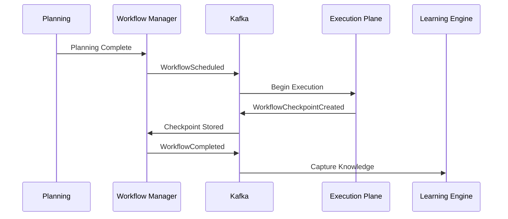

# Enterprise AI Software Factory
# Architecture Design Specification (ADS)

> **Document ID:** ADS-021-v3
>
> **Document Name:** Workflow State Machine — APIs, Events & Contracts
>
> **Version:** 2.0.0
>
> **Status:** Draft
>
> **Classification:** Core Runtime Specification
>
> **Importance:** CRITICAL
>
> **Depends On:** ADS-021-v1
>
> **Depends On:** ADS-021-v2
>
> **Next:** ADS-021-v4 — Runtime & Orchestration

---

# Executive Summary

The Workflow State Machine communicates with every subsystem of the Enterprise AI Software Factory.

This document defines every public interface, internal contract, event, schema, state transition message, workflow API, and communication protocol.

These contracts are immutable.

Implementations may change.

Contracts must remain stable.

---

# Communication Philosophy

Every subsystem communicates through contracts.

Never through implementation.

```
Planning

↓

Workflow Contract

↓

Workflow State Machine

↓

Workflow Contract

↓

Execution
```

Subsystems remain loosely coupled.

---

# System Interaction Map

```mermaid
flowchart LR

Gateway

-->

Workflow API

Workflow API

-->

Workflow Manager

Workflow Manager

-->

Planning

Workflow Manager

-->

TDD

Workflow Manager

-->

Execution

Workflow Manager

-->

QA

Workflow Manager

-->

Security

Workflow Manager

-->

Deployment

Workflow Manager

-->

Learning

Workflow Manager

-->

Observability
```

The Workflow Manager becomes the single orchestration authority.

---

# Communication Principles

Every communication MUST satisfy

- Versioned
- Authenticated
- Authorized
- Typed
- Auditable
- Observable
- Replayable
- Idempotent

---

# Public REST API

The Workflow State Machine exposes REST endpoints for

- Dashboard
- CLI
- Enterprise Integrations
- Automation Systems

---

## API-021-001

### Create Workflow

```http
POST /workflow/v1/workflows
```

Purpose

Creates a new engineering workflow.

---

Request

```json
{
  "projectId":"PROJ-001",
  "tenantId":"TENANT-001",
  "priority":"P2",
  "planningId":"PLAN-001"
}
```

---

Response

```json
{
  "workflowId":"WF-2026-001",
  "status":"Created",
  "currentState":"Created"
}
```

---

## API-021-002

### Get Workflow

```http
GET /workflow/v1/workflows/{workflowId}
```

Returns

- Current State
- Previous State
- Progress
- Active Owner
- Current Checkpoint
- Retry Count
- Audit Summary

---

## API-021-003

### Pause Workflow

```http
POST /workflow/v1/workflows/{workflowId}/pause
```

Transitions

```
Running

↓

Paused
```

---

## API-021-004

### Resume Workflow

```http
POST /workflow/v1/workflows/{workflowId}/resume
```

Requires

- Valid Checkpoint
- Active Lease
- Authorization

---

## API-021-005

### Cancel Workflow

```http
DELETE /workflow/v1/workflows/{workflowId}
```

Creates

```
WorkflowCancelled
```

event.

---

# Internal gRPC Services

Subsystem communication uses gRPC.

```protobuf
service WorkflowService{

rpc TransitionState(StateRequest)

returns(StateResponse);

rpc CreateCheckpoint(CheckpointRequest)

returns(CheckpointResponse);

rpc Rollback(RollbackRequest)

returns(RollbackResponse);

rpc AcquireLease(LeaseRequest)

returns(LeaseResponse);

}
```

---

# State Schema

```protobuf
message WorkflowState{

string workflow_id=1;

string current_state=2;

string previous_state=3;

string owner=4;

string checkpoint=5;

int32 retry_count=6;

}
```

---

# Workflow Events

Every transition produces an immutable event.

---

## EVT-021-001

WorkflowCreated

---

## EVT-021-002

WorkflowScheduled

---

## EVT-021-003

WorkflowStarted

---

## EVT-021-004

WorkflowCheckpointCreated

---

## EVT-021-005

WorkflowPaused

---

## EVT-021-006

WorkflowResumed

---

## EVT-021-007

WorkflowRetry

---

## EVT-021-008

WorkflowRollback

---

## EVT-021-009

WorkflowCompleted

---

## EVT-021-010

WorkflowFailed

---

## Event Flow



---

# Event Ordering

```
Created

↓

Scheduled

↓

Started

↓

Checkpoint

↓

Completed
```

Events are strictly ordered.

Out-of-order events are rejected.

---

# Event Metadata

Every event contains

```yaml
eventId:
eventType:
workflowId:
tenantId:
timestamp:
schemaVersion:
workflowVersion:
traceId:
correlationId:
causationId:
producer:
signature:
```

Every event is immutable.

---

# MCP Tool Contracts

The Workflow State Machine exposes standardized tools.

Supported tools

```
create_workflow

transition_state

pause_workflow

resume_workflow

rollback_workflow

create_checkpoint

get_workflow

list_workflows
```

Every tool invocation is authenticated and audited.

---

# Error Contract

```json
{
    "errorCode":"WF-021-014",
    "message":"Invalid workflow transition.",
    "severity":"High",
    "retryable":false,
    "workflowId":"WF-2026-001"
}
```

---

# API Versioning

The Workflow API follows semantic versioning.

```
v1

↓

v1.1

↓

v1.2

↓

v2
```

Breaking changes always require a new major version.

---

# Related Documents

ADS-021-v1

ADS-021-v2

ADS-021-v4

ADS-039

ADS-040

---

# Next Document

ADS-021-v4

**Runtime & Orchestration**

Defines coordinator services, scheduler implementation, distributed leases, queue topology, runtime deployment, worker coordination, checkpoint persistence, autoscaling, disaster recovery, observability, and production infrastructure.

---

# End of Part 1
