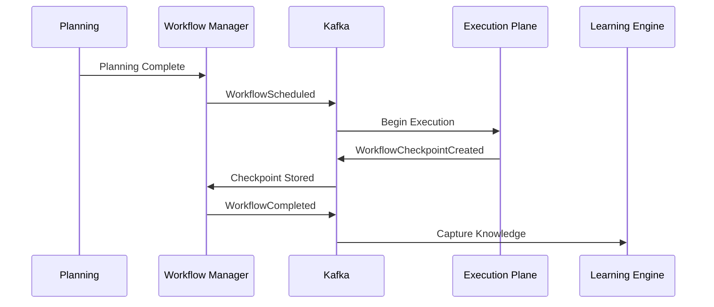
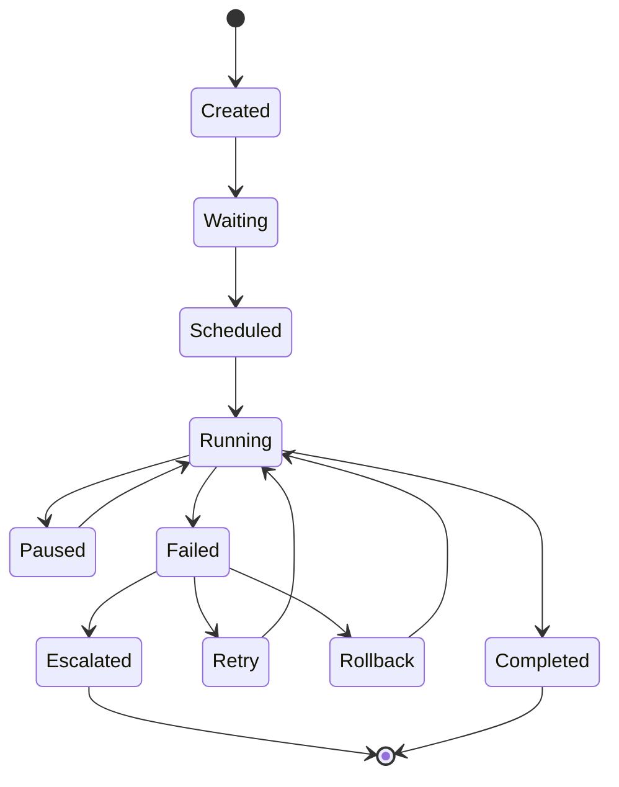
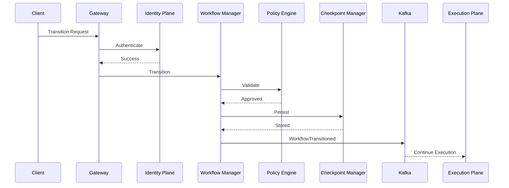

# Enterprise AI Software Factory
# Architecture Design Specification (ADS)

> **Document ID:** ADS-021-v3
>
> **Document Name:** Workflow State Machine — APIs, Events & Contracts
>
> **Version:** 2.0.0
>
> **Status:** Draft
>
> **Classification:** Core Runtime Specification
>
> **Importance:** CRITICAL
>
> **Depends On:** ADS-021-v1
>
> **Depends On:** ADS-021-v2
>
> **Next:** ADS-021-v4 — Runtime & Orchestration

---

# Executive Summary

The Workflow State Machine communicates with every subsystem of the Enterprise AI Software Factory.

This document defines every public interface, internal contract, event, schema, state transition message, workflow API, and communication protocol.

These contracts are immutable.

Implementations may change.

Contracts must remain stable.

---

# Communication Philosophy

Every subsystem communicates through contracts.

Never through implementation.

```
Planning

↓

Workflow Contract

↓

Workflow State Machine

↓

Workflow Contract

↓

Execution
```

Subsystems remain loosely coupled.

---

# System Interaction Map

```mermaid
flowchart LR

Gateway

-->

Workflow API

Workflow API

-->

Workflow Manager

Workflow Manager

-->

Planning

Workflow Manager

-->

TDD

Workflow Manager

-->

Execution

Workflow Manager

-->

QA

Workflow Manager

-->

Security

Workflow Manager

-->

Deployment

Workflow Manager

-->

Learning

Workflow Manager

-->

Observability
```

The Workflow Manager becomes the single orchestration authority.

---

# Communication Principles

Every communication MUST satisfy

- Versioned
- Authenticated
- Authorized
- Typed
- Auditable
- Observable
- Replayable
- Idempotent

---

# Public REST API

The Workflow State Machine exposes REST endpoints for

- Dashboard
- CLI
- Enterprise Integrations
- Automation Systems

---

## API-021-001

### Create Workflow

```http
POST /workflow/v1/workflows
```

Purpose

Creates a new engineering workflow.

---

Request

```json
{
  "projectId":"PROJ-001",
  "tenantId":"TENANT-001",
  "priority":"P2",
  "planningId":"PLAN-001"
}
```

---

Response

```json
{
  "workflowId":"WF-2026-001",
  "status":"Created",
  "currentState":"Created"
}
```

---

## API-021-002

### Get Workflow

```http
GET /workflow/v1/workflows/{workflowId}
```

Returns

- Current State
- Previous State
- Progress
- Active Owner
- Current Checkpoint
- Retry Count
- Audit Summary

---

## API-021-003

### Pause Workflow

```http
POST /workflow/v1/workflows/{workflowId}/pause
```

Transitions

```
Running

↓

Paused
```

---

## API-021-004

### Resume Workflow

```http
POST /workflow/v1/workflows/{workflowId}/resume
```

Requires

- Valid Checkpoint
- Active Lease
- Authorization

---

## API-021-005

### Cancel Workflow

```http
DELETE /workflow/v1/workflows/{workflowId}
```

Creates

```
WorkflowCancelled
```

event.

---

# Internal gRPC Services

Subsystem communication uses gRPC.

```protobuf
service WorkflowService{

rpc TransitionState(StateRequest)

returns(StateResponse);

rpc CreateCheckpoint(CheckpointRequest)

returns(CheckpointResponse);

rpc Rollback(RollbackRequest)

returns(RollbackResponse);

rpc AcquireLease(LeaseRequest)

returns(LeaseResponse);

}
```

---

# State Schema

```protobuf
message WorkflowState{

string workflow_id=1;

string current_state=2;

string previous_state=3;

string owner=4;

string checkpoint=5;

int32 retry_count=6;

}
```

---

# Workflow Events

Every transition produces an immutable event.

---

## EVT-021-001

WorkflowCreated

---

## EVT-021-002

WorkflowScheduled

---

## EVT-021-003

WorkflowStarted

---

## EVT-021-004

WorkflowCheckpointCreated

---

## EVT-021-005

WorkflowPaused

---

## EVT-021-006

WorkflowResumed

---

## EVT-021-007

WorkflowRetry

---

## EVT-021-008

WorkflowRollback

---

## EVT-021-009

WorkflowCompleted

---

## EVT-021-010

WorkflowFailed

---

## Event Flow



---

# Event Ordering

```
Created

↓

Scheduled

↓

Started

↓

Checkpoint

↓

Completed
```

Events are strictly ordered.

Out-of-order events are rejected.

---

# Event Metadata

Every event contains

```yaml
eventId:
eventType:
workflowId:
tenantId:
timestamp:
schemaVersion:
workflowVersion:
traceId:
correlationId:
causationId:
producer:
signature:
```

Every event is immutable.

---

# MCP Tool Contracts

The Workflow State Machine exposes standardized tools.

Supported tools

```
create_workflow

transition_state

pause_workflow

resume_workflow

rollback_workflow

create_checkpoint

get_workflow

list_workflows
```

Every tool invocation is authenticated and audited.

---

# Error Contract

```json
{
    "errorCode":"WF-021-014",
    "message":"Invalid workflow transition.",
    "severity":"High",
    "retryable":false,
    "workflowId":"WF-2026-001"
}
```

---

# API Versioning

The Workflow API follows semantic versioning.

```
v1

↓

v1.1

↓

v1.2

↓

v2
```

Breaking changes always require a new major version.

---

# Contract Validation

Every request entering the Workflow State Machine MUST pass contract validation before execution.

Validation follows a deterministic pipeline.

```text
Receive Request

↓

Schema Validation

↓

Authentication

↓

Authorization

↓

Workflow Validation

↓

Policy Validation

↓

Transition Validation

↓

Execution
```

A failure at any stage terminates the request.

---

# Validation Rules

Every request MUST satisfy all validation rules.

| Rule | Description |
|------|-------------|
| Schema Version | Supported contract version |
| Authentication | Valid identity token |
| Authorization | Required permissions |
| Workflow Exists | Valid Workflow ID |
| Current State | Existing active state |
| Requested Transition | Allowed transition |
| Policy Compliance | Organization policies |
| Lease Ownership | Valid worker lease |
| Checkpoint Integrity | Verified checkpoint |

Validation failures are never retried automatically.

---

# Authentication

Authentication is delegated to the Enterprise Identity Plane.

Supported methods

- OAuth2
- OpenID Connect (OIDC)
- Mutual TLS (mTLS)
- Service Accounts
- Enterprise SSO

Example

```http
Authorization:

Bearer eyJhbGci...
```

The Workflow State Machine never validates credentials directly.

---

# Authorization

Workflow operations are protected using Role-Based Access Control (RBAC).

| Role | Permissions |
|------|-------------|
| Viewer | Read workflows |
| Developer | Create workflows |
| Project Owner | Pause / Resume |
| Workflow Manager | Transition states |
| Organization Admin | Cancel workflows |
| Platform Admin | Full workflow control |

Every privileged operation generates an audit record.

---

# Multi-Tenant Isolation

Every workflow belongs to one tenant.

```text
Tenant

↓

Organization

↓

Project

↓

Repository

↓

Workflow
```

Cross-tenant operations are prohibited.

---

# Idempotency

Workflow creation and state transitions are idempotent.

Every mutation request MUST include

```
Idempotency-Key
```

Example

```http
POST /workflow/v1/workflows

Idempotency-Key:
f5b9d4f2-8d71-4dcb-a1b6-9f38eaf927b4
```

Duplicate requests return the original workflow.

---

# Rate Limiting

The API Gateway enforces request limits.

| Endpoint | Limit |
|-----------|-------:|
| Create Workflow | 20/min |
| Get Workflow | 500/min |
| Pause Workflow | 60/min |
| Resume Workflow | 60/min |
| Transition State | 300/min |

Limits are configurable.

---

# Workflow State Machine



Transitions outside this graph are invalid.

---

# Runtime Sequence



---

# Retry Policy

Retries depend on failure classification.

| Failure | Retry |
|----------|------:|
| Network Timeout | Yes |
| Queue Timeout | Yes |
| Worker Failure | Yes |
| Lease Expired | Yes |
| Invalid Transition | No |
| Authorization Failure | No |
| Policy Violation | No |

Retry schedule

```text
1 Second

↓

2 Seconds

↓

4 Seconds

↓

8 Seconds

↓

Escalation
```

---

# Circuit Breakers

Repeated failures isolate unhealthy workflow components.

```text
Failure

↓

Retry

↓

Threshold Reached

↓

Circuit Open

↓

Traffic Redirected

↓

Health Check

↓

Circuit Closed
```

Circuit breakers prevent cascading failures.

---

# Workflow Event Contracts

Every state transition publishes an immutable event.

```text
WorkflowCreated

↓

WorkflowScheduled

↓

WorkflowStarted

↓

WorkflowCheckpointCreated

↓

WorkflowPaused

↓

WorkflowResumed

↓

WorkflowCompleted
```

Events are append-only.

They are never modified or deleted.

---

# Distributed Tracing

Every workflow receives

- Trace ID
- Correlation ID
- Causation ID

Trace flow

```text
Gateway

↓

Workflow Manager

↓

Planner

↓

TDD

↓

Execution

↓

QA

↓

Deployment
```

Every subsystem contributes spans.

---

# Prometheus Metrics

```text
workflow_created_total

workflow_completed_total

workflow_failed_total

workflow_paused_total

workflow_resume_total

workflow_retry_total

workflow_transition_total

workflow_scheduler_latency

workflow_checkpoint_total

workflow_active_total
```

Metrics feed the Enterprise Observability Platform.

---

# Structured Logging

Example

```json
{
  "traceId":"trace-501",
  "workflowId":"WF-2026-001",
  "state":"Running",
  "previousState":"Scheduled",
  "owner":"ExecutionPlane",
  "durationMs":142,
  "status":"Success"
}
```

All logs follow structured JSON.

---

# Audit Records

Every workflow action records

- Workflow ID
- Current State
- Previous State
- Transition
- User ID
- Worker ID
- Timestamp
- Policy Version
- Trace ID

Audit history is immutable.

---

# Security Requirements

The Workflow State Machine

MUST

- Authenticate every request
- Validate every transition
- Verify workflow ownership
- Record audit logs
- Encrypt all communications

The Workflow State Machine MUST NOT

- Skip validation
- Execute unauthorized transitions
- Modify workflow history
- Share tenant context

---

# Architecture Decision Records

## ADR-021-06

### Decision

Treat workflow transitions as immutable events.

### Status

Accepted

### Reason

Immutable events enable replay, auditing, event sourcing, and forensic analysis.

---

## ADR-021-07

### Decision

Require idempotent workflow mutations.

### Status

Accepted

### Reason

Distributed systems must tolerate retries without creating duplicate workflows.

---

## ADR-021-08

### Decision

Expose both REST and gRPC interfaces.

### Status

Accepted

### Reason

REST supports external integrations while gRPC provides efficient internal communication.

---

# Operational Readiness Scorecard

| Capability | Status |
|------------|--------|
| API Versioning | ✅ Required |
| Event Contracts | ✅ Required |
| Distributed Tracing | ✅ Required |
| Multi-Tenant Isolation | ✅ Required |
| Idempotency | ✅ Required |
| Replay Support | ✅ Required |
| Auditability | ✅ Required |
| Contract Stability | ✅ Required |

---

# Related Documents

ADS-019-v5 — Autonomous Planning Engine Walkthrough

ADS-020-v5 — Agentic TDD Walkthrough

ADS-021-v1 — Architecture

ADS-021-v2 — State Transition Algorithms

ADS-021-v4 — Runtime & Orchestration

ADS-039 — Failure Recovery

ADS-043 — Enterprise Observability

---

# End of Document
