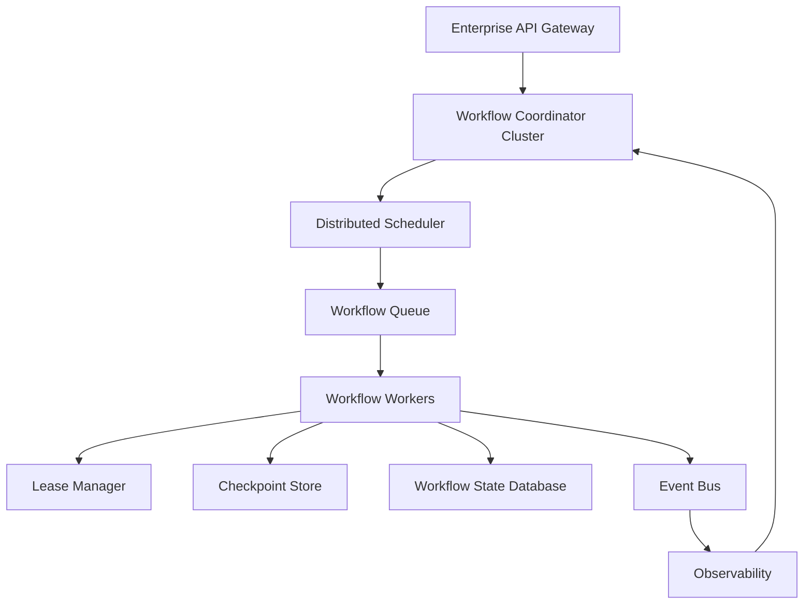
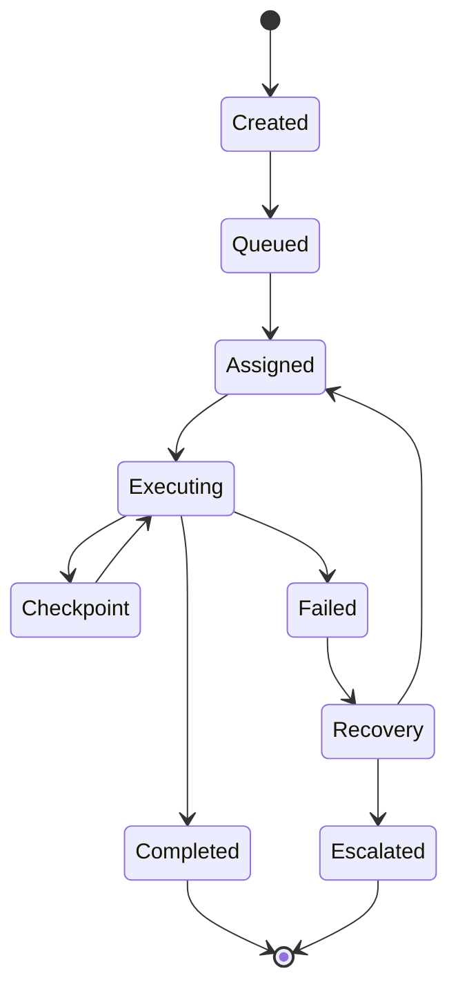
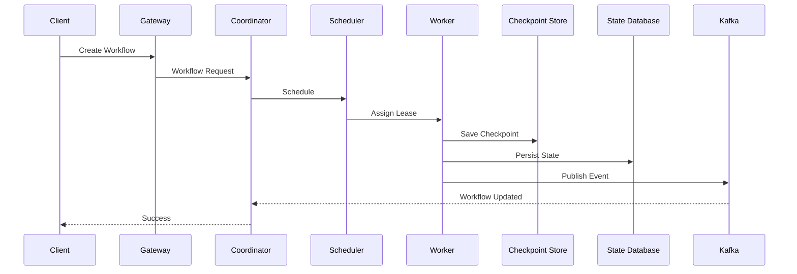
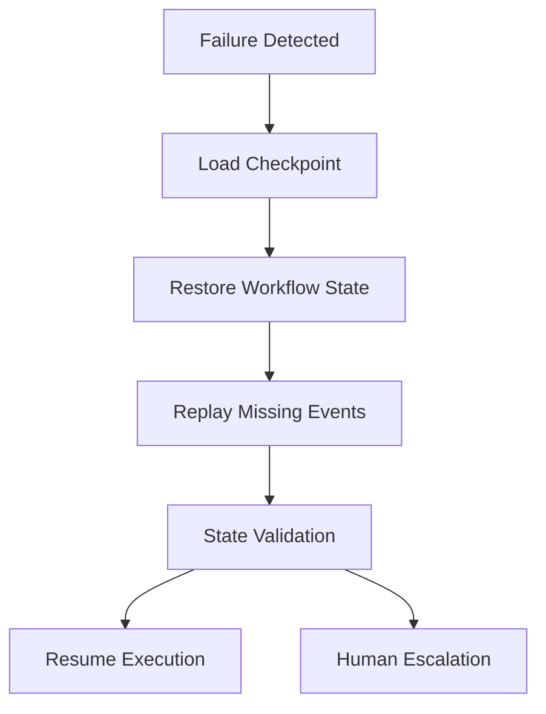
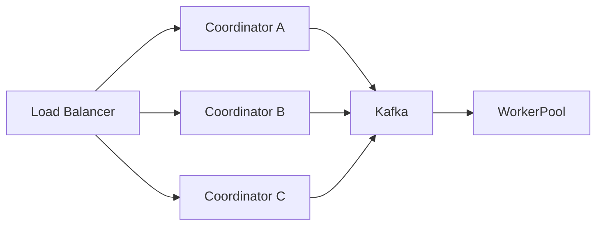

# Enterprise AI Software Factory
# Architecture Design Specification (ADS)

> **Document ID:** ADS-021-v4
>
> **Document Name:** Workflow State Machine — Runtime & Orchestration
>
> **Version:** 2.0.0
>
> **Status:** Draft
>
> **Classification:** Core Runtime Specification
>
> **Importance:** CRITICAL
>
> **Depends On:** ADS-021-v1
>
> **Depends On:** ADS-021-v2
>
> **Depends On:** ADS-021-v3
>
> **Next:** ADS-021-v5 — Complete Workflow Simulation

---

# Executive Summary

This document defines the production runtime of the Workflow State Machine.

Previous documents defined architecture, algorithms and communication contracts.

This specification explains how the Workflow State Machine executes inside production infrastructure.

Topics include

- Runtime services
- Scheduler
- Worker orchestration
- Lease management
- Checkpoint persistence
- Failure recovery
- Queue topology
- Scaling
- Disaster recovery

---

# Runtime Philosophy

The runtime follows seven principles.

- Stateless orchestration
- Durable workflow state
- Event sourcing
- Deterministic execution
- Horizontal scalability
- Automatic recovery
- Complete observability

---

# Runtime Architecture



Every workflow follows this runtime topology.

---

# Runtime Components

| Component | Responsibility |
|------------|----------------|
| Workflow Coordinator | Workflow orchestration |
| Scheduler | Worker assignment |
| Queue Manager | Workflow scheduling |
| Lease Manager | Workflow ownership |
| Worker Pool | State execution |
| Checkpoint Store | Recovery |
| State Database | Persistent workflow state |
| Event Bus | Event publication |
| Observability | Runtime telemetry |

Every service is independently deployable.

---

# Runtime Lifecycle



---

# Workflow Coordinator

The Workflow Coordinator is responsible for

- Creating workflows
- Managing transitions
- Assigning workers
- Persisting state
- Emitting events
- Coordinating recovery

The coordinator never performs subsystem work.

---

# Distributed Scheduler

The Scheduler decides

- Which workflow executes next
- Which worker receives it
- Which queue it enters
- When execution begins

Scheduling inputs

- Priority
- Dependencies
- Resource availability
- Tenant quotas
- Worker health
- SLA policies

---

# Queue Topology

```text
Planning Queue

↓

TDD Queue

↓

Execution Queue

↓

QA Queue

↓

Security Queue

↓

Deployment Queue
```

Each queue is independent.

Each queue supports retries and dead-letter handling.

---

# Worker Pool

Workers are disposable.

Each worker

- Acquires workflow lease
- Executes one state transition
- Persists checkpoint
- Emits telemetry
- Releases lease

Workers never retain persistent state.

---

# Lease Manager

Workflow ownership is controlled through renewable leases.

Lease Metadata

- Workflow ID
- Worker ID
- Lease Start
- Lease Expiration
- Heartbeat
- Renewal Count

Expired leases return ownership to the Scheduler.

---

# Checkpoint Store

Every transition generates two checkpoints

```text
Pre-Transition

↓

Transition

↓

Post-Transition
```

Stored data

- Workflow Context
- State
- Owner
- Retry Counter
- Active Tasks
- Event Offset
- Timestamp

---

# State Persistence

Persistent state contains

```text
Workflow

↓

Current State

↓

History

↓

Artifacts

↓

Audit Trail

↓

Events
```

State is append-only.

---

# Runtime Communication

| Communication | Protocol |
|---------------|-----------|
| External APIs | HTTPS |
| Internal Services | gRPC |
| Event Streaming | Kafka |
| Agent Tools | MCP |
| Telemetry | OpenTelemetry |

---

# Cache Layers

```text
L1

Worker Cache

↓

L2

Workflow Cache

↓

L3

Organization Cache
```

Cached objects include

- Workflow Metadata
- Policy Decisions
- Transition Graphs
- Runtime Configuration

---

# Runtime Sequence



---

# Resource Allocation

Worker assignment considers

- Queue Depth
- Workflow Priority
- Estimated Runtime
- CPU
- Memory
- Tenant Limits
- Worker Health

Assignments are dynamic.

---

# Runtime Guarantees

The Workflow State Machine guarantees

- Deterministic execution
- Durable state
- Replay support
- Horizontal scalability
- Checkpoint recovery
- Immutable history
- Observable execution

---

# Failure Recovery

The Workflow State Machine is designed to recover from failures without restarting an entire engineering workflow.

Recovery always resumes from the latest verified checkpoint.



Recovery Objectives

- Preserve completed work
- Minimize downtime
- Maintain deterministic execution
- Avoid duplicate transitions

---

# Retry Engine

Retries are categorized by failure type.

| Failure | Max Retries | Strategy |
|----------|------------:|----------|
| Network Failure | 5 | Exponential Backoff |
| Queue Timeout | 5 | Queue Retry |
| Worker Crash | 3 | Assign New Worker |
| Lease Expired | 3 | Acquire New Lease |
| Dependency Missing | 0 | Reject Transition |
| Policy Violation | 0 | Human Review |
| Security Failure | 0 | Security Escalation |

Retry Schedule

```text
Attempt 1

↓

1 s

↓

Attempt 2

↓

2 s

↓

Attempt 3

↓

4 s

↓

Attempt 4

↓

8 s

↓

Attempt 5

↓

16 s

↓

Escalation
```

Retries are bounded and observable.

---

# Worker Health Monitoring

Every worker continuously publishes health information.

Collected Metrics

- CPU Usage
- Memory Usage
- Active Workflow
- Heartbeat
- Lease Status
- Runtime Version
- Error Count

Heartbeat Flow

```text
Worker

↓

Heartbeat

↓

Coordinator

↓

Health Registry

↓

Dashboard
```

Workers missing heartbeats beyond the configured timeout are automatically replaced.

---

# Horizontal Scaling

The runtime scales automatically based on workload.

Scaling Inputs

- Queue Depth
- Active Workflows
- CPU Utilization
- Memory Pressure
- Worker Availability
- SLA Targets

Scaling Flow

```text
Queue Growth

↓

Autoscaler

↓

Provision Workers

↓

Register Workers

↓

Drain Queue

↓

Scale Down
```

Scaling decisions are policy-driven.

---

# High Availability

All runtime services are deployed redundantly.



Failure of one coordinator does not interrupt workflow execution.

---

# Runtime Isolation

Each worker executes in an isolated environment.

Supported isolation

- Kubernetes Pod
- Docker Container
- Firecracker MicroVM

Isolation guarantees

- Dedicated process space
- Dedicated filesystem
- Dedicated memory
- Dedicated runtime configuration

Workers never share execution context.

---

# Secrets Management

Runtime services never persist secrets.

Secrets are retrieved only when required.

```text
Worker

↓

Identity Plane

↓

HashiCorp Vault

↓

Temporary Credential

↓

Execution

↓

Credential Revoked
```

Secrets are short-lived and automatically rotated.

---

# Runtime Configuration

Configuration is externalized.

Example

```yaml
workflow:

  maxWorkers: 500

  leaseTimeout: 60s

  checkpointMode: dual

  retryLimit: 5

  schedulerPolicy: priority-aware

  heartbeatInterval: 10s

  enableReplay: true

  enableDeadLetterQueue: true
```

Runtime behavior is configurable without code changes.

---

# Performance Optimizations

The Workflow State Machine optimizes execution using

- Workflow Metadata Cache
- Policy Cache
- Transition Cache
- Incremental Replay
- Event Batching
- Parallel Scheduling
- Adaptive Worker Allocation

Optimizations MUST NOT alter workflow semantics.

---

# Distributed Event Sourcing

Every workflow transition is persisted as an event.

```text
Workflow Created

↓

Planning Completed

↓

TDD Completed

↓

Execution Started

↓

QA Completed

↓

Deployment Completed

↓

Workflow Closed
```

The event log becomes the authoritative execution history.

---

# Observability

Every runtime action emits

- Metrics
- Traces
- Structured Logs
- Audit Records
- Workflow Events

No transition occurs without telemetry.

---

# Prometheus Metrics

```text
workflow_queue_depth

workflow_active_workers

workflow_scheduler_latency_seconds

workflow_transition_duration_seconds

workflow_checkpoint_total

workflow_recovery_total

workflow_retry_total

workflow_leases_active

workflow_events_total

workflow_parallelism_ratio
```

Metrics integrate with the Enterprise Observability Plane.

---

# OpenTelemetry

Every workflow receives a distributed trace.

```text
Gateway

↓

Coordinator

↓

Scheduler

↓

Worker

↓

Checkpoint Store

↓

Event Bus

↓

Observability
```

Each transition becomes an independent span.

---

# Structured Logging

Example

```json
{
  "traceId":"trace-801",
  "workflowId":"WF-2026-001",
  "state":"Execution",
  "worker":"worker-12",
  "checkpoint":"CP-024",
  "durationMs":119,
  "status":"Success"
}
```

Logs are append-only and immutable.

---

# Disaster Recovery

The runtime survives infrastructure failures.

Recovery Flow

```text
Coordinator Failure

↓

Leader Election

↓

Queue Recovery

↓

Checkpoint Restore

↓

Workflow Replay

↓

Resume Execution
```

Recovery Targets

Recovery Point Objective (RPO)

Near-zero data loss

Recovery Time Objective (RTO)

Less than five minutes

---

# Recommended Production Deployment

```text
Kubernetes Cluster

↓

Workflow Namespace

↓

Coordinator Deployment

↓

Scheduler Deployment

↓

Worker Deployment

↓

Kafka

↓

Redis

↓

PostgreSQL

↓

Object Storage

↓

HashiCorp Vault

↓

Prometheus

↓

Grafana

↓

OpenTelemetry Collector
```

---

# Recommended Technology Stack

| Layer | Technology |
|--------|------------|
| Runtime | Kubernetes |
| Workflow Engine | Temporal |
| Event Bus | Kafka |
| Cache | Redis |
| Database | PostgreSQL |
| Object Storage | MinIO |
| Tracing | OpenTelemetry |
| Metrics | Prometheus |
| Dashboards | Grafana |
| Secrets | HashiCorp Vault |
| Service Mesh | Istio |
| Identity | SPIFFE / SPIRE |

---

# Runtime Checklist

The Workflow State Machine MUST

- Execute deterministic transitions
- Persist every checkpoint
- Publish immutable events
- Recover automatically
- Scale horizontally
- Maintain workflow leases
- Preserve execution history

The Workflow State Machine MUST NOT

- Lose workflow state
- Execute invalid transitions
- Modify historical events
- Store secrets locally
- Execute outside policy controls

---

# Architecture Decision Records

## ADR-021-09

### Decision

Persist every workflow transition as an immutable event.

### Status

Accepted

### Reason

Event sourcing enables replay, auditing, disaster recovery, and historical analysis.

---

## ADR-021-10

### Decision

Adopt lease-based workflow ownership.

### Status

Accepted

### Reason

Lease-based ownership prevents orphaned workflows and enables transparent worker replacement.

---

## ADR-021-11

### Decision

Separate orchestration from execution.

### Status

Accepted

### Reason

The Workflow State Machine coordinates execution but never performs business logic, preserving subsystem independence.

---

# Operational Readiness Scorecard

| Capability | Status |
|------------|--------|
| High Availability | ✅ Required |
| Event Sourcing | ✅ Required |
| Automatic Recovery | ✅ Required |
| Distributed Scheduling | ✅ Required |
| Lease Management | ✅ Required |
| Horizontal Scaling | ✅ Required |
| Multi-Tenant Isolation | ✅ Required |
| Full Observability | ✅ Required |

---

# Related Documents

ADS-019-v5 — Autonomous Planning Engine Walkthrough

ADS-020-v5 — Agentic TDD Walkthrough

ADS-021-v1 — Workflow State Machine Architecture

ADS-021-v2 — State Transition Algorithms

ADS-021-v3 — APIs, Events & Contracts

ADS-021-v5 — Complete Workflow Simulation

ADS-039 — Failure Recovery System

ADS-043 — Enterprise Observability

---

# End of Document
