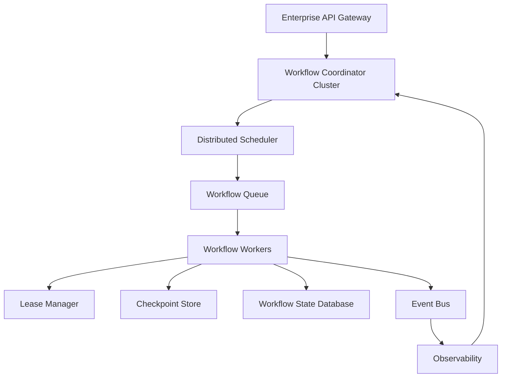
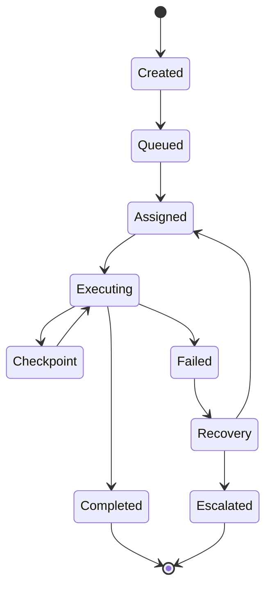
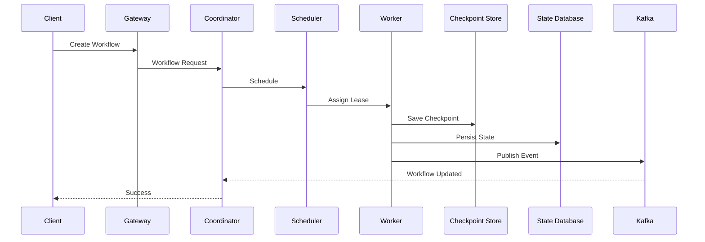

# Enterprise AI Software Factory
# Architecture Design Specification (ADS)

> **Document ID:** ADS-021-v4
>
> **Document Name:** Workflow State Machine — Runtime & Orchestration
>
> **Version:** 2.0.0
>
> **Status:** Draft
>
> **Classification:** Core Runtime Specification
>
> **Importance:** CRITICAL
>
> **Depends On:** ADS-021-v1
>
> **Depends On:** ADS-021-v2
>
> **Depends On:** ADS-021-v3
>
> **Next:** ADS-021-v5 — Complete Workflow Simulation

---

# Executive Summary

This document defines the production runtime of the Workflow State Machine.

Previous documents defined architecture, algorithms and communication contracts.

This specification explains how the Workflow State Machine executes inside production infrastructure.

Topics include

- Runtime services
- Scheduler
- Worker orchestration
- Lease management
- Checkpoint persistence
- Failure recovery
- Queue topology
- Scaling
- Disaster recovery

---

# Runtime Philosophy

The runtime follows seven principles.

- Stateless orchestration
- Durable workflow state
- Event sourcing
- Deterministic execution
- Horizontal scalability
- Automatic recovery
- Complete observability

---

# Runtime Architecture



Every workflow follows this runtime topology.

---

# Runtime Components

| Component | Responsibility |
|------------|----------------|
| Workflow Coordinator | Workflow orchestration |
| Scheduler | Worker assignment |
| Queue Manager | Workflow scheduling |
| Lease Manager | Workflow ownership |
| Worker Pool | State execution |
| Checkpoint Store | Recovery |
| State Database | Persistent workflow state |
| Event Bus | Event publication |
| Observability | Runtime telemetry |

Every service is independently deployable.

---

# Runtime Lifecycle



---

# Workflow Coordinator

The Workflow Coordinator is responsible for

- Creating workflows
- Managing transitions
- Assigning workers
- Persisting state
- Emitting events
- Coordinating recovery

The coordinator never performs subsystem work.

---

# Distributed Scheduler

The Scheduler decides

- Which workflow executes next
- Which worker receives it
- Which queue it enters
- When execution begins

Scheduling inputs

- Priority
- Dependencies
- Resource availability
- Tenant quotas
- Worker health
- SLA policies

---

# Queue Topology

```text
Planning Queue

↓

TDD Queue

↓

Execution Queue

↓

QA Queue

↓

Security Queue

↓

Deployment Queue
```

Each queue is independent.

Each queue supports retries and dead-letter handling.

---

# Worker Pool

Workers are disposable.

Each worker

- Acquires workflow lease
- Executes one state transition
- Persists checkpoint
- Emits telemetry
- Releases lease

Workers never retain persistent state.

---

# Lease Manager

Workflow ownership is controlled through renewable leases.

Lease Metadata

- Workflow ID
- Worker ID
- Lease Start
- Lease Expiration
- Heartbeat
- Renewal Count

Expired leases return ownership to the Scheduler.

---

# Checkpoint Store

Every transition generates two checkpoints

```text
Pre-Transition

↓

Transition

↓

Post-Transition
```

Stored data

- Workflow Context
- State
- Owner
- Retry Counter
- Active Tasks
- Event Offset
- Timestamp

---

# State Persistence

Persistent state contains

```text
Workflow

↓

Current State

↓

History

↓

Artifacts

↓

Audit Trail

↓

Events
```

State is append-only.

---

# Runtime Communication

| Communication | Protocol |
|---------------|-----------|
| External APIs | HTTPS |
| Internal Services | gRPC |
| Event Streaming | Kafka |
| Agent Tools | MCP |
| Telemetry | OpenTelemetry |

---

# Cache Layers

```text
L1

Worker Cache

↓

L2

Workflow Cache

↓

L3

Organization Cache
```

Cached objects include

- Workflow Metadata
- Policy Decisions
- Transition Graphs
- Runtime Configuration

---

# Runtime Sequence



---

# Resource Allocation

Worker assignment considers

- Queue Depth
- Workflow Priority
- Estimated Runtime
- CPU
- Memory
- Tenant Limits
- Worker Health

Assignments are dynamic.

---

# Runtime Guarantees

The Workflow State Machine guarantees

- Deterministic execution
- Durable state
- Replay support
- Horizontal scalability
- Checkpoint recovery
- Immutable history
- Observable execution

---

# End of Part 1
