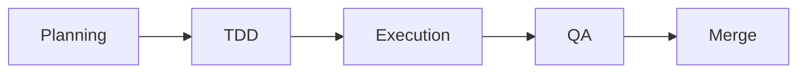
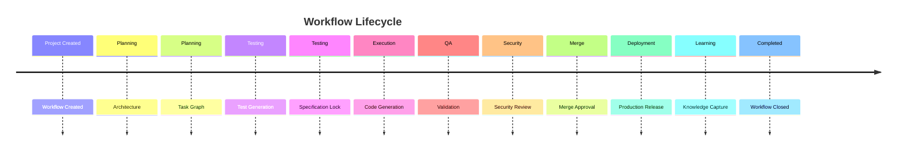

# Enterprise AI Software Factory
# Architecture Design Specification (ADS)

> **Document ID:** ADS-021-v5
>
> **Document Name:** Workflow State Machine — Complete Workflow Simulation
>
> **Version:** 2.0.0
>
> **Classification:** Reference Implementation
>
> **Importance:** CRITICAL
>
> **Depends On:** ADS-021-v1
>
> **Depends On:** ADS-021-v2
>
> **Depends On:** ADS-021-v3
>
> **Depends On:** ADS-021-v4

---

# Executive Summary

This document demonstrates a complete engineering workflow executed by the Workflow State Machine.

Unlike previous ADS documents that describe architecture and runtime behavior, this chapter simulates the execution of a real software project from creation to deployment.

The objective is to demonstrate deterministic orchestration, subsystem coordination, checkpoint recovery, event generation, workflow governance, and completion.

---

# Project Scenario

An enterprise customer submits the following request.

> Build a secure multi-tenant SaaS CRM platform with AI-assisted customer support, analytics dashboards, billing integration, enterprise authentication, and audit logging.

The request has already passed

- Planning
- Human Approval
- Agentic TDD

The Workflow State Machine receives

```
Workflow

WF-2026-001
```

---

# Stage 1 — Workflow Creation

The Control Plane creates a new workflow.

```text
Workflow ID

WF-2026-001

Priority

P1

Owner

Workflow Coordinator

Status

Created
```

Event Published

```
WorkflowCreated
```

Checkpoint

```
CP-001
```

---

# Stage 2 — Planning State

The Scheduler routes the workflow.

```
Created

↓

Planning
```

Planning artifacts loaded

```
Architecture

Execution DAG

Risk Report

Task Graph

Milestones

Planning Confidence
```

Planning completed successfully.

Checkpoint

```
CP-002
```

---

# Stage 3 — Test Generation

The Workflow Manager activates

```
Agentic TDD Engine
```

Generated

```
Unit Tests

Integration Tests

Security Tests

Vision Tests

Performance Tests
```

Coverage

```
96.8%
```

Mutation Score

```
89%
```

Specification

```
Locked
```

Checkpoint

```
CP-003
```

---

# Stage 4 — Execution

The Scheduler allocates

```
Backend Workers

Frontend Workers

Infrastructure Workers

QA Workers
```

Execution begins.



Event

```
WorkflowExecutionStarted
```

---

# Stage 5 — Parallel Execution

The scheduler detects independent execution groups.

```text
Authentication

Billing

Dashboard

Analytics

↓

Execute Simultaneously
```

Parallel Workers

```
12
```

Average CPU

```
64%
```

Average Memory

```
58%
```

Parallel efficiency

```
86%
```

Checkpoint

```
CP-004
```

---

# Stage 6 — Static Analysis

Execution completes.

The Workflow State Machine activates

```
Static Analysis Engine
```

Checks

- Formatting
- Linting
- Type Safety
- Dependency Rules
- Secret Detection
- License Compliance

Result

```
Passed
```

---

# Stage 7 — Security Review

Security Plane activated.

Executed

```
Dependency Scan

SAST

Secret Scan

Policy Validation

Container Scan
```

Critical Vulnerabilities

```
0
```

High

```
0
```

Medium

```
2
```

Risk

```
Accepted
```

Checkpoint

```
CP-005
```

---

# Stage 8 — Vision QA

Playwright captures application.

Gemini Vision validates

- Layout
- Accessibility
- Theme
- Responsiveness
- Component Placement

UI Similarity

```
98.1%
```

Accessibility Score

```
99%
```

Vision QA

```
Passed
```

---

# Stage 9 — Merge

The Merge Engine validates

```
Branch Protection

Required Reviews

Specification Lock

CI

Coverage

Security
```

Merge

```
Approved
```

Checkpoint

```
CP-006
```

---

# Stage 10 — Deployment

Deployment Engine activated.

Deployment

```
Blue / Green
```

Environment

```
Staging
```

Smoke Tests

```
Passed
```

Health Checks

```
Passed
```

Canary

```
Successful
```

Production rollout approved.

---

# Stage 11 — Learning

Learning Engine receives

- Planning Decisions
- Runtime Metrics
- Coverage Reports
- Security Results
- Deployment Results
- Human Feedback

Knowledge captured

```
Accepted Patterns

Failure Patterns

Performance Metrics

Prompt Improvements
```

Checkpoint

```
CP-007
```

---

# Stage 12 — Workflow Completion

The Workflow State Machine validates

- Planning
- TDD
- Execution
- QA
- Security
- Merge
- Deployment
- Learning

Every mandatory subsystem reports success.

Workflow

```
Completed
```

Final Event

```
WorkflowCompleted
```

---

# Workflow Timeline



---

# Workflow Metrics

| Metric | Result |
|----------|-------:|
| Total Duration | 27 Minutes |
| States Executed | 18 |
| Checkpoints Created | 7 |
| Events Published | 41 |
| Parallel Workers | 12 |
| Recovery Events | 0 |
| Rollbacks | 0 |
| Human Approvals | 2 |
| Planner Confidence | 96.3% |
| TDD Confidence | 95.8% |

---

# Workflow Event Stream

```text
WorkflowCreated

↓

WorkflowScheduled

↓

PlanningCompleted

↓

TestGenerationCompleted

↓

SpecificationLocked

↓

ExecutionStarted

↓

StaticAnalysisPassed

↓

SecurityPassed

↓

VisionQAPassed

↓

MergeApproved

↓

DeploymentCompleted

↓

KnowledgeCaptured

↓

WorkflowCompleted
```

---

# Produced Artifacts

| Artifact | Identifier |
|----------|------------|
| Workflow | WF-2026-001 |
| Planning Package | PLAN-001 |
| Architecture | ARCH-001 |
| Specification | SPEC-001 |
| Test Suite | TS-001 |
| Build Artifact | BUILD-001 |
| Deployment Package | DEPLOY-001 |
| Knowledge Package | KNOW-001 |

---

# Operational Readiness Scorecard

| Capability | Status |
|------------|--------|
| Workflow Orchestration | ✅ Complete |
| Checkpoint Recovery | ✅ Enabled |
| Event Sourcing | ✅ Enabled |
| Parallel Scheduling | ✅ Enabled |
| Lease Management | ✅ Enabled |
| Security Validation | ✅ Passed |
| Human Governance | ✅ Verified |
| Observability | ✅ Complete |

---

# Lessons Learned

The Workflow State Machine demonstrates the following principles.

- Every engineering activity is coordinated through deterministic state transitions.
- Every subsystem communicates through stable contracts rather than direct invocation.
- Every workflow is recoverable through checkpoints and immutable event history.
- Parallel execution improves throughput without sacrificing determinism.
- Governance, observability, and security are integrated into the workflow rather than treated as external concerns.

---

# Architecture Decision Record

## ADR-021-12

### Decision

Every engineering workflow MUST execute through the Workflow State Machine from creation to completion.

### Status

Accepted

### Reason

A single orchestration kernel provides deterministic execution, centralized governance, comprehensive auditing, reliable recovery, and consistent subsystem coordination.

---

# Related Documents

ADS-019-v5 — Autonomous Planning Engine

ADS-020-v5 — Agentic TDD Engine

ADS-021-v1 — Architecture

ADS-021-v2 — Algorithms

ADS-021-v3 — APIs & Contracts

ADS-021-v4 — Runtime & Orchestration

---

# End of Document
