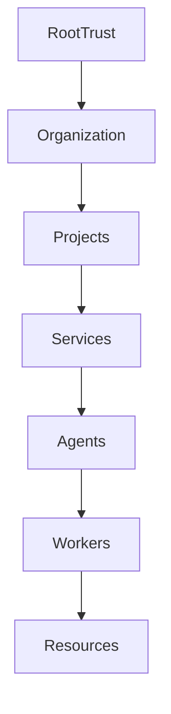
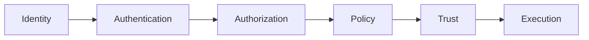

# Enterprise AI Software Factory
# Architecture Design Specification (ADS)

> **Document ID:** ADS-022-v1
>
> **Document Name:** Identity & Trust Plane — Architecture
>
> **Version:** 2.0.0
>
> **Classification:** Enterprise Platform Plane
>
> **Importance:** CRITICAL
>
> **Depends On:** ADS-000 → ADS-021
>
> **Next:** ADS-022-v2 — Identity Algorithms & Trust Model

---

# Executive Summary

The Identity & Trust Plane establishes the security foundation of the Enterprise AI Software Factory.

Every entity inside the platform—including users, AI agents, workflows, services, containers, APIs, workers, plugins, MCP servers, and infrastructure—is treated as an independent identity.

Nothing is implicitly trusted.

Every action requires authentication, authorization, policy evaluation, and audit logging.

The Identity & Trust Plane transforms the AI Software Factory into a Zero Trust distributed operating system.

---

# Why This System Exists

Traditional software trusts

- Internal networks
- Kubernetes clusters
- Containers
- Backend services
- CI/CD systems

Modern AI systems cannot.

AI agents are autonomous.

Workers are ephemeral.

Containers are disposable.

Execution constantly changes.

Trust must therefore become dynamic.

Identity becomes the new perimeter.

---

# Core Philosophy

The Identity & Trust Plane follows one rule.

> Never trust.
>
> Always verify.

Every request must prove

- Who initiated it
- What it wants
- Why it needs access
- Whether policy permits it
- Whether the action is auditable

No exceptions.

---

# Design Goals

The Identity Plane provides

- Human Identity
- Service Identity
- AI Agent Identity
- Workload Identity
- Device Identity
- API Identity
- Secret Distribution
- Authorization
- Policy Enforcement
- Trust Propagation

---

# Architectural Position

```mermaid
flowchart TB

User

-->

Gateway

Gateway

-->

Identity Plane

Identity Plane

-->

Control Plane

Control Plane

-->

Execution Plane

Execution Plane

-->

Workers

Workers

-->

Resources
```

Every subsystem depends on the Identity Plane.

Nothing bypasses it.

---

# Identity Domains

The platform recognizes multiple identity domains.

| Domain | Examples |
|---------|----------|
| Human | Developer, Admin, Product Owner |
| Service | Workflow Manager, Planner |
| AI Agent | Architect Bot, QA Bot |
| Workload | Kubernetes Pod, Worker |
| Infrastructure | Kafka, PostgreSQL, Redis |
| External | GitHub, Stripe, Slack |
| Device | CLI, Browser, IDE |

Every identity is unique.

---

# Trust Hierarchy



Trust is delegated.

Never inherited.

---

# Major Components

| Component | Responsibility |
|------------|----------------|
| Identity Provider | Authentication |
| Trust Manager | Trust decisions |
| Authorization Engine | Access decisions |
| Policy Engine | Organization policies |
| Secret Broker | Temporary credentials |
| Certificate Authority | Identity certificates |
| Audit Manager | Immutable audit history |
| Token Service | Identity tokens |

---

# Authentication Model

Supported authentication

- OAuth2
- OpenID Connect
- Mutual TLS
- SPIFFE IDs
- Service Accounts
- API Keys
- WebAuthn
- Passkeys

Passwords are not preferred.

Modern authentication is required.

---

# Authorization Model

Authorization combines

- RBAC
- ABAC
- Context-Based Policies
- Time-Based Policies
- Risk-Based Decisions

Authorization is dynamic.

---

# Workload Identity

Every runtime workload receives

- SPIFFE Identity
- Short-lived Certificate
- Temporary Token
- Renewable Lease

Identity expires automatically.

---

# AI Agent Identity

Every AI agent receives

Agent ID

Model Version

Capability Set

Allowed Tools

Allowed Resources

Policy Profile

Risk Level

Agents never share identities.

---

# Trust Propagation



Trust is evaluated continuously.

Not only once.

---

# Connected Systems

The Identity Plane protects

- Planning Engine
- Agentic TDD
- Workflow State Machine
- Execution Plane
- Security Plane
- Deployment Plane
- Observability Plane
- Learning Plane

Identity becomes a shared platform capability.

---

# Engineering Principles

The Identity Plane follows

- Zero Trust
- Least Privilege
- Short-Lived Credentials
- Continuous Verification
- Immutable Audit
- Dynamic Authorization
- Policy Driven Access

---

# Architecture Decision Records

## ADR-022-01

### Decision

Every entity MUST possess a unique identity.

### Status

Accepted

### Reason

Unique identities eliminate ambiguity, simplify auditing, and enable fine-grained authorization.

---

## ADR-022-02

### Decision

Adopt Zero Trust as the default security model.

### Status

Accepted

### Reason

Modern distributed AI systems cannot rely on network boundaries or static trust assumptions.

---

# Operational Readiness Scorecard

| Capability | Status |
|------------|--------|
| Zero Trust | ✅ Required |
| Mutual Authentication | ✅ Required |
| Short-Lived Credentials | ✅ Required |
| RBAC | ✅ Required |
| ABAC | ✅ Required |
| Workload Identity | ✅ Required |
| Immutable Audit | ✅ Required |
| Policy Enforcement | ✅ Required |

---

# Version Roadmap

| Version | Description |
|----------|-------------|
| v1 | Architecture |
| v2 | Trust Algorithms & Identity Model |
| v3 | APIs, Events & Contracts |
| v4 | Runtime & Identity Infrastructure |
| v5 | End-to-End Trust Walkthrough |

---

# Related Documents

ADS-021-v5 — Workflow State Machine

ADS-023-v1 — Enterprise Context & Memory Plane

ADS-024-v1 — Execution Plane

ADS-025-v1 — Security Plane

ADS-026-v1 — Observability Plane

---

# Next Document

**ADS-022-v2 — Trust Algorithms & Identity Model**

This document defines authentication flows, workload identity issuance, trust propagation, token lifecycles, certificate rotation, authorization algorithms, policy evaluation, and continuous trust verification across the Enterprise AI Software Factory.

---

# End of Document
