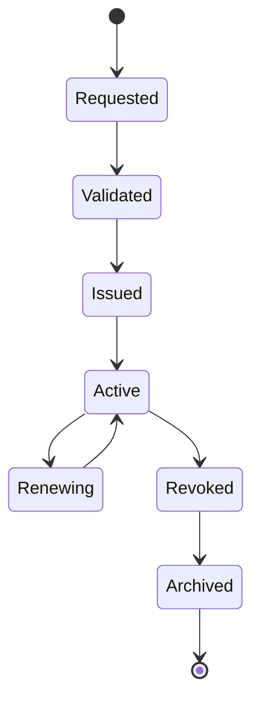

# Enterprise AI Software Factory
# Architecture Design Specification (ADS)

> **Document ID:** ADS-022-v2
>
> **Document Name:** Identity & Trust Plane — Trust Algorithms & Identity Model
>
> **Version:** 2.0.0
>
> **Status:** Draft
>
> **Classification:** Enterprise Platform Plane
>
> **Importance:** CRITICAL
>
> **Depends On:** ADS-022-v1
>
> **Next:** ADS-022-v3 — APIs, Events & Contracts

---

# Executive Summary

This document defines the algorithms governing identity issuance, trust evaluation, authentication, authorization, workload identity, certificate lifecycle management, and continuous verification.

The Identity & Trust Plane does not grant permanent trust.

Instead, trust is computed dynamically from multiple independent signals.

Identity is persistent.

Trust is temporary.

Authorization is contextual.

---

# Identity Model

Every entity inside the Enterprise AI Software Factory is represented as a cryptographically verifiable identity.

Identity is immutable.

Permissions are not.

Every identity contains

- Identity ID
- Entity Type
- Tenant
- Organization
- Roles
- Attributes
- Capability Profile
- Public Key
- Certificate Reference
- Creation Timestamp

Identity never changes.

Authorization evolves over time.

---

# Trust Evaluation Pipeline

```mermaid
flowchart LR

Identity

-->

Authentication

-->

Certificate Validation

-->

Policy Evaluation

-->

Risk Analysis

-->

Trust Score

-->

Authorization

-->

Execution
```

Trust is recalculated for every privileged operation.

---

# Identity Categories

| Category | Examples |
|------------|----------|
| Human | Developer, Reviewer |
| Agent | Planner, QA Agent |
| Service | Workflow Manager |
| Workload | Kubernetes Pod |
| Infrastructure | Kafka, PostgreSQL |
| External | GitHub, Stripe |
| Automation | CI/CD Pipeline |

Each category follows independent policy rules.

---

# ALG-022-001

## Identity Issuance

Identity creation follows

```text
Request Identity

↓

Validate Entity

↓

Generate UUID

↓

Generate Key Pair

↓

Issue Certificate

↓

Register Identity

↓

Publish Identity Event
```

Identity issuance occurs only once.

Identity replacement creates a new identity.

---

# ALG-022-002

## Authentication

Authentication validates identity ownership.

Supported methods

- OAuth2
- OpenID Connect
- Mutual TLS
- SPIFFE/SPIRE
- Passkeys
- Service Account Tokens

Authentication proves

```
Who are you?
```

Nothing more.

---

# ALG-022-003

## Authorization

Authorization answers

```
What are you allowed to do?
```

Authorization inputs

- Identity
- Role
- Attributes
- Requested Action
- Resource
- Tenant
- Time
- Risk Score
- Policies

Decision

```text
Allow

Deny

Escalate

Require Approval
```

Authorization is evaluated for every request.

---

# ALG-022-004

## Trust Score

Trust is dynamic.

Example factors

| Signal | Weight |
|----------|-------:|
| Valid Identity | 20% |
| Valid Certificate | 20% |
| Policy Compliance | 20% |
| Behavioral History | 15% |
| Device Health | 10% |
| Risk Signals | 15% |

Example

```text
Trust Score

=

20

+

20

+

20

+

14

+

9

+

13

=

96
```

Organizations configure trust thresholds.

---

# ALG-022-005

## Certificate Lifecycle

Certificates are short-lived.

Lifecycle

```text
Issue

↓

Active

↓

Renew

↓

Rotate

↓

Revoke

↓

Archive
```

Automatic rotation occurs before expiration.

---

# ALG-022-006

## Workload Identity

Every workload receives

- SPIFFE ID
- X.509 Certificate
- JWT-SVID (where applicable)
- Lease
- Expiration Time

Example

```text
spiffe://enterprise-ai/workflows/worker-021
```

Workloads authenticate without long-lived secrets.

---

# ALG-022-007

## Trust Propagation

Trust is not inherited automatically.

Propagation rules

```
Authenticated

↓

Authorized

↓

Policy Approved

↓

Risk Accepted

↓

Temporary Trust Granted
```

Each downstream service repeats verification.

---

# ALG-022-008

## Continuous Verification

Trust is continuously reevaluated.

Triggers

- Policy Changes
- Certificate Rotation
- Role Updates
- Risk Events
- Behavioral Anomalies
- Tenant Changes

Trust may decrease during execution.

---

# ALG-022-009

## Credential Rotation

Credentials rotate automatically.

Supported credentials

- Access Tokens
- Refresh Tokens
- X.509 Certificates
- SPIFFE SVIDs
- Service Account Tokens

Rotation minimizes credential exposure.

---

# ALG-022-010

## Trust Revocation

Trust may be revoked immediately.

Reasons

- Compromised Identity
- Policy Violation
- Certificate Revocation
- Suspicious Behavior
- Manual Revocation
- Organization Offboarding

Revocation Flow

```mermaid
flowchart TD

Incident

-->

Identity

-->

Certificate Revoked

-->

Sessions Invalidated

-->

Workloads Terminated

-->

Audit Event

-->

Recovery
```

Revocation propagates across the platform.

---

# Identity State Machine



Every identity follows this lifecycle.

---

# Authorization Decision Matrix

| Trust Score | Action |
|-------------|--------|
| 95–100 | Allow |
| 80–94 | Allow + Monitor |
| 60–79 | Require Additional Verification |
| 40–59 | Human Approval Required |
| Below 40 | Deny |

Thresholds are configurable.

---

# Identity Invariants

Every identity MUST satisfy

- Globally unique identifier
- Valid certificate
- Active policy binding
- Immutable creation record
- Auditable history

Violation of any invariant disables the identity.

---

# Time Complexity

| Operation | Complexity |
|------------|------------|
| Identity Lookup | O(log n) |
| Trust Evaluation | O(p) |
| Policy Lookup | O(log n) |
| Certificate Validation | O(1) |
| Role Evaluation | O(r) |

Where

- **p** = applicable policies
- **r** = assigned roles

---

# Runtime Metrics

```text
identity_created_total

identity_active_total

identity_revoked_total

trust_score_average

authorization_denied_total

certificate_rotation_total

authentication_latency_seconds

policy_evaluation_duration_seconds

credential_rotation_total

trust_recalculation_total
```

---

# Architecture Decision Records

## ADR-022-03

### Decision

Separate identity from trust.

### Status

Accepted

### Reason

Identity is long-lived, while trust must adapt continuously to changing operational conditions.

---

## ADR-022-04

### Decision

Use workload identities instead of shared service credentials.

### Status

Accepted

### Reason

Workload identities eliminate credential sharing and improve traceability.

---

## ADR-022-05

### Decision

Continuously reevaluate trust throughout workflow execution.

### Status

Accepted

### Reason

Trust established at authentication time may become invalid as context changes.

---

# Operational Readiness Scorecard

| Capability | Status |
|------------|--------|
| Continuous Verification | ✅ Required |
| Dynamic Authorization | ✅ Required |
| Certificate Rotation | ✅ Required |
| Workload Identity | ✅ Required |
| Trust Scoring | ✅ Required |
| Credential Revocation | ✅ Required |
| Zero Trust | ✅ Required |
| Full Auditability | ✅ Required |

---

# Related Documents

ADS-021-v5 — Workflow State Machine

ADS-022-v1 — Identity & Trust Plane Architecture

ADS-022-v3 — APIs, Events & Contracts

ADS-025 — Security Plane

ADS-026 — Observability Plane

---

# Next Document

**ADS-022-v3 — APIs, Events & Contracts**

Defines REST APIs, gRPC services, SPIFFE/SPIRE integration points, token contracts, identity events, certificate schemas, authorization requests, policy interfaces, and trust propagation protocols.

---

# End of Document
