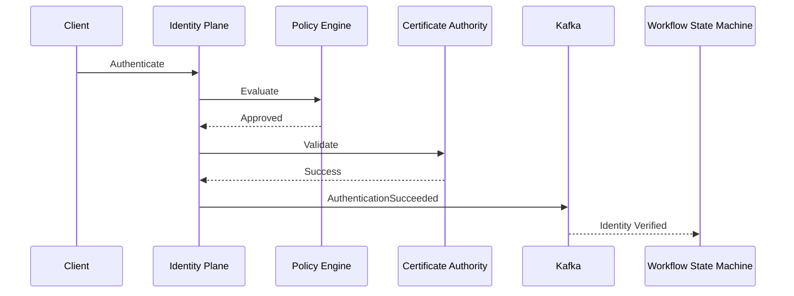
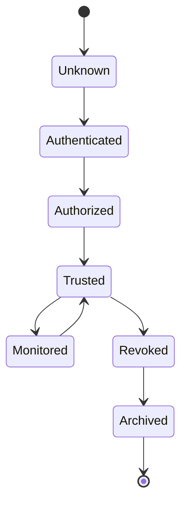
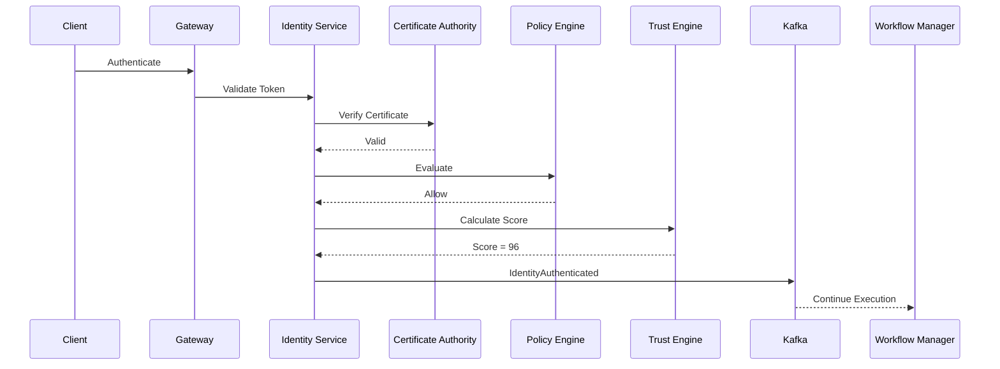

# Enterprise AI Software Factory
# Architecture Design Specification (ADS)

> **Document ID:** ADS-022-v3
>
> **Document Name:** Identity & Trust Plane — APIs, Events & Contracts
>
> **Version:** 2.0.0
>
> **Status:** Draft
>
> **Classification:** Enterprise Platform Plane
>
> **Importance:** CRITICAL
>
> **Depends On:** ADS-022-v1
>
> **Depends On:** ADS-022-v2
>
> **Next:** ADS-022-v4 — Runtime & Identity Infrastructure

---

# Executive Summary

The Identity & Trust Plane exposes secure APIs, gRPC services, identity events, workload identity contracts, certificate interfaces, authorization endpoints, and trust propagation mechanisms.

Every subsystem inside the Enterprise AI Software Factory communicates with the Identity Plane through these contracts.

No subsystem may bypass them.

---

# Communication Principles

Every interface MUST satisfy

- Authenticated
- Authorized
- Versioned
- Auditable
- Observable
- Replayable
- Idempotent
- Cryptographically Verifiable

---

# Identity Communication Architecture

```mermaid
flowchart LR

Gateway

-->

Identity API

Identity API

-->

Authentication

Identity API

-->

Authorization

Identity API

-->

Policy Engine

Policy Engine

-->

Trust Engine

Trust Engine

-->

Certificate Authority

Certificate Authority

-->

Event Bus

Event Bus

-->

Enterprise Platform
```

Every trust decision passes through this pipeline.

---

# Public REST API

The Identity Plane exposes REST APIs for

- Web Dashboard
- CLI
- Enterprise Integrations
- External Systems
- Platform Administration

---

## API-022-001

### Register Identity

```http
POST /identity/v1/identities
```

Purpose

Creates a new identity.

---

Request

```json
{
  "entityType":"AI_AGENT",
  "tenantId":"TENANT-001",
  "organizationId":"ORG-001",
  "displayName":"Planner Agent"
}
```

---

Response

```json
{
  "identityId":"ID-2026-001",
  "status":"Issued",
  "certificate":"Pending"
}
```

---

## API-022-002

### Authenticate Identity

```http
POST /identity/v1/authenticate
```

Returns

- Access Token
- Trust Score
- Expiration
- Policy Version

---

## API-022-003

### Evaluate Authorization

```http
POST /identity/v1/authorize
```

Returns

```
Allow

Deny

Escalate

RequireApproval
```

---

## API-022-004

### Revoke Identity

```http
DELETE /identity/v1/identities/{identityId}
```

Triggers

```
IdentityRevoked
```

event.

---

## API-022-005

### Rotate Credentials

```http
POST /identity/v1/identities/{identityId}/rotate
```

Supported

- Certificates
- Tokens
- Service Accounts
- SPIFFE SVIDs

---

# Internal gRPC Services

Platform components communicate through gRPC.

```protobuf
service IdentityService {

rpc Authenticate(AuthenticationRequest)

returns(AuthenticationResponse);

rpc Authorize(AuthorizationRequest)

returns(AuthorizationResponse);

rpc IssueIdentity(IssueIdentityRequest)

returns(IssueIdentityResponse);

rpc RotateCertificate(RotateCertificateRequest)

returns(RotateCertificateResponse);

rpc RevokeIdentity(RevokeIdentityRequest)

returns(RevokeIdentityResponse);

}
```

---

# Identity Schema

```protobuf
message Identity {

string identity_id = 1;

string tenant_id = 2;

string organization_id = 3;

string entity_type = 4;

string trust_level = 5;

string certificate_id = 6;

bool active = 7;

}
```

---

# Authentication Schema

```protobuf
message AuthenticationResponse {

string access_token = 1;

string refresh_token = 2;

double trust_score = 3;

int64 expires_at = 4;

}
```

---

# MCP Tool Contracts

The Identity Plane exposes the following tools.

```
authenticate_identity

authorize_action

issue_identity

rotate_certificate

revoke_identity

lookup_identity

validate_certificate

calculate_trust_score
```

Every tool invocation requires an authenticated caller.

---

# Identity Events

Every identity operation generates an immutable event.

---

## EVT-022-001

IdentityCreated

---

## EVT-022-002

AuthenticationSucceeded

---

## EVT-022-003

AuthenticationFailed

---

## EVT-022-004

AuthorizationGranted

---

## EVT-022-005

AuthorizationDenied

---

## EVT-022-006

CertificateIssued

---

## EVT-022-007

CertificateRotated

---

## EVT-022-008

IdentityRevoked

---

## EVT-022-009

TrustScoreChanged

---

## Event Flow



---

# Event Ordering

```
IdentityCreated

↓

AuthenticationSucceeded

↓

AuthorizationGranted

↓

TrustScoreCalculated

↓

ExecutionAuthorized
```

Events are append-only.

---

# Event Metadata

Every event contains

```yaml
eventId:
eventType:
identityId:
tenantId:
organizationId:
traceId:
correlationId:
timestamp:
schemaVersion:
signature:
```

---

# Contract Validation

Every request entering the Identity Plane MUST pass a deterministic validation pipeline before processing.

```text
Receive Request

↓

Schema Validation

↓

Identity Authentication

↓

Certificate Validation

↓

Policy Evaluation

↓

Authorization Decision

↓

Trust Score Evaluation

↓

Execution
```

Any failed stage terminates the request.

---

# Validation Rules

Every request MUST satisfy all validation requirements.

| Rule | Description |
|------|-------------|
| API Version | Supported version |
| Authentication | Valid identity token |
| Certificate | Valid X.509 / SPIFFE identity |
| Policy | Organization policies satisfied |
| Trust Score | Above required threshold |
| Tenant | Valid tenant context |
| Resource | Existing resource |
| Signature | Cryptographically verified |

---

# Authentication

Supported authentication methods

- OAuth 2.1
- OpenID Connect (OIDC)
- SPIFFE / SPIRE
- Mutual TLS (mTLS)
- Service Accounts
- Passkeys (WebAuthn)
- API Keys (restricted automation)

Authentication only proves identity ownership.

---

# Authorization

Authorization evaluates

- RBAC
- ABAC
- Organization Policies
- Workflow Context
- Risk Level
- Requested Capability

Decision Matrix

```text
Allow

↓

Execute

Deny

↓

Reject

Escalate

↓

Human Approval
```

Authorization is performed for every privileged action.

---

# Multi-Tenant Isolation

Every identity belongs to exactly one tenant.

```text
Tenant

↓

Organization

↓

Project

↓

Identity

↓

Resources
```

Cross-tenant access is denied unless explicitly delegated through organizational trust policies.

---

# Idempotency

Identity operations are idempotent.

Required header

```http
Idempotency-Key:
```

Supported operations

- Identity Creation
- Certificate Rotation
- Token Issuance
- Identity Revocation

Duplicate requests return the original result.

---

# Rate Limiting

The API Gateway enforces request quotas.

| Endpoint | Limit |
|-----------|-------:|
| Authenticate | 500/min |
| Authorize | 1000/min |
| Register Identity | 50/min |
| Rotate Certificate | 30/min |
| Revoke Identity | 20/min |

Rate limits are configurable per organization.

---

# Trust Evaluation State Machine



Trust evolves continuously during execution.

---

# Runtime Sequence



---

# Retry Policy

Retryable failures

| Failure | Retry |
|----------|------:|
| Network Timeout | Yes |
| Certificate Authority Timeout | Yes |
| Token Cache Miss | Yes |
| Identity Store Timeout | Yes |
| Invalid Certificate | No |
| Invalid Signature | No |
| Policy Violation | No |

Retry Schedule

```text
1 Second

↓

2 Seconds

↓

4 Seconds

↓

8 Seconds

↓

Escalation
```

Retries are bounded.

---

# Circuit Breakers

The Identity Plane isolates unhealthy services.

```text
Failure

↓

Retry

↓

Threshold Reached

↓

Circuit Open

↓

Traffic Redirected

↓

Health Probe

↓

Circuit Closed
```

This prevents cascading authentication failures.

---

# Distributed Tracing

Every identity operation includes

- Trace ID
- Correlation ID
- Identity ID
- Tenant ID
- Workflow ID

Trace Flow

```text
Gateway

↓

Identity Plane

↓

Policy Engine

↓

Trust Engine

↓

Workflow State Machine
```

Every service contributes spans.

---

# Prometheus Metrics

```text
identity_authentication_total

identity_authorization_total

identity_revoked_total

identity_rotation_total

identity_trust_score_average

identity_policy_denied_total

identity_certificate_expiration_total

identity_authentication_latency_seconds

identity_authorization_latency_seconds

identity_active_sessions
```

---

# Structured Logging

Example

```json
{
  "traceId":"trace-2201",
  "identityId":"ID-2026-001",
  "entityType":"AI_AGENT",
  "operation":"Authenticate",
  "trustScore":96,
  "status":"Success",
  "durationMs":24
}
```

Logs are immutable and structured.

---

# Audit Records

Every operation records

- Identity ID
- Entity Type
- Authentication Method
- Authorization Decision
- Trust Score
- Policy Version
- Timestamp
- Trace ID
- Certificate Version

Audit records are append-only.

---

# Security Requirements

The Identity Plane MUST

- Authenticate every request
- Verify every certificate
- Recalculate trust continuously
- Rotate credentials automatically
- Encrypt all communications
- Maintain immutable audit trails

The Identity Plane MUST NOT

- Issue long-lived credentials
- Share identities
- Store plaintext secrets
- Bypass policy evaluation

---

# Reference Standards & Specifications

The implementation aligns with the following standards where applicable.

| Standard | Purpose |
|----------|---------|
| OAuth 2.1 | Authorization Framework |
| OpenID Connect | Authentication |
| SPIFFE / SPIRE | Workload Identity |
| RFC 7519 | JSON Web Tokens (JWT) |
| RFC 7515 | JSON Web Signature (JWS) |
| RFC 7517 | JSON Web Key (JWK) |
| X.509 | Certificate Infrastructure |
| WebAuthn / FIDO2 | Passwordless Authentication |
| NIST SP 800-207 | Zero Trust Architecture |
| Open Policy Agent (OPA) | Policy-as-Code |

---

# Architecture Decision Records

## ADR-022-06

### Decision

Every trust decision must be recalculated at request time.

### Status

Accepted

### Reason

Trust changes as operational context changes.

---

## ADR-022-07

### Decision

Adopt short-lived workload credentials.

### Status

Accepted

### Reason

Reducing credential lifetime minimizes compromise impact.

---

## ADR-022-08

### Decision

Use cryptographically verifiable identities for every platform entity.

### Status

Accepted

### Reason

Cryptographic identity provides strong authentication and non-repudiation.

---

# Operational Readiness Scorecard

| Capability | Status |
|------------|--------|
| Zero Trust | ✅ Required |
| Continuous Verification | ✅ Required |
| Workload Identity | ✅ Required |
| Certificate Rotation | ✅ Required |
| Dynamic Authorization | ✅ Required |
| Multi-Tenant Isolation | ✅ Required |
| Full Auditability | ✅ Required |
| Standards Compliance | ✅ Required |

---

# Related Documents

ADS-021-v5 — Workflow State Machine

ADS-022-v1 — Identity & Trust Plane Architecture

ADS-022-v2 — Trust Algorithms & Identity Model

ADS-022-v4 — Runtime & Identity Infrastructure

ADS-025 — Security Plane

ADS-026 — Observability Plane

---

# End of Document
