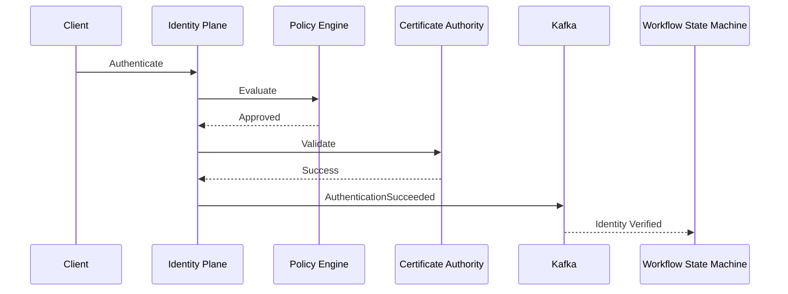

# Enterprise AI Software Factory
# Architecture Design Specification (ADS)

> **Document ID:** ADS-022-v3
>
> **Document Name:** Identity & Trust Plane — APIs, Events & Contracts
>
> **Version:** 2.0.0
>
> **Status:** Draft
>
> **Classification:** Enterprise Platform Plane
>
> **Importance:** CRITICAL
>
> **Depends On:** ADS-022-v1
>
> **Depends On:** ADS-022-v2
>
> **Next:** ADS-022-v4 — Runtime & Identity Infrastructure

---

# Executive Summary

The Identity & Trust Plane exposes secure APIs, gRPC services, identity events, workload identity contracts, certificate interfaces, authorization endpoints, and trust propagation mechanisms.

Every subsystem inside the Enterprise AI Software Factory communicates with the Identity Plane through these contracts.

No subsystem may bypass them.

---

# Communication Principles

Every interface MUST satisfy

- Authenticated
- Authorized
- Versioned
- Auditable
- Observable
- Replayable
- Idempotent
- Cryptographically Verifiable

---

# Identity Communication Architecture

```mermaid
flowchart LR

Gateway

-->

Identity API

Identity API

-->

Authentication

Identity API

-->

Authorization

Identity API

-->

Policy Engine

Policy Engine

-->

Trust Engine

Trust Engine

-->

Certificate Authority

Certificate Authority

-->

Event Bus

Event Bus

-->

Enterprise Platform
```

Every trust decision passes through this pipeline.

---

# Public REST API

The Identity Plane exposes REST APIs for

- Web Dashboard
- CLI
- Enterprise Integrations
- External Systems
- Platform Administration

---

## API-022-001

### Register Identity

```http
POST /identity/v1/identities
```

Purpose

Creates a new identity.

---

Request

```json
{
  "entityType":"AI_AGENT",
  "tenantId":"TENANT-001",
  "organizationId":"ORG-001",
  "displayName":"Planner Agent"
}
```

---

Response

```json
{
  "identityId":"ID-2026-001",
  "status":"Issued",
  "certificate":"Pending"
}
```

---

## API-022-002

### Authenticate Identity

```http
POST /identity/v1/authenticate
```

Returns

- Access Token
- Trust Score
- Expiration
- Policy Version

---

## API-022-003

### Evaluate Authorization

```http
POST /identity/v1/authorize
```

Returns

```
Allow

Deny

Escalate

RequireApproval
```

---

## API-022-004

### Revoke Identity

```http
DELETE /identity/v1/identities/{identityId}
```

Triggers

```
IdentityRevoked
```

event.

---

## API-022-005

### Rotate Credentials

```http
POST /identity/v1/identities/{identityId}/rotate
```

Supported

- Certificates
- Tokens
- Service Accounts
- SPIFFE SVIDs

---

# Internal gRPC Services

Platform components communicate through gRPC.

```protobuf
service IdentityService {

rpc Authenticate(AuthenticationRequest)

returns(AuthenticationResponse);

rpc Authorize(AuthorizationRequest)

returns(AuthorizationResponse);

rpc IssueIdentity(IssueIdentityRequest)

returns(IssueIdentityResponse);

rpc RotateCertificate(RotateCertificateRequest)

returns(RotateCertificateResponse);

rpc RevokeIdentity(RevokeIdentityRequest)

returns(RevokeIdentityResponse);

}
```

---

# Identity Schema

```protobuf
message Identity {

string identity_id = 1;

string tenant_id = 2;

string organization_id = 3;

string entity_type = 4;

string trust_level = 5;

string certificate_id = 6;

bool active = 7;

}
```

---

# Authentication Schema

```protobuf
message AuthenticationResponse {

string access_token = 1;

string refresh_token = 2;

double trust_score = 3;

int64 expires_at = 4;

}
```

---

# MCP Tool Contracts

The Identity Plane exposes the following tools.

```
authenticate_identity

authorize_action

issue_identity

rotate_certificate

revoke_identity

lookup_identity

validate_certificate

calculate_trust_score
```

Every tool invocation requires an authenticated caller.

---

# Identity Events

Every identity operation generates an immutable event.

---

## EVT-022-001

IdentityCreated

---

## EVT-022-002

AuthenticationSucceeded

---

## EVT-022-003

AuthenticationFailed

---

## EVT-022-004

AuthorizationGranted

---

## EVT-022-005

AuthorizationDenied

---

## EVT-022-006

CertificateIssued

---

## EVT-022-007

CertificateRotated

---

## EVT-022-008

IdentityRevoked

---

## EVT-022-009

TrustScoreChanged

---

## Event Flow



---

# Event Ordering

```
IdentityCreated

↓

AuthenticationSucceeded

↓

AuthorizationGranted

↓

TrustScoreCalculated

↓

ExecutionAuthorized
```

Events are append-only.

---

# Event Metadata

Every event contains

```yaml
eventId:
eventType:
identityId:
tenantId:
organizationId:
traceId:
correlationId:
timestamp:
schemaVersion:
signature:
```

---

# End of Part 1
