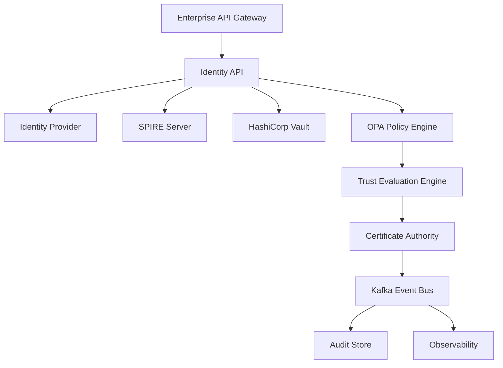
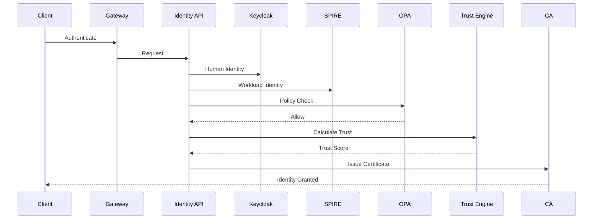
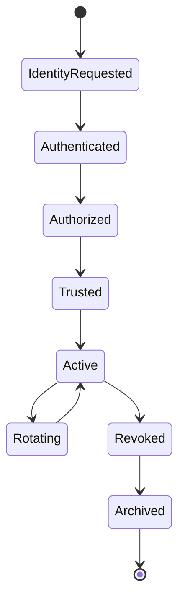
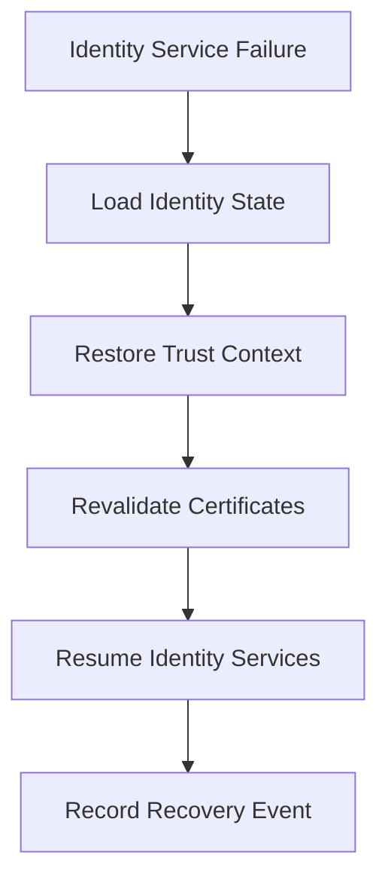
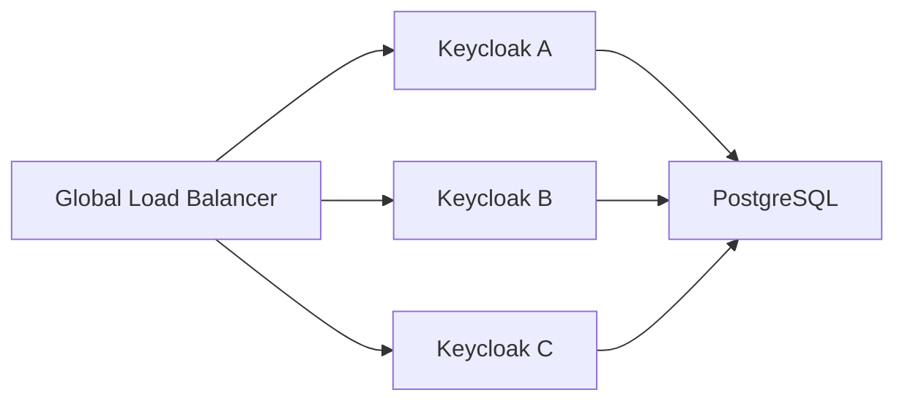

# Enterprise AI Software Factory
# Architecture Design Specification (ADS)

> **Document ID:** ADS-022-v4
>
> **Document Name:** Identity & Trust Plane — Runtime & Identity Infrastructure
>
> **Version:** 2.0.0
>
> **Classification:** Enterprise Runtime Specification
>
> **Importance:** CRITICAL
>
> **Depends On:** ADS-022-v1
>
> **Depends On:** ADS-022-v2
>
> **Depends On:** ADS-022-v3
>
> **Next:** ADS-022-v5 — End-to-End Trust Lifecycle

---

# Executive Summary

This document defines the production runtime responsible for identity issuance, workload authentication, certificate lifecycle management, authorization, trust propagation, and policy enforcement.

The Identity Plane operates continuously.

Every request, workload, workflow, and AI agent depends on it.

The runtime must therefore provide

- high availability
- zero trust
- continuous verification
- automatic certificate rotation
- distributed trust
- immutable auditability

---

# Runtime Philosophy

The Identity Plane follows seven runtime principles.

- Identity First
- Trust Never Cached Permanently
- Certificates Are Disposable
- Credentials Are Short Lived
- Every Request Is Verified
- Every Decision Is Observable
- Every Action Is Auditable

---

# Runtime Architecture



The runtime is entirely event-driven.

No component stores long-lived session state.

---

# Four Runtime Layers

## Logical Architecture

Responsible for

- Identity
- Authentication
- Authorization
- Trust
- Certificates
- Policies

---

## Deployment Topology

Responsible for

- Kubernetes
- Multi-region deployment
- High availability
- Service discovery
- Service mesh integration

---

## Operational Model

Responsible for

- Scaling
- Rotation
- Backup
- Disaster Recovery
- Runtime maintenance

---

## Threat Model

Responsible for

- Trust boundaries
- Credential theft
- Certificate compromise
- Insider threats
- Supply-chain attacks

---

# Runtime Components

| Component | Responsibility |
|------------|----------------|
| Identity API | Public identity services |
| Keycloak | Human identity provider |
| SPIRE Server | Workload identity |
| Vault | Secret broker |
| OPA | Authorization |
| Trust Engine | Dynamic trust calculation |
| CA | Certificate issuance |
| Kafka | Identity events |
| Audit Store | Immutable audit log |
| OpenTelemetry | Runtime telemetry |

Every component is independently deployable.

---

# Identity Runtime Flow



---

# Identity Provider

Human identities are managed by

```
Keycloak
```

Responsibilities

- OAuth 2.1
- OIDC
- MFA
- Passkeys
- Enterprise SSO
- Federation

Passwords should never be the primary authentication mechanism.

---

# Workload Identity

Runtime workloads authenticate using

```
SPIFFE

↓

SPIRE

↓

X.509 SVID

↓

JWT-SVID
```

Example

```
spiffe://enterprise-ai/workers/execution-001
```

No shared service credentials exist.

---

# Certificate Authority

The runtime issues

- X.509 Certificates
- SPIFFE SVIDs
- Short-lived TLS Certificates

Certificate Lifecycle

```text
Generate

↓

Issue

↓

Activate

↓

Rotate

↓

Revoke

↓

Archive
```

---

# Secret Management

Secrets are never stored inside

- Containers
- Git
- Images
- Worker Configuration

Secrets flow

```text
Worker

↓

SPIFFE Identity

↓

Vault Authentication

↓

Temporary Secret

↓

Execution

↓

Secret Expired
```

---

# Trust Engine

The Trust Engine continuously evaluates

- Identity Validity
- Certificate Health
- Policy Compliance
- Behavioral Signals
- Runtime Context
- Risk Events

Trust is recalculated before every privileged action.

---

# Authorization Engine

Authorization is delegated to

```
Open Policy Agent

OPA
```

Supported policy models

- RBAC
- ABAC
- Context Policies
- Time Policies
- Risk Policies
- Tenant Policies

Policies are evaluated dynamically.

---

# Runtime Communication

| Communication | Technology |
|---------------|------------|
| External APIs | HTTPS |
| Internal APIs | gRPC |
| Workload Identity | SPIFFE |
| Certificates | X.509 |
| Events | Kafka |
| Telemetry | OpenTelemetry |

---

# Identity Runtime Lifecycle



---

# Runtime Guarantees

The Identity Plane guarantees

- Mutual Authentication
- Continuous Verification
- Automatic Rotation
- Distributed Trust
- Immutable Auditing
- Policy Enforcement
- High Availability

---

# Failure Recovery

The Identity Plane is designed to survive failures without interrupting active engineering workflows.

Recovery always restores the latest trusted identity state.



Recovery guarantees

- Identity continuity
- Trust consistency
- Certificate integrity
- No unauthorized privilege escalation

---

# Runtime Retry Engine

Retry behavior depends on failure classification.

| Failure | Retries | Strategy |
|----------|---------:|----------|
| Identity API Timeout | 5 | Exponential Backoff |
| Vault Timeout | 3 | Alternate Vault Node |
| SPIRE Timeout | 3 | Retry Registration |
| OPA Timeout | 2 | Secondary Policy Engine |
| Kafka Timeout | 5 | Queue Retry |
| Invalid Certificate | 0 | Reject |
| Policy Denied | 0 | Reject |
| Revoked Identity | 0 | Immediate Termination |

Retry schedule

```text
1 s

↓

2 s

↓

4 s

↓

8 s

↓

16 s

↓

Escalation
```

Retries are deterministic.

---

# Runtime Health Monitoring

Every runtime component continuously publishes health telemetry.

Collected metrics

- CPU
- Memory
- Certificate Queue
- Vault Latency
- OPA Latency
- SPIRE Registration Queue
- Authentication Rate
- Trust Evaluation Time

Health pipeline

```text
Component

↓

Heartbeat

↓

Health Registry

↓

Observability Plane

↓

Dashboard
```

Missing heartbeats automatically trigger failover.

---

# Horizontal Scaling

Identity services scale independently.

Scaling inputs

- Authentication requests
- Active workloads
- Certificate issuance rate
- Trust evaluations
- Policy requests
- CPU utilization
- Latency SLO

Scaling flow

```text
Traffic Increase

↓

Autoscaler

↓

Provision Pods

↓

Register Services

↓

Join Mesh

↓

Serve Requests
```

Identity services remain stateless.

---

# High Availability

Every critical runtime component runs in an HA configuration.



Recommended deployment

- Minimum 3 Identity API replicas
- Minimum 3 Keycloak replicas
- HA PostgreSQL cluster
- Multi-node SPIRE deployment
- HA Vault cluster

---

# Runtime Isolation

Identity infrastructure executes inside dedicated platform namespaces.

Isolation boundaries

- Identity Namespace
- Vault Namespace
- SPIRE Namespace
- Policy Namespace
- Certificate Namespace

Every namespace has

- Network Policies
- Resource Quotas
- Dedicated RBAC
- Pod Security Admission
- Service Mesh Policies

---

# Certificate Rotation

Certificate rotation is fully automated.

Lifecycle

```text
Certificate Issued

↓

Health Monitoring

↓

Rotation Threshold

↓

New Certificate

↓

Trust Validation

↓

Old Certificate Revoked
```

No manual certificate rotation is required.

---

# Secret Lifecycle

Secrets remain ephemeral.

```text
Identity Verified

↓

Vault Authentication

↓

Dynamic Secret Issued

↓

Execution

↓

Secret TTL Expired

↓

Automatic Revocation
```

Secrets are never cached permanently.

---

# Runtime Configuration

Example

```yaml
identity:

  workloadIdentity: spiffe

  certificateTTL: 24h

  tokenTTL: 15m

  trustThreshold: 90

  policyEngine: opa

  vaultDynamicSecrets: true

  certificateRotation: automatic

  continuousVerification: true

  maxAuthenticationLatency: 100ms
```

Configuration changes are version-controlled.

---

# Performance Optimizations

Runtime optimizations include

- JWKS cache
- Policy cache
- Certificate chain cache
- Trust score cache (short TTL)
- Parallel trust evaluation
- Batch certificate issuance
- Hardware cryptographic acceleration

Optimizations must never weaken security guarantees.

---

# Runtime Observability

Every operation emits

- Metrics
- Traces
- Structured Logs
- Audit Records
- Security Events

Identity operations are fully observable.

---

# Prometheus Metrics

```text
identity_requests_total

identity_auth_latency_seconds

certificate_issued_total

certificate_rotated_total

certificate_revoked_total

vault_request_duration_seconds

opa_policy_evaluation_seconds

trust_score_average

active_workload_identities

failed_authentication_total
```

---

# OpenTelemetry

Distributed tracing spans

```text
Gateway

↓

Identity API

↓

Keycloak

↓

SPIRE

↓

OPA

↓

Vault

↓

Certificate Authority

↓

Workflow State Machine
```

Each trust decision becomes an independent trace span.

---

# Structured Logging

Example

```json
{
  "traceId":"trace-3301",
  "identityId":"ID-2026-011",
  "authentication":"OIDC",
  "certificate":"CERT-102",
  "trustScore":97,
  "policyDecision":"Allow",
  "durationMs":19
}
```

Logs are immutable and signed.

---

# Disaster Recovery

Recovery process

```text
Regional Failure

↓

Traffic Failover

↓

Replica Promotion

↓

SPIRE Rejoin

↓

Vault Recovery

↓

Certificate Validation

↓

Resume Operations
```

Targets

Recovery Point Objective (RPO)

Near-zero data loss

Recovery Time Objective (RTO)

Less than five minutes

---

# Recommended Production Deployment

```text
Global Load Balancer

↓

Kubernetes Cluster

↓

Identity Namespace

↓

Keycloak

↓

SPIRE Server

↓

HashiCorp Vault

↓

OPA

↓

Certificate Authority

↓

Kafka

↓

PostgreSQL

↓

OpenTelemetry Collector

↓

Prometheus

↓

Grafana
```

---

# Technology Decision Records

## TDR-022-01

### Technology

Keycloak

### Decision

Adopt Keycloak for enterprise human identity.

### Reason

Supports OIDC, OAuth2.1, federation, MFA, and enterprise SSO with a mature ecosystem.

---

## TDR-022-02

### Technology

SPIFFE / SPIRE

### Decision

Adopt SPIFFE as the workload identity standard.

### Reason

Provides portable cryptographic identities for workloads across Kubernetes and multi-cloud environments.

---

## TDR-022-03

### Technology

HashiCorp Vault

### Decision

Use Vault for dynamic secret issuance.

### Reason

Supports short-lived credentials, automatic rotation, and fine-grained access control.

---

## TDR-022-04

### Technology

Open Policy Agent (OPA)

### Decision

Use OPA for policy evaluation.

### Reason

Provides policy-as-code with decoupled authorization logic and broad ecosystem adoption.

---

## TDR-022-05

### Technology

Istio Ambient Mesh

### Decision

Use Ambient Mesh for service-to-service security.

### Reason

Delivers mTLS, authorization, and traffic policy with lower operational overhead than traditional sidecars.

---

# Runtime Checklist

The Identity Plane MUST

- Authenticate every request
- Verify every workload identity
- Rotate certificates automatically
- Issue only short-lived credentials
- Enforce policy on every privileged action
- Maintain immutable audit records
- Support multi-region failover

The Identity Plane MUST NOT

- Store plaintext secrets
- Use shared credentials
- Skip policy evaluation
- Trust network location
- Issue perpetual certificates

---

# Architecture Decision Records

## ADR-022-09

### Decision

Deploy all identity services as stateless, horizontally scalable components.

### Status

Accepted

### Reason

Stateless services simplify autoscaling, failover, and disaster recovery.

---

## ADR-022-10

### Decision

Treat workload identity as the primary authentication mechanism for internal services.

### Status

Accepted

### Reason

Workload identities eliminate shared credentials and improve service-to-service security.

---

## ADR-022-11

### Decision

Perform continuous trust verification throughout request execution.

### Status

Accepted

### Reason

Trust is dynamic and must reflect current runtime conditions.

---

# Operational Readiness Scorecard

| Capability | Status |
|------------|--------|
| High Availability | ✅ Required |
| Automatic Certificate Rotation | ✅ Required |
| Dynamic Secrets | ✅ Required |
| Multi-Region Deployment | ✅ Required |
| Continuous Verification | ✅ Required |
| Zero Trust | ✅ Required |
| Standards Compliance | ✅ Required |
| Full Observability | ✅ Required |

---

# Related Documents

ADS-021-v5 — Workflow State Machine

ADS-022-v1 — Architecture

ADS-022-v2 — Trust Algorithms & Identity Model

ADS-022-v3 — APIs, Events & Contracts

ADS-022-v5 — End-to-End Trust Lifecycle

ADS-025 — Security Plane

ADS-026 — Observability Plane

---

# End of Document
