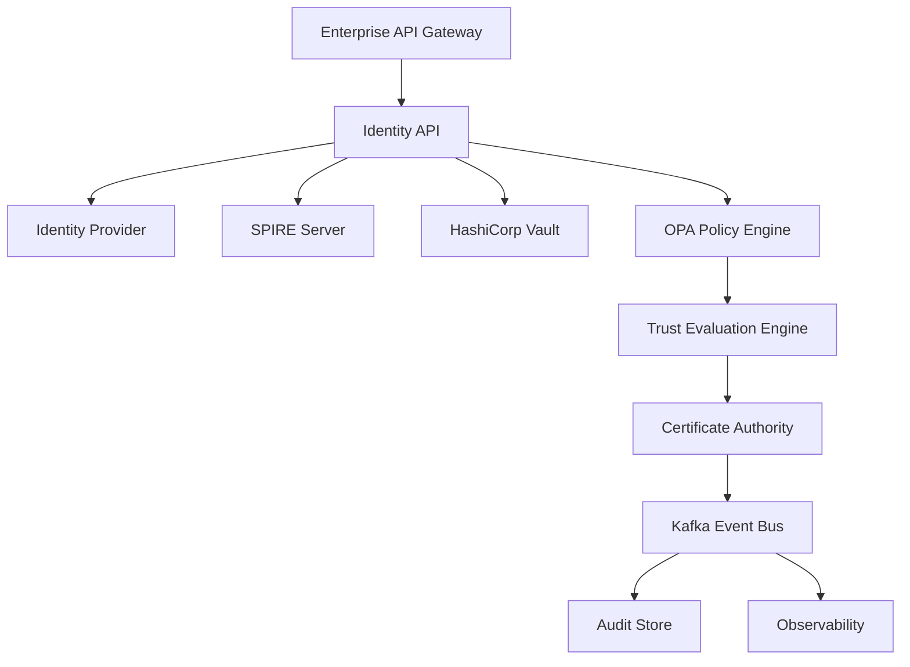
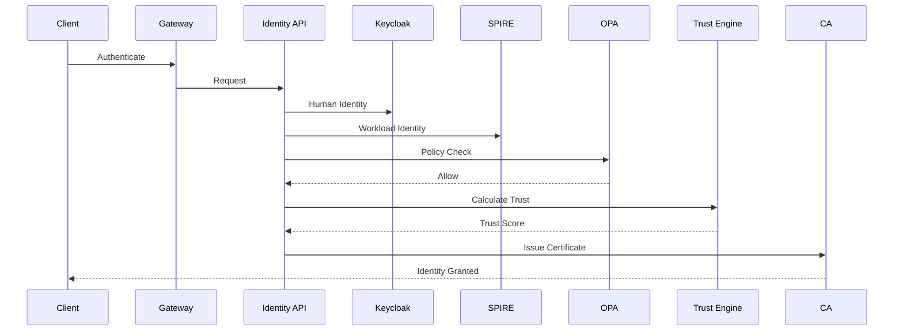
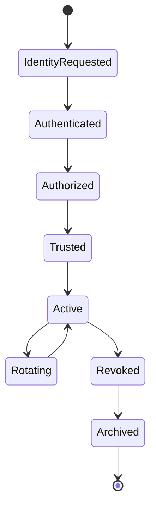

# Enterprise AI Software Factory
# Architecture Design Specification (ADS)

> **Document ID:** ADS-022-v4
>
> **Document Name:** Identity & Trust Plane — Runtime & Identity Infrastructure
>
> **Version:** 2.0.0
>
> **Classification:** Enterprise Runtime Specification
>
> **Importance:** CRITICAL
>
> **Depends On:** ADS-022-v1
>
> **Depends On:** ADS-022-v2
>
> **Depends On:** ADS-022-v3
>
> **Next:** ADS-022-v5 — End-to-End Trust Lifecycle

---

# Executive Summary

This document defines the production runtime responsible for identity issuance, workload authentication, certificate lifecycle management, authorization, trust propagation, and policy enforcement.

The Identity Plane operates continuously.

Every request, workload, workflow, and AI agent depends on it.

The runtime must therefore provide

- high availability
- zero trust
- continuous verification
- automatic certificate rotation
- distributed trust
- immutable auditability

---

# Runtime Philosophy

The Identity Plane follows seven runtime principles.

- Identity First
- Trust Never Cached Permanently
- Certificates Are Disposable
- Credentials Are Short Lived
- Every Request Is Verified
- Every Decision Is Observable
- Every Action Is Auditable

---

# Runtime Architecture



The runtime is entirely event-driven.

No component stores long-lived session state.

---

# Four Runtime Layers

## Logical Architecture

Responsible for

- Identity
- Authentication
- Authorization
- Trust
- Certificates
- Policies

---

## Deployment Topology

Responsible for

- Kubernetes
- Multi-region deployment
- High availability
- Service discovery
- Service mesh integration

---

## Operational Model

Responsible for

- Scaling
- Rotation
- Backup
- Disaster Recovery
- Runtime maintenance

---

## Threat Model

Responsible for

- Trust boundaries
- Credential theft
- Certificate compromise
- Insider threats
- Supply-chain attacks

---

# Runtime Components

| Component | Responsibility |
|------------|----------------|
| Identity API | Public identity services |
| Keycloak | Human identity provider |
| SPIRE Server | Workload identity |
| Vault | Secret broker |
| OPA | Authorization |
| Trust Engine | Dynamic trust calculation |
| CA | Certificate issuance |
| Kafka | Identity events |
| Audit Store | Immutable audit log |
| OpenTelemetry | Runtime telemetry |

Every component is independently deployable.

---

# Identity Runtime Flow



---

# Identity Provider

Human identities are managed by

```
Keycloak
```

Responsibilities

- OAuth 2.1
- OIDC
- MFA
- Passkeys
- Enterprise SSO
- Federation

Passwords should never be the primary authentication mechanism.

---

# Workload Identity

Runtime workloads authenticate using

```
SPIFFE

↓

SPIRE

↓

X.509 SVID

↓

JWT-SVID
```

Example

```
spiffe://enterprise-ai/workers/execution-001
```

No shared service credentials exist.

---

# Certificate Authority

The runtime issues

- X.509 Certificates
- SPIFFE SVIDs
- Short-lived TLS Certificates

Certificate Lifecycle

```text
Generate

↓

Issue

↓

Activate

↓

Rotate

↓

Revoke

↓

Archive
```

---

# Secret Management

Secrets are never stored inside

- Containers
- Git
- Images
- Worker Configuration

Secrets flow

```text
Worker

↓

SPIFFE Identity

↓

Vault Authentication

↓

Temporary Secret

↓

Execution

↓

Secret Expired
```

---

# Trust Engine

The Trust Engine continuously evaluates

- Identity Validity
- Certificate Health
- Policy Compliance
- Behavioral Signals
- Runtime Context
- Risk Events

Trust is recalculated before every privileged action.

---

# Authorization Engine

Authorization is delegated to

```
Open Policy Agent

OPA
```

Supported policy models

- RBAC
- ABAC
- Context Policies
- Time Policies
- Risk Policies
- Tenant Policies

Policies are evaluated dynamically.

---

# Runtime Communication

| Communication | Technology |
|---------------|------------|
| External APIs | HTTPS |
| Internal APIs | gRPC |
| Workload Identity | SPIFFE |
| Certificates | X.509 |
| Events | Kafka |
| Telemetry | OpenTelemetry |

---

# Identity Runtime Lifecycle



---

# Runtime Guarantees

The Identity Plane guarantees

- Mutual Authentication
- Continuous Verification
- Automatic Rotation
- Distributed Trust
- Immutable Auditing
- Policy Enforcement
- High Availability

---

# End of Part 1
